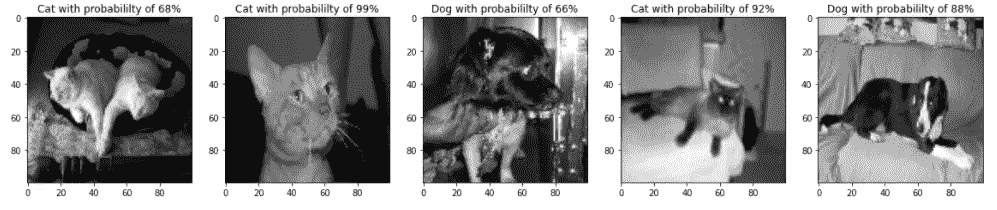

# 用 GradioML 创建一个简单的机器学习演示

> 原文：<https://towardsdatascience.com/creating-a-simple-image-classification-machine-learning-demo-with-gradioml-361a245d7b50?source=collection_archive---------7----------------------->

## 只需几行代码就可以在功能性用户界面中部署模型


作者图片

部署机器学习模型有时是数据科学中被忽视的一个方面。许多分析专业人员将大部分注意力集中在理论和应用上，以构建能够解决问题和满足目标的模型。这在项目的研究或原型阶段都是完全没问题的。但是，为了与其他职业的利益相关者或合作者分享这项工作，为这些用户和观众开发某种应用程序会很好。

然而，部署这些模型的任务并不总是那么简单。要完成这项工作，还需要掌握许多额外的技能和工具。传统上，机器学习工程师和 DevOps 专家等专家与数据科学家合作，将这些模型投入生产。

有时，一个简单的用户界面演示可以完成传达机器学习模型内容的工作，而不是全力以赴进行部署。在寻找可以帮助构建这个的工具时，我偶然发现了 **GradioML** ，一个符合这种描述的开源工具。

**Gradio 是一个软件包，允许用户用几行代码创建简单的网络应用。**它的基本用途与 Streamlight 和 Flask 相同，但使用起来更简单。许多类型的网络界面工具可以选择，包括画板，文本框，文件上传按钮，网络摄像头等。使用这些工具接收各种类型的数据作为输入，可以很容易地演示分类和回归等机器学习任务。(参考工具见[官网](https://www.gradio.app/)及其 [Github 页面](https://github.com/gradio-app/gradio))

在本演练中，我们将快速创建一个猫/狗图像分类模型，并部署一个简单的 Gradio 演示程序，我们可以在其中上传新图像以进行分类预测。该模型将是一个简单的 Keras **卷积神经网络(CNN)** ，它将在作为特征的猫和狗的图像上进行训练，并将它们的类名作为标签。

有关 Jupyter 笔记本的完整代码，请参考[此链接](https://github.com/DavidYoo912/cat_dog_classification/blob/main/cat_dog_image_classification.ipynb)

# 必需品；要素

首先我们安装 Gradio

```
pip install gradio
```

接下来，我们导入依赖项。我们需要的一些工具将用于**数值计算**(Numpy)**可视化/绘图**(Matplotlib)**图像数据争论**(cv2)**深度学习** (Tensorflow，Keras)，当然还有**构建 web 界面** (Gradio)

```
import numpy as np
import pandas as pdimport matplotlib.pyplot as plt
import os
import cv2from sklearn.model_selection import train_test_split
from sklearn import metricsimport tensorflow as tf
from tensorflow import keras
from tensorflow.keras.models import Sequential
from tensorflow.keras.layers import Dense, Dropout, Activation, Flatten, Conv2D, MaxPooling2Dimport gradio
import gradio as gr 
```

# 浏览和组织数据

然后我们看一下我们的数据。猫/狗图像来自发布在 [Kaggle](https://www.kaggle.com/dbtjdals/cat-dog-classification) 中的数据集来源。我们将检查第一张图片

```
DATADIR = os.path.abspath(os.getcwd()) + '/PetImages'path = os.path.join(DATADIR, category)    #path to cats or dogs dir
first_img_path = os.listdir(path)[0]
img_array = cv2.imread(os.path.join(path, first_img_path), cv2.IMREAD_GRAYSCALE)
plt.imshow(img_array, cmap = "gray")
plt.show()#show image shape
print('The image shape is {}'.format(img_array.shape))
```


作者图片

因为这个练习是针对一个简单的 CNN 模型，我们将调整所有图像的大小为 shape (100，100 ),并将它们的颜色改为灰度。

要素和标注也将被分离并分别添加到列表 X 和 y 中

```
#create create array of data
data = []
def create_data():
    for category in CATEGORIES:
        path = os.path.join(DATADIR, category)  
        class_num = CATEGORIES.index(category)    
        for img in os.listdir(path):
            try: 
                img_array = cv2.imread(os.path.join(path, img), cv2.IMREAD_GRAYSCALE)
                new_array = cv2.resize(img_array, (IMG_SIZE, IMG_SIZE))data.append([new_array, class_num])
            except Exception as e:
                pass
create_data()#randomly shuffle the images
random.shuffle(data)#separate features and labels
X = []
y = []for features, label in data:
    X.append(features)
    y.append(label)#neural network takes in a numpy array as the features and labels so convert from list to array and change shape
X = np.array(X).reshape(-1, IMG_SIZE, IMG_SIZE, 1)
y = np.array(y)
```

调整后的特征图像示例如下所示

```
#show first feature image X
first_feature = X[0]
plt.imshow(first_feature, cmap = 'gray')
print('The image shape is {}'.format(first_feature.shape))
```


作者图片

最后，我们归一化图像以确保每个像素具有相似的数据分布(在训练卷积神经网络模型时允许更快的收敛)

```
#normalize images
X = X/255.0
```

# 建模

这里我们将训练(70%)和测试(30%)数据分开。总共会有 17462 个训练数据和 7484 个测试数据。

```
#separate training and test data
X_train, X_test, y_train, y_test = train_test_split(X, y, test_size=0.3, random_state=42)print('the shape of training features is {}'.format(X_train.shape))
print('the shape of training labels is {}'.format(y_train.shape))print('the shape of test features is {}'.format(X_test.shape))
print('the shape of test labels is {}'.format(y_test.shape))
```


作者图片

我们现在创建我们的卷积神经网络(CNN)模型。它将由多个卷积层、最大池层和下降层组成。卷积层中的所有激活函数将是 relu，而输出密集层的激活函数将是 softmax。

```
#create model
model = Sequential()model.add(Conv2D(64, (3,3), activation = 'relu'))
model.add(MaxPooling2D(2,2))
model.add(Dropout(0.1))model.add(Conv2D(64, (3,3), activation = 'relu'))
model.add(MaxPooling2D(2,2))
model.add(Dropout(0.2))model.add(Conv2D(64, (3,3), activation = 'relu'))
model.add(MaxPooling2D(2,2))
model.add(Dropout(0.2))model.add(Flatten())model.add(Dense(128, input_shape = X.shape[1:], activation = 'relu'))#output layer
model.add(Dense(2, activation = 'softmax'))
```

使用以下参数编译模型:

```
#compile the model
model.compile(loss="sparse_categorical_crossentropy",
             optimizer="adam",
             metrics=['accuracy'])
```

使用 5 个时期和 0.1 的验证分割来训练模型

```
#fit model
history = model.fit(X_train, y_train, epochs=5, validation_split=0.1)
```


用 5 个时期训练模型:作者的图像

```
#show learning curves
#mean training loss and accuracy measured over each epoch
#mean validation loss and accuracy measured at the end of each epochpd.DataFrame(history.history).plot(figsize=(8,5))
plt.grid(True)
plt.gca().set_ylim(0,1) # set the vertical range to [0-1]
plt.show()
```


学习曲线；培训与验证:作者提供的图片

该模型似乎没有过度拟合训练数据，因为在训练和验证准确性/损失之间没有相当大的差距。验证精度略高于使用脱落图层时可能出现的训练精度。

我们预测测试数据的类别，并比较我们的准确度

```
#use predict_classes() to find the class with the highest probability
y_pred = model.predict_classes(X_test)print("Performance Summary of Sequential Neural Network on test data:")#show classification report
print(metrics.classification_report(y_test, y_pred))#show confusion matrix
print(metrics.confusion_matrix(y_test, y_pred))
```


分类报告和混淆矩阵:作者图片

虽然不令人惊讶，但在测试数据的 83%的总体准确率下，这是一个相当不错的模型

我们可以快速浏览前 5 个正确和不正确的分类

```
#show first 5 correctly identified test images with predicted labels and probabilities
fig, ax = plt.subplots(1,5,figsize=(20,20))class_names = ["Dog", "Cat"]for i, correct_idx in enumerate(correct_indices[:5]):
    ax[i].imshow(X_test[correct_idx].reshape(100,100),cmap='gray')
    ax[i].set_title("{} with probabililty of {}%".format(class_names[y_pred[correct_idx]], int(max(y_proba[correct_idx]
```



前 5 张正确识别的图片:作者图片

```
#show first 5 incorrectly identified test images with predicted labels and probabilities
fig, ax = plt.subplots(1,5,figsize=(20,20))for i, incorrect_idx in enumerate(incorrect_indices[:5]):
    ax[i].imshow(X_test[incorrect_idx].reshape(100,100),cmap='gray')
    ax[i].set_title("{} with probabililty of {}%".format(class_names[y_pred[incorrect_idx]], int(max(y_proba[incorrect_idx])*100)))
```


前 5 张识别错误的图片:作者图片

有趣的是，该模型已经正确识别了一些甚至人类都难以看到的图像。但是，它也错误地识别了一些明显的猫和狗的图片。

# 使用 Gradio 的模型演示

最后，我们准备使用 Gradio 来创建我们模型的演示。同样，目的是使用该模型在新上传的输入图像上预测猫或狗类别

```
#create a function to make predictions
#return a dictionary of labels and probabilities
def cat_or_dog(img):
    img = img.reshape(1, 100, 100, 1)
    prediction = model.predict(img).tolist()[0]
    class_names = ["Dog", "Cat"]
    return {class_names[i]: prediction[i] for i in range(2)}#set the user uploaded image as the input array
#match same shape as the input shape in the model
im = gradio.inputs.Image(shape=(100, 100), image_mode='L', invert_colors=False, source="upload")#setup the interface
iface = gr.Interface(
    fn = cat_or_dog, 
    inputs = im, 
    outputs = gradio.outputs.Label(),
)iface.launch(share=True)
```

这段代码中发生了以下情况:

1.  我们首先创建一个名为 cat_or_dog()的函数，它将一个图像数组作为输入，利用模型进行预测，并返回一个字典，其中每个类名作为键，其各自的概率作为值(例如{Dog: 0.6，Cat: 0.4})
2.  设置输入上传:转换输入图像以匹配模型被训练的输入形状，在我们的例子中是(100，100)。我们还将源设置为“上传”，这样我们就可以将自己的图像上传到 Gradio 中
3.  编译接口；利用我们在上面创建的 cat_or_dog()函数，将 input 设置为输入上传器，并允许 Gradio 返回类及其概率作为输出

结果显示在下面的 gif 中:


Gradio 图像分类演示:按作者分类的图像

用户可以轻松地从本地拖放或上传图像，并单击“提交”以显示模型分类的输出。概率较高的类别(猫或狗)将显示为最终预测。

# 结论

在本练习中，使用 CNN 构建了一个影像分类模型，并使用一个名为 GradioML 的工具将其部署为一个简单的演示。然而，Gradio 可以用于更多的任务，如回归/数值预测和自然语言处理。Gradio 具有适合这些任务的各种界面选项，是一种可以作为呈现快速机器学习演示的快速高效解决方案的工具。