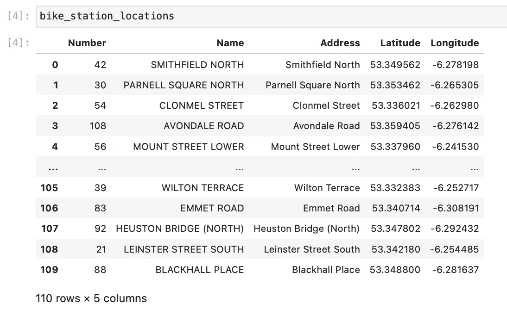
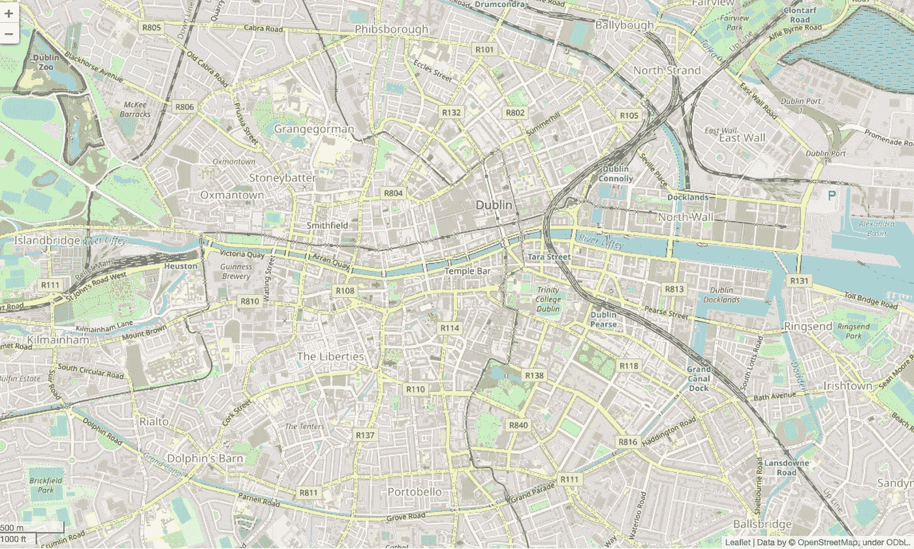
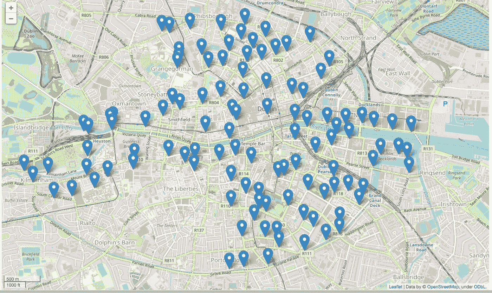

# 用 leav 和 Python 创建一个简单的地图

> 原文：<https://towardsdatascience.com/creating-a-simple-map-with-folium-and-python-4c083abfff94?source=collection_archive---------1----------------------->

## 如何获得自行车租赁位置数据，创建一个简单的地图，并在 Python 中使用 Folium 为每个位置添加点。


由[卡尔文·汉森](https://unsplash.com/@calvinhanson?utm_source=medium&utm_medium=referral)在 [Unsplash](https://unsplash.com?utm_source=medium&utm_medium=referral) 拍摄的照片

通常，在处理数据时，您可以访问地理空间要素，如纬度和经度坐标。绘制这些图会很有趣，可以了解数据集的实例是如何分布在不同位置的。

在这篇短文中，我介绍了获取自行车租赁位置数据并在地图上显示这些位置的步骤。我使用 Dublin Bikes 数据([https://data.smartdublin.ie/dataset/dublinbikes-api](https://data.smartdublin.ie/dataset/dublinbikes-api))和叶库([https://python-visualization.github.io/folium/](https://python-visualization.github.io/folium/))，正如文档所说，“建立在 Python 生态系统的数据角力优势和`leaflet.js`库的映射优势之上”。有关传单的更多信息，请参见此处的[文档。](https://leafletjs.com)

## 要求

我用的是 Python 3.7，叶子 0.12.1，熊猫 1.2.4。我也在 [Anaconda Navigator 中使用 Jupyter 笔记本。](https://anaconda.org/anaconda/anaconda-navigator)

## 数据

我正在处理的数据来自[都柏林自行车应用编程接口](https://data.smartdublin.ie/dataset/dublinbikes-api)，特别是自行车租赁站的位置:

```
[https://data.smartdublin.ie/dataset/33ec9fe2-4957-4e9a-ab55-c5e917c7a9ab/resource/2dec86ed-76ed-47a3-ae28-646db5c5b965/download/dublin.csv](https://data.smartdublin.ie/dataset/33ec9fe2-4957-4e9a-ab55-c5e917c7a9ab/resource/2dec86ed-76ed-47a3-ae28-646db5c5b965/download/dublin.csv)
```

# 步骤 1-进口熊猫和叶子

和往常一样，第一步是导入库:

```
import pandas as pd
import folium
```

# 步骤 2-获取自行车站点位置并保存到熊猫数据框

使用 Pandas，我可以直接找到我想要的 CSV 文件的位置:

```
location = "[https://data.smartdublin.ie/dataset/33ec9fe2-4957-4e9a-ab55-c5e917c7a9ab/resource/2dec86ed-76ed-47a3-ae28-646db5c5b965/download/dublin.csv](https://data.smartdublin.ie/dataset/33ec9fe2-4957-4e9a-ab55-c5e917c7a9ab/resource/2dec86ed-76ed-47a3-ae28-646db5c5b965/download/dublin.csv)"bike_station_locations = pd.read_csv(location)
```

现在我有了自行车 _ 车站 _ 位置数据框架:



# 步骤 3 —仅保留我需要的列

我想保留位置的*纬度*、*经度*和*名称*。前两列将允许我映射位置，后一列将用于为每个位置引脚命名:

```
bike_station_locations = bike_station_locations[["Latitude", "Longitude", "Name"]]
```

# 步骤 4-创建地图

对于地图，第一步是创建一个我想要的位置的地图。使用位置参数，我传入纬度和经度坐标的平均值，我必须将地图放在那里。

```
map = folium.Map(location=[bike_station_locations.Latitude.mean(), bike_station_locations.Longitude.mean()], zoom_start=14, control_scale=True
```

这将给出一张空白地图，以先前给出的位置为中心，缩放至 14。



# 步骤 5-向地图添加点

现在，我将每个自行车站位置的点添加到地图上。遍历数据帧的每一行，我将位置纬度和经度传递给叶子。标记为列表，并将名称传递给 popup 参数。对于我添加到地图上的每个位置:

```
for index, location_info in bike_station_locations.iterrows():
    folium.Marker([location_info["Latitude"], location_info["Longitude"]], popup=location_info["Name"]).add_to(map)
```

然后我显示地图:



注意:默认情况下，地图使用 OpenStreetMap 切片，尽管在创建地图时可以通过添加参数*切片*参数和值来使用其他选项。这里的[文档里有例子。](https://python-visualization.github.io/folium/modules.html)

更多关于 OpenStreetMap 的信息，可以在这里找到。

# 结论

将 flour 与 Python 结合使用是开始绘制地理空间数据的一个很好的方式。只需几行代码，就可以组合出基本的地图。还有许多其他选项可用，文档也非常值得研究。

Jupyter 笔记本可用[此处](https://github.com/LiamConnors/Medium-articles/blob/6234dc87107ea87e6629422d0a815d139f580558/Creating%20a%20Simple%20Map%20with%20Folium%20and%20Python/Day%2027%20-Plotting%20Dublin%20Bikes%20rental%20stations.ipynb)。

所有截图均为作者拍摄。由 [Calvin Hanson](https://unsplash.com/@calvinhanson?utm_source=medium&utm_medium=referral) 在 [Unsplash](https://unsplash.com?utm_source=medium&utm_medium=referral) 上制作的介绍性图片。