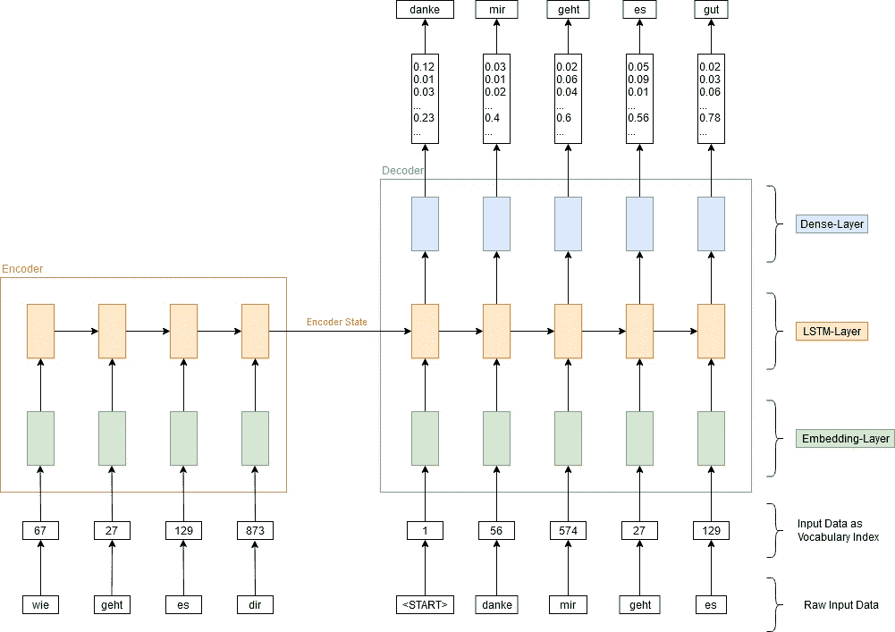
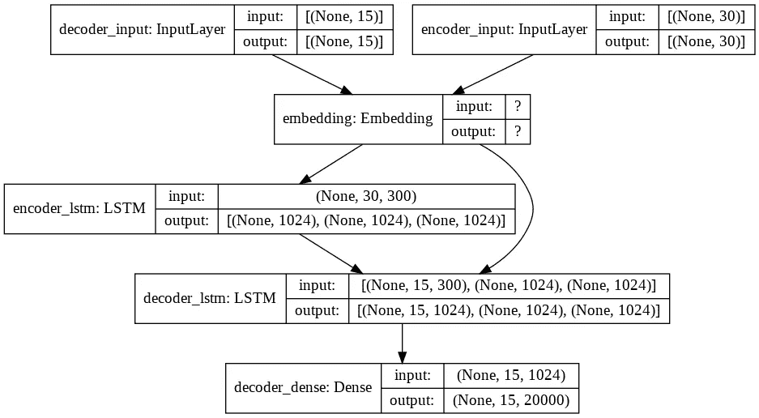
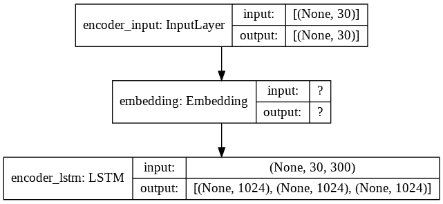
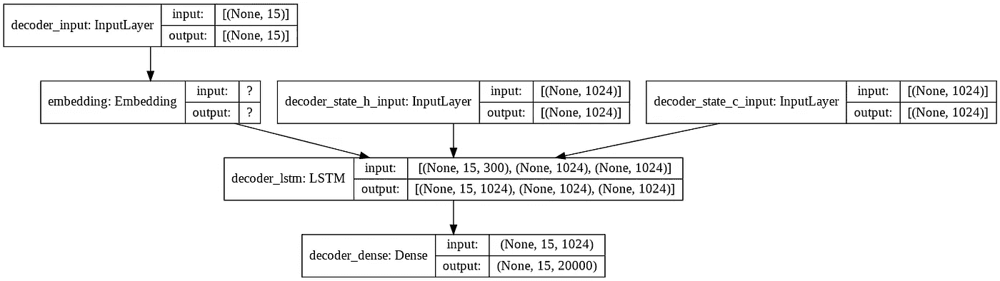

# 创造一个像你一样说话的智能聊天机器人

> 原文：<https://towardsdatascience.com/creating-a-smart-chat-bot-that-talks-like-you-79bb700b288f?source=collection_archive---------19----------------------->

## 一种创建具有 RNN 编码解码器和预训练单词嵌入的聊天机器人的有效方法


来自 [Pexels](https://www.pexels.com/photo/woman-in-white-and-black-stripe-spaghetti-strap-top-holding-white-ceramic-mug-3769109/?utm_content=attributionCopyText&utm_medium=referral&utm_source=pexels) 的 Andrea Piacquadio 的照片

# 介绍

在这篇文章中，描述了一种创建聊天机器人的方法，该聊天机器人具有预训练的单词嵌入和具有编码器-解码器架构的递归神经网络。单词嵌入是预先训练的，这意味着它们不需要学习，而是简单地从文件加载到网络中。为了学习聊天机器人对某个请求的响应，实现了一个编码器-解码器网络。聊天机器人是使用 TensorFlow 和 Keras API 一起创建的。在本文中，您可以了解这些概念，以及如何使用它们来创建像您一样说话的聊天机器人。

# 应用人工智能技术简介

由于在这种方法中使用了单词嵌入，所以提供了对这种 AI 技术的以下简短介绍:单词嵌入是用实数来描述或表示某个单词的向量。通常，向量的大小为 50 到 300 个元素。在本文所示的例子中，每个单词都由一个 300 维向量表示。这个向量可以用作神经网络的输入。这就是为什么用字母书写的单词不会被输入到神经网络中，而是将其表示为单词嵌入。通过处理大量数据来学习单词嵌入(例如，某种语言的所有维基百科文章都可以用于此目的)。单词的单词嵌入是基于其上下文，即围绕它的单词来学习的。因此，具有相似上下文的单词具有相似的单词嵌入。由于训练这样的单词嵌入需要很大的努力和大量的数据，所以使用预训练的单词嵌入。由于需要用于特定语言的单词嵌入，所以应该确定用于期望语言的预训练单词嵌入的可用性。对于本文中描述的示例，使用了德语和德语单词嵌入的训练数据。这些可以在 deepset(https://deepset.ai/german-word-embeddingss，感谢 deepset 创造了单词 embedding 并让我使用它们)找到，并且是用德语维基百科的 GloVe 算法生成的。关于 GloVe 算法的详细描述和更多信息可以在[1]中找到。在本文中，您可以学习如何使用这种预先训练好的单词嵌入。这个过程被称为迁移学习，因为我们使用已经学习的向量，并且在训练过程中不改变它们。关于单词嵌入的更多信息可以在[2]中找到。

本文中另一项重要的人工智能技术是递归神经网络。递归神经网络通常用于处理数据序列。例如天气数据序列(30 天内每天的温度)或股票数据(一年内股票的每日价格)。递归神经网络可以输出单个值或另一个序列。在天气数据的情况下，这可以是未来 30 天的预测温度，或者对于股票数据，这可以是第二天股票的预期价格。主要有两种不同类型的单元用于构建递归神经网络:LSTMs(长短期记忆)和 GRUs(门控递归单元)。它们都有一个共同点，即它们计算一个内部状态，这个状态从一个 LSTM 或 GRU 单元传递到下一个。在本文展示的例子中，将使用 LSTMs。然而，所描述的方法也应该适用于 GRUs。LSTMs 首先由 Sepp Hochreiter 和 Jürgen Schmidthuber 提出。你可以找到更多关于他们的信息。gru 可以被视为 LSTMs 的简单版本。你可以在[4]中得到关于它们的进一步信息。

在下面的例子中，序列是对聊天机器人的请求。这个请求被分成几个单词。因此，该序列由几个单个单词组成。递归神经网络的输出序列是聊天机器人的响应。由于请求和响应不具有相同的字数，所以使用循环网络的特殊结构。这种架构被称为编码器-解码器网络。尽管这种方法最初是为语言翻译设计的，但它也适用于本文描述的情况。

编码器-解码器网络最初是在[5]中引入的，用于将英语句子翻译成法语。可以找到类似的方法[4]。基本上，我们在这个架构中有两个循环网络。第一个循环网络称为编码器。它将输入序列编码成内部状态，将其表示为固定长度的向量。该状态被用作第二递归网络(解码器)的初始状态。解码器的输出被馈送到具有 softmax 激活功能的简单神经网络。该神经网络的输出是由 softmax 激活函数在输出序列中的每个单词的整个词汇表上创建的概率分布。本文稍后将对此进行更详细的解释。

# 获取培训数据

因为我们希望聊天机器人像你一样说话，所以需要一些包含与你对话的训练数据。来自 messenger 应用程序的聊天协议是一个很好的来源。通常，您可以将聊天协议导出为 CSV 文件。这些 CSV 文件需要进行处理，以便有对您的请求和来自您的相应响应。请求是编码器-解码器网络的输入，而响应是预期的输出。因此，需要两个数组——一个包含请求(x_test_raw ),一个包含相应的响应(y_test_raw)。这些数组需要预处理，以便删除或替换任何标点符号、大写字母和特殊字符。

在下面的代码片段中，您可以看到如何预处理 CSV 文件以获取训练数据:

```
x_train_raw = []
y_train_raw = []

with open("drive/MyDrive/messages.csv") as chat_file:
  first_line = True
  is_request = True
  last_request = ""
  csv_chat_file = csv.reader(chat_file)
  for row in csv_chat_file:
    if first_line:
      first_line = False
      continue
    else:
      if row[CSV_IS_OUTGOING_ROW_INDEX] == "0":
        last_request = row[10]
        is_request = True
      if row[CSV_IS_OUTGOING_ROW_INDEX] == "1" and is_request:
        x_train_raw.append(re.sub(r"[^a-zäöüß ]+", "", last_request.lower()))
        y_train_raw.append(re.sub(r"[^a-zäöüß ]+", "", row[10].lower()))
        is_request = False
```

# 嵌入层和词汇表

为了实现单词嵌入，Keras API 提供了一个嵌入层。预训练的单词嵌入被加载到这个嵌入层中。这种方法被称为迁移学习，因为我们使用已经学会的单词嵌入。单词嵌入保存在文本文件中。因此，需要从该文件中加载单词 embedding，对其进行处理，使其符合 Keras 的预期数据结构，并将其加载到嵌入层中。随着单词嵌入的加载，需要定义词汇表。为了定义词汇表，创建了一个 Python 字典，其中包含每个单词的索引作为值，单词本身作为键。稍后将使用该字典将我们的训练数据转换成数组，该数组包含每个单词的索引，而不是书写单词的索引。嵌入层使用该索引来查找相应的单词嵌入。以下特殊单词也需要放入词汇表中:

*   <pad></pad>
*   <start></start>

这些的目的将在本文中进一步解释。

以下代码片段显示了如何从文件中加载单词嵌入，以及如何创建词汇表的字典:

```
word_embeddings = {}
word_index = {}

#Add special words to vocabulary
word_index[PAD_TOKEN] = PAD_INDEX
word_index[START_TOKEN] = START_INDEX
word_index[UNKNOWN_TOKEN] = UNKNOWN_INDEX

word_embeddings[PAD_TOKEN] = [0.0] * 300
word_embeddings[START_TOKEN] = [-1.0] * 300
word_embeddings[UNKNOWN_TOKEN] = [1.0] * 300

index = VOCAB_START_INDEX

with open("drive/MyDrive/vectors.txt") as vector_file:
  for line in vector_file:
    word, embedding = line.split(maxsplit=1)
    embedding = np.fromstring(embedding, sep=" ")
    word_embeddings[word] = embedding
    word_index[word] = index
    index += 1
    if index == VOCAB_SIZE:
      break
```

因为不希望加载整个文件，所以当达到词汇表中定义的单词数时，加载停止。由于单词是按照它们出现的频率排序的，所以只能加载一定数量的单词；例如前 20，000 个单词。因此，对于本文描述的情况，德语维基百科中最常见的 20，000 个单词被定义为我们的词汇表。

从文件中加载单词嵌入后，需要将其加载到 Keras 的嵌入层中。您可以在下面的代码片段中看到这一部分:

```
embedding_matrix = np.zeros((VOCAB_SIZE, embedding_dim))

for word, index in word_index.items():
  word_embedding = word_embeddings[word]
  embedding_matrix[index] = word_embedding

embedding_layer = Embedding(VOCAB_SIZE, 
                            embedding_dim,
                            embeddings_initializer=Constant(embedding_matrix),
                            trainable=False,
                            mask_zero=True,
                            name="embedding")
```

重要的是，可训练设置为假。否则，单词嵌入将在训练期间被改变，这是不期望的，因为它们已经被训练过了。另一个重要的参数是 mask_zero=True。此参数用索引零屏蔽单词，因此它不用于训练。索引为零的单词是特殊单词“<pad>”，用于填充。如何做到这一点，将在下一节中解释。</pad>

# 准备培训数据

一旦定义了词汇表，就可以最终处理训练数据，以便将其用于训练。为此，两个数组(x_test_raw 和 y_test_raw)中的每个单词都被替换为词汇表中相应的索引。由于编码器和解码器输入都需要固定的长度，所以字数高于输入大小的句子会被截断，而字数较少的句子会被填充。为此，使用了索引为零的特殊单词“<pad>”。在训练期间，预期输出也必须输入到解码器中，从而必须对其进行修改。为此，采用数组 y_test，其中的每一句都移动一位，并将索引“<start>”插入到每一句的第一个元素中。如果在我们的词汇表中找不到一个单词，我们就用“<unknown>”作为索引。由于解码器网络的响应不是索引数组，而是包含词汇表中每个单词的下一个单词的概率的向量，因此训练数据需要进一步转换。为此，可以使用 Keras API 函数 to _ categorical()。这个函数从带有索引的数组中生成一个一次性编码的向量。</unknown></start></pad>

```
def sentences_to_index(sentences, sentenc_length):
  sentences_as_index = np.zeros((len(sentences), sentenc_length), dtype=int)
  tmp_sentences_index = 0
  tmp_word_index = 0
  unknown_count = 0
  for sentence in sentences:
    words = sentence.split(" ")
    for word in words:
      current_word_index = word_index.get(word)
      if tmp_word_index == sentenc_length - 1:
        break
      if current_word_index != None:
        sentences_as_index[tmp_sentences_index, tmp_word_index] = current_word_index
      else:
        sentences_as_index[tmp_sentences_index, tmp_word_index] = UNKNOWN_INDEX #Word is not in vocabulary, use the index of the unkown toke
        unknown_count += 1
      tmp_word_index += 1
    tmp_sentences_index += 1
    tmp_word_index = 0
  print("Unknown count: " + str(unknown_count))
  return sentences_as_index

x_train_encoder = sentences_to_index(x_train_raw, MAX_INPUT_SENTENC_LENGTH)
y_train = sentences_to_index(y_train_raw, MAX_OUTPUT_SENTENC_LENGTH)
x_train_decoder = np.roll(y_train, 1)
x_train_decoder[:,0] = START_INDEX
y_train = to_categorical(y_train, num_classes=VOCAB_SIZE)
```

# 定义模型

在创建了嵌入层并将单词 embedding 加载到其中之后，就可以定义模型了。在这种方法中，需要三个模型。一个模型是将用于训练聊天机器人的训练模型。另外两个模型用于在训练完成后获得聊天机器人的响应。它们被称为推理模型。所有模型共享相同的层。因此，推理模型使用在训练期间学习的层的权重。首先，查看所需层的创建是有帮助的:

```
#Define the layers of the encoder
encoder_input = Input(shape=(MAX_INPUT_SENTENC_LENGTH), name="encoder_input")
encoder_lstm = LSTM(LSTM_UNITS_NUMBER, return_state=True, name="encoder_lstm")

#Connect the layers of the encoder
encoder_input_embedded = embedding_layer(encoder_input)
_, state_h, state_c = encoder_lstm(encoder_input_embedded)
encoder_state = [state_h, state_c]

#Define the layers of the decoder
decoder_input = Input(shape=(MAX_OUTPUT_SENTENC_LENGTH), name="decoder_input")
decoder_state_input_h = Input(shape=(LSTM_UNITS_NUMBER,), 
                              name="decoder_state_h_input")
decoder_state_input_c = Input(shape=(LSTM_UNITS_NUMBER,), 
                              name="decoder_state_c_input")
decoder_state_input = [decoder_state_input_h, decoder_state_input_c]
decoder_lstm = LSTM(LSTM_UNITS_NUMBER, 
                    return_sequences=True, 
                    return_state=True, 
                    name="decoder_lstm")
decoder_dense = Dense(VOCAB_SIZE, activation='softmax', name="decoder_dense")

#Connect the layers of the decoder
decoder_input_embedded = embedding_layer(decoder_input)
decoder_output, _, _ = decoder_lstm(decoder_input_embedded,
                                     initial_state=encoder_state)
decoder_output = decoder_dense(decoder_output)
```

为了更好地理解不同的层，体系结构如下图所示:



图 1:RNN 编码器-解码器网络的架构。作者创造的形象。

如图 1 所示，嵌入层是编码器模型和解码器网络的第一层。相同的嵌入层可以用于编码器和解码器网络，因为二者使用相同的词汇。嵌入层的输出被馈送到编码器网络，该网络包括具有 1024 个单元的 LSTM 层。return_state 设置为 True 很重要，因为该状态是解码器网络的必要输入。因此，编码器网络的状态作为初始状态被传递到解码器网络中。此外，解码器网络接收预期的输出序列作为输入。解码器网络的最后一层是具有 softmax 激活功能的密集层。这个密集层提供了词汇表中每个单词下一个出现的概率。因此，密集层的输出具有我们的最大输出句子长度的大小，并且对于句子中的每个元素，分别具有词汇的大小。

创建并连接所有层后，我们可以定义我们的训练模型，如下面的代码片段所示:

```
#Define the training model
training_model = Model([encoder_input, decoder_input], decoder_output)
```



图 2:培训模型的架构。作者创造的形象。

在图 2 中，显示了训练模型的结构图。该图表是在 Keras 函数 plot_model 的帮助下创建的。

由于在训练期间需要将目标句子作为输入提供给解码器，因此变量 decoder_input 是训练模型输入的一部分。

最后，创建了两个推理模型——编码器模型和解码器模型，如下面的代码片段所示:

```
#Define the encoder model
encoder_model = Model(encoder_input, encoder_state)

#Define the decoder model
decoder_output, state_h, state_c = decoder_lstm(decoder_input_embedded, 
                                                initial_state=decoder_state_input)
decoder_state = [state_h, state_c]
decoder_output = decoder_dense(decoder_output)
decoder_model = Model([decoder_input] + decoder_state_input, 
                      [decoder_output] + decoder_state)
```

编码器模型和解码器模型的结果结构分别如图 3 和图 4 所示。



图 3:编码器模型的架构。作者创造的形象。



图 4:解码器模型的架构。作者创造的形象。

# 训练模型

一旦定义了培训模型并且我们的培训数据准备好了，培训就可以开始了。以下代码片段显示了培训:

```
training_model.compile(loss='categorical_crossentropy', optimizer='adam', metrics=['accuracy'])
training_model.fit(x=[x_train_encoder, x_train_decoder], y=y_train, epochs=40)training_model.fit(x=[x_train_encoder, x_train_decoder], y=y_train, epochs=40)
```

经过 40 个时期的训练后，模型 s 的输出与训练数据的匹配精度约为 95%，这已经相当不错了。

# 使用推理模型

既然训练已经完成，推理模型终于可以用来和聊天机器人对话了。为此，首先将请求传递到编码器模型中，以计算内部状态。由于预期输出不可用，如在训练期间，用作编码器输入的目标序列仅由特殊单词“<start>”组成。这个目标序列与计算出的编码器状态一起被传递到解码器模型中，以计算我们的响应的第一个字。当密集层为词汇表中的每个单词计算概率时，选择概率最高的单词。此后，根据解码器输出的状态更新初始状态，并根据该输出提供的第一个字更新目标序列。重复此操作，直到达到每个句子的最大字数，或者计算出的单词为“<pad>”。结果是一个列表，其中包含为响应中的每个单词计算的索引。最后，索引必须被翻译回文字，以获得聊天机器人的响应。</pad></start>

下面的代码片段显示了如何使用推理模型:

```
def talk_with_chat_bot(request):
  x_test_raw = []
  x_test_raw.append(request)
  x_test = sentences_to_index(x_test_raw, MAX_INPUT_SENTENC_LENGTH)
  state = encoder_model.predict(x_test)

  target_seq = np.zeros((1, MAX_OUTPUT_SENTENC_LENGTH))
  target_seq[0, 0] = START_INDEX

  output_index = []
  chat_bot_response = ""

  for i in range(MAX_OUTPUT_SENTENC_LENGTH-1):
    output_tokens, state_h, state_c  = decoder_model.predict([target_seq] + state)
    predicted_word_index = np.argmax(output_tokens[0, i, :])
    output_index.append(predicted_word_index)
    if predicted_word_index == PAD_INDEX:
      break
    target_seq[0,i+1] = predicted_word_index
    state = [state_h, state_c]

  for output_token in output_index:
    for key, value in word_index.items():
        if value == output_token \
          and value != PAD_INDEX \
          and value != UNKNOWN_INDEX:
          chat_bot_response += " " + key

  print("Request: " + request)
  print("Response:" + chat_bot_response)

talk_with_chat_bot("wo sollen wir uns treffen")
talk_with_chat_bot("guten tag")
talk_with_chat_bot("wie viel uhr treffen wir uns")
```

# 结果

聊天机器人用合理的句子和良好的语法进行回答，如聊天机器人的以下输出所示。对于不熟悉德语的人，括号中提供了翻译:

```
Request: wo sollen wir uns treffen (where should we meet)
Response: am haupteingang (at the main entrance)
Request: guten tag (good day)
Response: hey du wie läuft es bei dir (hey you how is it going)
Request: wie viel uhr treffen wir uns (what time do we meet)
Response: oh (oh)
```

经过合理的努力后，上述方法提供了良好的结果。由于已经学习了单词嵌入，训练不需要很长时间，你也不需要那么多的训练数据。

这是一个非常基本的方法，使用几种可能的改进可以获得更好的结果。例如，循环网络可以不只有一层，而是两层或四层。它们也可以被实现为双向循环网络。在这种情况下，递归神经网络不仅查看当前单词后面的单词，还查看它前面的单词。为了获得对同一请求的各种响应，可以改进选择下一个单词的算法(在上述情况下，选择概率最高的单词，这称为贪婪采样)。一些随机性可以应用于下一个单词的选择，即通过从具有最高概率的单词中随机选择一个单词(这被称为随机采样)。

# 摘要

您从本文中学到了什么:

*   编码器-解码器网络和字嵌入的基础
*   迁移学习的概念。具体地，如何将预训练的单词嵌入加载到 Keras 的嵌入层中。
*   如何获取训练数据，准备制作一个像你一样说话的聊天机器人。
*   如何为编码器-解码器网络建立和训练模型。
*   推理模型如何被用来从你的聊天机器人那里产生回应。

# 参考

下面是一个资源列表，提供了关于本文主题的更多信息:

[1] Jeffrey Pennington 和 Richard Socher 和 Christopher D. Manning， [GloVe:单词表示的全局向量](http://www.aclweb.org/anthology/D14-1162) (2014)，自然语言处理中的经验方法(EMNLP)

[2]托马斯·米科洛夫、程凯、格雷戈·科拉多和杰弗里·迪恩，[《向量空间中词表征的有效估计》](https://arxiv.org/abs/1301.3781v3) (2013)，arXiv

[3] Hochreiter，Sepp 和 Schmidhuber，于尔根，(1997)，神经计算

[4]赵庆云和巴特·范·梅里恩博尔和卡格拉尔·古尔切雷和迪米特里·巴丹瑙和费特希·布加雷斯以及霍尔格·施文克和约舒阿·本吉奥，[使用 RNN 编码器-解码器学习短语表示用于统计机器翻译](https://arxiv.org/abs/1406.1078) (2014)，EMNLP 2014

[5] Ilya Sutskever 和 Oriol Vinyals 和 Quoc V. Le，[用神经网络进行序列间学习](https://arxiv.org/abs/1409.3215v3) (2014)，arXiv