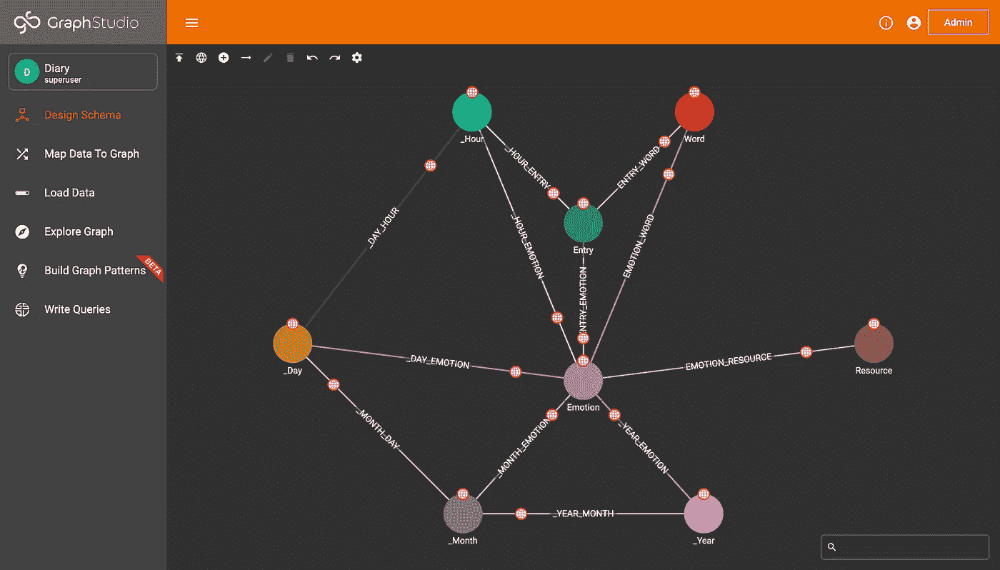

# 使用 TigerGraph、Flask、Bootstrap、NLTK 和 SkLearn 创建“智能日志”

> 原文：<https://towardsdatascience.com/creating-a-smart-journal-with-tigergraph-flask-bootstrap-nltk-and-sklearn-8b15e1465a3?source=collection_archive---------30----------------------->

## 我的 2020 年国会应用程序挑战获奖应用程序的逐步演练

# 什么是国会应用挑战？

每年，国会都会举办一项名为[国会应用挑战(CAC)](https://www.congressionalappchallenge.us/) 的年度竞赛。每个众议院议员都会收到几个应用程序提交，他们会为获胜的团队选择最佳应用程序，在华盛顿 DC 进行展示。不幸的是，由于今年的疫情，DC 之行被取消了，但我得到了在网上展示我的项目的机会。

所以，事不宜迟，下面是我今年项目的一个预演。

# 目标

我项目的目标是创建一个“智能日志”我想让它成为一个分析一个人长期情绪的地方。我在想类似于《软禁》中的东西:一个人出于治疗的目的写下他们的情感。但是，如果使用得当，该杂志将能够追踪与不同事物的积极和消极联系，并可能在未来能够发现精神疾病的早期迹象，如倦怠、抑郁等。

# 技术堆栈+技术概述

下面来分解一下我是怎么做出来的。对于前端，我使用 Bootstrap 来轻松创建我的网站。我用 Python 后端的 Flask 使我的网站具有交互性。在 Python 中，我用 NLTK 和 Sklearn 处理数据，具体是整体内涵是正还是负。最后，我使用图形数据库来存储日记条目中的重要单词，并找到积极和消极的关联。

因此，我们总共有五个步骤:

1.  从文本中抓取关键词。
2.  确定一篇文章总体上是正面的还是负面的，以及它的“强度”。
3.  创建一个图表模式并将数据插入图表。
4.  编写查询来提取数据。
5.  建立前端和连接一切与烧瓶。

# 第一步和第二步:抓住关键词，找到文本的情感

我保持了我的第一个原型的简单:我只是想知道某样东西是积极的还是消极的。因为时间关系，我做了一个简单的算法，不复杂，但是很简单。

首先，我提取了停用词和标点符号。

```
stopwords.words('english')
punc = [".", ",", "!", "?", ";", ":"]
stop_words = set(stopwords.words('english'))
word_tokens = word_tokenize(inp)
arr1 = [w for w in word_tokens if not w in stop_words]
pain = " ".join([w for w in arr1 if not w in punc])
```

为了给积极/消极评分，我考虑过使用情绪分析，但我没有数据来训练它，而且我认为标准的 Twitter 版本不适合我的目的，所以我使用了一个非常基本的替身。我发现一个 txt 文件的积极的话和另一个消极的话。然后，我把每个单词分类，不包括停用词，分为积极的，消极的或中性的。最后，我使用`(positive_count-negative_count) / (positive_count + negative_count)`计算出最终分数。

接下来，我想提取关键词。为此，我使用了一个 TF-IDF 算法(来自 Sklearn)。

```
from sklearn.feature_extraction.text import TfidfVectorizervectorizer = TfidfVectorizer()
vectors = vectorizer.fit_transform([pain])
feature_names = vectorizer.get_feature_names()
dense = vectors.todense()
denselist = dense.tolist()
df = pd.DataFrame(denselist, columns=feature_names)
```

最后，我从关键词中过滤掉所有负面和正面的词(否则最常见的正面和负面联想就是这些词)。

```
all_neutral_words = [w for w in to_add_list if not w in neg]
all_neutral_words = [w for w in all_neutral_words if not w in pos]
emo = ["Positive" if score > 0 else "Negative"][0]
```

现在我已经准备好了我的话，我需要创建一个图表。

# 第三步:创建模式

首先，对于我的图表，我需要创建我的模式。我决定要一个时间树。

```
conn.gsql('''CREATE VERTEX Entry(PRIMARY_ID id STRING)
CREATE VERTEX Word (PRIMARY_ID word STRING) WITH primary_id_as_attribute="true"
CREATE VERTEX Emotion (PRIMARY_ID emotion STRING) WITH primary_id_as_attribute="true"
CREATE VERTEX Resource (PRIMARY_ID id STRING, url STRING)
CREATE VERTEX _Year(PRIMARY_ID year STRING) WITH primary_id_as_attribute="true"
CREATE VERTEX _Month(PRIMARY_ID year STRING) WITH primary_id_as_attribute="true"
CREATE VERTEX _Day(PRIMARY_ID year STRING) WITH primary_id_as_attribute="true"
CREATE VERTEX _Hour(PRIMARY_ID year STRING) WITH primary_id_as_attribute="true"CREATE UNDIRECTED EDGE ENTRY_WORD (FROM Entry, TO Word)
CREATE UNDIRECTED EDGE ENTRY_EMOTION (FROM Entry, TO Emotion, strength DOUBLE)
CREATE UNDIRECTED EDGE EMOTION_RESOURCE (FROM Emotion, TO Resource)
CREATE UNDIRECTED EDGE EMOTION_WORD (FROM Emotion, TO Word)
CREATE UNDIRECTED EDGE _YEAR_EMOTION (FROM _Year, TO Emotion)
CREATE UNDIRECTED EDGE _MONTH_EMOTION (FROM _Month, TO Emotion)
CREATE UNDIRECTED EDGE _DAY_EMOTION (FROM _Day, TO Emotion, strength DOUBLE)
CREATE UNDIRECTED EDGE _HOUR_EMOTION (FROM _Hour, TO Emotion)
CREATE UNDIRECTED EDGE _HOUR_ENTRY (FROM _Hour, TO Entry)
CREATE UNDIRECTED EDGE _YEAR_MONTH (FROM _Year, TO _Month)
CREATE UNDIRECTED EDGE _MONTH_DAY (FROM _Month, TO _Day)
CREATE UNDIRECTED EDGE _DAY_HOUR (FROM _Day, TO _Hour)''')
```

我有几个主要的顶点:入口、词和情感。接下来，我将所有东西都连接到时间树(年、月、日和小时)，这样我就可以创建一个时间戳(打算在将来创建某种日历)。

接下来，我创建了我的图表并更新了我的连接:

```
print(conn.gsql('''CREATE GRAPH Diary(Entry, Word, Emotion, Resource, _Year, _Month, _Day, _Hour, ENTRY_WORD, ENTRY_EMOTION, EMOTION_RESOURCE, EMOTION_WORD, _YEAR_EMOTION, _MONTH_EMOTION, _DAY_EMOTION, _HOUR_EMOTION, _HOUR_ENTRY, _YEAR_MONTH, _MONTH_DAY, _DAY_HOUR)''', options=[]))  # Create the Graph # Update the Connection
conn.graphname = "Diary"
conn.apiToken = conn.getToken(conn.createSecret())
```

最后，如果我打开 GraphStudio，模式如下所示:



作者图片

# 第四步:上传数据

现在，图表已经创建，我需要添加我的数据。首先，每个条目都有一个惟一的 id，我将 entry_id 设为当前时间(用 datetime.now())。

```
entry_id = str(datetime.now())
```

接下来，我向上插入条目和情感顶点，并用一条边将其连接起来。

```
conn.upsertVertex("Entry", entry_id, attributes={})conn.upsertVertex("Emotion", emo, attributes={"emotion": emo})conn.upsertEdge("Entry", entry_id, "ENTRY_EMOTION", "Emotion", emo, attributes={"strength": score})
```

最后，我把日记条目中所有重要的单词向上插入，并连接到时间树。

```
for i in all_neutral_words:
   conn.upsertVertex("Word", i, attributes={"word": i})
   conn.upsertEdge("Emotion", emo, "EMOTION_WORD", "Word", i)
   conn.upsertEdge("Entry", entry_id, "ENTRY_WORD", "Word", i)
   conn.upsertVertex("_Day", datetime.today().strftime("%d"))
   conn.upsertEdge("_Day", datetime.today().strftime("%d"), "_DAY_EMOTION", "Emotion", emo, attributes={"strength": score})
```

接下来，我必须编写查询，然后我可以将 UI 组装在一起。

# 步骤五:编写查询

我决定让第一个原型总共有三种情绪:

1.  getmostconwordbyemotion—>简单来说，这是基于某种情绪获取最常见的单词。
2.  getEmotionByDay —>这衡量一天中的整体情绪。
3.  getTotalWords —>查看图表中的所有单词。

从最简单的开始，getTotalWords 就像它听起来的那样，获取图表中的所有单词并对它们进行计数。我是这样做的:

```
CREATE QUERY getTotalWords() FOR GRAPH Diary { 
  SumAccum<int> @@total = 0;
  Seed = {Word.*};
  Res = SELECT s FROM Seed:s
        ACCUM @@total+=1;
  PRINT @@total;
}
```

接下来，对于 getEmotionByDay，我查看输入的日顶点，然后使用 AvgAccum 查看当天的平均情绪。

```
CREATE QUERY getEmotionByDay(STRING day) FOR GRAPH Diary { 
  AvgAccum @@avgEmotion;
  Seed = {_Day.*};
  Res = SELECT e FROM Seed:s -(_DAY_EMOTION:d)-Emotion:e 
        WHERE s.year == day
        ACCUM @@avgEmotion +=d.strength;
  PRINT @@avgEmotion;
}
```

# 第六步:把它们放在一起(用烧瓶和自举！)

最后，我用 Flask 和 Bootstrap 把所有东西放在一起！烧瓶部分看起来像这样:

```
# Import Libraries
from flask import Flask, render_templateapp = Flask(__name__)@app.route('/')def index(): return render_template("index.html")@app.route('/<string:file>', methods=['GET', 'POST'])def diary(file): # Main code here
```

我创建了我的 Flask 应用程序。所做的工作全部进入@app.route('/ <file>')。如果打开 stats 页面，我需要运行所有的查询，所以我首先添加了一个 If，然后运行并呈现所有内容:</file>

```
if file == "profile.html": ans = conn.runInstalledQuery("getMostCommonWordByEmotion", params={"emo": "Positive"})[0]["Res1"] pos1 = ans[0]["attributes"]["word"]
   pos2 = ans[1]["attributes"]["word"]
   pos3 = ans[2]["attributes"]["word"] ans = conn.runInstalledQuery("getMostCommonWordByEmotion", params={"emo": "Negative"})[0]["Res1"] neg1 = ans[0]["attributes"]["word"]
   neg2 = ans[1]["attributes"]["word"]
   neg3 = ans[2]["attributes"]["word"] return render_template(file, pos1=pos1, pos2=pos2, pos3=pos3, neg1=neg1, neg2=neg2, neg3=neg3, things=conn.runInstalledQuery("getTotalWords")[0]["@@total"], color=["red" if conn.runInstalledQuery("getEmotionByDay")[0]["@@avgEmotion"] < 0 else "green"][0])
```

接下来，我添加了一个简单的方法，如果该方法是一个 GET 来返回文件。

```
if request.method == 'GET': return render_template(file)
```

最后，如果方法是 POST，我添加了步骤 I、II 和 IV 中的代码。然后我用所有必要的数据渲染 profile.html。

```
if request.method == 'POST': inp = request.form['inp'] # Code from Steps I, II, and IV ans = conn.runInstalledQuery("getMostCommonWordByEmotion", params={"emo": "Positive"})[0]["Res1"] pos1 = ans[0]["attributes"]["word"]
   pos2 = ans[1]["attributes"]["word"]
   pos3 = ans[2]["attributes"]["word"] ans = conn.runInstalledQuery("getMostCommonWordByEmotion", params={"emo": "Negative"})[0]["Res1"] neg1 = ans[0]["attributes"]["word"]
   neg2 = ans[1]["attributes"]["word"]
   neg3 = ans[2]["attributes"]["word"] return render_template("profile.html", pos1=pos1, pos2=pos2, pos3=pos3, neg1=neg1, neg2=neg2, neg3=neg3, things=conn.runInstalledQuery("getTotalWords")[0]["@@total"], color=["red" if conn.runInstalledQuery("getEmotionByDay")[0]["@@avgEmotion"] < 0 else "green"][0])
```

从自举的角度来看，我在 journal.html 有一个输入，它导致了上插:

```
<div class = "container text-center"><form method="POST" action="/practice_place"><div class="form-group">
<label for="exampleFormControlTextarea1"></label>
<textarea name = "inp" class="form-control" style="height: 50vh;" id="exampleFormControlTextarea1" rows="3"></textarea>
</div><input type="submit" class="btn btn-primary btn-lg" href="info.html" value = "I'm Done for Today"></input></form><br><br></div>
```

然后，我在个人资料页面上有各种协会的卡片:

```
<div class="container text-center padding">
<h1>Here are Negative Associations</h1>
<div class="row"><div class="col-md-12 col-lg-4">
<div class="card">
<div class="card-body">
<h4>{{ neg1 }}</h4>
</div></div></div><div class="col-md-12 col-lg-4">
<div class="card">
<div class="card-body">
<h4>{{ neg2 }}</h4>
</div></div></div><div class="col-md-12 col-lg-4">
<div class="card">
<div class="card-body">
<h4>{{ neg3 }}</h4>
</div></div></div></div></div>
```

恭喜你！现在，您已经使用 Bootstrap、Flask、NLTK 和 TigerGraph 创建了一个应用程序！

# 第七步:下一步！

恭喜你。你完成了我的这个项目。接下来，你可以开始着手自己的项目了！要获得帮助，您可以加入 TigerGraph Discord:

[](https://discord.gg/gRHWBZNpxW) [## 加入 TigerGraph Discord 服务器！

### 查看 Discord 上的 TigerGraph 社区-与 526 名其他成员一起玩，享受免费的语音和文本聊天。

不和谐. gg](https://discord.gg/gRHWBZNpxW)