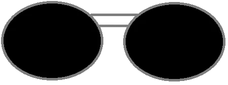
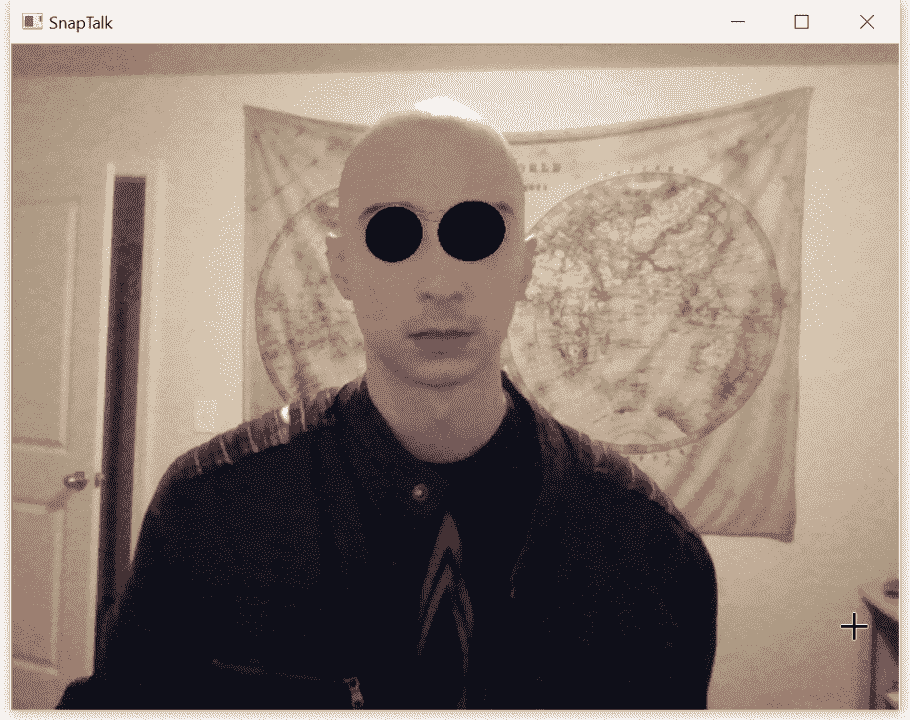
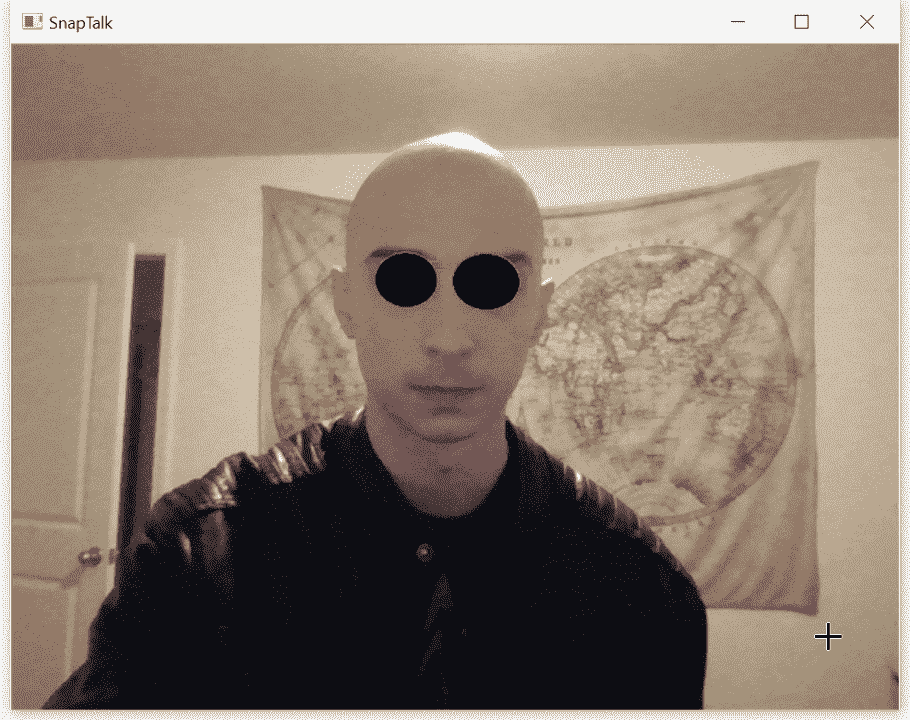

# 用 Python 创建 Snapchat 风格的过滤器

> 原文：<https://towardsdatascience.com/creating-a-snapchat-style-filter-with-python-b42ecfd2ff54?source=collection_archive---------7----------------------->

## 哈尔级联和单应性的实际演示


Ethan Robertson 在 [Unsplash](https://unsplash.com?utm_source=medium&utm_medium=referral) 上拍摄的照片

智能手机中增强现实(AR)的引入开创了一种新的娱乐方式。从玩 Pokémon Go 这样的游戏到在 Snapchat 上做鬼脸，AR 已经成为一种司空见惯的现象。

虽然这些技术似乎先进到可以借用科幻小说，但用 Python 创建一个有趣的 Snapchat 风格的过滤器却出人意料地简单。在这种情况下，我将创建一个过滤器，将一副太阳镜放在脸上。



我为这个项目画了这副太阳镜。我不会辞掉日常工作去追求艺术。

与任何 AR 一样，这种过滤器依赖于两个基本步骤。首先，它必须确定在视频帧中的何处投影图像。在这个例子中，无论我使用什么算法，都必须正确识别我眼睛的位置。其次，它必须变换投影图像，使其与视频帧的其余部分成比例。在这种情况下，图像是一副在投影时必须适合一双眼睛的太阳镜。

虽然这两个挑战听起来令人生畏，但是 Python 对 OpenCV 的实现使之变得相当容易。

# 基本概述

要克服的第一个挑战是检测一双眼睛。面部检测和面部标志检测都是计算机视觉中的巨大课题，有许多独特的方法，但这种方法将使用[哈尔级联](https://en.wikipedia.org/wiki/Viola%E2%80%93Jones_object_detection_framework)。

由 Paul Viola 和 Michael Jones 在 2001 年的一篇论文中首次介绍的 Haar Cascades 是一种专门为快速面部检测设计的通用监督机器学习技术。然而，OpenCV 没有从头开始训练，而是提供了许多预先构建的模型，包括人脸和眼睛检测。

第二个挑战是转换投影图像，以确保它与人脸成比例。关注投影空间中同构的单应性提供了一个解决方案。虽然这个概念本身听起来很吓人，但我们将使用它来将太阳镜投影到视频帧上，以便它看起来[自然](https://en.wikipedia.org/wiki/Homography_(computer_vision))。

显然，Haar Cascades 和 Homorgraphy 都是很深的概念，其细节超出了本文的范围，但是对它们是什么和它们做什么的基本理解将有助于理解代码实现。

# 检测眼睛

```
import numpy as np
import cv2# Import the pre-trained models for face and eye detection
face_cascade = cv2.CascadeClassifier("haarcascade_frontalface_default.xml")
eye_cascade = cv2.CascadeClassifier("haarcascade_eye.xml")
```

在做很多之前，导入 NumPy 用于高效的数值计算，导入 OpenCV 用于图像处理。

接下来调用 OpenCV 内置的级联分类器方法。现在还没有分类，但是这可以用来初始化将要使用的模型。作为参数传递的 XML 文件实际上是预先训练好的模型，专门检测面部和眼睛的正面视图。

这些预先训练好的模型内置在 OpenCV 中，但是可以在这里单独下载。但是，请注意，这些预先训练的模型已授权给英特尔，可能有使用限制。

```
# Global variable to cache the location of eyes
eye_cache = None
```

声明一个全局变量来创建缓存。这样做有两个原因:

1.  Haar Cascades 分类器将无法在每一帧中识别眼睛，这将产生闪烁效果。然而，通过使用缓存，该程序可以参考上次成功识别的眼睛位置，并相应地放置眼镜。这将消除闪烁，使程序运行更流畅。
2.  有时，哈尔喀斯会错误地识别两个以上的眼睛，这将打乱眼镜的位置。像以前一样，使用高速缓存，这可以通过参考眼睛的先前位置来校正。

虽然这使得程序运行更流畅，但这是有代价的。通过连续参考先前帧中眼睛的位置，眼镜的位置会滞后。对于平静地坐着甚至缓慢摇摆的人来说，这种影响不是很明显，但是快速移动的脸会看到这种影响。

```
# Capture video from the local camera
cap = cv2.VideoCapture(0)while True:

    # Read the frame
    ret, frame = cap.read() # Check to make sure camera loaded the image correctly
    if not ret:
        break
```

第一行捕捉视频。注意，传递 0 将使用电脑上的第 0 个摄像头。如果使用了 multiple，那么传递任何整数都会使用第 n 个相机。

此外，如果需要使用预先录制的视频，那么向视频的位置传递一个字符串也可以。

接下来，初始化一个无限循环，并读取来自摄像机的数据。变量“ret”只是一个布尔值，它表示视频是否实际上是从摄像机捕获的，而“frame”是来自摄像机的当前帧。如果“ret”为假，循环将会中断。

```
 # Convert to grayscale
    gray_frame = cv2.cvtColor(frame, cv2.COLOR_BGR2GRAY) # Detect faces
    faces = face_cascade.detectMultiScale(gray_frame, 1.3, 5)
```

该帧被转换成灰度，然后进入哈尔级联检测任何人脸。在眼睛之前检测到面部*，因为检测到的任何眼睛都应该位于面部内。如果一只眼睛位于脸部之外，那么要么是有问题，比如假阳性，要么是有问题*非常*。*

被调用来检测面的方法将返回一个面的矩阵，带有它们自己的(x，y)坐标以及宽度和高度。

```
 for (x, y, w, h) in faces: # Draw a rectangle around the face
        roi_gray = gray_frame[y:y+h, x:x+w] # Detect eyes within the grayscale region of interest
        eyes = eye_cascade.detectMultiScale(roi_gray)
```

对于找到的每一张人脸，视频帧的一个子部分被提取出来，称为感兴趣区域。这个感兴趣的区域然后通过专门研究眼睛的 Haar Cascades 分类器。检测到眼睛后，可以进行下一步。

```
 # Only detect 2 eyes
        if len(eyes) == 2:
            # Store the position of the eyes in cache
            eye_cache = eyes
        # If 2 eyes aren't detected, use the eye cache
        elif eye_cache is not None:
            eyes = eye_cach
```

如前所述，如果没有检测到眼睛或者检测到两个以上的眼睛，将使用缓存。如果如预期的那样检测到两只眼睛，则相应地更新缓存。

# 将图像投影到框架上

要将太阳镜的图像投影到视频帧上，使它们成比例，需要两件事情:太阳镜的(x，y)坐标和它们将被投影到视频帧上的(x，y)坐标。两者都将被组织成简单的矩阵。前者将是源矩阵，因为它是图像的源，而后者将是目的矩阵，因为它是图像的目的。

一旦两个矩阵都被开发出来，第三个矩阵，即单应矩阵，将被计算出来，它给出了如何“拉伸”太阳镜的图像以使其适合一双眼睛的方向。

```
 # read the image and get its dimensions
    img = cv2.imread("glasses_transparent.png", -1)
    img_h = img.shape[0]
    img_w = img.shape[1] # Create source matrix
    src_mat = np.array([[0,0], [img_w, 0],  [img_w, img_h], [0, img_h]])
```

首先，太阳镜的图像被读入内存。通常，图像有三个通道:红色、绿色和蓝色。这些表示默认的色彩空间；然而，一些图像有第四个通道，称为 [alpha 通道](https://en.wikipedia.org/wiki/Alpha_compositing)，它表示透明度。

当我画这副太阳镜时，我确保它包含一个透明的背景。通常，OpenCV 会忽略这一点，但是通过向 imread 方法传递-1，它会读取第四个通道。

读取图像后，标注尺寸，源矩阵由左上角、右上角、右下角和左下角的坐标组成。**矩阵必须是这个顺序！**

```
 # define the destination matrix based on eye detected order.
        # Order of points must be top-left, top-right, bottom-left,
        # and bottom-right
        if eyes[0][0] < eyes[1][0]:
            dst_mat = np.array([
                [x + eyes[0][0], y + eyes[0][1]],
                [x + eyes[1][0] + eyes[1][2], y + eyes[1][2]],
                [x + eyes[1][0] + eyes[1][2], y + eyes[1][1] + eyes[1][3]],
                [x + eyes[0][0], y + eyes[0][1] + eyes[0][3]] ])
        else:
            dst_mat = np.array([
                [x + eyes[1][0], y + eyes[1][1]],
                [x + eyes[0][0] + eyes[0][2], y + eyes[0][2]],
                [x + eyes[0][0] + eyes[0][2], y + eyes[0][1] + eyes[1][3]],
                [x + eyes[1][0], y + eyes[1][1] + eyes[1][3]] ])
```

这就是事情变得有点复杂的地方。当眼睛被检测时，没有办法预先知道眼睛的顺序。有时会先检测到右眼，有时会检测到左眼。为了测试，在两眼之间比较 x 坐标，然后可以组成适当的目的矩阵。

目标矩阵必须包含与源矩阵顺序相同的眼角坐标。换句话说，左上角、右上角、右下角和左下角的(x，y)坐标。

不这样做将会产生意想不到的结果。在我的第一次尝试中，眼镜自己折叠起来，看起来像是图形故障。

```
 # Get the dimensions of the frame
    face_h = frame.shape[0]
    face_w = frame.shape[1] # Find the Homography matrix
    hom = cv2.findHomography(src_mat, dst_mat)[0] # Warp the image to fit the homegraphy matrix
    warped = cv2.warpPerspective(img, hom, (face_w, face_h))
```

在快速获得视频帧的尺寸之后，使用内置的 OpenCV 方法找到单应矩阵。

接下来，源图像被扭曲，所以现在眼镜将与戴眼镜的脸成比例。现在唯一要做的就是将这个扭曲的图像投射到视频帧上并显示出来。

```
 # Grab the alpha channel of the warped image and create a mask
    mask = warped[:,:,3] # Copy and convert the mask to a float and give it 3 channels
    mask_scale = mask.copy() / 255.0
    mask_scale = np.dstack([mask_scale] * 3) # Remove the alpha channel from the warped image
    warped = cv2.cvtColor(warped, cv2.COLOR_BGRA2BGR)
```

图像的遮罩将原始图像的 alpha 通道。还可以通过使用阈值处理在不透明的图像上创建遮罩，但是使用透明的图像使得该过程更快更容易。

然后将掩码归一化，然后转换为三个通道，以便它可以与其他矩阵相乘。

在这一点上，阿尔法通道已经达到了它的目的，保持它实际上会导致比它解决的问题更多的问题。因此，最后一行将图像转换回正常的三通道图像。

```
 warped_multiplied = cv2.multiply(mask_scale, warped.astype("float"))
    image_multiplied = cv2.multiply(frame.astype(float), 1.0 -     mask_scale)
    output = cv2.add(warped_multiplied, image_multiplied)
    output = output.astype("uint8")
```

产生的遮罩与扭曲的图像相乘，这将在“透明”背景上创建一个扭曲的图像。然后，视频帧本身被放大，这在眼镜所在的图像中产生了一个间隙。这两幅图像加在一起，结果是一张戴着太阳镜的脸。

```
 cv2.imshow("SnapTalk", output)

    if cv2.waitKey(60) & 0xff == ord('q'):
        breakcap.release()
cv2.destroyAllWindows()
```

最后，显示图像。写一个退出条件，这样当“q”键被按下时，它中断循环。

一旦环路中断，摄像机将关闭，所有打开的窗口都将关闭。

# 结果呢

如果幸运的话，最终结果会是这样的:



我穿上了我最好的仿皮革夹克，以最大限度地提高这次展示的酷感

该程序自动准确地检测我的眼睛，并实时将眼镜投影到我的脸上。即使当我改变表情并在屏幕上移动我的头时，眼镜也没有太大问题。

因为我使用缓存来记录眼镜的位置，即使我的眼睛没有被检测到，眼镜仍然在屏幕上。因此，我可以在擦眼睛的时候假装拿着眼镜。

玻璃本身倾向于改变大小，这是哈尔级联分类器的结果。当它设法找到我的眼睛时，它不断地改变分类尺寸。与太阳镜的平面图像搭配，合成图像看起来滑稽可笑。额外的工作，如使用眼镜尺寸的滚动平均值，可能会适应这一点，但它确实会产生更多的滞后。



在快速运动中，程序的滞后变得相当明显。

随着程序的运行，当对象快速移动时会有明显的滞后。当我在屏幕上移动时，在程序再次找到我的眼睛之前，眼镜会暂时悬停。

然而，与之前的演示相比，我的动作比正常人自然会做的动作更快。理想情况下，即使在这种速度下，程序也能找到我的眼睛，但它最终足够好地服务于它的目的。

# 结论

虽然有许多关于人脸检测的教程和文章，但将它用于 AR 推动了这些技术的可能性。在本文中，Haar cascades 用于眼睛，但是对于身体的不同部分存在各种其他预训练模型，这增加了可能使用的应用数量。同样，作为一种通用的机器学习技术，定制的 Haar 级联可以被训练并用于尚不可用的东西。

再加上 AR 的新颖性，可以创建一个简单的 Snapchat 风格的过滤器。单应提供了一个很好的工具，可以将 2D 项目投射到视频静止图像中，产生有趣的效果。