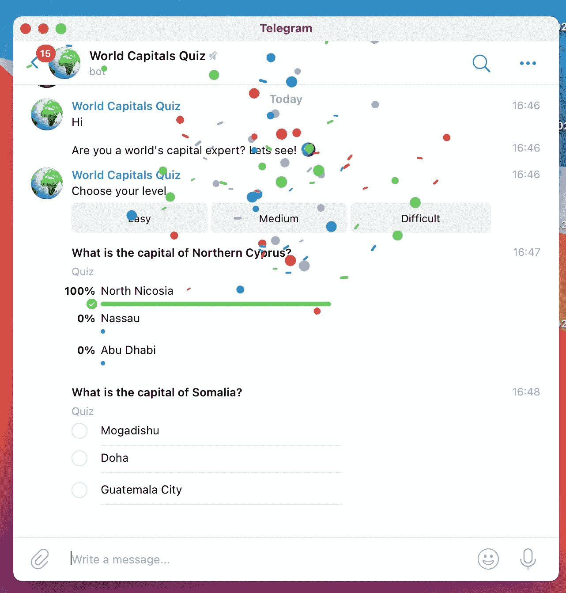
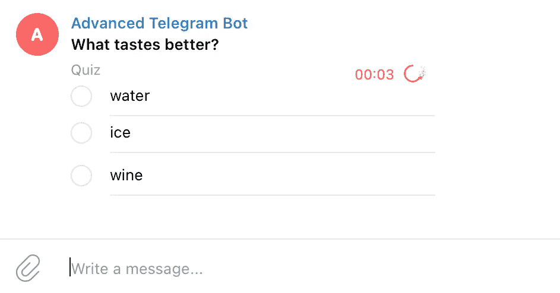
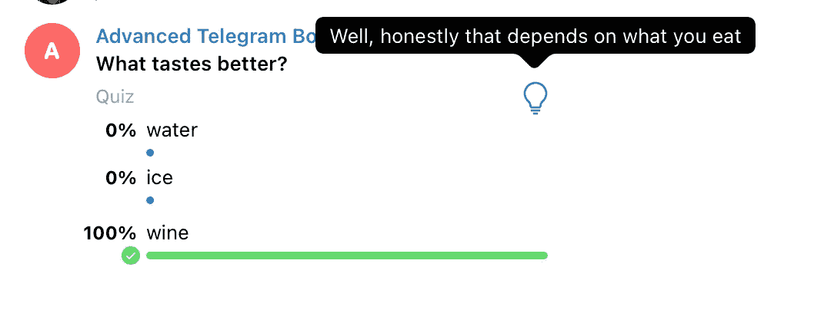
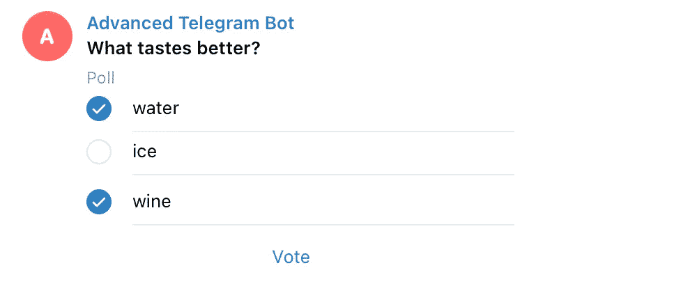

# 用 Python 创建电报聊天机器人测验

> 原文：<https://towardsdatascience.com/creating-a-telegram-chatbot-quiz-with-python-711a43c0c424?source=collection_archive---------6----------------------->

## 教程和一个真实的例子:“世界首都”聊天机器人测验



作者图片

Telegram 成为一个伟大的聊天机器人平台的特征之一是能够创建[投票](https://telegram.org/blog/polls-2-0-vmq)。这是在 2019 年推出的，后来通过添加**问答模式**进行了改进，最重要的是，通过将其提供给 Telegram Chatbot API。

可以在 Telegram 应用程序中直接创建投票(无需编码),但这里我们将探索如何使用 [Python Telegram Bot](https://python-telegram-bot.readthedocs.io/) 库从头开始开发 Telegram 聊天机器人测验。

首先做一些热身:**玩一个真实的例子**，测试你对世界各国首都的了解😎。使用`/start`命令(*)开始对话。

[](https://t.me/world_capitals_quiz_bot) [## 世界首都测验

### 测试你对世界各国首都的了解🌎

t.me](https://t.me/world_capitals_quiz_bot) 

(*)请耐心等待，它会按需运行，可能需要几秒钟才能醒来并开始聊天😊

# 聊天机器人设置

该设置包括 3 个步骤:

*   交谈[机器人父亲](https://t.me/botfather)创建一个新的聊天机器人并获得授权令牌
*   配置更新程序对象和方法处理程序
*   启动聊天机器人(在本例中，在**轮询模式下**，但是可以使用 Webhook 代替)

```
defmain():
  updater = Updater('secret token', use_context=True)

  dp = updater.dispatcher

  *# command handlers* dp.add_handler(**CommandHandler**("help", help_command_handler))
  *# message handler* dp.add_handler(**MessageHandler**(Filters.text, main_handler))
  *# quiz handler* dp.add_handler(**PollHandler**(poll_handler, pass_chat_data=True, pass_user_data=True)) # start
  updater.start_polling()
  updater.idle()
```

理解上面定义的**处理器**负责处理“帮助”命令、简单的文本消息和投票回答是很重要的。

# 获取聊天 Id

我们将首先创建一个助手方法来获取聊天 id:这将在本教程中非常有用，而且如果你开发其他电报聊天机器人。

```
# extract chat_id based on the incoming object
def get_chat_id(update, context):
  chat_id = -1

  if update.**message** is not None:
    chat_id = update.message.chat.id
  elif update.**callback_query** is not None:
    chat_id = update.callback_query.message.chat.id
  elif update.**poll** is not None:
    chat_id = context.bot_data[update.poll.id]

  return chat_id
```

# 测验问题

使用`send_poll`方法可以创建测验答案

```
c_id = **get_chat_id**(update, context)q = 'What is the capital of Italy?'
answers = ['Rome', 'London', 'Amsterdam']message = context.bot.**send_poll**(chat_id=c_id, question=q, options=answers, type=Poll.**QUIZ**, correct_option_id=0)
```

`type`必须是`Poll.QUIZ`才能触发**测验效果**(选择正确答案后的纸屑)`correct_option_id`必须与`answers`提供的列表中的正确选项(位置)相匹配。

# 测验问题增强

让我们不要停留在基础知识上，而是让测验变得更有趣一点。

可以在**中增加一个倒计时**来让它更刺激:

```
message = context.bot.send_poll(chat_id=c_id, question=q, options=answers, type=Poll.QUIZ, correct_option_id=0, **open_period**=5)
```



超时 5 秒的问题—图片由作者提供

可以包括**附加解释**以在用户回答后提供额外信息:注意用户可用的灯图标。

```
message = context.bot.send_poll(chat_id=c_id, question=q, options=answers, type=Poll.QUIZ, correct_option_id=0, 
**explanation**= **'**Well, honestly that depends on what you eat**'**, **explanation_parse_mode** = telegram.ParseMode.MARKDOWN_V2)
```



带附加“解释”的问题—作者图片

# 处理答案

了解如何处理用户答案很重要。

Telegram BOT API 提供了方法和对象来呈现一个漂亮的界面，以及庆祝正确的答案(或标记错误的响应)。然而，**开发人员需要跟踪成功的答案**并构建必要的逻辑，例如计算分数、增加后续问题的复杂性等...

所有测验答案都被发送到`PollHandler`,在那里`update`对象将携带包含所有必要信息的有效载荷

```
# handling Poll answers
def poll_handler(update, context): # Quiz question
  question = update.poll.question
  # position of correct answer
  correct_answer = update.**poll.correct_option_id** # first option (text and voted yes|no)
  option_1_text = update.**poll.options[0].text**
  option_1_vote = update.**poll.options[0].voter_count**
```

有效载荷中的每个`option`指示它是否已经被投票(`voter_count`等于 1)。

```
# find the answer chosen by the user
def get_answer(update):
  answers = update.poll.options

  ret = ""

  for answer in answers:
    if **answer.voter_count == 1**:
      # found it
      ret = answer.text
      break return ret
```

使用`correct_option_id`可以确定用户给出的答案是否正确。

```
# determine if user answer is correct
def is_answer_correct(update):
  answers = update.poll.options

  ret = **False**
  counter = 0

  for answer in answers:
    if answer.voter_count == 1 and \
                update.poll.correct_option_id == counter:
      ret = **True**
      break

    counter = counter + 1 return ret
```

# 常规民意测验差异

可以创建一个**常规投票**来代替测验:逻辑和代码是相同的，但是有一些不同之处，使得标准投票更适合于调查和问卷:

*   没有五彩纸屑庆祝
*   允许多个答案
*   让用户可以看到结果

```
message = context.bot.send_poll(chat_id=cid, question=q, options=answers, type=Poll.**REGULAR**, **allows_multiple_answers**=True,
**is_anonymous**=False)
```



定期投票-按作者分类的图片

# 结论

我们已经介绍了在 Telegram 上开发一个测验的所有关键概念，查看 [Github repo](https://github.com/gcatanese/SampleTelegramQuiz) 从一个基本的测验实现开始，使用本文中提供的代码片段。

如果您正在开发电报聊天机器人，您可能会发现这很有用:

[](/bring-your-telegram-chatbot-to-the-next-level-c771ec7d31e4) [## 让你的电报聊天机器人更上一层楼

### 发现可以改变现状的高级功能

towardsdatascience.com](/bring-your-telegram-chatbot-to-the-next-level-c771ec7d31e4) 

如有问题和建议，请在 Twitter 上找到我，如果你创建了一个电报问答聊天机器人，请与我分享！