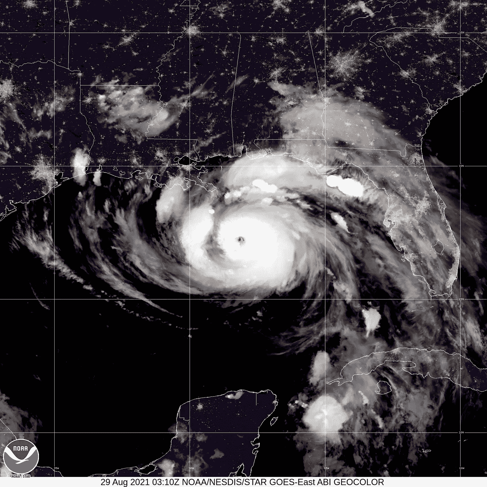
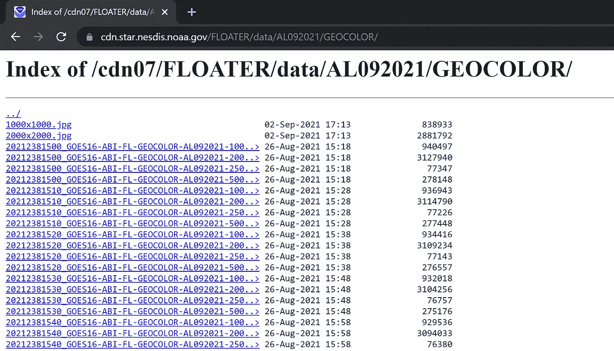

# 利用 NOAA 卫星图像制作飓风视频

> 原文：<https://towardsdatascience.com/creating-a-video-of-hurricane-from-noaa-satellite-images-ed39178d501c?source=collection_archive---------35----------------------->

## 使用 Wolfram 语言



(图片来自 NOAA，公共领域)

国家气象局提供由 T2 国家海洋和大气管理局 T3 运营的许多卫星的详细卫星图像。当出现严重的天气事件时，如飓风伊达，他们就训练一颗卫星跟踪这一事件，并在它的一生中跟踪它。这篇文章展示了如何使用 [Wolfram 语言](https://www.wolfram.com/language/)将这些图像转换成一个视频。这段视频让我们对艾达的演变有了有趣的了解，从一个小型热带低气压，到一场大飓风，再到美国东北部的一场主要造雨者:

图片来自 NOAA(公共领域)

用于生成上面显示的视频的图像存储在 NOAA 网络服务器上。以下代码为这些 NOAA 图像设置了**基本** URL:

```
base = "https://cdn.star.nesdis.noaa.gov/FLOATER/data/AL092021/GEOCOLOR/"
```

此网页有许多不同大小(250x250、500x500、1000x1000 和 2000x2000)的特定图像的超链接:



(图片由作者提供)

为了从该页面获取图像链接，我们使用 Wolfram 语言将该页面作为 [XMLObject](https://reference.wolfram.com/language/ref/XMLObject.html) 导入:

```
xml = Import[base, "XMLObject"];
```

使用这个 **xml** 对象，我们可以使用 [Cases](https://reference.wolfram.com/language/ref/Cases.html) 和 [Select](https://reference.wolfram.com/language/ref/Select.html) 来提取我们感兴趣的图像(在这种情况下，我们想要 2000 x 2000 像素的图像):

```
files = Select[
  Cases[
    xml,
    XMLElement["a", {_, "href" -> href_}, _] :> href, 
    \[Infinity]
  ],
  StringContainsQ["_GOES16-ABI-FL-GEOCOLOR-AL092021-2000x2000.jpg"]
]
```

**files** 变量是我们感兴趣的所有图像文件的列表。

接下来，我们使用 [CreateDirectory](https://reference.wolfram.com/language/ref/CreateDirectory.html) 创建一个目录来存储下载的图像:

```
CreateDirectory["ida-images"]
```

使用 [URLDownload](https://reference.wolfram.com/language/ref/URLDownload.html) 我们可以将图像下载到本地硬盘:

```
downloads = URLDownload[
  URLBuild[{base, #}],
  FileNameJoin[{"ida-images", #}]
] & /@ files;
```

**下载**变量是所有本地图像文件的列表。

使用 [SlideShowVideo](https://reference.wolfram.com/language/ref/SlideShowVideo.html) ，我们现在可以从图像列表中创建一个视频。我们给每幅图像 0.3 秒的显示时间，即每秒三幅图像:

```
video = SlideShowVideo[downloads -> 0.3]
```

生成的视频以文件形式存储在本地计算机上，并准备上传到 [YouTube](https://www.youtube.com/watch?v=0HlhEB2GT88) :

那么现在我们有了这个视频，可以回放整个事件，我们能学到什么呢？令我震惊的是，国家气象局能够如此早地探测到这个热带低气压，并预测到它将转变为飓风。他们指示他们的一颗卫星，在很早的时候就聚焦在这个低气压上:在登陆前三天。

我发现早期的图像序列，直到眼壁的形成，是最有趣的观看。特别是在这段视频的第 45 秒，热带系统似乎在日落时爆发了。到了晚上，在清晨时分，这个系统已经变成了古巴北部的一个旋转的怪物。

眼墙也很迷人，令人惊讶的是它在陆地上能坚持多久。路易斯安那州的海岸大部分是沼泽，海水非常温暖，这可能有助于这种持久力。

该系统一直旋转，直到它完全覆盖田纳西州，之后它成为东北部各州的主要降雨者。据报道，纽约市在短短 3 小时内降雨量达到创纪录的 5 英寸，今年第二次关闭了地铁系统。

这个系统最终会消失，尽管一路追踪到欧洲并观察它是否也会在那里引发问题会很有趣。

要了解更多的细节和完整代码的 Wolfram 笔记本，请看这篇文章:【https://community.wolfram.com/groups/-/m/t/2358543