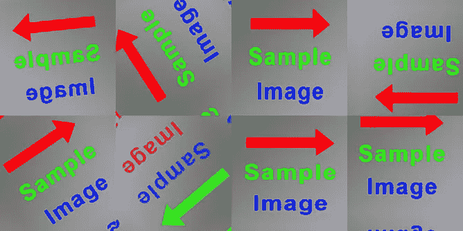
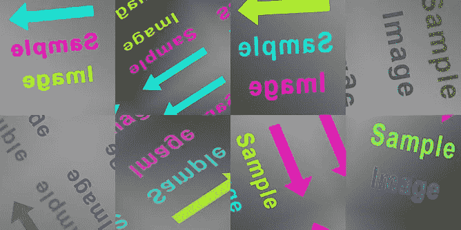
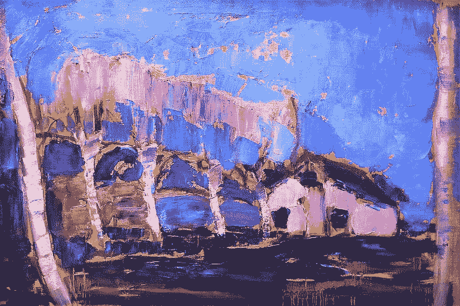
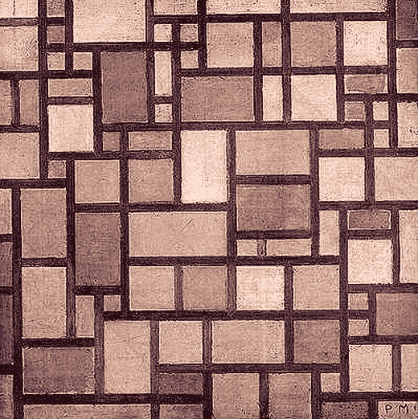

# 用风格创造抽象艺术

> 原文：<https://towardsdatascience.com/creating-abstract-art-with-stylegan2-ada-ea3676396ffb?source=collection_archive---------11----------------------->

## 我如何使用自适应鉴别器增强和学习转移来生成具有人工智能的改进的抽象画。


**style gan 2 ADA**的输出样本，图片作者

回到 2020 年 8 月，我创建了一个名为 [MachineRay](/machineray-using-ai-to-create-abstract-art-39829438076a) 的项目，该项目使用 Nvidia 的 StyleGAN2 来创作基于 20 世纪早期公共领域绘画的新抽象艺术品。从那以后，Nvidia 发布了新版本的人工智能模型 StyleGAN2 ADA，旨在从有限的数据集生成图像时产生更好的结果[1]。(我不确定他们为什么不叫它 StyleGAN3，但为了节省几个字符，我将把新型号称为 SG2A)。在本文中，我将向您展示我如何使用 SG2A 来创建更好看的抽象画。

# 机器射线 2

## 概观

类似于原始的机器射线，我使用公共领域的抽象画作为我的源图像来训练 SG2A 系统。然后，作为后期处理的一部分，我改变了长宽比。这张图显示了系统的流程。


**MachineRay 2 流程图**，图片作者

一切都从我用自定义脚本从 WikiArt.org 收集的 850 张图片开始。图像经过预处理，作为“真实”图像输入鉴别器网络。一组 512 个随机数被选择并输入到样式映射器和生成器网络中，以创建“假”图像。真假图像都用自适应鉴别器增强进行了修改，这是 SG2A 的关键创新。我将在本文中进一步讨论这一点。鉴别器网络的工作是确定输入是真的还是假的。结果反馈到三个网络来训练它们。训练完成后，我对生成器网络的输出进行后处理，以获得最终的图像。

我将在下面的小节中更详细地介绍每个步骤。

## 收集源图像

我使用一个 Python 脚本来收集来自 WikiArt.org 的图像，这些图像被标记为“抽象的”并且在公共领域中，即在 1925 年之前创建的。这些图片来自蒙德里安、康定斯基、克利等人。收集图像的源代码是这里的。这里有一幅原画的样本。


**WikiArt.org 抽象画的随机样本**，在公共领域

## 预处理源图像

以下是我用来预处理图像的步骤:

1.  移除框架:Python 脚本查找并移除图像周围的木制(或其他)框架。这里的代码是[这里是](https://github.com/robgon-art/MachineRay/blob/master/remove_frames.py)。
2.  调整到 1024x1024: GANs 最适合调整到 2 的幂的正方形图像，例如 2 ⁰ = 1024

这是一个预处理图像的例子。


**预处理抽象画**、**、作者图片**

## 自适应鉴别器增强

SG2A 的主要改进之一是在训练期间动态地改变图像增强的数量。

图像增强已经存在一段时间了。这个概念相当简单。如果没有足够的图像来训练 GAN，可能会导致性能下降，如过拟合、欠拟合或可怕的“模型崩溃”，即生成器重复相同的输出图像。解决这些问题的方法是图像放大，你可以应用旋转、缩放、平移、颜色调整等变换。，为训练集创建附加图像。

图像增强的一个缺点是变换可能“泄漏”到生成的图像中，这可能是不希望的。例如，如果要生成人脸，可以使用 90°旋转来增加训练数据，但可能不希望生成的人脸被旋转。Nvidia 发现，在以非零概率跳过的条件下，增强可以被设计为不泄漏的。因此，如果输入鉴别器的大部分图像没有旋转以进行增强，生成器将学习不创建旋转的图像[1]。

> …只要损坏过程由数据空间上概率分布的可逆变换来表示，训练就会隐式地撤销损坏并找到正确的分布。我们称这种增强操作器为非泄漏操作器。Tero Karras 等人。

新版本的 StyleGAN 具有一个名为自适应鉴别器增强(ADA)的功能，可以在训练期间执行非泄漏图像增强。一个新的超参数 *p* ，在 0 到 1 的范围内，确定在训练期间对真实图像和伪图像应用增强的程度和频率。

这里有一个示例，显示了不同的 *p* 值。



**图片放大**(上图)p=0.0，0.2，0.4(下图)p=0.6，0.8，1.0，图片作者

您可以看到随着 *p* 从 0.0 增加到 1.0，样本图像显示出更多的空间和颜色变化。(注意，SG2A 没有显示在训练期间对真实图像进行的增强。所以我在我的代码分支中添加了这个功能，这里是。你可以在谷歌实验室里运行一个测试，[这里](https://colab.research.google.com/github/robgon-art/MachineRay2/blob/main/StyleGAN2_ADA_Augmentation_Test.ipynb)。)

当训练开始时，值 *p* 从 0 开始，然后如果系统在训练期间检测到过拟合或欠拟合，则增加或减少。

在处理一批生成的图像期间，系统中使用的试探基于鉴别器输出的符号(正或负)。如果正输出值比负输出值多，则趋势是朝向真实图像，这是过度拟合的指示。如果负值比正值多，则趋势是假图像，这是拟合不足的指示。批处理后，相应地上调或下调 *p* 的值——上调表示过拟合，下调表示欠拟合。

可以设置 *p* 的目标值，即 0.7，因此总是有非零概率可以跳过增加，这避免了泄漏。

你可以在 Mayank Agarwal 的帖子[中阅读更多关于适应性鉴别器增强的信息。](https://medium.com/swlh/training-gans-with-limited-data-22a7c8ffce78)

## 训练系统

我用谷歌 Colab 训练了这个系统。跑了大概四天。该系统拥有 Nvidia Tesla V100 GPU，可运行高达 14 万亿次浮点运算(每秒 14 万亿次浮点运算)。因此，训练大约需要 4.6 万亿次浮点运算(大约 4.6 万亿次浮点运算)。这需要大量的数学运算。

这是我用来启动的 shell 命令。

```
python stylegan2-ada/train.py --aug=ada --target=0.7 \
--mirror=1 --snap=1 --gpus=1 \
--data='/content/drive/MyDrive/datasets/paintings' \
--outdir='/content/drive/MyDrive/results_stylegan2_ada'
```

将 *aug* 参数设置为 *ada* 可在需要时启用自适应鉴别器增强。将*目标*参数设置为 *0.7* 可防止 *p* 超过 0.7，这样可最大化动态增强，而不会将任何进一步增强泄露到最终图像中。

这是一张训练结果随时间变化的图表。我使用弗雷歇初始距离(FID)作为图像质量和多样性的衡量标准，分数越低越好[2]。你可以在 Cecelia Shao 的帖子[中阅读关于 FID 分数的信息。](/graduating-in-gans-going-from-understanding-generative-adversarial-networks-to-running-your-own-39804c283399)


**style gan 2 和 StyleGAN2 ADA 的训练结果——越小越好**，图片作者

您可以看到在相同的迭代次数下，StyleGAN2 ADA 如何优于原始的 StyleGAN2。SG2A 的 FID 分数在大约 300 次迭代后降至 100 多一点。以下是一些结果示例。


**style gan 2 ADA 的输出**，图片作者

甘似乎创作出了各种各样的抽象画，有着有趣的构图和各种各样的配色方案。但是还有改进的余地。

# 迁移学习

这可能不直观，但可以通过首先在一组不同的更大的图像上训练 GAN，然后使用抽象绘画进一步训练模型来提高绘画的质量。这种技术被称为迁移学习。它在 1976 年首次被描述为一种训练神经网络的技术[3]。

> 迁移学习是一种使用为任务 1 训练的预训练神经网络的技术，用于在学习任务 2 中实现更短的训练时间。[4]斯特沃·博兹诺夫斯基

## 从风景画到抽象画

我记得在我的艺术史 101 课堂上学到，许多抽象画家是从画具象的主题开始的，比如人和风景。例如，这里是蒙德里安、克利和康定斯基的一系列绘画，展示了他们从风景到抽象艺术的进展。



皮埃特·蒙德里安:沿着阿姆斯特尔，未确定，灰色轮廓的浅色平面，来源:wikiart.org


《采石场、城堡和太阳、光和其他》,资料来源:wikiart.org


wikiart.org:《冬季景观》,《绿色住宅景观》,《构图研究 II》

## 从风景中学习

我想看看我是否能把从创作风景照片中学到的知识转移到提高它创作抽象画的能力上。

作为一项实验，我用来自 Flickr 的 4800 张公共领域的风景照片来训练 SG2A。Arnaud Rougetet 的数据集可以在 Kaggle 上找到，点击这里。

这是来自 Flickr 的照片样本。请注意，我将每张照片的大小调整为 1，024 x 1，024 像素。


Arnaud Rougetet 收集的**实景照片**、**公共领域图片**

我使用另一个 Google Colab 训练 SG2A 系统来创建新的风景图像。开展培训也花了大约四天时间。下面是我使用的 shell 命令。

```
python stylegan2-ada/train.py --aug=ada --target=0.7 \
--mirror=1 --snap=1 --gpus=1 \
--data='/content/drive/MyDrive/datasets/landscapes' \
--outdir='/content/drive/MyDrive/results_stylegan2_ada_landscapes'
```

这个命令和我以前用抽象画训练的命令几乎一样。唯一的区别是 Google Drive 上风景文件夹的路径。这里有一个图表显示了景观训练的 FID 分数(绿线)。


**抽象艺术和风景的培训结果——越小越好**，作者图片

生成的风景比抽象画好得多。你可以看到，在大约 150 次迭代后，它在 25 左右触底。风景比抽象画得分高的原因可能是由于更大的训练集-4800 幅风景和 850 幅抽象画。

## 假风景

这里有一些生成的风景照片，是经过四天的 SG2A 训练后创作的。


**生成的风景照片**，**，**图片作者

这些看起来很不错。地平线有点扭曲，云看起来有点不可思议，但它们可以作为真实的风景照片。现在让我们看看这种学习是否有助于创造抽象艺术。

## 转移学习

实验的下一步是重新训练 SG2A 从之前在风景上训练的模型开始创作抽象艺术。这里有一个流程图显示了这一过程。


**学习创作风景后学习绘画抽象艺术**，作者图片

在甘人被训练去创造风景后，他们被进一步训练去利用先前的风景知识创造抽象画。我用第三个谷歌实验室训练了这个系统。下面是我使用的 shell 命令。

```
python stylegan2-ada/train.py --aug=ada --target=0.7 \
--mirror=1 --snap=1 --gpus=1 \
--data='/content/drive/MyDrive/datasets/paintings' \
--resume='/content/drive/MyDrive/results_stylegan2_ada/00006-landscapes-mirror-auto1-ada-target0.7-resumecustom/network-snapshot-000048.pkl' \
--outdir='/content/drive/MyDrive/results_stylegan2_ada_tl' 
```

我正在使用抽象画进行训练，但是*恢复*选项从用风景训练甘开始训练。最后的训练花了大约四天时间。这是一张 FID 分数的图表。新的结果是蓝色的。


**采用迁移学习的抽象艺术培训结果——越小越好**，作者图片

你可以看到迁移学习帮助提高了分数。最近一次训练的 FID 值稳定在 85 左右，比之前的 105 分要好。这里有一些受益于迁移学习的样本图片。


**style gan 2 ADA 带迁移学习的输出**，图片作者

这可能很微妙，但用迁移学习模型创建的图像看起来更精致，更令人愉快。请查看下面的附录中的样本库。

## 生成图像

一旦训练好 GAN，就可以使用这个命令行生成图像。

```
python stylegan2-ada/generate.py --seeds=1-4 --trunc=1.5 \
  --outdir results --network=network-snapshot-000188.pkl
```

这将使用随机种子 1、2、3 和 4 生成四幅图像。截断参数 *trunc* 将决定图像中的变化量。我发现默认值 0.5 太低了，1.5 给出了更多的变化。

# 创作你自己的画

一个用于生成各种长宽比的图像的 Google Colab 在这里[可用](https://colab.research.google.com/github/robgon-art/MachineRay2/blob/main/MachineRay2_Image_Generation.ipynb)。它可以生成 21 幅图像，并让你选择一幅以高分辨率观看。这是一个图像样本。


**由 MachineRay 2 Google Colab** 生成的样本图片，图片作者

# 后续步骤

额外的工作可能包括培训风景画，而不是照片的迁移学习。这可能有助于甘将绘画风格应用于抽象画。

# 感谢

我要感谢詹尼弗·林、奥利弗·斯特林佩尔、马赫萨·梅斯加兰和瓦希德·呼罗珊对这个项目的帮助和反馈。

# 源代码

我收集的 850 幅抽象画可以在 Kaggle [这里](https://www.kaggle.com/robgonsalves/abstract-paintings)找到。这个项目的所有源代码都可以在 [GitHub](https://github.com/robgon-art/MachineRay2) 上获得。这些源代码在 [CC BY-NC-SA 许可](https://creativecommons.org/licenses/by-nc-sa/4.0/)下发布。


**署名-非商业性使用-类似分享**

# 参考

[1]t . Karras，m . Aittala，j . hells ten，Laine，s . lehti nen，j .和 Aila。用有限的数据训练生成性对抗网络。，2020 年 10 月 7 日，[https://arxiv.org/pdf/2006.06676.pdf](https://arxiv.org/pdf/2006.06676.pdf)

[2] Eiter，t .和 Mannila，h .，“计算离散的 Fréchet 距离”，Christian Doppler labor für expertensyteme，1994 年 4 月 25 日，[http://www . kr . tuwien . AC . at/staff/e ITER/et-archive/cdtr 9464 . pdf](http://www.kr.tuwien.ac.at/staff/eiter/et-archive/cdtr9464.pdf)

[3] Bozinovskim S .和 ful gosi a .,“模式相似性和迁移学习对基本感知机 B2 训练的影响”*信息研讨会会议录，*3–121–5，1976 年

[4] Bozinovski，s .，“对神经网络中迁移学习的第一篇论文的提醒，1976 年”。informatica 44:291–302，2020，[http://www . informatica . si/index . PHP/informatica/article/view/2828](http://www.informatica.si/index.php/informatica/article/view/2828)

# 附录 MachineRay 2 结果图库

