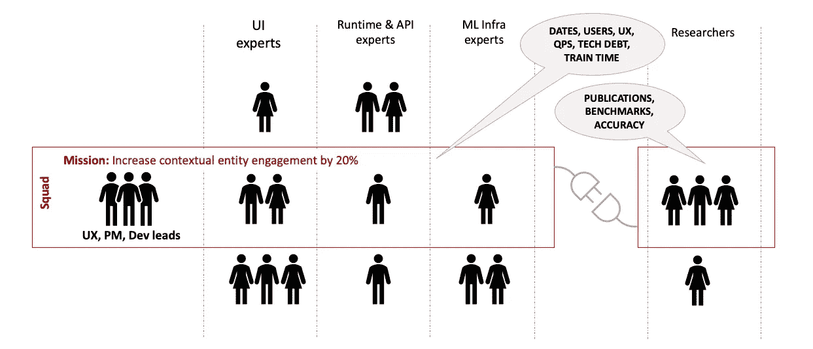
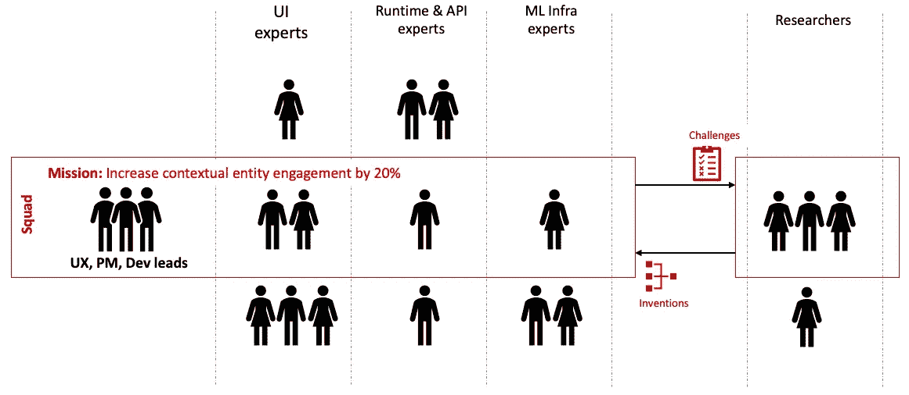
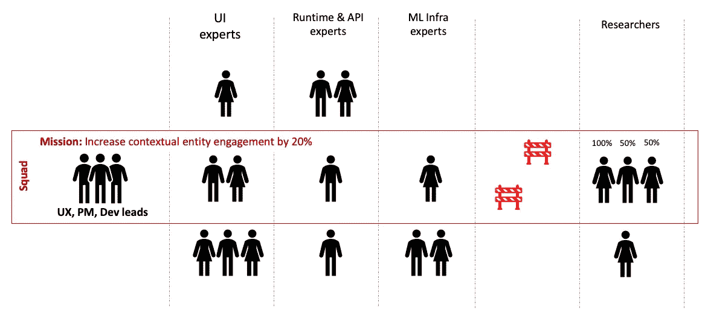
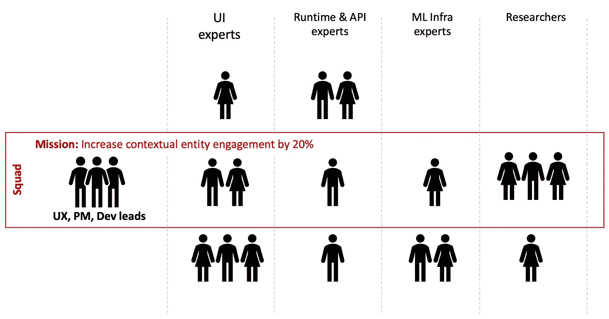

# 创建与研究科学家一致的产品团队

> 原文：<https://towardsdatascience.com/creating-aligned-product-teams-with-research-scientists-e4725ed735d7?source=collection_archive---------23----------------------->

## *当你的产品团队需要创新时，如何与研究科学家合作*

在产品团队中建立产品管理、用户体验和工程之间的一致性是一项挑战。当你的产品依赖于创新技术时，在这种组合中包括研究科学家可能会产生额外的复杂性。

由[兰迪父亲](https://unsplash.com/@randyfath?utm_source=medium&utm_medium=referral)在 [Unsplash](https://unsplash.com?utm_source=medium&utm_medium=referral) 上拍摄的照片

在 IBM 的聊天机器人平台 Watson Assistant 的五年时间里，我与多个人工智能研究团队一起领导了各种产品任务。在这篇文章中，我将解释我们在产品和研究科学家团队之间经历的几种不同的合作*模式*。在我们成功地创建了一个团结的团队后，一些合作非常富有成效。在其他一些情况下，我们遭受了产生次优结果的跨学科冲突。

# 背景:我们的产品团队是如何工作的？

我们的产品团队围绕*任务*、*成果*和*小队*组织交付:

*   一个 ***任务*** 是一个关注一些可测量的 ***结果*** 的交付。
*   *A* ***小队*** 是拥有使命的跨职能团队，由产品经理、用户体验、工程经理领导。

我们为每个班配备完成特定任务所需的所有技能。理想情况下，每个小队都有一个任务，每个队员都被分配到一个小队。

例如，我们可能有一个“增加 20%上下文实体特性的参与度”的任务。这个任务的团队可能需要新用户体验的设计师，实现这些设计的 UI 开发技能，对我们的机器学习基础设施的改变(例如，减少训练时间)，以及改进的机器学习模型(例如，在不影响训练时间的情况下提高算法性能)。

# 当我们需要人工智能创新时，协作面临挑战

围绕产品团队成员的任务创建团队是一项常规操作。当然，我们确实在努力应对典型的产品开发挑战:总是有优先级、路线图、运营和员工问题。当我们执行时，我们偶尔会遇到工程、产品管理和设计之间的跨学科分歧。

当产品团队与*研究科学家*合作解决人工智能难题时，额外的挑战出现了，特别是对于一个拥有大量客户的现有成功产品。

*研究人员*通常不属于产品组织，而是*研究组织*的成员。研究和产品组织之间的合作总是通过描述目标、计划和承诺的文档来计划和正式化。

要求研究人员“只是加入团队”并不总是奏效。属于不同组织的人通常有不同的文化、日常挑战、业务承诺和职业发展目标。

产品团队制定了严格的工程实践和团队仪式，以管理常规的跨学科冲突，避免客户不满。总有一些重要的里程碑、重要的客户和运营挑战需要担心。产品经理和设计师担心 A/B 测试、NPS、转化和参与度指标。工程团队筛选每一个拉动请求，担心缺陷或生产事故会影响生产。

另一方面，研究团队试图解决看似不可能的问题。他们创建各种原型，通常从事多个需要实验的开放式项目。客户压力、生产事故和业务目标对他们来说并不是常规挑战。然而，他们必须赶上技术趋势，发表论文，并为未来的研究项目争取资助。

# 三种合作模式

尽管理想的合作是创建*一个来自所有学科的团队*来交付一个结果，但上面概述的差异使这变得困难。团队成员或管理层对理想协作的愿景有时会被业务约束和个性所掩盖。

# 模式 1:通过依赖关系控制协作

开始协作的最快方式是将产品和研究团队分开，并通过依赖关系来管理协作。然而，团队经常在以后为这个初始速度买单。

模式 1:通过依赖关系控制协作

在这种模式下，在最初的启动研讨会之后，研究团队基本上独立于产品团队工作。产品管理描述业务目标，技术领导同意高级技术路线和时间表。然后，两个团队分开工作，除了技术领导和经理之间的定期检查点会议。代码工件可以保持分离，产品团队定期采用这些研究工件。

缺乏跨领域协作经验的团队倾向于默认这种方法，因为它的“快速启动”特性。孤立的团队在早期阶段似乎进步很快。然而，这种速度通常是一种错觉，随着失调和误解的出现，团队要付出很多倍的代价。

这种协作模式也将研究人员与客户需求隔离开来。通常，期望的用户体验、操作约束和业务需求对 AI 算法提出了要求。断开连接的研究团队无法获得 A/B 测试的实时更新、用户研究结果以及来自产品管理的更新。新的人工智能算法最终没有满足客户的需求，即使它击败了所有的研究基准。

如果两个团队开发的组件已经存在，或者如果它们有明确定义的边界和 API 契约，这种类型的合作可能会产生好的结果。如果存在团队和组织之间的功能失调，这种模式也往往会出现。这种隔离让双方都能取得进展，但也将冲突推迟到以后处理。

# 模式 2:单个班的部分合作，有行动限制

通过创建一个单独的团队，更紧密的合作是可能的，但对研究和产品团队如何在任务中合作有规则和限制。当研究团队需要或喜欢某种程度的独立性时，这种模式可以很好地用于面向客户的任务。

模式 2:单个班的部分合作，有行动限制

操作是这种协作中经常协商的要素。研究团队可能不具备部署、维护和寻呼机工作的技能或兴趣。类似地，模仿团队边界的源代码控制边界往往会形成，规则规定谁可以在相同的应用程序边界内交付、审查或合并不同组件的代码。

谁加入队伍仪式也可以被有意地限制。可能只有一两个研究负责人总是加入 scrums 和 playbacks，而其他人则远离这些活动。一些(或全部)研究团队在这种产品任务上的分配少于 100%也是很常见的。制定这些规则的原因通常是其他并行的产品或研究合作、会议以及出版所需的时间。

这种模式运作良好的先决条件是，至少有一名工程团队成员和一名研究团队成员不受任何限制地“无所不在”，并且 100%地参与任务，没有其他兼职。理想情况下，这些工程和研究领导作为所有工程师和研究人员的技术领导。他们主导端到端的产品功能，甚至参与运营。拥有两个这样的具有工程和学术/人工智能印章的模范领导，极大地帮助了产品和研究团队之间的沟通。

寻找具有如此广泛技能和动机的人才可能很难。除了系统招聘之外，一个组织需要有一个训练有素的方法在内部培养这样的人才。雇用合适的人的组织文化激励学习和“流动”对于培养和留住这样的人才至关重要。

# 模式 3:在一个小队中充分合作

这种模式是关于有一个班，每个人都 100%分配到任务，除了任务什么都没有，对任何一个队都没有特殊的规则或限制。

模式 3:在一个小队中充分合作

这种模式非常适合面向客户的任务。每个团队成员关注相同的结果，参加相同的会议，看到相同的实验结果，担心相同的用户角色。

当所需的创新受到明确定义的领域的限制时，这种模式也很有效。当研究和产品团队专注于客户驱动的结果时，开放式的研究挑战和“寻找将推动产品方向的算法”不会很好地工作。

当它起作用时，这种协作模式也是团队成员个体最满意的。研究团队喜欢看到他们的研究成果帮助实际客户。他们中的一些人欣赏他们在与工程师合作部署和扩展他们的解决方案时获得的新技能。产品团队成员非常喜欢成为创新研究的一部分，并对研究团队的工作方式有了更多的了解。

然而，*“一个小队，一个任务”并不总是发生，即使是在标准的产品团队中。为了赶上最后期限，要求工程师或设计师“帮助另一项任务进行几个冲刺”的情况并不少见。研究人员也有类似的冲突。做“研究工作”、写论文、参加会议或参与其他合作所需的时间。*

*此外，如果产品和研究领导之间存在个人或激励冲突，早期阶段的“一个团队，一个任务”可能会混乱。*

# *你该怎么办？*

*作为一个单一的以结果为导向的跨职能团队(或者它的老校名，“特色团队”)工作，虽然理想和有趣，但并不总是容易的。在产品团队中，作为一个单独的团队，成功地协作可能会遇到许多组织和个人的障碍。*

*如果你的产品团队没有在跨职能团队中工作的经验，从“单一团队，单一任务”开始可能会更难。尽管跨职能团队对于产品团队来说不是一个新概念，但是围绕组件和规程创建边界在许多产品组织中仍然很常见。随着研究人员的加入，拥有一些在跨职能团队中工作经验丰富的团队成员将有助于这种合作模式的成功。*

*最后，只是给团队时间来弄清楚他们应该如何合作有时是正确的策略。在我经历的早期，我们能够在大约 60%的时间里预先确定并执行我们希望如何与人工智能研究团队合作。在剩下的时间里，我们的协作方法随着时间的推移和实验而出现(在一些冲突和失败之后),并且主要由约束和个性形成。*

*然而，随着我们获得了更多的经验，随着产品和研究团队中更多的人在几个成功故事之后开始*看到光明*，我们的研究团队执行“单个团队，单个任务”方法的成功率显著增加。*