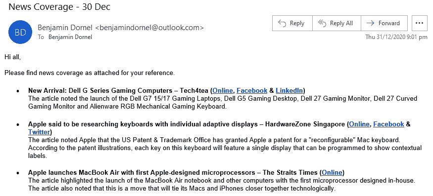
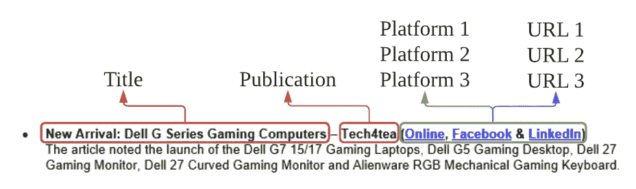
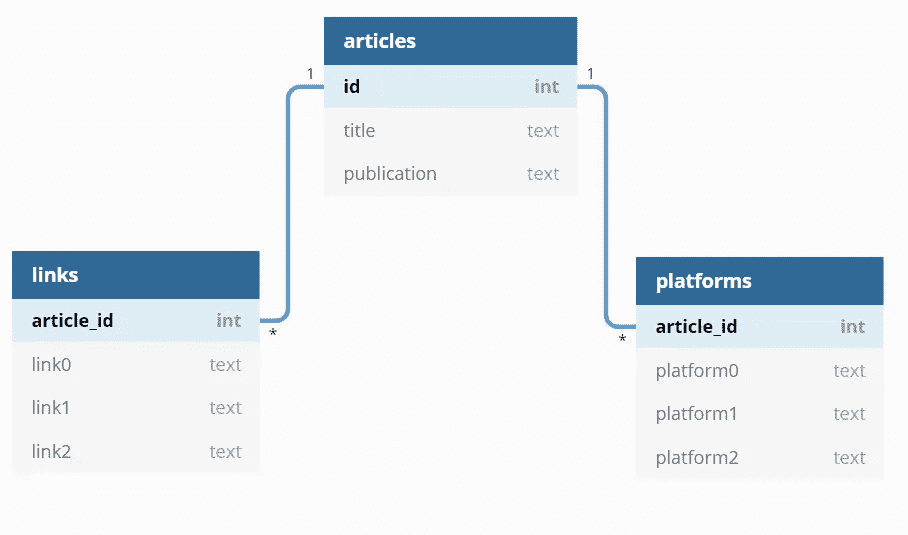
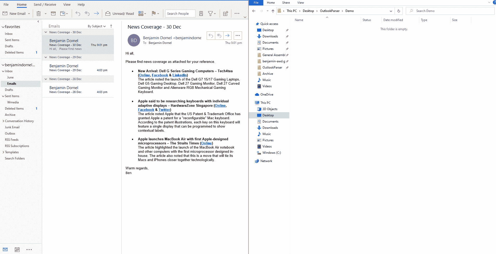
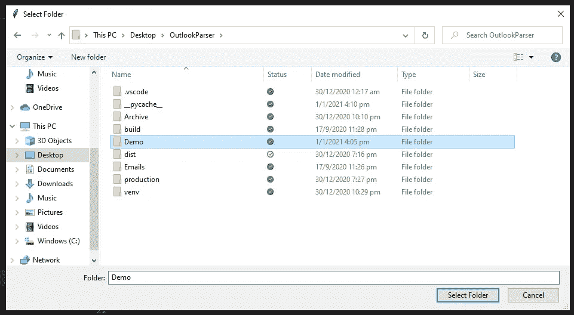
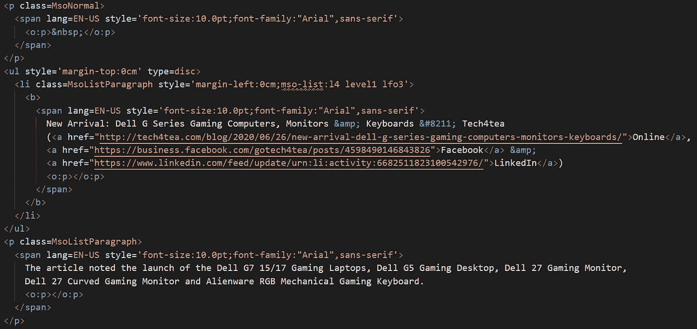
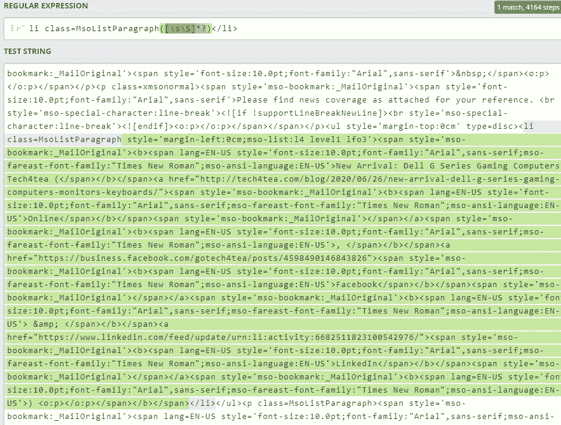
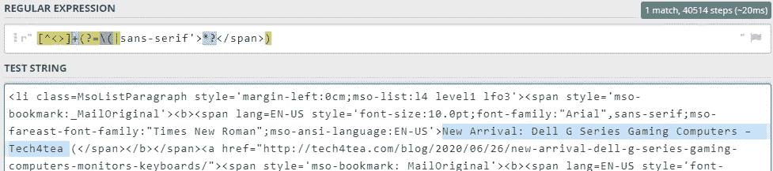
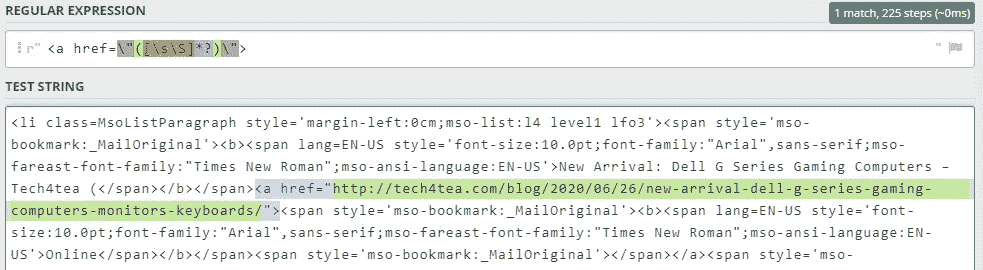
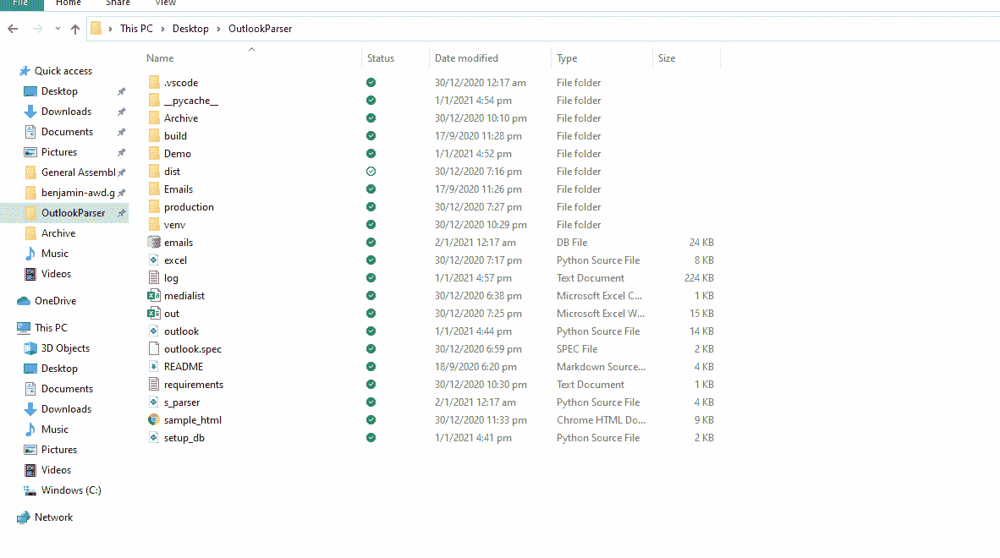

# 用 Python 和 SQL 创建电子邮件解析器

> 原文：<https://towardsdatascience.com/creating-an-email-parser-with-python-and-sql-c79cb8771dac?source=collection_archive---------2----------------------->

## 通过自动从电子邮件中提取数据来提高您的工作效率


[Solen Feyissa](https://unsplash.com/@solenfeyissa) 在 [Unsplash](https://unsplash.com/photos/LBNJi8qHIbA) 上拍照

## **嗯，那是什么？一个邮件解析器？**

您可能想知道什么是电子邮件解析器，为什么您可能需要一个。

简而言之，电子邮件解析器是一种从入站电子邮件和附件中寻找和提取数据的软件。更重要的是，电子邮件解析器使用条件处理来提取对您重要的特定数据。

那么，为什么这很重要呢？如果你曾经从事过常规的办公室工作，你可能会非常熟悉报表，或者说，从 Microsoft Outlook 向 Excel 或 Word 复制粘贴文本行。

你甚至可能一周又一周地重复同样的报告。再加上格式和拼写检查，这会耗费你大量的时间，而你本可以专注于更重要的任务。

好消息是，您可以使用 Python 和 SQL 来自动化这个过程的大部分。

在这篇文章中，我将介绍如何用 Python 打开 Outlook 电子邮件，并将正文提取为 HTML。然后，我将介绍如何用 Python 解析这些数据，以及如何将最终数据上传到 SQL 数据库。从那里，您可以将这些数据写入 Excel 或将其转换成 Pandas 数据框架。

# 入门指南

我们将在这里使用几个关键的 Python 库，即`os`、`sqlite3`和`pywin32`。

首先，我们需要决定我们想从邮件中提取什么。例如，假设我们有一堆电子邮件，每封邮件都包含一个新闻文章列表，如下所示:



假设我们想要提取每个要点的**头**，它包括标题、出版物、媒体平台和 URL 链接。简而言之，我们希望将每个项目符号的整个标题提取出来，然后将其分成四个不同的部分。



我们要从中提取文本的示例标题

到目前为止，我们的伪代码应该是这样的:

```
1\. Create list of emails that we want to parse
2\. Open first email
3\. Iterate over each bullet point
4\. Extract data from bullet point
5\. Upload data from bullet point to a database
6\. Repeat until all data is parsed, then move to next email
```

# **创建 SQL 数据库**

在解析我们的电子邮件之前，我们首先要用 Python 建立一个 SQL 数据库。我们将通过使用一个名为`db`的连接对象建立到 SQLite 数据库的连接来实现这一点。

```
# Create & connect to database
db = sqlite3.connect("emails.db")
```

如果它还不存在，一个新的数据库将被创建为`emails.db`。然后，我们可以在数据库中创建表，稍后电子邮件解析器可以写入这些表。

```
# Create empty tables
db.execute("""
CREATE TABLE IF NOT EXISTS "articles" (
"id" INTEGER,
"title" TEXT UNIQUE,
"publication" TEXT,
PRIMARY KEY("id" AUTOINCREMENT))
""")db.execute("""
CREATE TABLE IF NOT EXISTS "links" (
"article_id"    INTEGER,
"link0" TEXT,
"link1" TEXT,
"link2" TEXT,
PRIMARY KEY("article_id"))
""")db.execute("""
CREATE TABLE IF NOT EXISTS "platforms" (
"article_id"    INTEGER,
"platform0" TEXT,
"platform1" TEXT,
"platform2" TEXT,
PRIMARY KEY("article_id"))
""")
```

实质上，我们创建了三个表，其中我们的主表是“文章”，它与“平台”和“链接”有一对多的关系。换句话说，这反映了一篇文章可以有许多不同的平台和链接。



我们的数据库模式

# 在 Python 中访问您的电子邮件

您需要将希望解析的电子邮件从 Outlook 移动到一个文件夹中。最简单的方法是拖放。



拖放方法的演示

接下来，创建一个变量来存储电子邮件的文件夹路径。您可以手动操作，如`folder_path = r‘C:\Users\Username\EmailFolder’`或使用`tkinter`和`os`，这将生成一个文件浏览器提示来选择一个文件夹。

```
# Create an folder input dialog with tkinter
folder_path = os.path.normpath(askdirectory(title='Select Folder'))
```



用 tkinter 获取我们的文件夹路径

这里，我们使用用`tkinter`创建的文件输入提示来保存我们的文件夹路径，然后用`os`规范化路径来删除任何多余的分隔符。

然后，我们希望获得每封电子邮件的路径标题。我们可以用`os.listdir()`来实现，它给出了指定目录中所有文件的列表。

```
# Initialise & populate list of emails
email_list = 
[file for file in os.listdir(folder_path) if file.endswith(".msg")]
```

这将保存列表中每个电子邮件的文件名，以便我们以后访问。

# 将 Outlook 连接到 Python

接下来，您将需要创建一个对象，允许我们从 Python 中控制 Outlook。这是通过`pywin32`库实现的，该库有助于通过**微软** **Outlook 消息传递 API (MAPI)** 将 Python 连接到 Outlook。

```
# Connect to Outlook with MAPI
outlook = win32com.client.Dispatch(“Outlook.Application”)
                  .GetNamespace(“MAPI”)
```

这样，我们可以开始将每个项目作为 HTML 对象打开，并使用**正则表达式**即 Regex 来提取每封电子邮件的正文。

虽然传统观点认为不应该使用 Regex 来解析 HTML，但我们并不担心这一点，因为我们只希望从标准电子邮件格式中提取非常具体的文本片段(一些商业电子邮件解析器，如 [Parseur](https://parseur.com/blog/parsing-html-with-regular-expressions-for-fun-and-profit#top_post) 主要围绕 Regex 构建)。

从这一点来看，Regex 可以用来缩小您想要提取的特定数据的范围。

```
# Iterate through every email
for i, _ in enumerate(email_list): # Create variable storing info from current email being parsed
   msg = outlook.OpenSharedItem(os.path.join(folder_path,
   email_list[i])) # Search email HTML for body text
   regex = re.search(r"<body([\s\S]*)</body>", msg.HTMLBody)
   body = regex.group()
```

# 用 Python 解析电子邮件 HTML

这是我们的电子邮件的第一个要点可能看起来像 HTML:



我们的电子邮件片段的 HTML 视图

好的——我们可以看到这里有几个关键特征，即我们的数据以项目符号列表或`li class=MsoListParagraph`的形式存在。我们可以使用正则表达式来提取每个项目符号。

```
# Search email body text for unique entries
pattern = **r"li class=MsoListParagraph([\s\S]*?)</li>"**
results = re.findall(pattern, body)
```

每个项目符号都被提取为一个字符串，每个字符串都存储在一个列表中。我们的第一个要点应该是这样的:



用正则表达式([Regex101.com](https://regex101.com/))缩小 HTML 正文的范围

为了检索我们的标题和出版物，我们可以再次使用 Regex。这一次，我们还将在文本上使用 call `html.unescape()`来帮助将 HTML 翻译成字符串，例如&8211；→-(unicode 破折号)。

```
regex = re.search(r**"[^<>]+(?=\(|sans-serif’>([\s\S]*?)</span>)"**, header)# HTML unescape to get remove remaining HTML
title_pub = html.unescape(regex.group())
```



我们的正则表达式返回高亮显示的文本作为上面的变量

从这里开始，它就像拆分我们的文本一样简单。我们可以用`split_list = title_pub.split("–")`给我们一个列表:`["New Arrival: Dell G Series Gaming Computers", "Tech4tea"]`。

然后，我们可以删除任何多余的空白，并将每一项保存为一个变量。

```
title = split_list[0].strip()
publication = split_list[1].strip()
```

已经两次了！

为了获得我们的媒体平台，我们将使用一种更简单的方法。

```
# List of publications to check for
platform_list = ["Online", "Facebook", "Instagram", "Twitter", "LinkedIn", "Youtube"]# Create empty list to store publications
platform = []# Iterate and check for each item in my first list
for p in platform_list:
   if p in header:
      platform.append(p)
```

这将给我们一个出版物列表:`["Online", "Facebook", "LinkedIn"]`

现在来看看网址:

```
# Find all links using regex
links = re.findall(r"<a href=\”([\s\S]*?)\”>", header)
```

这将为我们提供下面以绿色突出显示的字符:



很漂亮，对吧？

到目前为止，我们的数据应该是这样的:

```
Title: New Arrival: Dell G Series Gaming Computers
Publication: Tech4tea
Platform: [‘Online’, ‘Facebook’, ‘LinkedIn’]
Links: [‘[http://tech4tea.com/blog/2020/06/26/new-arrival-dell-g-series-gaming-computers-monitors-keyboards/'](http://tech4tea.com/blog/2020/06/26/new-arrival-dell-g-series-gaming-computers-monitors-keyboards/'), ‘[https://business.facebook.com/gotech4tea/posts/4598490146843826'](https://business.facebook.com/gotech4tea/posts/4598490146843826'), ‘[https://www.linkedin.com/feed/update/urn:li:activity:6682511823100542976/'](https://www.linkedin.com/feed/update/urn:li:activity:6682511823100542976/')]
```

# 将数据上传到 SQL 数据库

这个过程的最后一步是将每条数据上传到我们的 SQL 数据库。

我们将从上传我们的标题和出版物数据开始。这可以通过下面的代码来实现:

```
# Insert title & pub by substituting values into each ? placeholder
db.execute("INSERT INTO articles (title, publication) 
VALUES (?, ?)", (title, publication))
```

上传我们的链接和平台有点棘手。首先，我们将从主表中复制主 id，然后逐个迭代每个平台和链接。

```
# Get article id and copy to platforms & links tables
article_id = db.execute(“SELECT id FROM articles WHERE title = ?”, (title,))for item in article_id:
   _id = item[0]for i, _ in enumerate(platform):
   db.execute(f”UPDATE platforms SET platform{i} = ? WHERE    
   article_id = ?”, (platform[i], _id))for i, _ in enumerate(links):
   db.execute(f”UPDATE links SET link{i} = ? WHERE article_id = ?”, 
   (links[i], _id))# Commit changes
db.commit()
```

这里的最后一步是将所有这些更改提交给数据库。完成后，我们的电子邮件解析器就完成了！如果您愿意，您可以使用类似于 [DB 浏览器](https://sqlitebrowser.org/)的工具来检查您的数据库内容是否已经成功更新。



使用数据库浏览器查看数据库

如果你需要的话，我已经在我的[网站](https://www.benjamindornel.com/projects/email_parser.html)和 [Github](https://github.com/benjamin-awd/OutlookParser50/blob/main/Demo/s_parser.py) 上传了完整的代码。