# 在自动气象站上创造一个有气流和 DBT 的环境(第一部分)

> 原文：<https://towardsdatascience.com/creating-an-environment-with-airflow-and-dbt-on-aws-part-1-ca13bc95f479?source=collection_archive---------8----------------------->

## 启动实例并安装气流


在 [Unsplash](https://unsplash.com?utm_source=medium&utm_medium=referral) 上[万圣业](https://unsplash.com/@wansan_99?utm_source=medium&utm_medium=referral)拍摄的照片

在研究气流的时候，我试着用它来安排一些 DBT 的工作。虽然我在互联网上找到了一些关于它们的设置和一些关于它们的集成的资源，但我在设置我可以测试集成选项的整个环境时遇到了一些麻烦，比如 API 调用或 DBT 命令。

当我达到我所需要的时候，我必须做很多设置，安装操作系统库或 Python 库，以及诸如此类的事情。所以，我意识到从零开始再做一次有点难。此外，不仅我可能不得不再次这样做，而且有人可能会有同样的问题，并利用这些步骤。于是，我又做了一遍，记下了所有的事情。

本文的主要目标是展示如何配置同时具有气流和 DBT 的环境，并集成这两种工具。

我不会试图解释这两个工具到底是什么或者它们的更高级的资源。基本上，DBT 是一个使用 SQL 在数据仓库中转换数据的工具。Airflow 是一个基于 Python 的工具，用于编排和调度工作流。好吧，既然你在使用 Python，基本上你可以对各种东西进行编排。但是如果你看到了这个页面，你可能已经知道它们是什么以及它们是如何工作的了。我希望这篇文章可以帮助你作为一个起点，然后你可以延伸到你自己的需求。

还有，我不会用更复杂更合适的架构。因为我们的目标是集成气流和 DBT，所以我将在这个环境中使用最简单的配置。所以，我不会用其他像芹菜或 Kubernetes 的气流执行器。

为此，我们将启动一个 EC2 实例，安装这两个工具，对它们进行配置，并在这两个工具上创建一些东西，这样我们就可以集成它们。

# ***1。在 AWS*** 上启动 EC2 实例

如果您知道如何在 EC2 上启动一个实例并连接到它，那么您可以按照自己喜欢的方式来做，然后跳到下一步。

我将在 AWS 上使用 t3a.medium EC2 实例。起初我试图使用 t2.micro，因为它在空闲层，但是一些命令冻结了机器。你可以尝试使用 t2.micro，但我不推荐。

要启动实例，我们可以使用 Amazon AMI OS 和所有默认设置。只要继续点击下一步，直到安全组页面。在此页面中，选择“创建新的安全组”。根据需要命名，并添加一个规则，选择“所有流量”类型和“我的 IP”源。点击查看并启动。这将允许您进行 SSH 连接(端口 22)并打开气流页面(端口 8080)。如果您愿意，您可以只创建这两条规则。

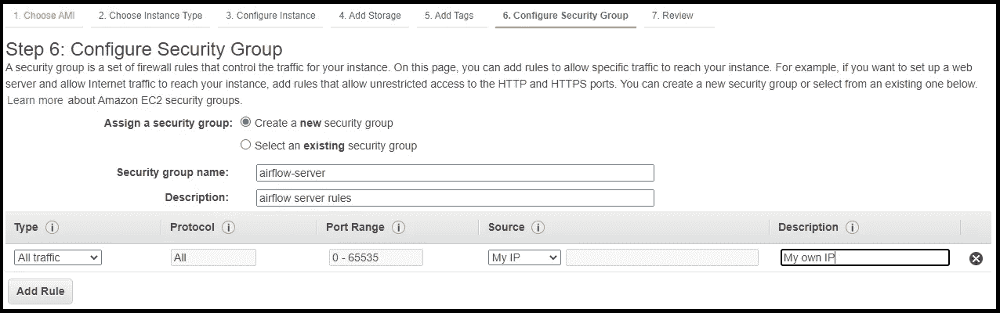

AWS 上的安全组。这就像它的防火墙

下一页显示了实例的摘要。当您单击 Launch 按钮时，您会收到一个弹出窗口，要求您设置密钥对。如果您没有或不确定要选择什么，请选择“创建新的一对”选项。给文件命名，然后按“下载密钥对”按钮。确保您下载了密钥对文件(一个带有。pem 扩展名)，然后单击“启动实例”。

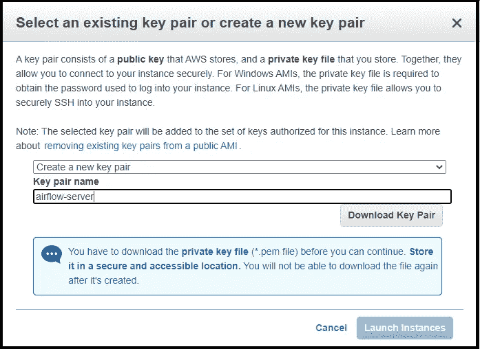

下载实例的密钥对文件的唯一机会

您可能需要等待几分钟才能运行实例。当新实例的状态为 Running 时，选择它并单击 Connect 按钮。选择 SSH 选项卡并复制 SSH 命令的示例(“SSH-I your-key . PEM ec2-user @ something”)。

要连接到实例，您可以直接使用终端或 Putty。但我将继续使用 Visual Code Studio，因为它是我们稍后也要使用的工具，我们可能会在 Windows 或 Linux 上使用相同的过程。

在 Visual Studio 代码上，转到左上角的扩展图标。搜索 SSH-Remote 扩展并下载它。

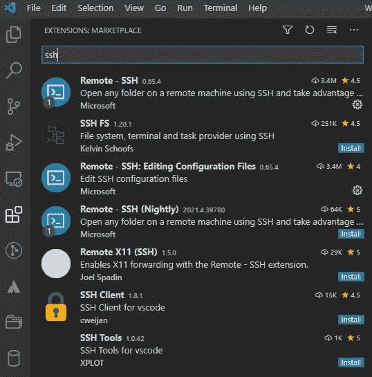

远程 SSH 扩展

安装后，按 F1，数字 SSH，你会看到新的扩展选项。选择“添加新的 SSH 主机”并粘贴 AWS 的示例。

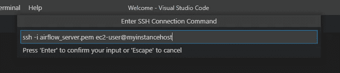

将连接添加到实例中

添加连接后，将显示一个带有打开配置的弹出窗口(如果没有，请按 F1，编写 SSH 并选择“打开 SSH 配置文件”)。在该文件中，您将拥有一个主机，其主机和主机名与您在 AWS 上看到的 EC2 实例主机相同。您可以为 Host 使用更重要的文本。只是不要改变主机名。在“身份文件”字段中，您将只有。pem 文件。写入文件的完整路径(在 Windows 上，类似于“C:\ Users \ UserName \…\ name-of-the-file . PEM”)；在 Ubuntu 上，类似“/home/users/UserName/…/name-of-file . PEM”的东西。保存文件。

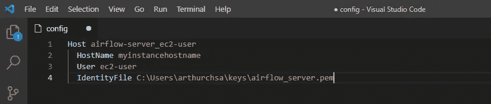

SSH 配置文件，其中包含。pem 文件

现在，按 F1，写 SSH，选择“连接到主机”。选择您用作主机的名称。如果一切正常，您将有一个新的 VSCode 窗口连接到 EC2 实例。如果文件有错误。pem，您可能需要在路径中从“/”切换到“\”，反之亦然。现在，我们必须修改。pem 文件。

打开终端(菜单终端>新建终端，或点击终端选项卡)，转到保存有 *cd 的文件的目录。*

现在，如果您使用的是 Linux，请使用以下命令:

```
$ sudo chmod 400 name-of-the-file.pem
```

如果您使用的是 Windows:

```
$ path = ".\name-of-the-file.pem"
$ icacls.exe $path /reset
$ icacls.exe $path /GRANT:R "$($env:USERNAME):(R)"
$ icacls.exe $path /inheritance:r
```

考虑到您现在已经连接到 EC2 实例，打开终端菜单，然后打开新建终端。使用下面的命令确保实例的操作系统得到更新。

```
$ sudo yum -y update
```

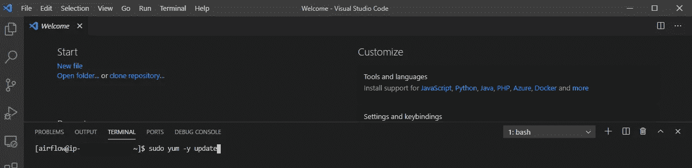

我们将使用的终端

# 2.安装气流及其要求

首先，让我们安装操作系统的先决条件。经过一些实验后，下面命令上的包似乎是必要的并且足以做我们想做的一切:

```
$ sudo yum -y install wget tar intltool icu4c gettext icu libicu-devel gcc-c++ python3-devel redhat-rpm-config gcc libffi-devel python-devel openssl-devel gzip gcc make expect openssl-devel bzip2-devel libffi-devel
```

在我们安装 Airflow 之前，我们需要升级 sqlite 版本。以下是命令。如果你对 sqlite 的链接有错误，请查看它的页面，因为它可能会被更新。

```
$ wget [https://www.sqlite.org/src/tarball/sqlite.tar.gz](https://www.sqlite.org/src/tarball/sqlite.tar.gz)
$ tar xzf sqlite.tar.gz
$ cd sqlite/
$ export CFLAGS="-DSQLITE_ENABLE_FTS3 \
-DSQLITE_ENABLE_FTS3_PARENTHESIS \
-DSQLITE_ENABLE_FTS4 \
-DSQLITE_ENABLE_FTS5 \
-DSQLITE_ENABLE_JSON1 \
-DSQLITE_ENABLE_LOAD_EXTENSION \
-DSQLITE_ENABLE_RTREE \
-DSQLITE_ENABLE_STAT4 \
-DSQLITE_ENABLE_UPDATE_DELETE_LIMIT \
-DSQLITE_SOUNDEX \
-DSQLITE_TEMP_STORE=3 \
-DSQLITE_USE_URI \
-O2 \
-fPIC"
$ export PREFIX="/usr/local"
$ LIBS="-lm" ./configure -disable-tcl -enable-shared -enable-tempstore=always -prefix="$PREFIX"
$ make
$ sudo make install
```

现在，打开/etc/environment 文件:

```
$ sudo vi /etc/environment
```

并添加这些行，这样就加载了正确版本的 SQLite。当您执行上面的命令时，终端中会打开一个空白文件。如果您使用 vi(如上面的命令)进入编辑模式，请按“I”。然后，给下面的线编号或粘贴。按 ESC 退出编辑模式。然后数字':w '和回车保存文件。现在，数字':q '和回车退出文件。一开始可能有点棘手，但你会习惯的。

```
export LD_LIBRARY_PATH="/usr/local/lib"
export LD_RUN_PATH="/usr/local/lib"
```

并运行以下命令来加载修改后的文件:

```
$ source /etc/environment
```

使用以下命令检查操作系统上的 sqlite 版本和 Python 识别的版本:

```
$ sqlite3 --version
$ python3 -c "import sqlite3; print(sqlite3.sqlite_version)"
```

如果一切正常，两者都将返回版本 3.36(或更高版本，取决于您何时执行该过程)。

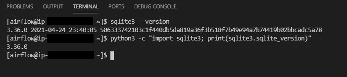

在操作系统和 Python 上检查 SQLite 版本

现在，让我们创建一个拥有气流装置的用户:

```
$ sudo adduser airflow
```

并使用以下命令为用户定义密码:

```
$ sudo passwd airflow
```

我继续使用“气流”这个密码，但是你可以随意选择一个更好的。请注意，如果我在某个地方使用了密码，而你有不同的密码，请用你的密码交换。

使用下面的命令编辑文件，将新用户添加到 sudoers 文件中:

```
$ sudo vi /etc/sudoers
```

搜索“root ALL=(ALL) ALL”行。将这一行复制粘贴到下面，将“根”部分切换为“气流”(该行将是:气流全部=(全部)全部)。

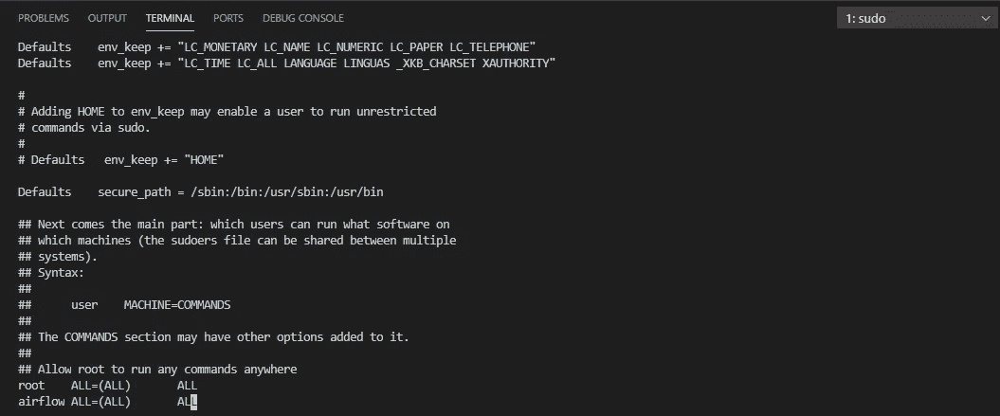

将 airflow 用户添加到 sudoers 文件中

使用命令切换到新用户，然后输入密码:

```
$ su airflow -
```

让我们为 airflow 安装创建一个目录，为虚拟环境创建一个目录，然后创建一个 venv 来安装 airflow:

```
$ mkdir ~/airflow
$ mkdir ~/.venv
$ python3 -m venv ~/.venv/airflow
```

通过以下方式激活新环境:

```
$ source ~/.venv/airflow/bin/activate
```

现在，运行这两个命令来安装更多 Airflow 需要的依赖项:

```
$ sudo python3 -m pip install -U pip
$ sudo python3 -m pip install -U setuptools
```

现在，我们要安装气流。从 Apache Airflow 页面中的命令，我们必须将 python 改编为 python3，将 pip 改编为 pip3。因此，我们有以下内容:

```
$ AIRFLOW_VERSION=2.0.1
$ PYTHON_VERSION="$(python3 --version | cut -d " " -f 2 | cut -d "." -f 1-2)"
$ export AIRFLOW_HOME=~/airflow
$ CONSTRAINT_URL="https://raw.githubusercontent.com/apache/airflow/constraints-${AIRFLOW_VERSION}/constraints-${PYTHON_VERSION}.txt"
$ pip3 install --upgrade "apache-airflow[postgres,google]==${AIRFLOW_VERSION}" --constraint "${CONSTRAINT_URL}"
```

现在，转到 Airflow 主目录并初始化 airflow 元数据数据库:

```
$ cd ~/airflow
$ airflow db init
```

如果一切正常，您应该会看到类似 airflow.cfg 和 airflow.db 的文件。

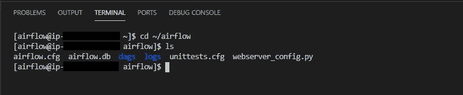

气流目录中的文件，在我们初始化它之后

现在，要以最简单的方式运行气流，我们需要运行两个服务。其中一个是调度器。为此，只需在终端上运行以下命令:

```
$ airflow scheduler
```

当您运行这个命令时，您的终端将被该服务的所有输出“锁定”。因为我们仍然需要运行第二个服务，所以我们需要打开第二个终端。在 VSCode 中，我们只需进入终端菜单，选择新终端。第一个航站楼将继续运行，并将开通一个全新的航站楼。如果您从一开始就遵循了整个过程，那么将再次与 ec2 用户建立远程 ssh 连接。我们需要切换到 airflow 用户并激活我们创建的虚拟环境:

```
$ sudo su airflow -
$ cd ~
$ source ~/.venv/airflow/bin/activate
```

最后，运行我们需要的第二个服务:

```
$ airflow webserver
```

我们有足够的证据来检查气流是否流动。转到您的浏览器，使用端口为 8080 (http://#的实例的 IP 或主机名作为 URL。##.###.###:8080).可能需要几秒钟才能访问应用程序。如果您在使用此地址时遇到一些错误，请检查您的浏览器是否正在尝试使用 https 而不是 http。必须是 http。

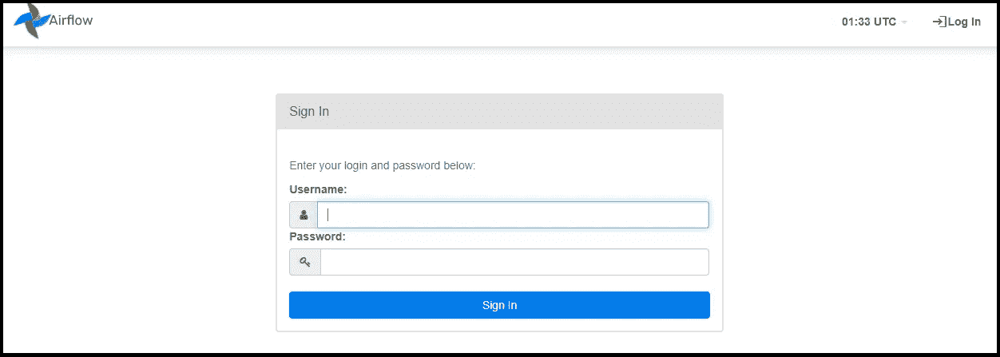

气流初始页面

现在，即使气流页面正确打开，我们仍然无法登录。为此，我们需要创建一个用户。因为我们使用的两个终端正在运行服务，所以我们需要再打开一个，以便再次在实例上运行命令。打开新的终端，回到我们的用户和 python 环境:

```
$ sudo su airflow -
$ cd ~
$ source ~/.venv/airflow/bin/activate
```

现在运行下面的 airflow 命令来创建用户:

```
$ airflow users create -u admin -p admin -f FirstName -l LastName -r Admin -e name@mail.com
```

在这里，您可以将参数切换到您喜欢的用户名、密码等。

现在，回到您的浏览器，使用您选择的登录名和密码。您将看到示例 Dag 列表。

# 3.测试气流装置

转到 VSCode。考虑到您仍然连接到实例，激活了 Airflow 用户和虚拟环境(确保在每个命令的开头都有“(airflow)”。转到 Airflow 安装文件夹，创建 Airflow DAGs 的目录，并转到该目录:

```
$ cd ~/airflow
$ mkdir dags
$ cd dags
```

创建新文件:

```
$ vi test.py
```

并添加以下代码:

```
from airflow import DAG
from airflow.operators.python_operator import PythonOperator
from datetime import datetimedefault_args = {'start_date': datetime(2021,1,1)}def test():
    print('Success')with DAG('test_dag', default_args=default_args, schedule_interval='@daily', catchup=False) as dag: task_1 = PythonOperator(task_id='task_1', python_callable=test)
```

回到你的浏览器，在气流页面。

刷新页面并检查 Dag 列表中的新文件。加载 DAG 可能需要几分钟时间。

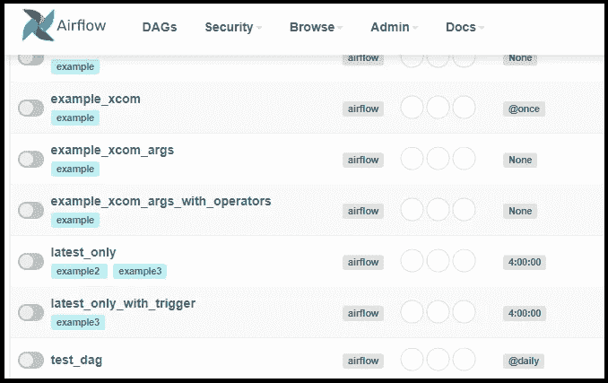

我们在狗狗列表中的新狗狗

打开新的 DAG。打开 DAG 名称左侧的开关。刷新页面。

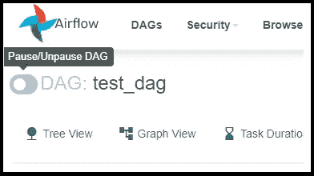

打开 DAG 的开关

转到图表视图。检查任务是否标记为绿色。

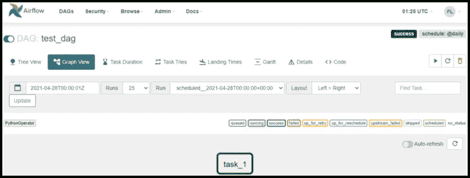

像往常一样，绿色是一个好信号

点击它并进入日志。用我们打印的文本检查这一行。“成功”。

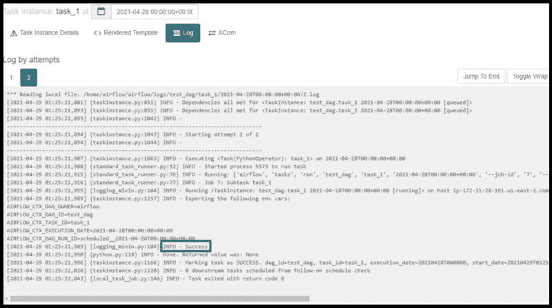

我们想要的信息

仅此而已。

在本文的下一部分中，我们将在这个实例上安装 DBT，进行一些设置以简化一些事情，在 AWS 上启动一些实验所需的其他资源，配置 DBT 并使用 Airflow 来调度 DBT。

# 阅读本文的所有部分:

第 1 部分:启动一个实例并安装气流
第 2 部分:[安装 DBT 和一些设置使工作更容易](/creating-an-environment-with-airflow-and-dbt-on-aws-part-2-a23617d56eeb)
第 3 部分:[使用 DBT 云并将气流与 DBT 集成](/creating-an-environment-with-airflow-and-dbt-on-aws-part-3-2789f35adb5d)

# 参考

[*https://docs.aws.amazon.com/*](https://docs.aws.amazon.com/) [*https://airflow.apache.org/*](https://airflow.apache.org/) [*https://air flow . Apache . org/docs/Apache-air flow/stable/installation . html*](https://airflow.apache.org/docs/apache-airflow/stable/installation.html)[*https://charlesleifer . com/blog/compilating-SQLite-for-use-with-python-applications/*](https://charlesleifer.com/blog/compiling-sqlite-for-use-with-python-applications/)

**对我在这里所做的大部分事情有帮助的来源:** [*https://www.datascienceacademy.com.br*](https://www.datascienceacademy.com.br)*【葡萄牙语】* [*https://academy.astronomer.io/*](https://academy.astronomer.io/)[*https://www . udemy . com/course/the-complete-hand-on-course-master-Apache-air*](https://www.udemy.com/course/the-complete-hands-on-course-to-master-apache-airflow)