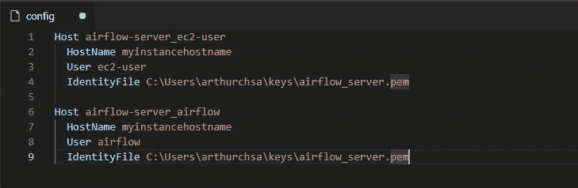
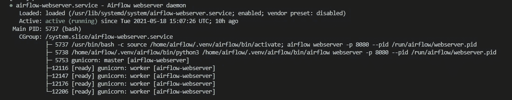
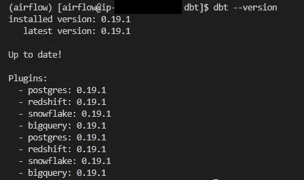
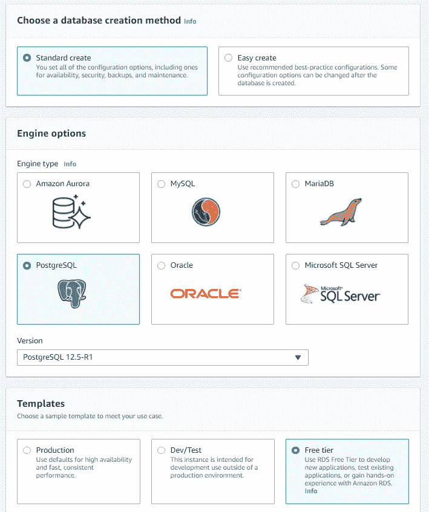
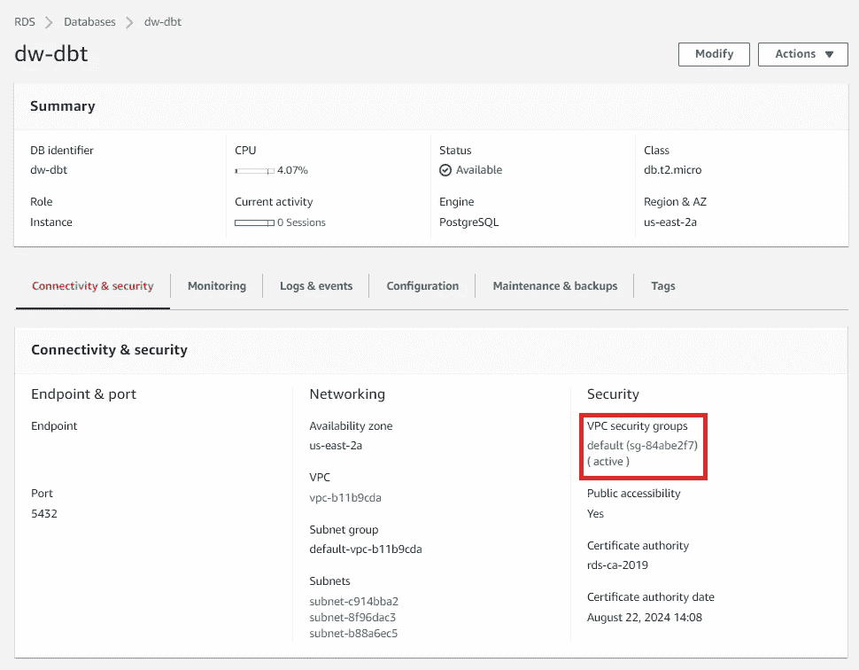
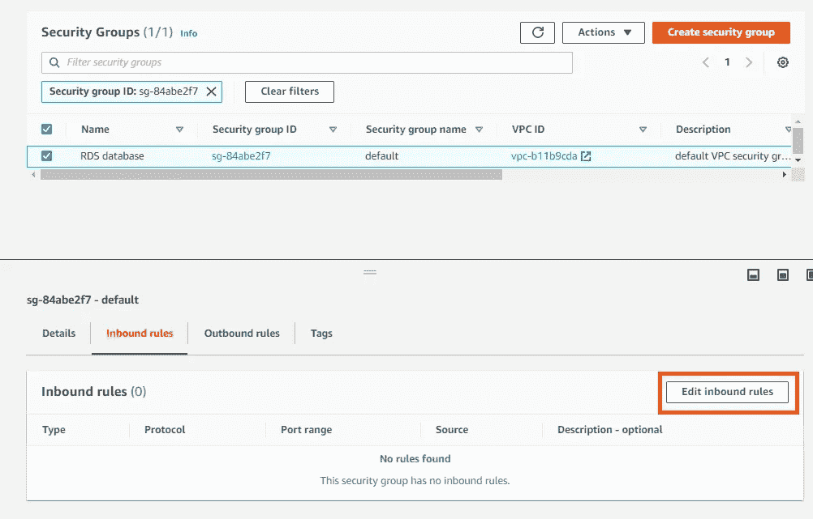
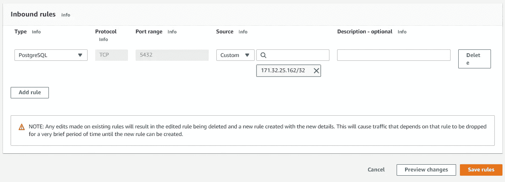
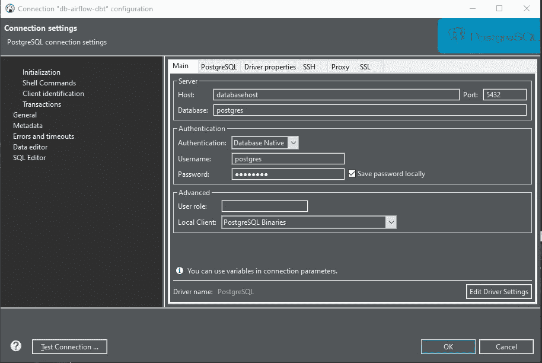
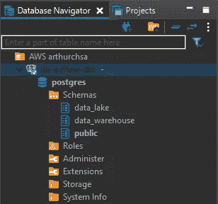
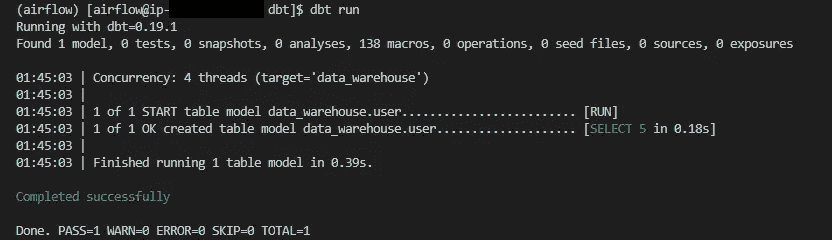

# 在自动气象站上创造一个有气流和 DBT 的环境(第二部分)

> 原文：<https://towardsdatascience.com/creating-an-environment-with-airflow-and-dbt-on-aws-part-2-a23617d56eeb?source=collection_archive---------11----------------------->

## 安装 DBT 和一些设置，使工作更容易


在 [Unsplash](https://unsplash.com?utm_source=medium&utm_medium=referral) 上由 [Boitumelo Phetla](https://unsplash.com/@writecodenow?utm_source=medium&utm_medium=referral) 拍摄的照片

在本文第 1 部分的[中，我们启动了一个 EC2 实例，安装了一些操作系统需求，然后是气流。现在，我们将安装 DBT。但是首先让我们做一些设置来简化一些事情。](/creating-an-environment-with-airflow-and-dbt-on-aws-part-1-ca13bc95f479)

# **1。使用 airflow 用户**连接到 ec2 实例

到目前为止，我们使用默认用户 ec2-user 连接到 EC2 实例。然后我们转向用户气流，我们装置的所有者。我们可以简化连接步骤，允许与气流用户直接连接。为此，首先转到 VSCode，连接到 EC2 实例并切换到 airflow 用户。现在，我们需要创建一个目录来存储 ssh 授权的密钥，复制包含它们的文件(该文件允许使用。pem 文件在我们启动实例时生成)并调整一些权限。以下是命令。

```
$ mkdir ~/.ssh
$ sudo cp /home/ec2-user/.ssh/authorized_keys ~/.ssh/authorized_keys
$ sudo chown airflow:airflow ~/.ssh/authorized_keys
$ sudo chmod 700 ~/.ssh
$ sudo chmod 600 ~/.ssh/authorized_keys
```

在 VSCode 中，按 F1，键入 SSH 并选择“添加新的 SSH 主机”。现在，使用我们在第 1 部分中使用的相同命令，但是改变用户。

```
ssh -i airflow_server.pem airflow@myinstancehost
```

按照第 1 部分的相同说明调整的路径。pem 文件在 SSH 配置文件中，为新连接选择一个名称，然后保存文件。



带有新连接的 SSH 配置文件

之后，再次按 F1，选择连接到主机，并选择新的连接。现在，您已连接到带有气流用户的实例。每当您需要停止实例并再次连接时，您可以考虑对这个用户使用这个连接。

# 2.自动启动气流服务

要像第 1 部分那样启动 airflow，我们只需运行 Airflow 命令(webserver 和 scheduler)。但是我们必须打开两个终端，并让它们在 VSCode 上打开。我们可以使用 *nohup* 从终端分离命令。更好的选择是将这些服务作为守护进程运行。这不仅可以更容易地启动/停止服务，还可以更容易地自动启动服务和实例。

为此，我们将使用 Airflow github 中的可用文件，并做一些调整。

首先，在/etc/sysconfig 中创建一个文件，名为 airflow:

```
$ sudo vi /etc/sysconfig/airflow
```

而内容:

```
AIRFLOW_CONFIG=/home/airflow/airflow/airflow.cfg
LD_LIBRARY_PATH=/usr/local/lib
```

这定义了运行 airflow 命令时将使用的两个环境变量，以及 Airflow 配置文件的路径和 sqlite 正确版本的目录。

现在，在/usr/lib/systemd/system 中创建一个名为 airflow-webserver.service 的文件:

```
$ sudo vi /usr/lib/systemd/system/airflow-webserver.service
```

内容如下。请注意，我正在传递端口，尽管我使用的是默认值 8080。如果您打算让其他应用程序使用 8080 端口在同一服务器上运行，您可以更改为使用另一个端口:

```
[Unit]
Description=Airflow webserver daemon
After=network.target postgresql.service mysql.service redis.service rabbitmq-server.service
Wants=postgresql.service mysql.service redis.service rabbitmq-server.service[Service]
PIDFile=/run/airflow/webserver.pid
EnvironmentFile=/etc/sysconfig/airflow
User=airflow
Group=airflow
Type=simple
ExecStart=/usr/bin/bash -c 'source /home/airflow/.venv/airflow/bin/activate; airflow webserver -p 8080 --pid /run/airflow/webserver.pid'
ExecReload=/bin/kill -s HUP $MAINPID
ExecStop=/bin/kill -s TERM $MAINPID
Restart=on-failure
RestartSec=5s
PrivateTmp=true[Install]
WantedBy=multi-user.target
```

在同一个目录中创建另一个文件，名为 airflow-scheduler.service:

```
$ sudo vi /usr/lib/systemd/system/airflow-scheduler.service
```

而内容:

```
[Unit]
Description=Airflow scheduler daemon
After=network.target postgresql.service mysql.service redis.service rabbitmq-server.service
Wants=postgresql.service mysql.service redis.service rabbitmq-server.service[Service]
PIDFile=/run/airflow/webserver.pid
EnvironmentFile=/etc/sysconfig/airflow
User=airflow
Group=airflow
Type=simple
ExecStart=/usr/bin/bash -c 'source /home/airflow/.venv/airflow/bin/activate; airflow scheduler --pid /run/airflow/webserver.pid'
KillMode=process
Restart=always
RestartSec=5s[Install]
WantedBy=multi-user.target
```

最后，创建一个文件/usr/lib/tmpfiles . d/air flow . conf，包含:

```
$ sudo vi /usr/lib/tmpfiles.d/airflow.conf
```

以及下面的内容:

```
D /run/airflow 0755 airflow airflow
```

现在创建一个目录，归 airflow 所有:

```
$ sudo mkdir /run/airflow
$ sudo chown -R airflow:airflow /run/airflow
```

好了，现在两个服务 Scheduler 和 Webserver 能够作为守护进程运行了。要让它们自动启动，只需运行以下命令:

```
$ sudo systemctl enable airflow-webserver.service
$ sudo systemctl enable airflow-scheduler.service
```

如果在启动实例后还没有启动 Airflow，现在只需运行:

```
$ sudo systemctl start airflow-webserver.service
$ sudo systemctl start airflow-scheduler.service
```

要检查服务的状态，可以运行以下命令

```
$ sudo systemctl status airflow-webserver.service
$ sudo systemctl status airflow-scheduler.service
```



绿色消息，显示服务正在运行

我们期望的结果是绿色的“活动(运行)”状态。如果您遇到不同的情况，显示服务没有运行，您可以使用命令检查服务的输出(100 是我想要显示的行数，您可以更改):

```
$ journalctl -u airflow-webserver -n 100
$ journalctl -u airflow-scheduler -n 100
```

# 3.安装 DBT

现在，是时候安装 DBT 了。由于我们将使用 Airflow 来编排 DBT 作业，并希望进行简单而廉价的配置，因此我们将把它安装在同一台服务器上。

如果您遵循了本文的第 1 部分，那么您已经安装了所有的操作系统需求。现在我们只需要安装 Python 包。首先，激活我们创建的 python 环境:

```
$ source ~/.venv/airflow/bin/activate
```

现在，安装安装 DBT 所需的这两个包

```
$ pip3 install pyicu-binary pyicu
```

最后，我们现在可以安装 dbt，命令如下:

```
$ pip3 install dbt
```

几秒钟后，您将看到成功的消息。如果在安装 dbt 的过程中，您收到一些失败的消息，告知您。h 文件没有找到，这可能是因为 gcc 包只寻找/usr/include 文件夹。如果发生这种情况，运行下面的命令来创建指向 gcc 试图找到的文件夹中的标题的符号链接:

```
$ sudo ln -sv /usr/include/python2.7/* /usr/include/
```

然后，您可以使用以下命令检查一切是否正常:

```
$ dbt --version
```

该命令将显示 dbt 及其插件的版本。



检查 dbt 版本时的输出

# 4.在 RDS 上启动数据库

DBT 是一个运行在数据仓库上的工具。虽然它与红移兼容，但也与 Postgres 兼容。为了避免一些意外的红移计费(由于空闲层周期过期或群集配置的资源/时间超过空闲层)，这可能非常昂贵，我们将在 RDS 上使用 Postgres。您可以选择使用红移，只需注意我们将要进行的配置，您可能会在需要时进行切换。还要记住使用端口 5439，而不是 5432。

首先，转到 AWS 管理控制台并访问 RDS 页面。选择创建数据库。在配置页面，选择'标准创建'，选择' PostgreSQL '，就可以保留 12.5-R1 版本。



创建数据库

选择自由层模板，以便更容易配置此数据库。为您的实例选择任意名称，主用户名和一些密码。

在“公共访问”选项中，您需要选择“是”，这样您就可以从您的网络进行连接。

您不需要更改此页面中的任何其他选项，只需单击“创建数据库”即可。

您将被重定向到数据库列表。选择您刚刚创建的那个。等待几分钟，直到您看到状态为“可用”。

点击数据库名称，进入配置页面。在“连接和安全”选项卡中，单击“VPC 安全组”中的链接。



打开安全组规则的链接

您将向数据库打开安全组规则。在页面的底部，有一些选项卡。选择入站规则，然后选择“编辑入站规则”。



向安全组添加新规则

单击“添加规则”。在类型中，选择“PostgreSQL”，在源中，使用 EC2 实例的私有 IP。然后，点击“保存规则”。如果您找不到这个 IP，您只需在一个新的选项卡上打开 EC2 页面，选择您的实例，并在“私有 IPv4 地址”中复制该 IP。



允许您的实例连接到数据库

现在，连接到您的新数据库(我建议使用 DBeaver，但是您可以自由选择您自己的工具)。



在 DBeaver 上创建连接非常简单

在默认数据库 postgres 中，创建两个模式，一个名为“data_warehouse ”,另一个名为“data_lake”。如果您愿意，也可以创建一个特定的数据库来完成这项工作，但是我将保持简单，使用 postgres 数据库。



Dbeaver 上的数据库连接，带有两个新模式

此外，在数据库上创建一个表并添加一些数据。只需在 DBeaver 上运行:

```
create table data_lake.user (name varchar(256), birth_date DATE, email varchar(256));insert into data_lake.user values
('Ted Mosby', '1978-07-04', 'ted.mosby@mosbiusdesign.com'),
('Robin Scherbatsky', '1980-12-04', 'bus.lady@world.com'),
('Barney Stinson', '1976-11-02', 'suitup@gnb.com'),
('Marshall Eriksen', '1978-03-16', 'fudge@supreme.com'),
('Lily Aldrin', '1979-09-22', 'comisisoner@slapbet.com');
```

# 5.配置 DBT

我们需要配置的第一件事是概要文件。在这个文件中，我们将信息连接到我们的数据仓库，所以当我们有不同的基础和模式时，这里是我们将要添加它们的地方。
存储该文件的默认路径是在一个名为. dbt 的隐藏文件夹中。您也可以更改权限以避免对该文件的未授权访问，因为现在，我们将把密码保存在该文件中。因此，要创建目录和文件:

```
$ mkdir ~/.dbt
$ vi ~/.dbt/profiles.yml
```

并添加信息以连接到您的数据库，在这种情况下切换到您自己的信息:

```
dw_dev:
  target: data_warehouse
  outputs:
    data_warehouse:
      type: postgres
      host: your-db-host
      user: postgres
      pass: postgres
      port: 5432
      dbname: postgres
      schema: data_warehouse
      threads: 4
      keepalives_idle: 0
```

现在，我们需要创建 dbt_project 文件。该文件包含有关项目的信息。让我们也创建一个文件夹来保存我们将与 DBT 一起使用的文件:

```
$ mkdir ~/dbt
$ cd ~/dbt
$ vi ~/dbt/dbt_project.yml
```

在 DBT 页面，你可以找到这个文件的例子。现在，我们将只添加一些属性。在提高 DBT 的使用后，您可以添加其他属性。因此，将以下内容添加到该文件中:

```
name: 'project_dbt_airflow'
config-version: 2
version: 1.0profile: dw_devsource-paths: ['source']
data-paths: ['data']
test-paths: ['test']
analysis-paths: ['analysis']
macro-paths: ['macro']
snapshot-paths: ['snapshots']models: +materialized: table
    +enabled: true
```

现在，创建文件夹来存储模型。sql 文件)。正如你在前面文件的内容中看到的，我们还可以有其他目录(用于测试、宏等。)，但是我们现在不打算使用它们。此外，创建一个文件来运行我们在 DBT 的第一个模型:

```
$ mkdir ~/dbt/source
$ vi ~/dbt/source/user.sql
```

加上这一行:

```
select * from data_lake.user
```

现在，我们准备第一次运行 dbt。转到 dbt 项目文件夹并运行 dbt 命令:

```
$ cd ~/dbt
$ dbt run
```



运行 dbt run 命令后的输出

DBT 现在所做的是运行查询，然后用查询的结果创建一个模型(在本例中是一个表)。如果您有一个可以从数据仓库连接访问源数据的架构(就像 s3 上的数据湖，由带有 Spectrum 的 Redshift 上的数据仓库访问)，您可以像这样运行模型查询您的源数据。如果不是这样，您首先必须将数据从您的源移动到您的数据仓库(正如 DBT 文档中所指定的，它只适用于 ETL 的 T)。但是你总是可以在气流上增加一些步骤来做这件事，作为你管道的一部分。

无论如何，您可以在 DBeaver 上检查数据仓库中的数据，使用:

```
select * from data_warehouse.user;
```

现在，我们已经在实例上安装了 DBT 和气流。在接下来的部分中，我们将集成它们，使用 Airflow 来编排 DBT 的作业，还将使用 DBT 云来检查其他集成选项。

# 阅读本文的所有部分:

第 1 部分:[启动一个实例并安装气流](/creating-an-environment-with-airflow-and-dbt-on-aws-part-1-ca13bc95f479)
第 2 部分:安装 DBT 和一些设置使工作更容易
第 3 部分:[使用 DBT 云并将气流与 DBT 集成](/creating-an-environment-with-airflow-and-dbt-on-aws-part-3-2789f35adb5d)

# 参考资料:

[https://www.getdbt.com/](https://www.getdbt.com/)
[https://airflow.apache.org/](https://airflow.apache.org/)
[https://github . com/Apache/air flow/tree/master/scripts/systemd](https://github.com/apache/airflow/tree/master/scripts/systemd)
[https://docs.getdbt.com/reference/dbt_project.yml](https://docs.getdbt.com/reference/dbt_project.yml)

**对我在这里所做的大部分事情有帮助的来源:** [https://www.datascienceacademy.com.br](https://www.datascienceacademy.com.br)
[https://docs.getdbt.com/docs/introduction](https://docs.getdbt.com/docs/introduction)