# 在自动气象站上创造一个有气流和 DBT 的环境(第三部分)

> 原文：<https://towardsdatascience.com/creating-an-environment-with-airflow-and-dbt-on-aws-part-3-2789f35adb5d?source=collection_archive---------11----------------------->

## 使用 DBT 云和 DBT 整合气流


[田宽](https://unsplash.com/@realaxer?utm_source=medium&utm_medium=referral)在 [Unsplash](https://unsplash.com?utm_source=medium&utm_medium=referral) 上拍照

在 [part1](/creating-an-environment-with-airflow-and-dbt-on-aws-part-1-ca13bc95f479) 和 [part2](/creating-an-environment-with-airflow-and-dbt-on-aws-part-2-a23617d56eeb) 中，我们创建并配置了我们的 EC2 实例，使用 DBT 和气流，并为两者创建了一个初始项目来测试它们。现在，我们将最终一起使用气流和 DBT，首先在我们的实例上，然后将 DBT 切换到云版本，也在那里创建一个项目。

# **1。使用气流运行 dbt 命令**

正如我们已经看到的，基本上，气流调度和编排我们可以用 Python 运行的任何类型的任务。我们还看到了如何用命令 *dbt run* 运行 DBT。因此，我们可以集成它们的一种方法就是简单地创建一个 DAG，在我们的操作系统上运行这个命令。

假设您连接到 EC2 实例并使用 airflow 用户，创建一个 DAG 文件:

```
$ vi ~/airflow/dags/load_users.py
```

现在，添加以下代码:

```
from airflow import DAG
from airflow.operators.bash import BashOperatorimport datetimedefault_args = {
    'start_date': datetime.datetime(2021,1,1)
}def run_dbt(task_id, command):
    return BashOperator(
        task_id=task_id,
        bash_command='cd /home/airflow/dbt; ' + command,
        do_xcom_push=False
    )with DAG('load_user',
    schedule_interval="@daily",
    default_args=default_args, catchup=False) as dag: load_user = run_dbt('load_user', 'dbt run')
```

DAG 内的任务运行 bash 命令 *dbt 运行*，使用 Airflow 的 BashOperator。就像我们在终端上执行了命令一样。这里，我们必须从 DBT 文件夹(包含 dbt_project.yml 和其他目录的文件夹)运行这个命令，因此我们创建一个函数(run_dbt)来返回一个操作符，该操作符添加了移动到目录(' cd /home/airflow/dbt ')所需的命令。我们可以在运行 dbt run 时使用'- project-dir '来指定正确的路径，但我认为如果您有其他 dbt 命令来运行您的任务，这种方式会更简单。

保存文件后，您所要做的就是等待，直到新的 DAG 加载到 web 服务器中(在您的 web 浏览器中运行的气流)。当它是，打开开关和 DAG 将被执行。

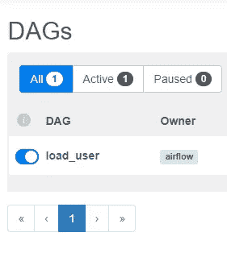

我们的 DAG 运行 DBT(只有一个 DAG，因为我按名称过滤，好吗？)

单击 DAG 名称并转到图表视图。您的任务可能正在执行中(标有浅绿色)。几秒钟后，该任务将被标记为深绿色，表示成功。

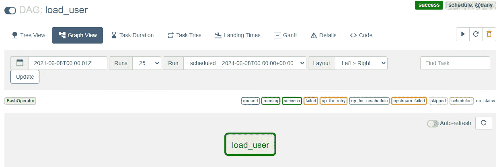

我们的 dbt 任务由气流执行

如果您单击该任务并打开日志，您将看到与从终端运行 DBT 相同的输出:

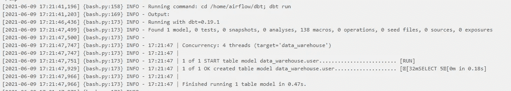

输出显示了我们拥有的每个模型的执行情况(由 DBT 创建的每个表/视图)

由于 DBT 安装在 Airflow 的同一台机器上，我们可以只运行 dbt 命令来调用这个实例中的操作系统。如果您在另一台计算机上安装了 DBT，您还可以使用不同的方法来远程运行该命令，例如，使用 Airflow SSH Operator。

# 2.在 DBT 云上创建项目

现在，我们还可以选择不安装 DBT。使用 DBT 云，我们可以在那里创建我们的项目，并使用他们的基础设施运行我们的工作。为此，你必须在 DBT 页面([https://cloud.getdbt.com/login](https://cloud.getdbt.com/login/))上创建一个账户。

在登录之前，我们需要做两件事。

首先，转到 RDS 数据库使用的安全组的规则。编辑入站规则并添加另外三个规则，所有规则的类型都是 PostgreSQL，使用 IP 52.45.144.63、54.81.134.249 和 52.22.161.231。这些 IP 是 DBT 云使用的 IP，需要允许 DBT 连接到我们的数据库:

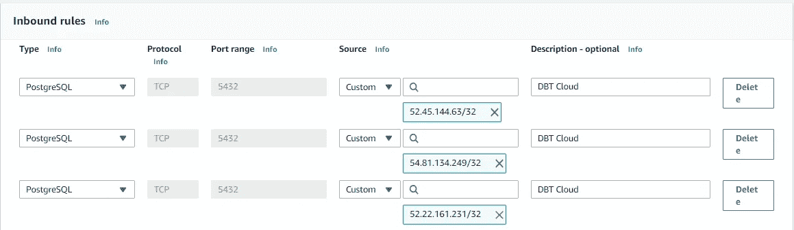

添加规则，以便 DBT 可以在我们的数据库中运行作业

我们必须做的另一件事是创建一个模式和一个用户来开发我们的 DBT 云项目。该用户将仅用于开发。它必须能够访问模式 data_lake 中的源表。此外，它将在新模式上创建表和视图(这个模式是专门为这个用户创建的)，所以它也需要拥有这个权限。因此，使用 admin 用户运行下面的 SQL 代码:

```
create user dev_user with password '1234';
create schema dbt_dev;
grant all privileges on schema dbt_dev to dev_user;
grant usage on schema data_lake to dev_user;
grant select on all tables in schema data_lake to dev_user;
```

好，现在回到 DBT·佩奇。创建帐户后，当您第一次登录时，您会看到如下内容:

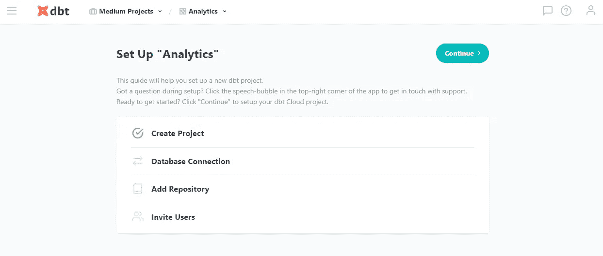

让我们用它来配置我们的项目。单击继续。在下一页中，您将选择数据库类型。在我们的例子中，PostgreSQL，所以选择它。在下一页中，您必须建立与我们数据库的连接。选择任何你想要的名字。在 PostgreSQL 设置中，您将使用该信息连接到 RDS 数据库(与您用于连接 DBeaver 或 SQL 工具的值相同)。在开发证书中，使用我们的新用户和模式。

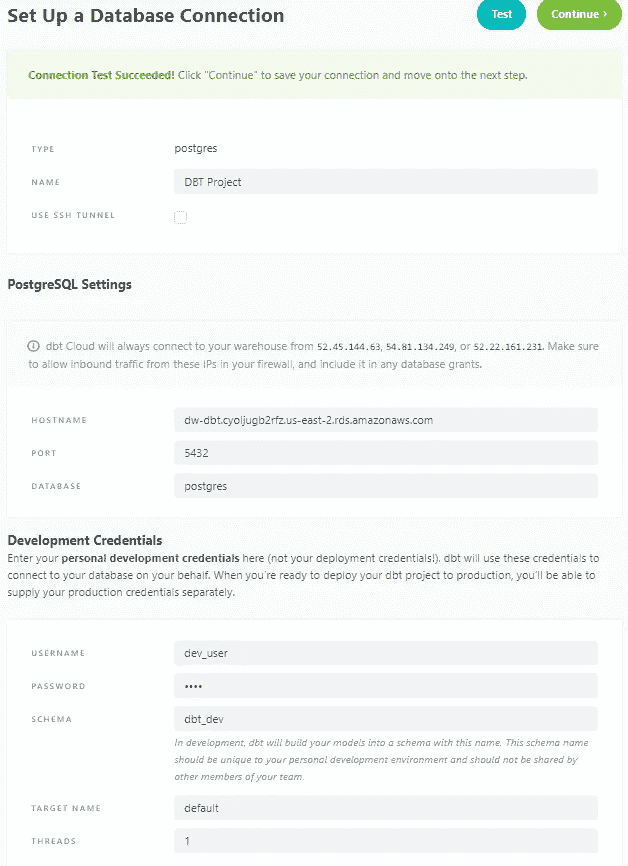

建立连接，在 DBT 云上开发我们的 DBT 项目

点击继续。在下一页中，您可以选择使用 Github/Bitbucket/Gitlab 上的存储库。或者你可以使用由 DBT 管理的存储库。我们将使用后一种选择。因此，选择一个名称，单击创建，然后继续:

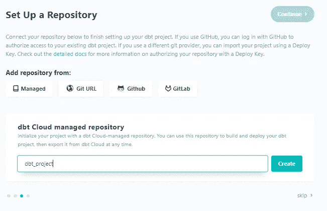

下一页允许您邀请人们在项目中与您一起工作。现在，你可以点击跳过并完成。

我们已经创建了我们的项目，DBT 将显示此页面:

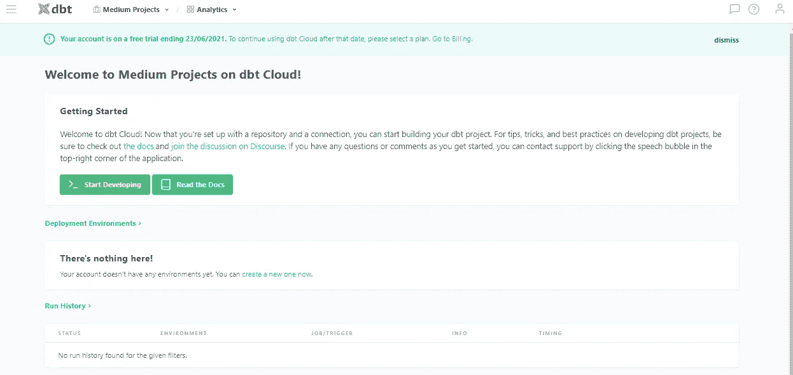

点击开始开发，一个类似于 IDE 的页面就会打开。你需要做的第一件事是点击“初始化你的项目”。这将创建我们在 DBT 上运行作业所需的文件夹和文件。

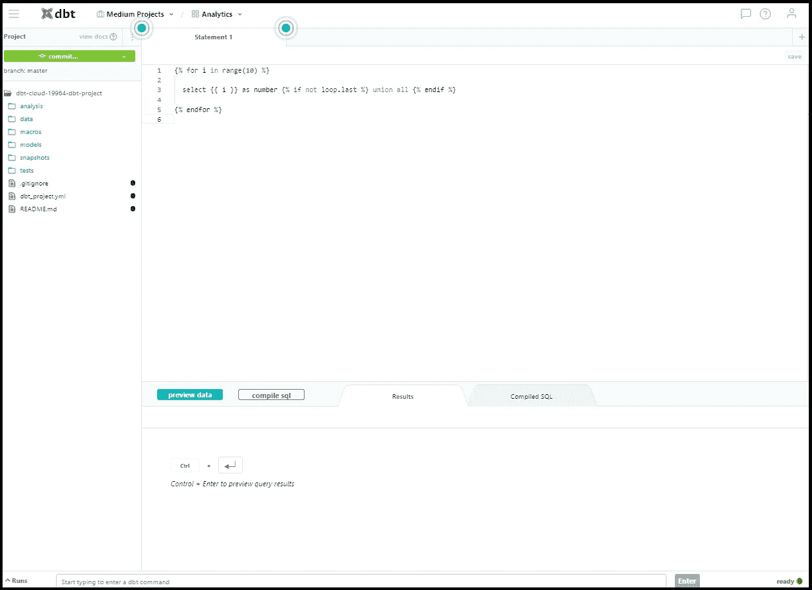

开发页面，初始化项目后

现在，删除 models 中的 example 文件夹。在 models 中添加一个名为 user.sql 的新文件。

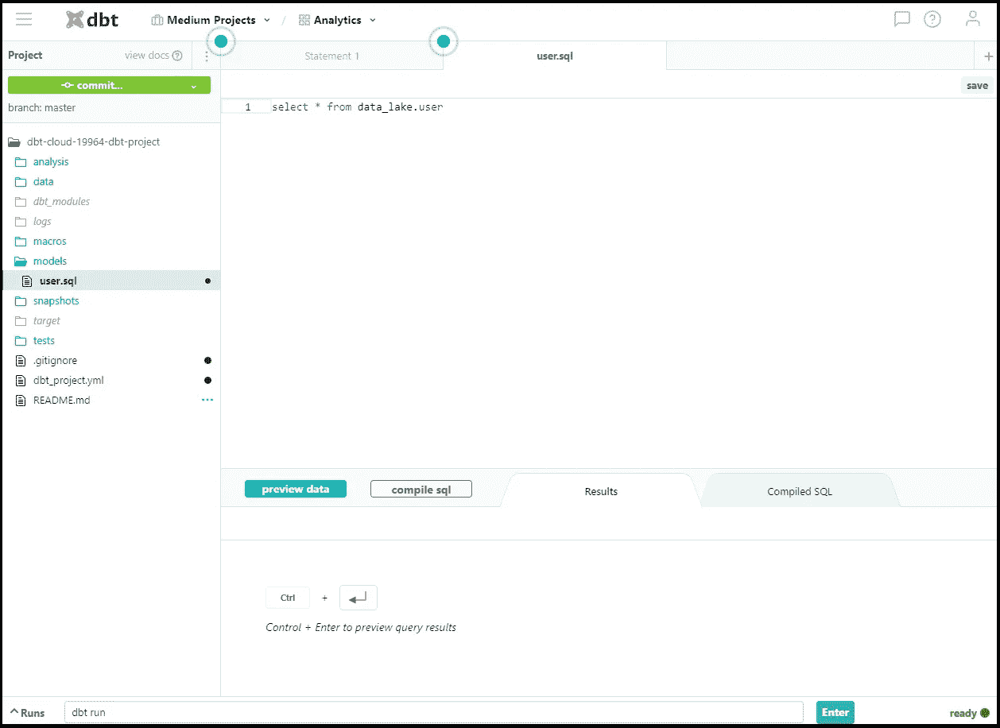

我们在 EC2 实例上创建的相同模型，现在在 DBT 云上

```
select * from data_lake.user
```

保存文件。在页面底部有一个运行命令的字段。键入“dbt run”并单击 Enter(您可以在上图底部看到该字段)，您将得到以下输出:

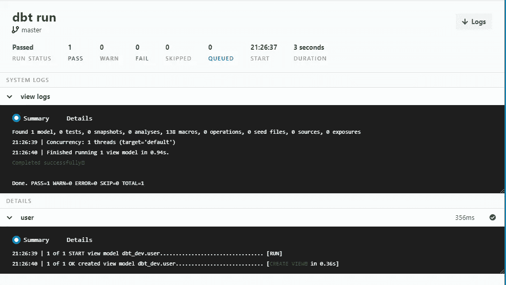

在 DBT 云 IDE 上运行作业

这就是我们如何通过 DBT 开发我们的数据转换。现在，假设我们想在生产环境中使用这段代码。仍然在开发页面中，单击提交并添加一些消息。现在，我们的代码在主分支中(请记住，您可以使用 Github/Bitbucket/Gitlab 并以更好的方式管理存储库和分支)。

我们可以一直使用我们的数据库主用户，但是为了更真实，在上一部分中，我们使用了一个用户，该用户只具有从我们的源模式(data_lake)读取数据的权限，并且对它自己的模式 dbt_dev 具有所有特权。

现在，为了在“生产”环境中运行我们的作业，让我们创建另一个具有必要权限的用户。我们需要从模式 data_lake 中读取数据的权限，就像前面的用户一样。我们还需要在模式 data_warehouse 中创建对象的权限(我们的模型将在那里创建)。最后，由于在第 2 部分中我们已经创建了 data_warehose.user 表，现在我们将删除它，这样 DBT 重新创建它不会有任何问题。因此，使用 admin 用户运行以下 SQL 代码:

```
create user prd_user with password '1234qwer';
grant all privileges on schema data_warehouse to prd_user;
grant usage on schema data_lake to prd_user;
grant select on all tables in schema data_lake to prd_user;
drop table data_warehouse.user;
```

接下来，单击左上角的菜单，选择“环境”,然后单击“新建环境”。为环境选择一个名称，并使用我们的新用户、密码和模式 data_warehouse 配置连接(记住，在这个模式中，我们将使用查询结果创建对象)。不要更改其他选项。但是请注意，这里 DBT 云派上了用场，因为您可以选择一个自定义分支，并在将代码推送到主服务器之前运行作业。

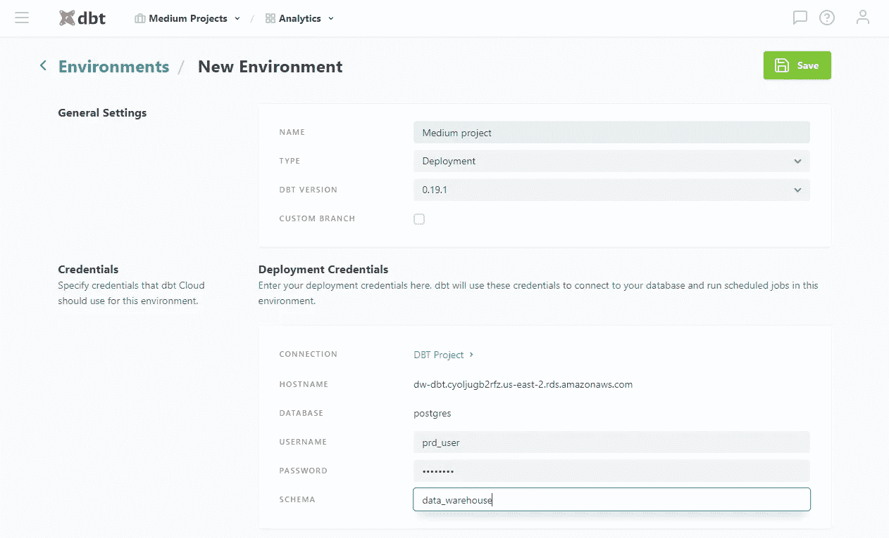

DBT 云使创建新环境、与分支机构合作变得更加容易

创建环境后，您将看到 environment 页面，其中还没有作业。点击新工作。

为作业选择一个名称。在环境选项中，选择您将拥有的唯一选项。在线程中，我使用的是 10，但是现在这并没有什么区别。不要更改其他选项。

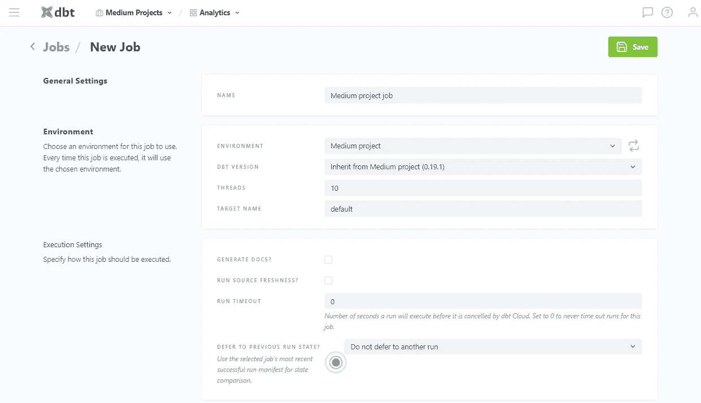

创造我们的工作

向下滚动，我们看到了将要运行的命令。由于我们的项目只有一个模型，当我们运行 DBT 时，这是唯一要处理的文件。但是如果您有一个更大的项目，并且只想运行您的模型的一部分，您可以过滤路径、标签和其他选项。请查阅 DBT 文档来探索这一点。

该页面中还有一个选项是调度作业。我们将使用气流来完成这项工作，因此您可以取消选中“按计划运行？”。

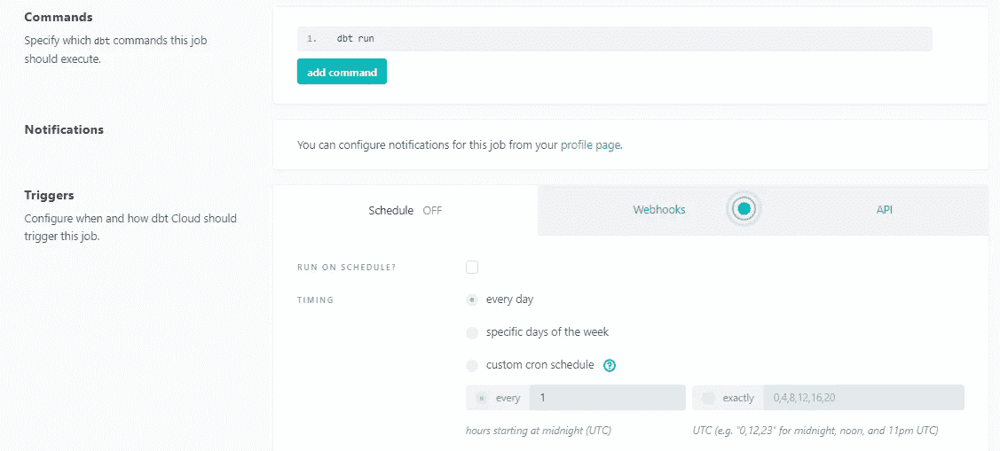

您可以通过 DBT 云直接安排工作，但只能安排您管道中的 DBT 部分

之后，点击页面顶部的保存。在下一页中，单击立即运行。您可能需要等待一段时间才能让您的工作正常运行。DBT 将在 10 秒内从 10 重新加载页面。过一会儿，您的作业将运行并显示以下结果:

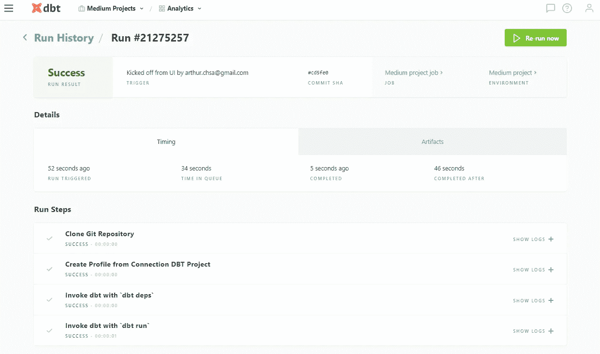

作业在 DBT 云上运行(在 dbt 运行之前有几个步骤)

这些步骤的最后一步是 dbt run 命令。单击它，您将看到我们已经知道的输出:

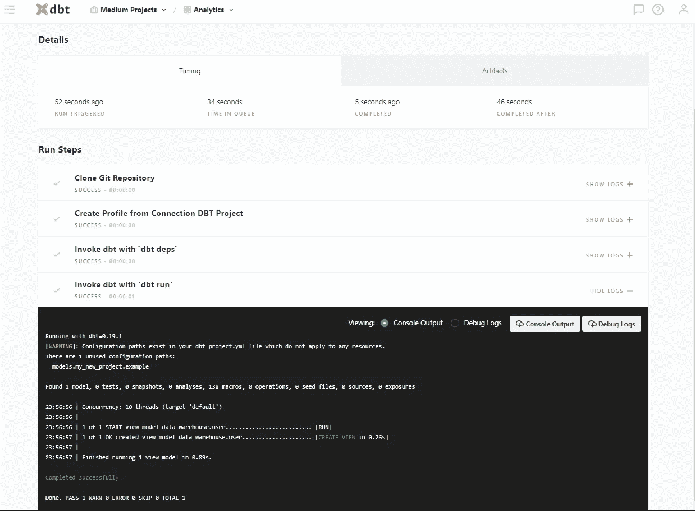

dbt 运行命令的相同输出

我们已经看到了如何在我们的实例上运行 DBT，如何使用气流来调度它，以及如何在 DBT 云上运行 DBT。唯一缺少的部分是如何使用气流来运行 DBT 云作业。

# 3.使用气流在 DBT 云上运行作业

为了用气流运行我们的工作，我们将使用 DBT 云 API。因此，我们需要做的就是将适当的代码放在我们的 DAG 上，并像以前一样执行相同的调度。

首先，让我们得到一些我们需要的数据。在我们使用的最后一个页面中，通过我们的作业，单击作业名称。

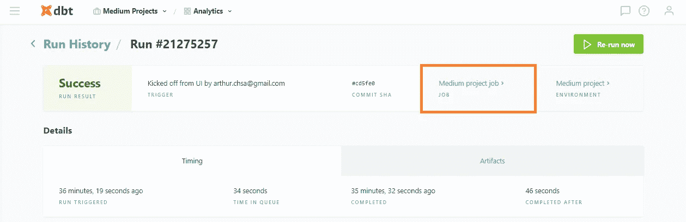

工作页面的链接，在这里我们可以找到工作 id

现在，通过浏览器上的 URL，检查您的帐户和该作业的 id。例如，在我的例子中，URL 是[https://cloud . get dbt . com/#/accounts/19964/projects/32821/jobs/25507/](https://cloud.getdbt.com/#/accounts/19964/projects/32821/jobs/25507/)。意思是我的账号 id 是 19964，工作 id 是 25507。

现在，转到右上角的菜单，单击个人资料。然后选择 API 访问。然后点击显示。这是您的 API 密钥，将用于向 DBT API 发出请求。

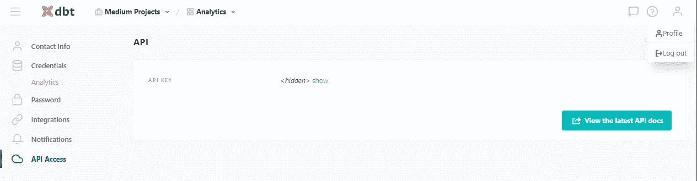

这是您找到 API 密钥的地方

接下来，使用 VSCode 通过 airflow 用户连接到您的 EC2 实例。转到文件>打开文件夹。选择气流，你会有路径'/home/airflow/airflow '。按回车键。

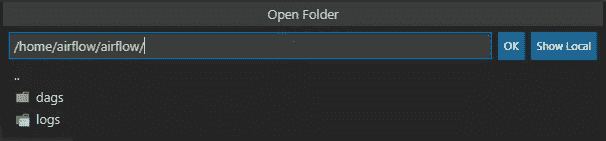

右键单击 dags 文件夹，创建一个名为 load_users_cloud.py 的新文件:

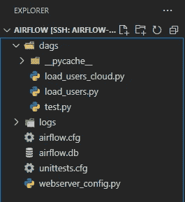

您可以使用 VSCode 的接口而不是终端来创建项目文件

现在，复制下面的代码，需要时使用自己的 API 键(而不是*****)、帐户 id 和作业 id。

```
from airflow import DAG
from airflow.providers.http.operators.http import SimpleHttpOperatorimport datetime, jsondefault_args = {
  'start_date': datetime.datetime(2021,1,1)
}
dbt_header = {
  'Content-Type': 'application/json',
  'Authorization': 'Token *****'
}def getDbtMessage(message):
  return {'cause': message}def getDbtApiLink(jobId, accountId):
  return 'accounts/{0}/jobs/{1}/run/'.format(accountId, jobId)def getDbtApiOperator(task_id, jobId, message='Triggered by Airflow', accountId=19964):
  return SimpleHttpOperator(
    task_id=task_id,
    method='POST',
    data=json.dumps(getDbtMessage(message)),
    http_conn_id='dbt_api',
    endpoint=getDbtApiLink(jobId, accountId),
    headers=dbt_header
  )with DAG('Our_medium_project',
  schedule_interval="@daily",
  default_args=default_args,
  catchup=False) as dag: load_user_cloud = getDbtApiOperator('load_users', 25507)
```

这里，我们使用 SimpleHttpOperator 向 API 发出 POST 请求。getDbtApiOperator 函数简化了我们创建操作符的方式。我们只需要为任务和作业 id 定义一个名称。如果我们在单个 DAG 中使用多个 DBT 云帐户，我们还可以定义一条在 DBT 上显示的作业执行消息，不过我使用的是默认值和 accountID。

保存文件并在浏览器上打开 Airflow。转到管理>连接。单击+添加新连接。

在 Conn Id 中，使用 dbt_api(如果使用不同的名称，还必须在上面的代码中切换名称)。在连接类型中，选择 HTTP。在主机中，使用“【https://cloud.getdbt.com/api/v2/】T2”(不带引号)。保存连接。

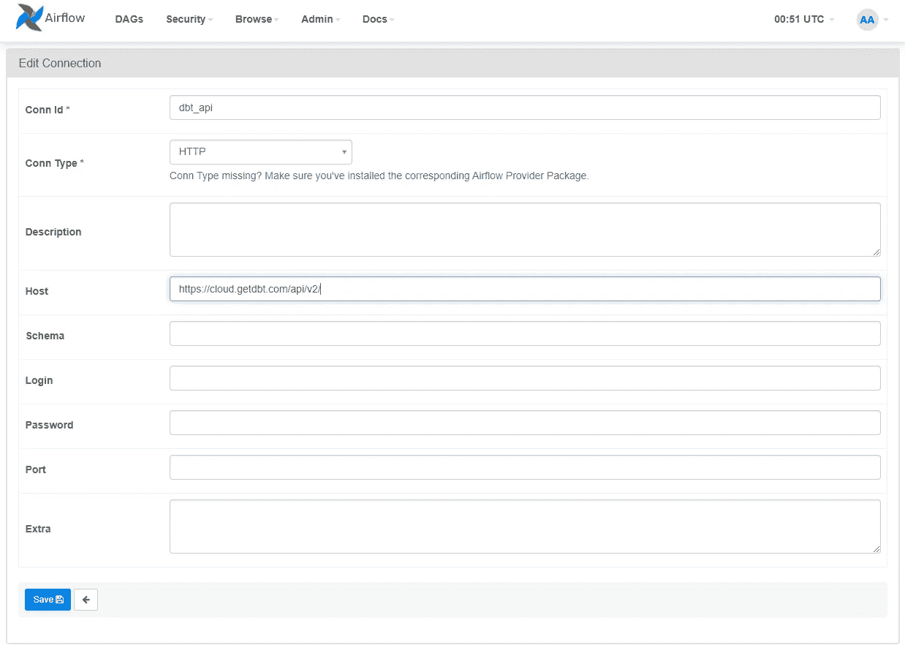

设置与 DBT API 的连接

现在，转到 DAGs 页面。为我们的新 DAG 打开开关。几秒钟后，你会看到深绿色的指示器，显示我们的任务被执行了。

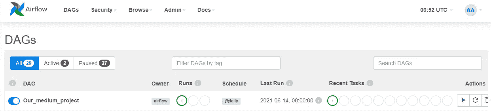

我们负责 DBT 任务的狗

回到 DBT 云页面，到求职页面。您将在作业历史记录中看到一条新记录，其中包含我们在 DAG 中定义的消息。

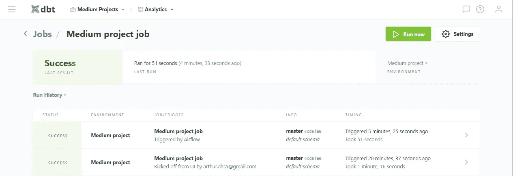

作业历史，手动执行和从气流

好了，现在我们可以使用气流来运行我们的 DBT 作业，无论是在服务器上使用 DBT 云还是 DBT。尽管我使用的例子非常简单，但这里的重点是两种工具之间的集成。

如果您已经使用了 DBT，那么您应该知道如何处理您的作业，因此您可以简单地包含 Airflow 来调度作业，并集成与 DBT 无关的其他步骤，比如将数据移动到数据仓库。
如果您已经使用了 Airflow，并且需要在您的数据仓库中转换数据，您可以使用 DBT 来利用它在模型之间创建的引用来完成这项工作，而不是使用 Airflow 运行所有的 SQL 命令，创建临时表并使用它们。
不管怎样，我希望这能有点用。

# 阅读本文的所有部分:

第 1 部分:[启动一个实例并安装气流](/creating-an-environment-with-airflow-and-dbt-on-aws-part-1-ca13bc95f479)
第 2 部分:[安装 DBT 和一些设置以简化工作](/creating-an-environment-with-airflow-and-dbt-on-aws-part-2-a23617d56eeb) 第 3 部分:使用 DBT 云和将气流与 DBT 集成

# 参考资料:

[*https://www.getdbt.com/*](https://www.getdbt.com/) [*https://airflow.apache.org/*](https://airflow.apache.org/) [*https://docs.getdbt.com/dbt-cloud/api*](https://docs.getdbt.com/dbt-cloud/api) [*https://docs.getdbt.com/reference/node-selection/syntax*](https://docs.getdbt.com/reference/node-selection/syntax)[*https://air flow . Apache . org/docs/Apache-air flow-providers-http/stable/operators . html*](https://airflow.apache.org/docs/apache-airflow-providers-http/stable/operators.html)

**对我在这里所做的事情最有帮助的来源:** [*https://www.datascienceacademy.com.br*](https://www.datascienceacademy.com.br/)(葡萄牙语)
[*https://docs.getdbt.com/docs/introduction*](https://docs.getdbt.com/docs/introduction)