# 创建以太坊令牌以支持分散的“租赁-拥有”网络

> 原文：<https://towardsdatascience.com/creating-an-ethereum-token-to-enable-a-decentralized-rent-to-own-network-cc3786cf1142?source=collection_archive---------14----------------------->

## 加密货币最可持续的应用包括重新思考我们如何在日常关系中建立信任。

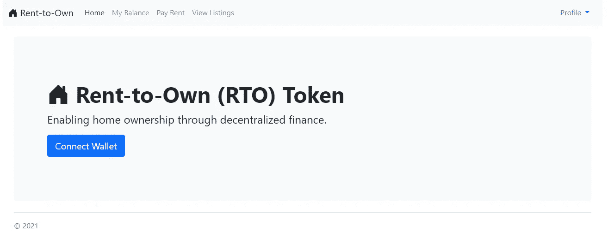

图片作者。

***注来自《走向数据科学》的编辑:*** *虽然我们允许独立作者根据我们的* [*规则和指导方针*](/questions-96667b06af5) *发表文章，但我们不认可每个作者的贡献。你不应该在没有寻求专业建议的情况下依赖一个作者的作品。详见我们的* [*读者术语*](/readers-terms-b5d780a700a4) *。*

# 介绍

随着房地产价格飙升至创纪录的高度，获得抵押贷款资格从未如此困难。即使那些有稳定、高薪工作的人也很难证明自己的信誉，也很难攒够钱开始购买房产。顾名思义,[先租后拥有(Rent-to-Own)](https://www.investopedia.com/updates/rent-to-own-homes/)是获得房屋所有权的另一种途径，租房者可以选择在租约到期时购买房屋。虽然协议的条款可能会有所不同，但这基本上意味着每份租金支票的某一部分将用于最终的首付款。理想情况下，这种安排是双赢的:房东受益于动力十足的租户，可靠的租户因其财务责任而获得回报。然而，在实践中，先租后拥有远非完美。决定搬家的租房者不得不放弃他们应得的付款，重新开始。掠夺性房东在最后一刻改变条款，双方必须相互依赖，保持诚实准确的记录。

幸运的是，分散金融创新为这些问题提供了一个潜在的解决方案。使用智能合同，我们可以将租赁到拥有协议的业务逻辑编程为不可变分类帐中可独立验证的交易。我们甚至可以创建一个基于加密货币的激励系统，奖励租房者和房东。这些是 RTO T21 令牌背后的原则，这是一种不可转让的资产类别，它驱动着“先租后拥有”参与者的潜在网络。在深入技术细节之前，让我们先从(初步)经济学的概念概述开始。

## 动机

RTO 系统要发挥作用，必须让所有利益相关方受益。首先，通过任何“先租后拥有”计划挂牌出售房屋的房东，都希望在出售前的租赁期内赚取一定的现金。通常，这代表了财产评估价值的一部分。一旦达到这个门槛，他们就想卖给一个有动力、有信誉的买家。但是你如何找到这样的买家呢？信用评分并不能说明全部情况，推荐信也很容易伪造。由于难以通过这些不完善的指标建立信任，房东通常别无选择，只能允许每个租户通过第一手经验(即多年的按时付款)来证明自己。出于这个原因，大多数从租到拥有的协议是不可转让的，这意味着如果租户决定搬家，他们必须回到原点。

因此，一个无处不在的出租房屋和参与者的网络将是有利的。物业管理公司是实现这一目标的一种方式，但这种集中化的选择剥夺了个人的自主权，以换取标准化和共享基础设施，如安全支付平台和数据库。RTO 提供了一个分散的选择。我们首先利用已经融入以太坊生态系统的安全、稳定和不可变的金融交易，将我们的业务逻辑包装在智能合约中，以在分布式网络参与者之间建立信任。

## RTO 智能合同

我们的智能合同简单，但功能强大。要在 RTO 网络上列出出租房屋，房东必须首先通过合同管理员的验证。一旦获得批准，他们可以添加他们的租赁财产，这是由租赁者的 ETH 地址、收入阈值(代表他们在出售房屋之前希望收回的美元金额)和收入百分比(每笔租金付款中对收入阈值有贡献的部分)定义的。新房和租房者被初始化为一个空的 RTO 余额，**的房屋将不会被出售，直到买方*和*卖方的 RTO 余额都超过收入阈值**。这一条件确保了房东有一定的利润保证，而租房者证明了自己的信誉。

每次通过这种智能合同支付租金时，租户*和*家庭都会获得不可转让的、美元标准化的 RTO。获得的 RTO 的确切数量由以下公式确定:

```
amountToMint = rentAmountEth * earningsPercent * usdPriceEth
```

因此，假设一个家庭的月租金为 2000 美元(撰写本文时的市值约为 1 ETH)，收益百分比为 20%，收益阈值为 20，000 美元。每次付款时，1 ETH * 20% *(2000 美元/ETH) = 400 RTO 会添加到租房者和住房的余额中。按照这种利率，租房者将有机会在大约 4 年的稳定付款后购买房子。如果他们决定搬家，租户和家庭都会保留他们的 RTO 余额。需要注意的是，**有效的租金支付是获得 RTO 的唯一途径—** 代币不可转让、不可燃烧，并且不能在二级市场上交换，这与标准的 ERC20 硬币不同。像信用评分一样，建立良好的财务状况没有捷径可走。

通过公开关键信息，RTO 网络创建了一个竞争性市场，除了便利设施和面积，参与者还可以比较和协商收入协议的条款。即使在契约的相对简单的界限内，也可以自然地出现许多独特的、互利的场景，例如:

*   *租户和住宅均以 0 RTO 开始，租户不移动*:这代表传统的“从租到拥有”结构。两个实体同时达到收入门槛，在这一点上，租房者可以购买房屋。
*   *租房者 RTO >收益阈值&住宅 RTO <收益阈值*:租房者准备好了，但房东还没准备好。当这两个条件都满足时，租房者可能有足够的筹码来争取更有利的抵押贷款(例如 20 年而不是 30 年)。
*   *家庭 RTO >收益&租户 RTO <收益阈值*:与上一种情况相反。在这里，租房者仍然需要证明自己，但他们可能希望通过谈判获得更高的收入百分比来加速他们的收入。

# 代码和教程

[如果您想直接观看分散式应用的演示，请跳过本节](#aaca)。

## 部署智能合同

上面讨论的业务逻辑在下面用 Solidity 编写的 smart contract 中进行了编码。

如果你熟悉面向对象编程语言，大部分代码应该非常简单。我想强调几个关键功能:

*   **getThePrice()** : RTO 应该与美元挂钩，以考虑到 ETH 价格的波动性。为了使 ETH 支付正常化，我们需要一种访问当前美元/ETH 市场价格的方法。不幸的是，我们不能在 Solidity 中调用 CoinGecko API，但是我们可以访问一个“价格 Feed ”,它通过一个 Chainlink 聚合器接口巧妙地将价格存储在链上。点击此处了解更多信息。
*   **payRent(address _to)** :这是智能合约的核心，所以值得特别考虑。首先，我们确保付款是由房屋的承租人支付给经过核实的房东。接下来，作为一个可支付的功能，我们还促进了 ETH (L119)的转移，其金额存储在交易数据中。最后，我们计算 amountToMint(见上面的等式),并相应地更新 home 和 renter 的余额。

我使用 Remix IDE 和我的 Metamask wallet 将智能合约部署到 Ropsten Testnet。[这里](https://remix-ide.readthedocs.io/en/latest/run.html#run-setup)有更详细的说明，如果你感兴趣的话。在我们进入应用程序之前，我们(作为合同部署者)需要添加一个经过验证的房东，并使用部署合同的同一个帐户(代表一个受信任的管理员)签署交易。我们可以在混音中做到。

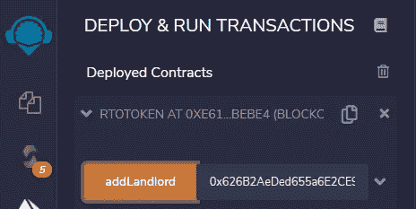

图片作者。

我们还可以在 Etherscan 上查看我们的合同和所有相关交易[。](https://ropsten.etherscan.io/address/0xf2433ed43d36b5b8f54db39ab2aafc397f13c695)

## 应用基础设施和元掩码集成

该应用程序为我们提供了通过支付门户式界面使用智能合同功能的方法。我使用 Python 的 FastAPI 来创建 API 端点，使用 Web3.py 库来准备以太坊事务(但不是 sign，稍后会详细介绍)，并使用一个基本的 PostgreSQL 数据库来存储一些链外数据，比如房屋图像的 URL。我们使用流行的 [Metamask](https://metamask.io) 浏览器扩展来签署交易，而不是要求用户将他们的私钥硬编码到应用程序本身中(这是一个严重的安全风险)。例如，我们为 payRent 函数生成如下事务数据:

```
# from transactions.pydef payRent(landlord, amount_eth):
    txn_dict = to_contract.functions.payRent(w3.toChecksumAddress(landlord)).buildTransaction({
                'chainId': 3,
                'value': w3.toWei(float(amount_eth), 'ether'),
                'gas': 2000000,
                'gasPrice': w3.toWei('2', 'gwei')
    })
    return txn_dict
```

然后，我们可以用几行 JavaScript 将这些数据发送给 Metamask:

```
# from confirm_transaction.html***sendTxnButton***.addEventListener('click', () => {
  ***sendTxnButton***.disabled = true;
  ***sendTxnButton***.innerHTML = "Connecting to Metamask...";
  ethereum
    .request({
      method: 'eth_sendTransaction',
      params: [
        {
          from: ethereum.selectedAddress,
          to: "{{contract_address}}",
          value: "{{value}}",
          gasPrice: '0x4A817C800',
          gas: '0x1E8480',
          data: "{{txn_data}}",
          chainId: '0x3'
        },
      ],
    })
    .then((txHash) => logTransaction(txHash))
    .catch((error) => ***console***.error);
});
```

完整的项目代码，以及如何运行演示应用程序的说明，可以在[这里](https://github.com/evandiewald/rto-token)访问。

# 演示

现在是一个快速演示，从房东和租户的角度演示功能。在租户和房屋可以开始赚取 RTO 之前，我们的房东必须将他们的财产添加到智能合同中。他们可以通过导航到“查看列表”选项卡并填写一个快速表格来完成。

## 角色:房东


在 RTO 网络上列出新的租赁信息。图片作者。

其中一些值，如街道地址和描述，将存储在我们的外链数据库中。其他的，像首付(也叫收入阈值)和收入百分比，将被存储在智能合同中。该页面只是准备了功能细节，但随后会要求他们使用元掩码钱包对交易进行显式签名。

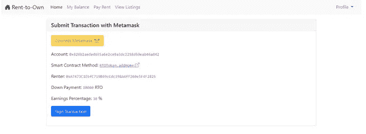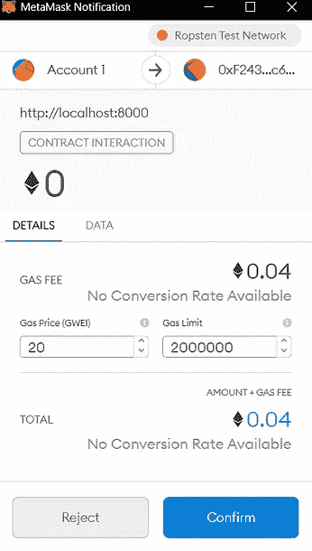

用元掩码签署事务。图片作者。

一旦异步执行的事务被批准，我们就可以查看我们漂亮的新清单，以及直接从分类帐中读取的不可变细节。

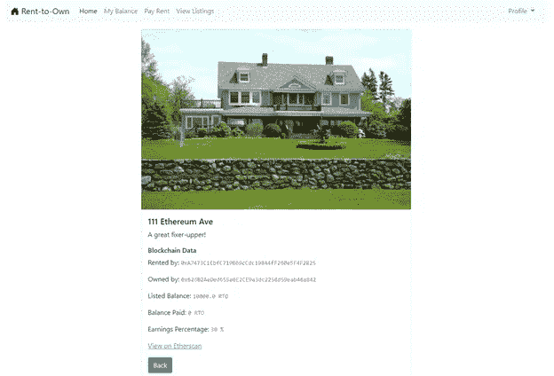

图片作者。

现在我们的家已经增加了，让我们降低收入门槛，开始挖掘一些 RTO。

## 角色:租赁者

点击“连接钱包”按钮，我们将进入如下页面:

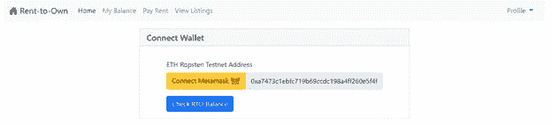

图片作者。

亮橙色的“连接 Metamask”按钮将从浏览器扩展中打开一个提示，通知我们我们的应用程序想要(目前)简单地读取我们的钱包地址。当我们接受申请时，我们的有效 ETH 地址会神奇地出现在我们的申请页面上。让我们继续检查这个钱包的 RTO 余额。

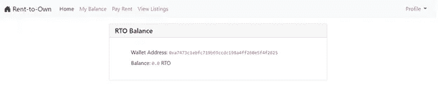

图片作者。

因为我们没有付任何租金，我们当然没有代币。为此，我们导航到“支付租金”选项卡，填写我们的付款金额(以 ETH 为单位)，以及我们房东的 ETH 地址。

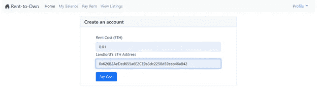

图片作者。

同样，实际的事务签名和私钥管理与应用程序本身是分离的。

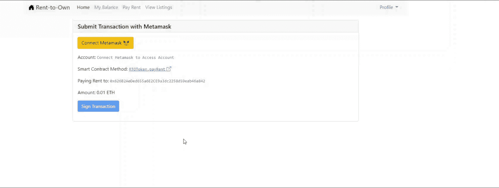

图片作者。

在这种情况下，我们的模拟租金支付额为 0.01 ETH，或大约 20 美元(也许它更像一个帐篷，而不是一个家)。给定 30%的收益百分比，我们应该为此交易挖掘大约 6–7 个 RTO。让我们继续检查我们的余额:

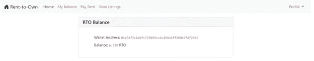

图片作者。

同样的金额也适用于住宅列表(参见已付余额):

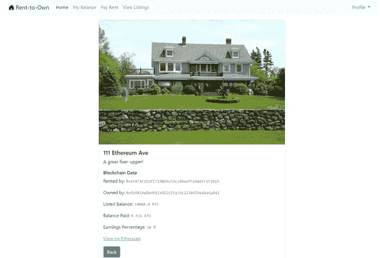

图片作者。

有趣的是，像任何 ERC20 令牌一样，我们也可以通过添加智能合约地址在 Metamask 中查看我们的余额！

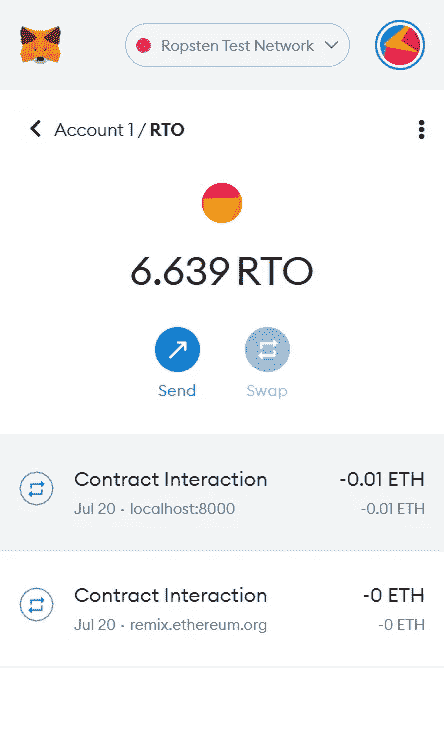

在 Metamask 中查看我们的 RTO 平衡。图片作者。

# 最后的想法

这个应用程序开发起来相对简单，但是它展示了一些重要的概念。除了稳定支付租金之外，租户不能伪造 RTO 余额或通过任何其他方式获得代币。同样，虽然房东有强烈的动机参与这个网络(有动机的租户，有保证的预售收入，不需要参与集中的物业管理)，但他们的 RTO 余额也是公开的。在传统的框架下，建立这种不信任的互动将需要艰苦的记录和强烈后果的威胁，以抑制欺诈行为。但是在一个强大的公共区块链，获得这些好处是微不足道的。我们经常听到“产量农业”、杠杆交易和其他复杂的 DeFi 工具，但加密货币最可持续的应用涉及重新思考我们如何在日常关系中建立信任。

所有代码都可以在 [Github](https://github.com/evandiewald/rto-token) 上获得。

## 参考