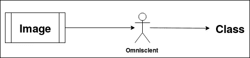
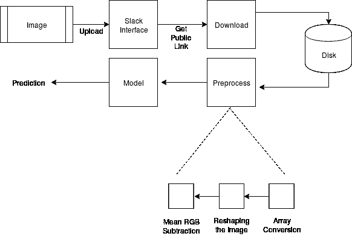
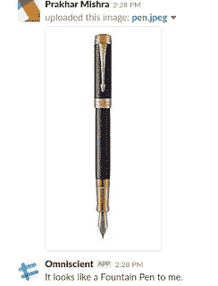

# 用 Python 创建影像分类 Slackbot

> 原文：<https://towardsdatascience.com/creating-an-image-classification-slackbot-in-python-99ea461331e0?source=collection_archive---------30----------------------->

## 带 Python 代码的 Slackbot 教程

图片来自[来源](https://unsplash.com/photos/BjhUu6BpUZA)

聊天机器人是一种软件，被编程为围绕某个主题与人类进行对话，并带有**动机以实现既定目标。**它们可以帮助我们自动完成任何特定的任务，或者触发一次普通的聊天，允许以文本或语音作为交流媒介。

*现实世界聊天机器人部署的一些流行示例包括—*

*   允许顾客使用机器人点餐的餐馆。
*   *帮助客户进行电子商务购买的机器人。*
*   *等等……*

有许多平台可以部署你的机器人，并让公众使用它。其中比较突出的有 **Facebook Messenger、Slack、Kik** 等。上述每个平台都有其局限性和优势。在这篇博客中，我们将学习如何在 Slack 上构建一个图像分类机器人，因为它提供了相对更好的交互选项。

***附言*** *本博客假设用户知道如何在 Slack 上设置你的 bot 首字母(令牌等)。*

# Slack 机器人

Slack 机器人有两种类型

1.  用户机器人——用户机器人是最自然的一对一聊天方式之一，就像我们和人类聊天一样。这种机器人类型有许多现成的功能。*更多详情可以阅读* [*本*](https://api.slack.com/bot-users)**。**
2.  *斜线命令——这些命令就像是对任何 API 的简单调用，用来满足用户的请求。这里斜杠命令被映射到一个可以处理特定类型查询的服务器 URL。*查看* [*基于斜线的命令*](https://www.formcept.com/blog/streamlining-conversations-and-information-exchange-on-slack-with-smart-chatbot/) *了解更多详情。**

*在这篇博客中，我们将讨论用户机器人，其中的高级流程如下所示——即，我们向我们的机器人提供一幅图像，它试图预测该图像的类别，并以自然语言返回给我们。*(我们把我们的 bot 命名为* ***全知*** *【无所不知】)😛**

**

*作者图片*

# *完全流通*

*让我们深入了解更多细节，看看它到底是如何连接 Slack 和我们的[分类模型](https://prakhartechviz.blogspot.com/2019/01/image-classification-keras.html)的。*

**

*完整流程图|作者图片*

*上图显示了整个流程的端到端流程——我们将图像上传到 Slack 上的 bot 用户界面，然后通过公共链接将图像保存在磁盘上。然后，我们应用必要的预处理转换，然后将它们传递给我们预先训练的图像分类模型。一旦我们得到了预测，然后**使用模板槽技术**围绕预测构建自然语言，并将其返回给 slack 接口。我用了一个**预训练的 VGG16 模型**同样，请参考这个[有趣的论文](https://papers.nips.cc/paper/4824-imagenet-classification-with-deep-convolutional-neural-networks.pdf)来了解更多关于模型的信息。此外，以监督方式建模，它只能从训练集中存在的一组给定的可能类别中进行预测。*

**下面的代码片段包含了这个项目的全部代码—**

*项目代码*

**你也可以在这里签出整个代码—* [*来源*](https://gist.github.com/prakhar21/cc275b6f321e85bfcdc0f68af2fab895) *。**

# *测试*

**以下是我尝试过的一些例子—**

**

*示例 1 |作者图片*

**

*示例 2 |作者图片*

*我们的机器人能够正确地执行上面提出的管道，并成功地以模板格式返回其输出，使其感觉像一次自然的对话。类似地，以类似的方式构建令人兴奋的用例的可能性是无穷无尽的，看看您能想到什么会很有趣。😃*

*这个周末对我来说是一次很棒的学习经历。欢迎分享和评论您的想法——谢谢！*