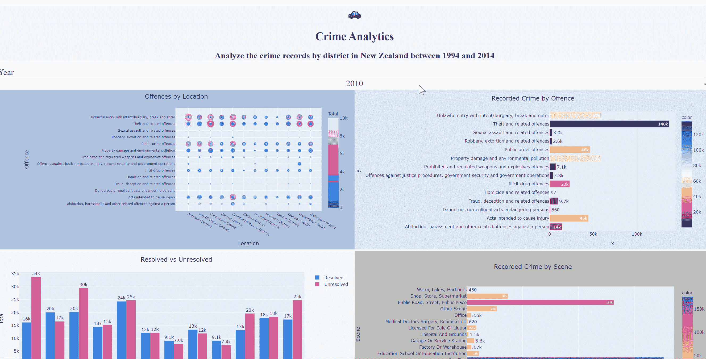
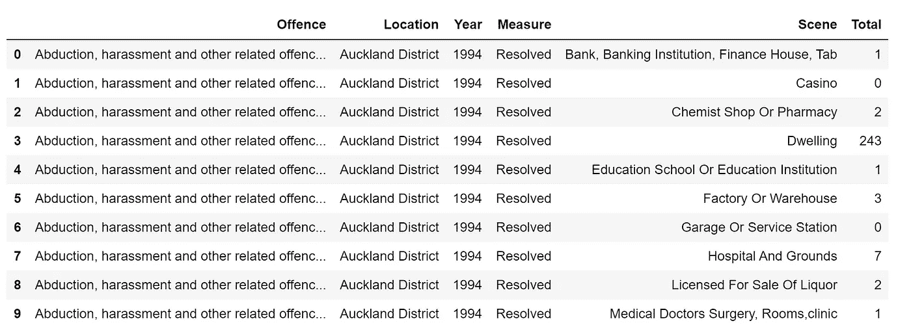
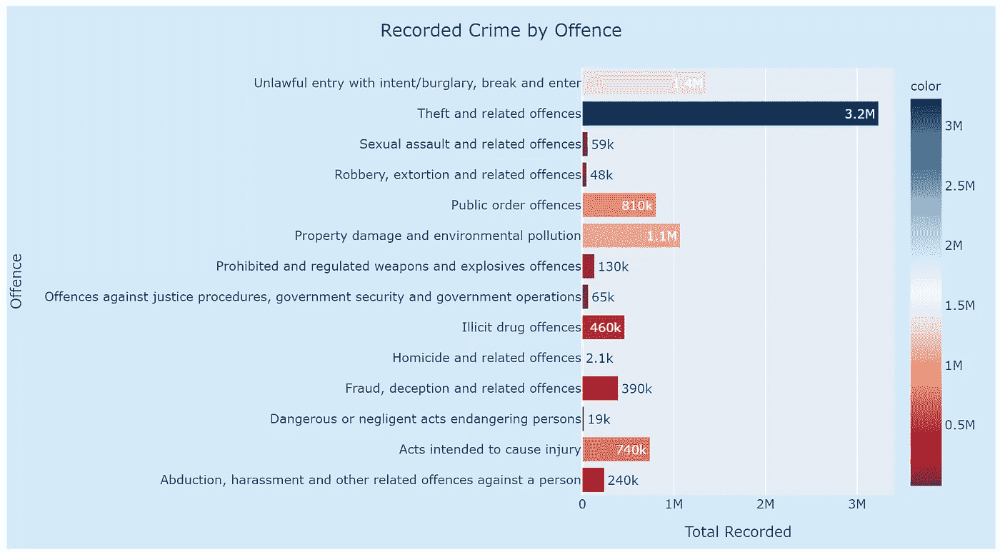
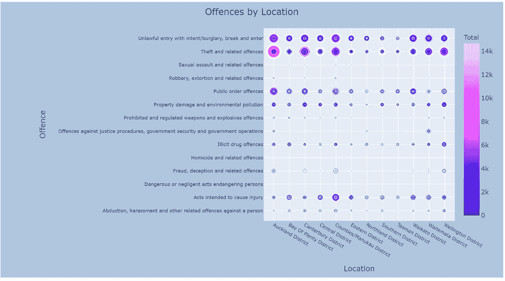
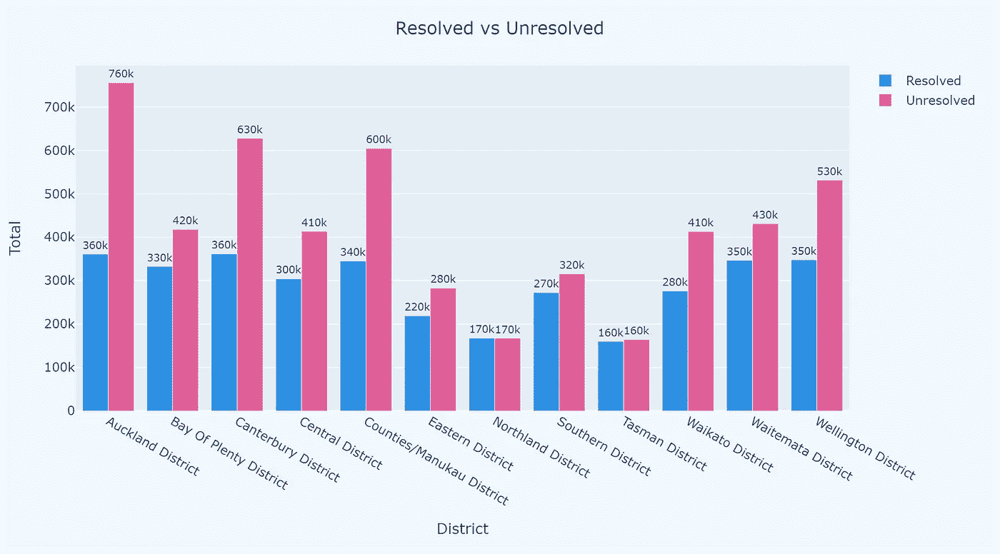
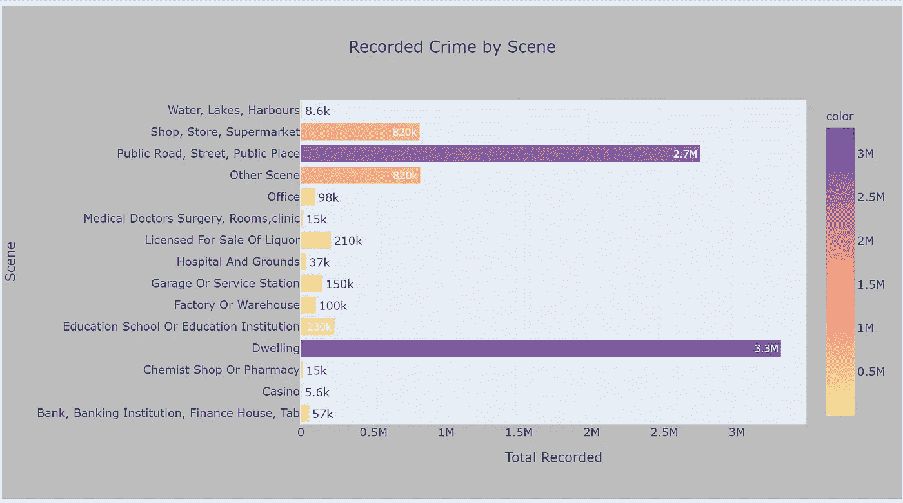

# 使用犯罪数据创建交互式仪表盘

> 原文：<https://towardsdatascience.com/creating-an-interactive-dashboard-with-dash-plotly-using-crime-data-a217da841df3?source=collection_archive---------4----------------------->

我的[上一篇文章](/create-a-simple-dashboard-with-plotly-dash-8f385ba1dd6d)简单介绍了如何用 Dash 开发一个简单的仪表盘。作为一个视觉化的狂热爱好者，那样的仪表板不会让我高兴。本周我做了进一步的探索，我想做一个交互式仪表盘，就像我们通常用 PowerBI 或 Tableau 做的那样。

**鸣谢:本作品基于/包括 Stats NZ 的数据，这些数据由** [**Stats NZ**](http://www.stats.govt.nz/) **根据** [**知识共享署名 4.0 国际**](https://creativecommons.org/licenses/by/4.0/) **许可证授权重用。**

这是仪表板的样子。然后，我将解释实现这一点的方法:



来自作者仪表板的 Gif

如果你想从一个简单的仪表板开始，你可能想看看这篇文章。

[](/create-a-simple-dashboard-with-plotly-dash-8f385ba1dd6d) [## 用 Plotly & Dash 创建一个简单的仪表板

### 自从上次我用意甲数据玩游戏并用 Plotly 创建了一些图表，我想我应该迈出一步…

towardsdatascience.com](/create-a-simple-dashboard-with-plotly-dash-8f385ba1dd6d) 

# 先决条件:

*   **数据**:

本文中使用的数据来自新西兰统计局，如开头致谢部分所述。我从新西兰统计局下载了数据，然后转换成可视化的数据帧。

数据框架包括六列，[犯罪]是关于不同类型的犯罪；[位置]是关于犯罪发生的地区；[年份]是犯罪发生的时间；[措施]是罪行是否已经解决；[场景]是犯罪发生的地方；[总数]是犯罪次数。



表 1:数据帧

*   **套餐:**

*Pandas、numpy、plotly.express、*和 *plotly.graph_objects* 用于数据清理和可视化； *dash，dash_core_components，*和 *dash_html_components* 用于创建仪表板。

```
import pandas as pd
import numpy as np
import plotly.express as px
import plotly.graph_objects as goimport dash
import dash_core_components as dcc
import dash_html_components as html
from dash.dependencies import Input, Output
```

# **第一步:可视化准备**

对于这个仪表板，我计划有四个图表:

```
fig1 = px.bar(
    offence_district, ***#dataframe***
    x=offence_district.groupby("Offence")["Total"].agg(sum), ***#x***
    y=offence_district["Offence"].unique(),***#y***
    labels={"x": "Total Recorded", "y": "Offence"}, ***#define lable***
    color=offence_district.groupby("Offence")["Total"].agg(sum),
    color_continuous_scale=px.colors.sequential.RdBu,***#color***
    text=offence_district.groupby("Offence")["Total"].agg(sum),***#text***
    title="Recorded Crime by Offence", ***#title***
    orientation="h"  ***#horizonal bar chart***
)
fig1.update_layout(
    title=dict(x=0.5), ***#set title in the center***
    margin=dict(l=550, r=20, t=60, b=20) ***#set margin of the chart***
    paper_bgcolor="#D6EAF8", ***#set the background color of the chart***
)
fig1.update_traces(texttemplate="%{text:.2s}") ***#formart the text***
```



图 1:条形图

*Plotly 有很大范围的颜色设置，例如离散颜色和连续颜色，我发现这在可视化中非常有助于突出显示一些信息或进行比较。查看来自 [ploty](https://plotly.com/python/discrete-color/) 的指令以获得更多信息。

```
fig2 = px.scatter(
    offence_district, ***#dataframe***
    x="Location", ***#x***
    y="Offence", ***#y***
    size="Total", ***#bubble size***
    color="Total",***#bubble color***
    color_continuous_scale=px.colors.sequential.Plotly3, ***#color theme***
    title="Offences by Location", ***#chart title***
)
fig2.update_layout(
    xaxis_tickangle=30,***#angle of the tick on x-axis***
    title=dict(x=0.5), ***#set the title in center***
    xaxis_tickfont=dict(size=9), ***#set the font for x-axis***
    yaxis_tickfont=dict(size=9), ***#set the font for y-axis***
    margin=dict(l=500, r=20, t=50, b=20), ***#set the margin***
    paper_bgcolor="LightSteelblue", ***#set the background color for chart***
)
```



图 2:气泡图——按地点和场景划分的犯罪

在第三个图表中，我想比较“已解决”和未解决记录的数量。所以首先我把原始数据帧分成两部分。

```
s1 = offence_district[offence_district['Measure']=='Resolved']
s2 = offence_district[offence_district['Measure']=='Unresolved']
```

然后我使用 *plotly.graph_objects* 来构建图形:

```
trace1 = go.Bar(    ***#setup the chart for Resolved records***
    x=s1["Location"].unique(), ***#x for Resolved records***
    y=s1.groupby("Location")["Total"].agg(sum),***#y for Resolved records***
    marker_color=px.colors.qualitative.Dark24[0],  ***#color***
    text=s1.groupby("Location")["Total"].agg(sum), ***#label/text***
    textposition="outside", ***#text position***
    name="Resolved", ***#legend name***
)
trace2 = go.Bar(   ***#setup the chart for Unresolved records***
    x=s2["Location"].unique(),
    y=s2.groupby("Location")["Total"].agg(sum),
    text=s2.groupby("Location")["Total"].agg(sum),
    marker_color=px.colors.qualitative.Dark24[1],
    textposition="outside",
    name="Unresolved",
)data = [trace1, trace2] ***#combine two charts/columns***
layout = go.Layout(barmode="group", title="Resolved vs Unresolved") ***#define how to display the columns***
fig3 = go.Figure(data=data, layout=layout)
fig3.update_layout(
    title=dict(x=0.5), ***#center the title***
    xaxis_title="District",***#setup the x-axis title***
    yaxis_title="Total", ***#setup the x-axis title***
    margin=dict(l=20, r=20, t=60, b=20),***#setup the margin***
    paper_bgcolor="aliceblue", ***#setup the background color***
)
fig3.update_traces(texttemplate="%{text:.2s}") ***#text formart***
```



图 3:柱形图—已解决与未解决

```
fig4= px.bar(offence_district, 
             x = offence_district.groupby('Scene')['Total'].agg(sum), 
             y = offence_district['Scene'].unique(), 
             labels={
                     "x": "Total Recorded",
                     "y": "Scene"
                 },
              color = offence_district.groupby('Scene')['Total'].agg(sum),
              color_continuous_scale=px.colors.sequential.Sunset,
              #color_discrete_sequence=['rgb(253,180,98)','rgb(190,186,218)'],
              text = offence_district.groupby('Scene')['Total'].agg(sum),
             title = 'Recorded Crime by Scene',
              #,barmode = 'group'
              orientation = 'h'
             )
fig4.update_layout( title = dict(x=0.5), paper_bgcolor="#BDBDBD")
fig4.update_traces(texttemplate = '%{text:.2s}')
```



图 4:条形图——犯罪现场

# 步骤 2:设置仪表板布局

一旦我们准备好了所有的图表，下一步就是设置仪表板的布局。换句话说，你希望你的仪表板是什么样子。

例如，在我的仪表板中，我希望在顶部中间有一个**标题**，然后接着有**四个** **图形**，两个一排。此外，我希望所有四个图表能够通过“年份”**过滤。**

为了实现我上面提到的，在我的布局设置中，需要对**标题**、四个**图形**和一个**下拉菜单**(过滤器)进行编码。

```
app = dash.Dash(__name__)app.layout = html.Div(
    children=[ html.Div(
            children=[
                html.P(children="🚓", style={'fontSize': "30px",'textAlign': 'center'}, className="header-emoji"), ***#emoji***
                html.H1(
                    children="Crime Analytics",style={'textAlign': 'center'}, className="header-title" 
                ), ***#Header title***
                html.H2(
                    children="Analyze the crime records"
                    " by district in New Zealand"
                    " between 1994 and 2014",
                    className="header-description", style={'textAlign': 'center'},
                ),
            ],
            className="header",style={'backgroundColor':'#F5F5F5'},
        ), ***#Description below the header***

        html.Div(
            children=[
                html.Div(children = 'Year', style={'fontSize': "24px"},className = 'menu-title'),
                dcc.Dropdown(
                    id = 'year-filter',
                    options = [
                        {'label': Year, 'value':Year}
                        for Year in offence_district.Year.unique()
                    ], ***#'Year' is the filter***
                    value ='2010',
                    clearable = False,
                    searchable = False,
                    className = 'dropdown', style={'fontSize': "24px",'textAlign': 'center'},
                ),
            ],
            className = 'menu',
        ), ***#the dropdown function***

        html.Div(
            children=[
                html.Div(
                children = dcc.Graph(
                    id = 'scatter',
                    figure = fig2,
                  #  config={"displayModeBar": False},
                ),
                style={'width': '50%', 'display': 'inline-block'},
            ),
                html.Div(
                children = dcc.Graph(
                    id = 'bar',
                    figure = fig1,
                    #config={"displayModeBar": False},
                ),
                style={'width': '50%', 'display': 'inline-block'},
            ),
                html.Div(
                children = dcc.Graph(
                    id = 'bibar',
                    figure = fig3,
                    #config={"displayModeBar": False},
                ),
                style={'width': '50%', 'display': 'inline-block'},
            ),
                html.Div(
                children = dcc.Graph(
                    id = 'barscene',
                    figure = fig4,
                    #config={"displayModeBar": False},
                ),
                style={'width': '50%', 'display': 'inline-block'},
            ),
        ],
        className = 'double-graph',
        ), 
    ]
) ***#Four graphs***
```

# 步骤 3:设置回拨

为了能够将下拉(过滤)值传递给仪表板中的图形，我们需要设置“回调”,以便图形可以是交互式的。下面我分别为每个图形设置*回调*。

```
[@app](http://twitter.com/app).callback(
    Output("scatter", "figure"), ***#the output is the scatterchart***
    [Input("year-filter", "value")], ***#the input is the year-filter***
)
def update_charts(Year):
    filtered_data = offence_district[offence_district["Year"] == Year] ***#the graph/dataframe will be filterd by "Year"***scatter = px.scatter(
        filtered_data,
        x="Location",
        y="Offence",
        size="Total",
        color="Total",
        color_continuous_scale=px.colors.sequential.Plotly3,
        title="Offences by Location",
    )
    scatter.update_layout(
        xaxis_tickangle=30,
        title=dict(x=0.5),
        xaxis_tickfont=dict(size=9),
        yaxis_tickfont=dict(size=9),
        margin=dict(l=500, r=20, t=50, b=20),
        paper_bgcolor="LightSteelblue",
    )
    return scatter ***#return the scatterchart according to the filter***[@app](http://twitter.com/app).callback(
    Output("bar", "figure"),
    [Input("year-filter", "value")],
)
def update_charts(Year):
    filtered_data = offence_district[offence_district["Year"] == Year]
    bar = px.bar(
        filtered_data,
        x=filtered_data.groupby("Offence")["Total"].agg(sum),
        y=filtered_data["Offence"].unique(),
        color=filtered_data.groupby("Offence")["Total"].agg(sum),
        color_continuous_scale=px.colors.sequential.RdBu,
        text=filtered_data.groupby("Offence")["Total"].agg(sum),
        title="Recorded Crime by Offence",
        orientation="h",
    )
    bar.update_layout(
        title=dict(x=0.5), margin=dict(l=550, r=20, t=60, b=20), paper_bgcolor="#D6EAF8"
    )
    bar.update_traces(texttemplate="%{text:.2s}")
    return bar[@app](http://twitter.com/app).callback(
    Output("bibar", "figure"),
    [Input("year-filter", "value")],
)
def update_charts(Year):
    filtered_s1 = s1[s1["Year"] == Year]
    filtered_s2 = s2[s2["Year"] == Year]
    trace1 = go.Bar(
        x=filtered_s1["Location"].unique(),
        y=filtered_s1.groupby("Location")["Total"].agg(sum),
        text=filtered_s1.groupby("Location")["Total"].agg(sum),
        textposition="outside",
        marker_color=px.colors.qualitative.Dark24[0],
        name="Resolved",
    )
    trace2 = go.Bar(
        x=filtered_s2["Location"].unique(),
        y=filtered_s2.groupby("Location")["Total"].agg(sum),
        text=filtered_s2.groupby("Location")["Total"].agg(sum),
        textposition="outside",
        marker_color=px.colors.qualitative.Dark24[1],
        name="Unresolved",
    )
    data = [trace1, trace2]
    layout = go.Layout(barmode="group", title="Resolved vs Unresolved")
    bibar = go.Figure(data=data, layout=layout)
    bibar.update_layout(
        title=dict(x=0.5),
        xaxis_title="District",
        yaxis_title="Total",
        paper_bgcolor="aliceblue",
        margin=dict(l=20, r=20, t=60, b=20),
    )
    bibar.update_traces(texttemplate="%{text:.2s}")
    return bibar[@app](http://twitter.com/app).callback(
    Output("barscene", "figure"),
    [Input("year-filter", "value")],
)
def update_charts(Year):
    filtered_data = offence_district[offence_district["Year"] == Year]
    barscene = px.bar(
        filtered_data,
        x=filtered_data.groupby("Scene")["Total"].agg(sum),
        y=filtered_data["Scene"].unique(),
        labels={"x": "Total Recorded", "y": "Scene"},
        color=filtered_data.groupby("Scene")["Total"].agg(sum),
        color_continuous_scale=px.colors.sequential.Sunset,
        # color_discrete_sequence=['rgb(253,180,98)','rgb(190,186,218)'],
        text=filtered_data.groupby("Scene")["Total"].agg(sum),
        title="Recorded Crime by Scene",
        # ,barmode = 'group'
        orientation="h",
    )
    barscene.update_layout(title=dict(x=0.5), paper_bgcolor="#BDBDBD")
    barscene.update_traces(texttemplate="%{text:.2s}")
    return barscene
```

一旦我们得到了 dash **布局**和**回调**，我们就可以运行仪表板并玩它了。

# 结论:

虽然我不认为用 Dash 开发 dashboard 是一个容易的开始，但 Dash 为用户提供了定制或个性化 dashboard 的灵活性，非常有趣。要开始构建自己的仪表板，请记住 Dash 的三个组成部分:1)图形；2)布局；以及 3)回调。

布局部分对我来说不是那么简单，因为我对 html 或 css 语言一无所知。这是[链接](https://www.w3schools.com/css/css_intro.asp)到 css intro，如果你和我有类似的问题。


```
***##if not using virtual environment***
if __name__ == '__main__':
    app.run_server()***##if using virtual environment*** if __name__ == '__main__':
    app.run_server(debug = True)
```

这就是创建交互式仪表板所需的全部内容。我们开始吧！

如果有任何问题，请在 Linkedin 上给我发短信，或者打个招呼🤪！

# **参考**

[](https://realpython.com/python-dash/) [## 用 Dash - Real Python 开发 Python 中的数据可视化接口

### 过去，创建分析性 web 应用程序是经验丰富的开发人员的任务，他们需要了解…

realpython.com](https://realpython.com/python-dash/) [](https://github.com/gsuijker/avocado_dashboard) [## gsuijker/avocado_dashboard

### 用 plotly 和 dash 制作的鳄梨仪表板。我想看看用…制作仪表板的可能性

github.com](https://github.com/gsuijker/avocado_dashboard)