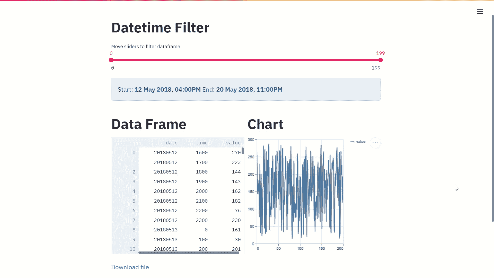
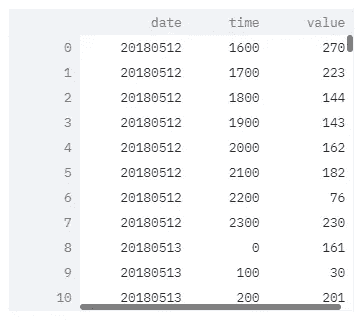
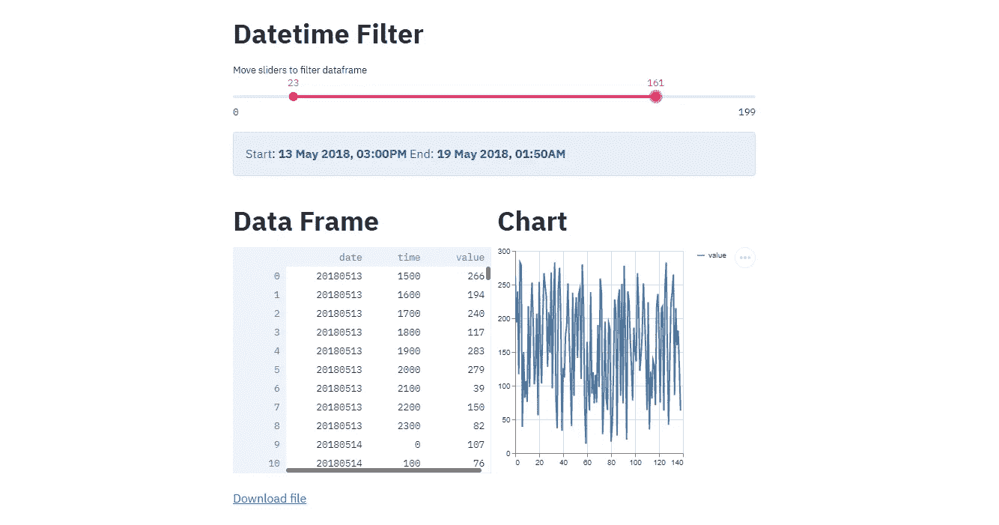

# 用 Pandas 和 Streamlit 创建交互式日期时间过滤器

> 原文：<https://towardsdatascience.com/creating-an-interactive-datetime-filter-with-pandas-and-streamlit-156e1ea12e90?source=collection_archive---------10----------------------->

## 用 Python 实现时序数据的可视化日期时间过滤器



作者视觉。

## 介绍

也许我们每天处理的最激增的数据类型是时间序列数据。基本上，任何使用日期、时间或两者索引的东西都可以被视为时间序列数据集。通常情况下，你可能需要用日期和时间来过滤时间序列数据。基于任何其他形式的索引过滤数据框是一项相当简单的任务；然而，datetime 的情况就不一样了，尤其是当日期和时间出现在不同的列中时。即使您成功过滤了它们，将它们应用到您的数据框并即时可视化它们也是另一项任务。

幸运的是，我们有 Pandas 和 Streamlit 在这方面帮助我们，以便创建和可视化交互式日期时间过滤器。我假设我们大多数人都非常熟悉 Pandas，并可能在我们的数据生活中经常使用它，但我怀疑许多人不熟悉 Streamlit，因为它是这个街区的新成员。无论如何，我将提供一个快速的介绍，以免有人问。

## 熊猫

在处理 Python 中的数据时，Pandas 可以说是最敏捷、高效、灵活、健壮、有弹性和用户友好的绑定。如果你认为我在前面的句子中加入了太多的夸张，那么你大大低估了熊猫。这个强大的工具包让您能够操纵、变异、转换，甚至是可视化框架中的数据，所有这些都只需要几行代码。在这个应用程序中，我们将使用 Pandas 从/向 CSV 文件中读取/写入数据，并根据选定的开始和结束日期/时间调整数据框的大小。

## 细流

正如其创始人自己所描述的那样，Streamlit 是一个纯 Python API，允许您创建机器学习应用程序。不对。实际上远不止这些。Streamlit 是一个 web 框架、一个准端口转发代理服务器和一个前端 UI 库，所有这些都混合在一个 bundle of good 中。简而言之，你可以开发和部署无数的 web 应用程序(或本地应用程序),用于各种用途。对于我们的应用程序，我们将利用 Streamlit 为我们的时间序列数据呈现一个交互式滑动过滤器，该过滤器也将被即时可视化。

## 包装

事不宜迟，让我们继续插入我们将要使用的软件包。

如果您需要安装上述任何软件包，请在 Anaconda 提示符下使用‘pip install’继续。

```
pip install streamlit
```

## 资料组

我们将使用[这个](https://raw.githubusercontent.com/mkhorasani/interactive_datetime_filter/main/data.csv)随机生成的数据集— CC0(无版权保留，公共领域)[1]，它有一个日期、时间和值的列，如下所示。



图片作者。

日期格式如下:

```
YYYYMMDD
```

而时间的格式为:

```
HHMM
```

您可以根据自己的需要使用任何其他格式来设置日期时间的格式，但是您必须确保按照上一节中的说明在脚本中声明它。

## 日期时间过滤器

为了实现我们的过滤器，我们将使用下面的函数作为参数— *message* 和 *df* ，它们对应于 slider 小部件显示的消息和需要过滤的原始数据帧。

最初，我们将调用 Streamlit slider 小部件，如下所示。

> streamlit.slider(标签，最小值，最大值，值，步长)
> 
> ***参数***
> 
> ***标签*** *(str 或 None)——向用户解释该滑块用途的简短标签。*
> 
> ***min _ value****(支持的类型或无)—最小允许值。如果值为 int，则默认为 0，如果值为 float，则默认为 0.0，如果值为 date/datetime，则值为 timedelta(days=14)，如果值为 time，则值为 time . min*
> 
> **(支持的类型或无)—最大允许值。如果值是 int，则默认为 100；如果是 float，则默认为 1.0；如果是 date/datetime，则默认为 value+time delta(days = 14)；如果是 time，则默认为 time . max**
> 
> ****value*** *(一个支持的类型或者一个支持的类型的元组/列表或者无)——滑块第一次呈现时的值。如果在这里传递一个由两个值组成的元组/列表，那么就会呈现一个带有上下边界的范围滑块。例如，如果设置为(1，10)，滑块将有一个介于 1 和 10 之间的可选范围。默认为最小值。**
> 
> ****步进****(int/float/time delta 或 None) —步进间隔。如果值为 int，则默认为 1；如果值为 float，则默认为 0.01；如果值为 date/datetime，则默认为 time delta(days = 1)；如果值为 time，则默认为 timedelta(minutes=15)**

*请注意，我们的滑块将返回两个值，即开始日期时间和结束日期时间值。因此，我们必须使用数组将滑块的初始值**声明为:***

```
*[0,len(df)-1]*
```

*我们必须将小部件等同于如下所示的两个变量，即用于过滤数据帧的开始和结束日期时间索引:*

```
*slider_1, slider_2 = st.slider('%s' % (message),0,len(df)-1,[0,len(df)-1],1)*
```

*随后，我们需要从开始/结束时间列中删除任何尾随的小数位，并添加前导零以防时间少于一个整小时，即 12:00AM 引用为 0，如下所示:*

```
*while len(str(df.iloc[slider_1][1]).replace('.0','')) < 4:
    df.iloc[slider_1,1] = '0' + str(df.iloc[slider_1][1]).replace('.0','')*
```

*然后，我们需要将我们的日期添加到时间中，并通过使用 Python 中的 **datetime.strptime** 绑定，以可理解的格式解析我们的日期时间，如下所示:*

```
*start_date = datetime.datetime.strptime(str(df.iloc[slider_1][0]).replace('.0','') + str(df.iloc[slider_1][1]).replace('.0',''),'%Y%m%d%H%M%S')*
```

*为了显示我们选择的日期时间，我们可以使用 **strftime** 功能来重新格式化开始/结束，如下所示:*

```
*start_date = start_date.strftime('%d %b %Y, %I:%M%p')*
```

*为了使用其他日期时间格式，请参考[这篇](https://docs.python.org/3/library/datetime.html)文章。最后，我们将显示选定的日期时间，并将过滤后的索引应用于数据集，如下所示:*

```
*st.info('Start: **%s** End: **%s**' % (start_date,end_date))                filtered_df = df.iloc[slider_1:slider_2+1][:].reset_index(drop=True)*
```

## *下载 CSV*

*您可能会发现将过滤后的数据框下载为 CSV 文件非常方便。如果是这样，请使用以下功能在您的 Streamlit 应用程序中创建一个可下载的文件。*

*该函数的参数— *name* 和 *df* 分别对应需要转换为 CSV 文件的可下载文件和数据帧的名称。*

## *简化应用程序*

*最后，我们可以以 Streamlit 应用程序的形式将所有内容绑定在一起，该应用程序将呈现日期时间过滤器、数据框和折线图，当我们移动滑块时，这些内容都会即时更新。*

*您可以通过在 Anaconda 提示符下键入以下命令来运行您的最终应用程序。首先，将根目录更改为保存源代码的位置:*

```
*cd C:/Users/...*
```

*然后键入以下内容运行您的应用程序:*

```
*streamlit run file_name.py*
```

## *结果*

*现在你有了它，一个交互式的仪表板，允许你可视化地过滤你的时间序列数据，同时可视化它！*

**

*作者照片。*

*如果您想了解更多关于数据可视化和 Python 的知识，请随时查看以下(附属链接)课程:*

## *使用 Streamlit 开发 Web 应用程序:*

*<https://www.amazon.com/Web-Application-Development-Streamlit-Applications/dp/1484281101?&linkCode=ll1&tag=mkhorasani09-20&linkId=a0cb2bc17df598006fd9029c58792a6b&language=en_US&ref_=as_li_ss_tl>  

## 使用 Python 实现数据可视化:

<https://www.coursera.org/learn/python-for-data-visualization?irclickid=xgMQ4KWb%3AxyIWO7Uo7Vva0OcUkGQgW2aEwvr1c0&irgwc=1&utm_medium=partners&utm_source=impact&utm_campaign=3308031&utm_content=b2c>  

## 面向所有人的 Python 专业化:

<https://www.coursera.org/specializations/python?irclickid=xgMQ4KWb%3AxyIWO7Uo7Vva0OcUkGQgW16Ewvr1c0&irgwc=1&utm_medium=partners&utm_source=impact&utm_campaign=3308031&utm_content=b2c>  

## GitHub 资源库:

<https://github.com/mkhorasani/interactive_datetime_filter>  

## 参考资料:

[1] Khorasani，M. K. (2021 年 12 月 28 日)。*交互式日期时间过滤器*(版本 1)【随机生成的数据集】。[https://github . com/mkhorasani/interactive _ datetime _ filter/blob/main/data . CSV](https://github.com/mkhorasani/interactive_datetime_filter/blob/main/data.csv)

# 新到中？你可以在这里订阅和解锁无限文章[。](https://khorasani.medium.com/membership)*