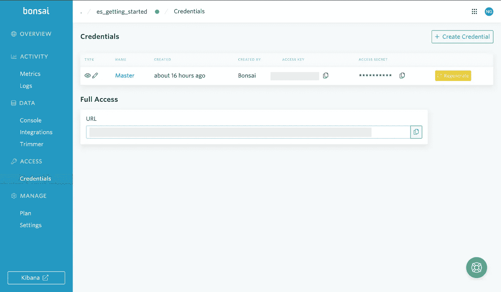

# 使用 Python 创建和管理弹性搜索索引

> 原文：<https://towardsdatascience.com/creating-and-managing-elasticsearch-indices-with-python-f676ff1c8113?source=collection_archive---------3----------------------->

## 从 CSV 文件创建 ES 索引以及使用 Python Elasticsearch 客户端管理数据的实践指南


[保罗·格伦](https://unsplash.com/@pgreen1983?utm_source=medium&utm_medium=referral)在 [Unsplash](https://unsplash.com?utm_source=medium&utm_medium=referral) 上拍照

E lasticsearch (ES)是一个分布式搜索引擎，旨在实现可扩展性和冗余性。它速度很快，适合[存储和处理大量数据，用于分析、机器学习和其他应用](https://www.elastic.co/guide/en/elasticsearch/reference/current/elasticsearch-intro.html)。ES 在最近几年获得了发展，对于任何数据科学家(和数据工程师)的工具箱来说，它都是一项重要的技术。在这篇博文中，我们将使用 Bonsai 提供我们自己的(免费)ES 集群，并使用 [Python Elasticsearch 客户端](https://elasticsearch-py.readthedocs.io/en/6.8.2/)来建立索引，并写入和查询数据。这篇博文的所有代码都可以在 GitHub 上找到。

# 设置您的弹性搜索集群

第一步，我们将建立一个弹性搜索集群。你可以通过一个托管的弹性搜索服务提供商来完成这项工作，比如 AWS 的亚马逊弹性搜索服务。您如何决定供应、部署和管理您的集群(以及在哪里)取决于您正在构建哪种解决方案以及哪些功能对您来说是重要的。

在这里，我们将使用 [Bonsai](https://bonsai.io) ，它为我们提供了一个[免费的“沙盒”层，具有 125mb 的存储空间和 35，000 个文档的存储限制](https://elements.heroku.com/addons/bonsai)。首先，在 Bonsai 上为[注册一个帐户，然后按照网站上的步骤来设置和部署您的集群](https://app.bonsai.io/signup#free)。如果您已经在 [Heroku](http://www.heroku.com) 上拥有一个帐户，您也可以通过[选择 Bonsai 作为应用程序资源标签中](https://elements.heroku.com/addons/bonsai)的附加组件，直接为您的应用程序提供一个 ES 集群，而无需在 Bonsai 上注册帐户(见下文)。


通过 Heroku 附加组件提供 Bonsai Elasticsearch 集群(图片由作者提供)

在您设置您的 Bonsai 帐户并部署您的集群(或通过 Heroku 为您的应用程序提供 Bonsai 集群)后，转到您的 [Bonsai 集群概览仪表板](https://docs.bonsai.io/article/199-cluster-overview)左侧栏中的“凭证”页面，并复制您的主机 URL、访问密钥和访问密码。稍后，我们将使用这些信息通过 [Python Elasticsearch 客户端](https://elasticsearch-py.readthedocs.io/en/6.8.2/)建立一个连接。



从[Bonsai Cluster overview dashboard](https://docs.bonsai.io/article/199-cluster-overview)中的“凭证”页面获取 ES 集群的主机 URL、访问密钥和访问密码(图片由作者提供)

Bonsai 的沙盒层不是生产级部署，有一些限制。例如，沙箱层不允许您为用户设置有限的权限(例如，只读权限)，因此，如果您希望将此设置用于向互联网公开的应用程序，请记住这一点。[Elastic.co 提供了一个 14 天的免费试用版](https://cloud.elastic.co/registration?elektra=downloads-overview&storm=elasticsearch)，如果你想探索 es 所提供的全部功能的话，你可以使用这个试用版。

完成上述步骤后，您可以使用 Elasticsearch 的[Compact and Aligned Text(CAT)API](https://www.elastic.co/guide/en/elasticsearch/reference/current/cat.html)从控制台检查集群健康状况和索引。卡特彼勒 API 旨在为您提供人类可读的输出。因此，它们*不是*打算由应用程序使用；相反，他们应该从终端或在[基巴纳控制台](https://www.elastic.co/guide/en/kibana/7.12/console-kibana.html)使用。

在控制台上(直接在 Kibana 和 Bonsai 上)，下面的 GET 请求将返回关于[集群健康](http://www.elastic.co/guide/en/elasticsearch/reference/current/cluster-health.html)的信息(一个“绿色”状态意味着您的所有碎片都已分配):


使用[卡特彼勒健康 API](https://www.elastic.co/guide/en/elasticsearch/reference/current/cat-health.html) 在 [Kibana 控制台](https://www.elastic.co/guide/en/kibana/7.12/console-kibana.html)上检查您的 ES 集群的健康状况(图片由作者提供)

# 定义您的 ES 索引映射

现在我们已经有了一个集群，让我们看看 es 中数据和索引的基础。

Elasticsearch 中的数据是以名为“ [**文档**](https://www.elastic.co/guide/en/elasticsearch/reference/7.12/documents-indices.html) ”的 JSON 对象的形式存在的。一个文档包含**字段**，它们是键值对，可以是一个值(如布尔值或整数)或一个嵌套结构。文档被组织在 [**索引**](https://www.elastic.co/blog/what-is-an-elasticsearch-index) 中，它们既是遵循模式的数据的[逻辑分组，也是通过碎片](https://www.elastic.co/guide/en/elasticsearch/reference/current/scalability.html)的数据的*物理*组织。

每个索引由[一个或多个物理碎片组成，这些物理碎片形成一个逻辑组](https://www.elastic.co/guide/en/elasticsearch/reference/current/scalability.html)。每个碎片依次是一个[“自含索引”](https://www.elastic.co/guide/en/elasticsearch/reference/current/scalability.html)。索引中的数据跨这些**碎片**进行分区，而碎片分布在各个节点上。每个文档都有一个“主碎片”和一个“副本碎片”(也就是说，如果索引已经被配置为有一个或多个副本碎片)。

驻留在不同碎片中的数据可以并行处理。在您的 CPU 和内存允许的范围内(即，取决于您拥有的 ES 集群的类型)，更多的碎片意味着更快的搜索。但是请注意，碎片会带来开销，您应该仔细考虑[集群中碎片的适当数量和大小](https://www.elastic.co/guide/en/elasticsearch/reference/current/size-your-shards.html)。

既然我们已经学习了 ES 的基础知识，让我们尝试建立一个我们自己的索引。这里，我们将使用 Kaggle 上提供的关于网飞演出的[数据。该数据集采用 CSV 格式，包含网飞上可用的电影和电视剧的信息，包括元数据，如上映日期、片名和演员阵容。](https://www.kaggle.com/shivamb/netflix-shows)

我们将首先为我们的索引定义一个 ES 映射。在这种情况下，我们将使用相对简单的字段类型，将所有字段定义为`text`，除了`release_year`(我们将其定义为`integer`)。

虽然 Elasticsearch 能够在您编写文档时使用[动态字段映射](https://www.elastic.co/guide/en/elasticsearch/reference/current/dynamic-field-mapping.html)来推断文档的映射，但它不一定能达到最佳效果。通常，您需要花一些时间来定义映射，因为字段类型(以及各种其他选项)会影响索引的大小以及查询数据的灵活性。例如，`text`字段类型在索引时被分解成单独的术语，允许部分匹配。`keyword`类型也可以用于字符串，但是在索引时不进行分析(或者说:“标记化”)，只允许精确匹配(在本例中，我们可以将它用于`type`字段，它取两个值之一——“电影”或“电视节目”)。

这里要记住的另一件事是 es [没有数组字段类型](https://www.elastic.co/guide/en/elasticsearch/reference/current/mapping-types.html):如果你的文档包含一个由整数数组组成的字段，那么 ES 的等价数据类型就是`integer`(关于 ES 字段类型的完整概述，请参见[本页](https://www.elastic.co/guide/en/elasticsearch/reference/current/mapping-types.html))。以下面的文件为例:

```
{
    "values": [1,2,3,4,5]
}
```

该数据的底层映射将简单地将`values`字段类型定义为一个整数:

```
mapping = {
    "mappings": {
        "properties": {
            "values": {
                "type": "integer"
            }
        }
    }
}
```

现在我们已经定义了我们的映射，我们可以使用 [Python Elasticsearch 客户端](https://elasticsearch-py.readthedocs.io/en/6.8.2/)在 ES 上设置我们的索引。在下面的 Python 代码中，我设置了一个名为 `[EsConnection](https://github.com/ngoet/es_demo/blob/main/es_connection.py)`的类[，带有一个 ES 客户端连接属性(`es_client`)。注意，为了方便起见，我将我的访问凭证存储在环境变量中(也是为了避免在将代码推送到 GitHub 时意外地共享它们)。对于真正的应用程序，你必须使用更安全的方法，比如](https://github.com/ngoet/es_demo/blob/main/es_connection.py) [AWS Secrets Manager](https://aws.amazon.com/secrets-manager/) 。

`EsConnection`类还包括两个方法，一个基于映射创建索引(`create_index`)，另一个(`populate_index`)获取 CSV 文件，将其行转换为 JSONs，并将每个条目(“文档”)写入 es 索引。这里，我们将只使用第一个函数来创建我们的`netflix_movies`索引:

现在，我们可以使用下面的代码检查索引的映射，该代码将返回我们刚刚编写的映射:

# 将数据写入 ES

现在我们已经定义了我们的映射，我们可以使用下面的代码将网飞电影数据写入我们的 es 索引(请注意，这段代码期望本文前面讨论的来自 Kaggle 的[网飞数据可以在名为“data”的子目录中获得):](https://www.kaggle.com/shivamb/netflix-shows)

当这段代码运行时，我们可以通过查看 Bonsai 仪表板中的日志来检查数据是否通过。日志应该显示对`netflix_movies`索引的 POST 请求(见下文)。


检查日志中对 Bonsai 索引的 POST 调用(图片由作者提供)

我们还可以使用`count`方法检查`netflix_movies`索引中的条目数量，例如:

最后，我们可以使用 Kibana 控制台中的[CAT indexes API](https://www.google.co.uk/search?q=CAT+indices+API&client=safari&source=hp&ei=QPlpYIDFMevYgwfLkr7gDQ&iflsig=AINFCbYAAAAAYGoHUNoVnfkkKa3B3-yI2Ja62TmRbazs&oq=CAT+indices+API&gs_lcp=Cgdnd3Mtd2l6EAMyAggAMgYIABAWEB46AgguOggILhDHARCjAjoFCC4QkwI6CAguEMcBEK8BOgUIABDJAzoECAAQCjoICAAQFhAKEB5Q7gZY1Blg1htoAXAAeACAAVmIAYUIkgECMTaYAQCgAQGqAQdnd3Mtd2l6&sclient=gws-wiz&ved=0ahUKEwiA5bS8kOXvAhVr7OAKHUuJD9wQ4dUDCAo&uact=5)来检查索引中的文档数量、它们的大小、主碎片和复制碎片的数量以及它们的健康状态:


使用 [CAT 索引 API](https://www.google.co.uk/search?q=CAT+indices+API&client=safari&source=hp&ei=QPlpYIDFMevYgwfLkr7gDQ&iflsig=AINFCbYAAAAAYGoHUNoVnfkkKa3B3-yI2Ja62TmRbazs&oq=CAT+indices+API&gs_lcp=Cgdnd3Mtd2l6EAMyAggAMgYIABAWEB46AgguOggILhDHARCjAjoFCC4QkwI6CAguEMcBEK8BOgUIABDJAzoECAAQCjoICAAQFhAKEB5Q7gZY1Blg1htoAXAAeACAAVmIAYUIkgECMTaYAQCgAQGqAQdnd3Mtd2l6&sclient=gws-wiz&ved=0ahUKEwiA5bS8kOXvAhVr7OAKHUuJD9wQ4dUDCAo&uact=5) 在 [Kibana 控制台](https://www.elastic.co/guide/en/kibana/7.12/console-kibana.html)上检查 es 集群中的索引(图片由作者提供)

在上面显示的输出中，`store.size`字段显示了主碎片和复制碎片的总大小，而`pri.store.size`只显示了主碎片的大小。在这种情况下,`store.size`将是主碎片大小的两倍，因为我们的碎片健康是“绿色的”,这意味着副本碎片被正确分配。

如果你喜欢全程使用 Python，Python Elasticsearch 客户端也可以[直接与 CAT API](https://elasticsearch-py.readthedocs.io/en/6.8.2/api.html#cat) 一起使用。

# 从 ES 查询数据

现在我们已经建立了集群并编写了文档，让我们简单地看一下从 Elasticsearch 查询数据。ES 查询是用 [Elasticsearch 领域特定语言(DSL)](https://www.elastic.co/guide/en/elasticsearch/reference/current/query-dsl.html) 编写的。正如在 [ES 文档](https://www.elastic.co/guide/en/elasticsearch/reference/current/query-dsl.html)中所描述的，DSL 是基于 JSON 的，应该被认为是查询的抽象语法树(AST)。DSL 查询由两种类型的子句组成:

1.  **叶查询子句**，查找特定字段中的特定值(如`match`或`range`)；和
2.  **复合查询子句**用于逻辑组合多个查询(如多叶或复合查询)或改变这些查询的行为。

当您对您的索引运行查询时，ES [按照代表匹配质量的**相关性分数**(一个浮点数)对结果进行排序](https://www.elastic.co/guide/en/elasticsearch/reference/current/query-filter-context.html#relevance-scores)(该值在与“命中”相关联的`_score`字段中报告)。ES 查询[有一个查询和一个过滤上下文。](https://www.elastic.co/guide/en/elasticsearch/reference/current/query-filter-context.html)过滤器上下文——顾名思义——过滤掉不符合语法条件的文档。但是，这不会影响相关性分数。布尔上下文*中的匹配*对相关性分数有贡献。

让我们看一个带有查询和过滤上下文的查询示例。下面的例子根据发行年份进行过滤，但是根据电影类型进行匹配。

```
{
    "query": {
        "bool": {
            "must": [
                {"match": {"type": "TV Show"}},
            ],
            "filter": [
                {"range": {"release_year": {"gte": 2021}}}
            ]
        }
    }
}
```

我们可以直接使用我们的 ES 控制台或者通过 Python 在我们的索引上运行这个查询。下面的例子使用了后一种方法。这段代码首先设置 ES 客户端。随后，它定义查询，最后，它针对`netflix_movies` ES 索引运行查询。代码的最后一行打印与我们的查询相匹配的电影的标题。

请记住，对于常规搜索，每个查询最多有 10，000 次命中。如果您需要在单个查询中提取更多内容(即“深度分页”)，您可以使用 [search_after](https://www.elastic.co/guide/en/elasticsearch/reference/current/paginate-search-results.html#search-after) 选项(您也可以使用[滚动搜索](https://www.elastic.co/guide/en/elasticsearch/reference/current/scroll-api.html)，但 ES 不再推荐这种方式)。还要注意，因为我们知道“TV Show”是`type`字段可以取的值，所以我们也可以使用过滤器上下文。我将把 DSL 的这些和其他复杂之处留到以后的博客文章中。

就是这样！我们已经配置了一个 ES 集群，检查了集群的健康状况，定义了一个索引，编写了文档，并对我们的索引运行了一个简单的查询。请继续关注 Elasticsearch 上的未来博客文章，在那里我将深入探讨 DSL 和索引存储大小优化的细节。

感谢阅读！

***支持我的工作:*** *如果你喜欢这篇文章，愿意支持我的工作，请考虑* [*通过我的推荐页面*](https://medium.com/@ndgoet/membership) *成为付费媒体会员。如果你通过我的推荐页面* *注册* [*，订阅的价格是一样的，但是我会收取你每月的部分会员费。*](https://medium.com/@ndgoet/membership)

如果你喜欢这篇文章，这里还有一些你可能喜欢的文章

</four-things-you-need-to-master-to-get-started-with-elasticsearch-c51bed6ae99d>  </getting-started-with-elasticsearch-query-dsl-c862c9d6cf7f>  </how-to-build-a-relational-database-from-csv-files-using-python-and-heroku-20ea89a55c63>  </optimising-disk-usage-in-elasticsearch-d7b4238808f7> [## 优化弹性搜索中的磁盘使用

towardsdatascience.com](/optimising-disk-usage-in-elasticsearch-d7b4238808f7) 

***免责声明****:“elastic search”和“Kibana”是 Elasticsearch BV 在美国和其他国家的商标。本文中对任何第三方服务和/或商标的描述和/或使用不应被视为对其各自权利持有人的认可。*

*在依赖* [*中的任何内容之前，请仔细阅读*](/@ndgoet) [*本免责声明*](https://medium.com/@ndgoet/disclaimer-5ad928afc841) *【我的 Medium.com 文章】* *。*