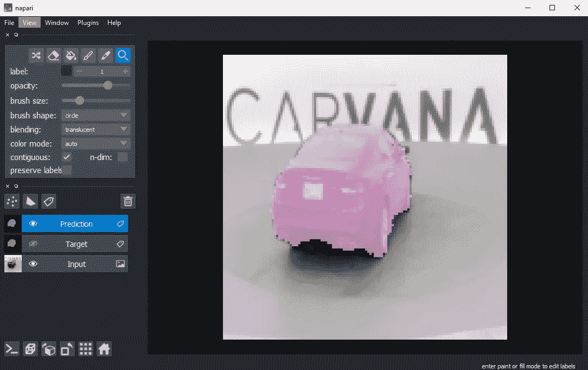
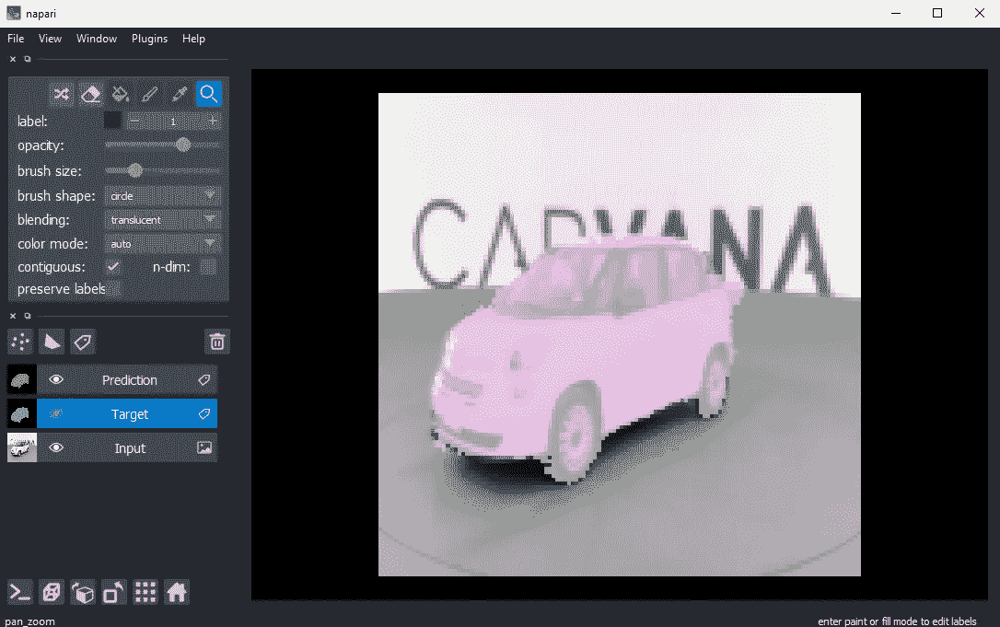
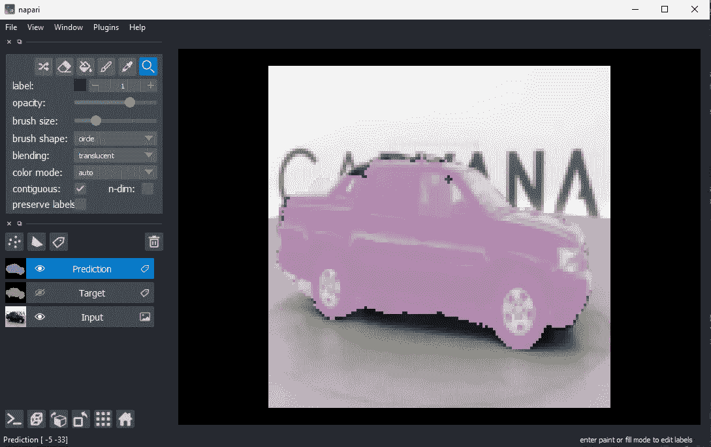

# 用 PyTorch 为 2D 创建和训练一个 U-Net 模型& 3D 语义分割:推理[4/4]

> 原文：<https://towardsdatascience.com/creating-and-training-a-u-net-model-with-pytorch-for-2d-3d-semantic-segmentation-inference-4-4-e52b074ddf6f?source=collection_archive---------20----------------------->

## PyTorch 和 U-Net 语义分割指南



作者图片

在[之前的章节](/creating-and-training-a-u-net-model-with-pytorch-for-2d-3d-semantic-segmentation-training-3-4-8242d31de234)中，我们构建了一个数据加载器，创建了一个可配置的 U-Net 模型，并开始使用 Carvana 数据集的样本进行训练。现在让我们用这个训练好的模型来预测一些网络没有看到的图像的分割图。你可以在这里找到 Carvana 数据集[的三幅图像。这部分的 Jupyter 笔记本可以在](https://drive.google.com/file/d/15APVesR0cgAO4soK5cGA0bg450Uj70qh/view?usp=sharing)[这里](https://github.com/johschmidt42/PyTorch-2D-3D-UNet-Tutorial/blob/master/Part4.ipynb)找到，GitHub repo [这里](https://github.com/johschmidt42/PyTorch-2D-3D-UNet-Tutorial)找到。

## 推理

为了进行推理，我们需要在数据通过网络之前对其进行一些转换。这包括线性缩放，改变维度的顺序(我们想要[C，H，W]而不是[H，W，C])和调整图像的大小。因此，我可以编写一个简单的`predict()`函数，它将图像作为`np.ndarray`、模型、预处理和后处理函数以及应该在其上执行推理的设备。输入图像经过预处理(第 11 行)，转换成`torch.tensor`，然后发送到设备(第 12 行)。然后通过输出逻辑的模型发送(第 14 行)。请注意，在 UNet 模型的末尾没有应用 Softmax 激活函数，因此必须添加它来进行推断(第 16 行)。结果应在之后进行处理(第 17 行)，以便可以在 [napari](https://napari.org/) 中或使用 [matplotlib](https://matplotlib.org/) 可视化。

让我们首先加载我们训练好的模型

```
import torch
from unet import UNet
# device
if torch.cuda.is_available():
    device = torch.device('cuda')
else:
    torch.device('cpu')

# model
model = UNet(in_channels=3,
             out_channels=2,
             n_blocks=4,
             start_filters=32,
             activation='relu',
             normalization='batch',
             conv_mode='same',
             dim=2).to(device)

model_name = 'carvana_model.pt'
model_weights = torch.load(pathlib.Path.cwd() / model_name)

model.load_state_dict(model_weights)
```

并用它来推断:

用`skimage.io.imread()`读取`get_filenames_of_path`得到的输入和目标路径，并存储在一个列表中:`images`和`targets`。因为训练是在缩小的图像上进行的，所以我将假设推理在类似的输入/质量下会工作得最好。因此，大小为 1918x1280x3 的输入和目标图像被调整为 128x128x3。在预处理函数中，我们只执行与对训练/验证数据执行的步骤相同的步骤，但没有增加。在后处理函数中，我们对输出执行`argmax`,因为我们不需要每个类的概率(软最大逻辑数)，而是预测类，即概率最高的类。我们依次使用模型进行推理来处理我们的图像，并将结果存储在列表`outputs`中。然后，我们可以再次使用 napari 来可视化结果，并将其与实际情况进行比较。

```
import napari

viewer = napari.Viewer()

idx = 0
img_nap = viewer.add_image(images_res[idx], name='Input')
tar_nap = viewer.add_labels(targets_res[idx], name='Target')
out_nap = viewer.add_labels(output[idx], name='Prediction')
```



预测不算太差，但也不算好。所以还有很大的提升空间！但是你能做些什么来改进你的模型呢？这是我想到的一些建议，当然这不是一个完整的列表:

*   应该对所有可用的数据进行训练，而不仅仅是我从数据集中挑选的 96 张图像。
*   每辆车有 16 幅图像，它们都应该出现在训练或验证数据集中，而不是两者都出现！请记住，验证数据集的目的是确定停止训练的时间。实施提前停止以找到合适的时间。
*   提高图像的分辨率。一般来说，更高分辨率的图像可以提取更多的特征。
*   增加更多的增强，而不仅仅是水平翻转。这人为地扩展了训练数据集的大小，这可能会使您的模型更健壮，更容易概括。
*   试验超参数！尝试不同的优化器，如 Adam 而不是 SGD，使用不同的激活函数，增加内核数量，使用不同的标准化层，不同的上采样方法等。
*   尝试骰子损失，而不是标准的 CrossEntropyLoss。或者两者结合使用！
*   考虑使用迁移学习来更快地学习任务。将 UNet 替换为在此处找到的[分段模型之一。这些模型(包括 UNet)可以有不同的主干，并在例如 ImageNet 上进行预训练。](https://github.com/qubvel/segmentation_models.pytorch)
*   使用联合交集(IoU)等评估指标来衡量特定数据集上模型的准确性。除了可视化结果，这将让你对你的模型有多好有更好的感觉。
*   尝试混合精度学习，以便能够增加批量大小，或者在处理很快填满内存的高分辨率图像时考虑使用梯度累积。

## 摘要

在这最后一部分，我们使用我们训练的模型对网络没有看到的图像进行预测(分割图)。推断基本上只是将图像数据传递给网络，而不计算梯度。人们只需确保输入满足网络要求。结果看起来很有希望，但还有改进的余地。

本教程旨在作为深度学习语义分割项目的起点和示例。我建议你去 Kaggle 下载完整的数据集，亲自看看你能训练你的模型到什么程度。你也可以使用现有的数据集，如 Cityscapes (2D)，2019 年肾脏肿瘤分割挑战(KiTS19，3D)等，启动自己的语义分割项目。或者创建您自己的数据集，您必须为其提供标签。正如您在本教程中所看到的，训练可以在简单的 PyTorch 中非常容易地进行。但是只有当你想学 PyTorch 的时候，你才应该这么做。一般建议使用更高级别的 API，如[闪电](https://github.com/PyTorchLightning/pytorch-lightning)、 [Fast.ai](https://www.fast.ai/) 或 [Skorch](https://github.com/skorch-dev/skorch) 。但是为什么呢？这个在这篇[文章](/efficient-pytorch-supercharging-training-pipeline-19a26265adae)里解释的很好。

你或许可以想象，如果你想将功能和特性，如日志记录、度量、提前停止、混合精度训练等整合到你的训练循环中，你最终会做别人已经做过的事情。然而，有可能你的代码不会像他们的一样好和稳定(hello spagetthi code)，你会花太多时间在集成和调试这些东西上，而不是专注于你的深度学习项目(hello me)。尽管学习一个新的 API 可能需要一些时间，但从长远来看，它可能会给你很大的帮助。

如果你想实现你自己的特性，看看这篇[文章](/deep-learning-model-training-loop-e41055a24b73)，使用回调和钩子。对于这个系列，我试图保持它非常简单，不使用开箱即用的解决方案。我已经用良好的 ol' PyTorch 实现了一个非常基本的数据处理管道/训练循环，它适用于 2D 和 3D 数据集。

好了，这个小教程就到这里。我希望你喜欢它，学到一些新的东西，并希望我可以让你更容易地开始你自己的深度学习细分项目。感谢您的阅读！

如果您有任何问题，请随时在 [LinkedIn](https://www.linkedin.com/in/johannes-schmidt-8789461bb/) 上联系我，或者在 [GitHub](https://github.com/johschmidt42/PyTorch-2D-3D-UNet-Tutorial) 上公开问题！

<https://johschmidt42.medium.com/membership> 