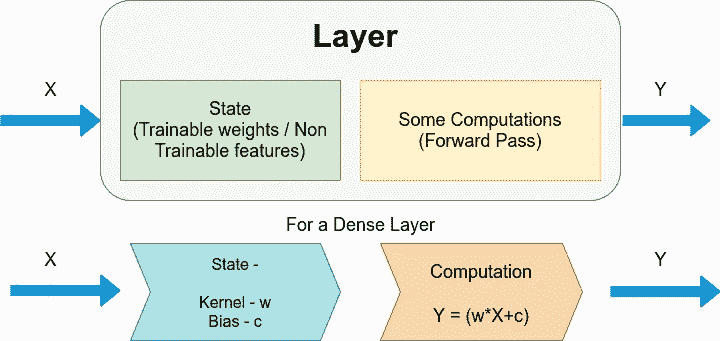
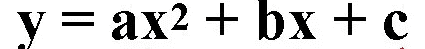

# 在 TensorFlow 2 中创建和训练自定义图层

> 原文：<https://towardsdatascience.com/creating-and-training-custom-layers-in-tensorflow-2-6382292f48c2?source=collection_archive---------18----------------------->

## 学习创建自己的自定义图层，并在 TensorFlow 2 中对其进行培训

1.  之前我们已经看到了如何创建自定义损失函数— [使用 TensorFlow 2](/creating-custom-loss-functions-using-tensorflow-2-96c123d5ce6c) 创建自定义损失函数
2.  接下来，我写了使用 Lambda 层创建自定义激活函数— [在 TensorFlow 2 中使用 Lambda 层创建自定义激活函数](/creating-custom-activation-functions-with-lambda-layers-in-tensorflow-691398b8a52d)

这是该系列的第三部分，我们创建自定义的密集层，并在 TensorFlow 2 中训练它们。

## **简介:**

Lambda 层是 TensorFlow 中的简单层，可用于创建一些自定义激活函数。但是 lambda 层有许多限制，尤其是在训练这些层的时候。因此，我们的想法是使用 TensorFlow 中的可继承 Keras 层来创建可训练的自定义层，特别关注密集层。

**什么是层？**



图一。图层-密集图层表示(来源:作者创建的图像)

层是一个类，它接收一些参数，通过状态和计算传递这些参数，并根据神经网络的要求传递输出。每个模型架构都包含多个层，无论是顺序的还是功能的 API。

***状态***——主要是在“model.fit”期间训练的可训练特征。在密集层中，状态构成权重和偏差，如图 1 所示。这些值会随着模型的训练而更新，以提供更好的结果。在某些层中，状态还可以包含不可训练的特征。

***计算*** —计算帮助将一批输入数据转换成一批输出数据。在该层的这一部分中，进行计算。在密集层中，计算执行以下计算—

*Y = (w*X+c)* ，返回 Y。

y 是输出，X 是输入，w =权重，c =偏差。

## **创建自定义密集层:**

现在我们知道了密集层内部发生了什么，让我们看看如何创建我们自己的密集层并在模型中使用它。

```
 **import tensorflow as tf
from tensorflow.keras.layers import Layer

class SimpleDense(Layer):

    def __init__(self, units=32):** *'''Initializes the instance attributes'''* **super(SimpleDense, self).__init__()
        self.units = units

    def build(self, input_shape):***'''Create the state of the layer (weights)'''* *# initialize the weights* **w_init = tf.random_normal_initializer()
        self.w = tf.Variable(name="kernel",   initial_value=w_init(shape=(input_shape[-1], self.units),
                 dtype='float32'),trainable=True)** *# initialize the biases* **b_init = tf.zeros_initializer()
        self.b = tf.Variable(name="bias",initial_value=b_init(shape=(self.units,), dtype='float32'),trainable=True)

    def call(self, inputs):***'''Defines the computation from inputs to outputs'''* **return tf.matmul(inputs, self.w) + self.b**
```

***上图*** 代码解释——类命名为 SimpleDense。当我们创建一个自定义层时，我们必须继承 Keras 的层类。这是在“class SimpleDense(Layer)”行中完成的。

***'__init__'*** 是类中第一个帮助初始化类的方法。“init”接受参数并将它们转换成可在类中使用的变量。这是从“层”类继承的，因此需要一些初始化。这种初始化是使用“super”关键字完成的。“units”是一个局部类变量。这类似于致密层中的单元数量。默认值设置为 32，但在调用该类时总是可以更改。

***‘建’***是类中的下一种方法。这用于指定状态。在密集层中，对于权重和偏差，所需的两个状态是“w”和“b”。当创建密集层时，我们不只是创建网络隐藏层的一个神经元，而是一次创建多个神经元(在这种情况下将创建 32 个神经元)。该层中的每个神经元都需要初始化，并被赋予一些随机权重和偏差值。TensorFlow 包含许多内置函数来初始化这些值。

为了初始化权重，我们使用 TensorFlow 的“random_normal_initializer”函数，它将使用正态分布随机初始化权重。“self.w”包含张量变量形式的权重状态。这些状态将使用“w_init”进行初始化。作为权重包含的值将采用“float_32”格式。它被设置为“可训练”，这意味着每次运行后，这些初始权重将根据损失函数和优化器进行更新。添加了“内核”这个名称，以便以后可以很容易地跟踪它。

为了初始化偏差，使用 TensorFlow 的“zeros_initializer”函数。这将所有初始偏置值设置为零。self . b’是一个张量，其大小与单元的大小相同(这里是 32)，并且这 32 个偏置项中的每一个最初都被设置为零。这也被设置为“可训练”，因此偏差项将随着训练的开始而更新。添加“偏差”这个名称是为了以后能够跟踪它。

***【call】***是执行计算的最后一个方法。在这种情况下，由于它是一个密集图层，它将输入乘以权重，加上偏差，最后返回输出。由于 self.w 和 self.b 是张量，而不是单个数值，因此使用“matmul”运算。

```
*# declare an instance of the class* **my_dense = SimpleDense(units=1)** *# define an input and feed into the layer* **x = tf.ones((1, 1)) 
y = my_dense(x)** *# parameters of the base Layer class like `variables` can be used* **print(my_dense.variables)**
```

***输出:***

```
[<tf.Variable 'simple_dense/kernel:0' shape=(1, 1) dtype=float32, numpy=array([[0.00382898]], dtype=float32)>, <tf.Variable 'simple_dense/bias:0' shape=(1,) dtype=float32, numpy=array([0.], dtype=float32)>]
```

***对上面*** 代码的解释——第一行创建了一个仅包含一个神经元(unit =1)的密集层。x(输入)是值为 1 的形状(1，1)的张量。Y = my_dense(x)，帮助初始化密集层。。“变量”帮助我们查看密集层内部初始化的值(权重和偏差)。

“my_dense.variable”的输出显示在代码块下方。它表明‘simple _ dense’中有两个变量叫做‘kernel’和‘bias’。内核‘w’被初始化为值 0.0038，一个随机正态分布值，偏差‘b’被初始化为值 0。这只是层的初始状态。一旦被训练，这些值将相应地改变。

```
**import numpy as np***# define the dataset* **xs = np.array([-1.0,  0.0, 1.0, 2.0, 3.0, 4.0], dtype=float) 
ys = np.array([-3.0, -1.0, 1.0, 3.0, 5.0, 7.0], dtype=float)  ** *# use the Sequential API to build a model with our custom layer* **my_layer = SimpleDense(units=1) 
model = tf.keras.Sequential([my_layer])** *# configure and train the model* **model.compile(optimizer='sgd', loss='mean_squared_error') model.fit(xs, ys, epochs=500,verbose=0) ** *# perform inference* **print(model.predict([10.0]))** *# see the updated state of the variables* **print(my_layer.variables)**
```

***输出:***

```
[[18.981567]][<tf.Variable 'sequential/simple_dense_1/kernel:0' shape=(1, 1) dtype=float32, numpy=array([[1.9973286]], dtype=float32)>, <tf.Variable 'sequential/simple_dense_1/bias:0' shape=(1,) dtype=float32, numpy=array([-0.99171764], dtype=float32)>]
```

***上面代码的解释***—上面使用的代码是一种非常简单的检查自定义层是否工作的方法。设置输入和输出，使用自定义层编译模型，最后训练 500 个历元。重要的是要看到，在训练模型之后，权重和偏差的值现在已经改变了。最初设置为 0.0038 的权重现在是 1.9973，而最初设置为零的偏差现在是-0.9917。

## 向自定义密集层添加激活函数:

以前我们创建了自定义密集层，但我们没有添加任何激活随着这一层。当然，要添加激活，我们可以在模型中单独写一行激活，或者添加一个 Lambda 层激活。但是，我们如何在上面创建的同一个自定义层中实现激活呢？

答案是对自定义密集层中的“__init__”和“call”方法进行简单的调整。

```
**class** **SimpleDense(Layer):**

    *# add an activation parameter* **  def __init__(self, units=32, activation=None):
        super(SimpleDense, self).__init__()
        self.units = units**

        *# define the activation to get from the built-in activation layers in Keras* **self.activation = tf.keras.activations.get(activation)**

    **def** **build(self, input_shape):** **w_init = tf.random_normal_initializer()
        self.w = tf.Variable(name="kernel",
            initial_value=w_init(shape=(input_shape[-1], self.units),dtype='float32'),trainable=True)** **b_init = tf.zeros_initializer()
        self.b = tf.Variable(name="bias",
            initial_value=b_init(shape=(self.units,), dtype='float32'),trainable=True)
        super().build(input_shape)**

 **def call(self, inputs):**

        *# pass the computation to the activation layer* **  return self.activation(tf.matmul(inputs, self.w) + self.b)**
```

***上图*** 的代码解释——大部分代码和我们之前用的代码一模一样。

要添加激活，我们需要在“__init__”中指定我们需要激活。一个字符串或者一个激活对象的实例可以被传递到这个激活中。它默认设置为 None，所以如果没有提到激活函数，它不会抛出错误。接下来，我们必须将激活函数初始化为“TF . keras . activations . get(activation)”。

最后的编辑是在“调用”方法中，在计算权重和偏差之前，我们需要添加自激活来激活计算。所以现在回报是计算和激活。

## 在 mnist 数据集上激活的自定义密集层的完整代码:

```
 **import** **tensorflow** **as** **tf**
**from** **tensorflow.keras.layers** **import** **Layer****class** **SimpleDense(Layer):** **def __init__(self, units=32, activation=None):
        super(SimpleDense, self).__init__()
        self.units = units**

        *# define the activation to get from the built-in activation layers in Keras***self.activation = tf.keras.activations.get(activation)**

    **def** **build(self, input_shape):****w_init = tf.random_normal_initializer()
        self.w = tf.Variable(name="kernel",
            initial_value=w_init(shape=(input_shape[-1], self.units),dtype='float32'),trainable=True)****b_init = tf.zeros_initializer()
        self.b = tf.Variable(name="bias",
            initial_value=b_init(shape=(self.units,), dtype='float32'),trainable=True)
        super().build(input_shape)**

 **def call(self, inputs):**

        *# pass the computation to the activation layer***return self.activation(tf.matmul(inputs, self.w) + self.b)****mnist = tf.keras.datasets.mnist

(x_train, y_train),(x_test, y_test) = mnist.load_data()
x_train, x_test = x_train / 255.0, x_test / 255.0**# build the model **model = tf.keras.models.Sequential([
    tf.keras.layers.Flatten(input_shape=(28, 28)),***# our custom Dense layer with activation* **SimpleDense(128, activation='relu'),
    tf.keras.layers.Dropout(0.2),
    tf.keras.layers.Dense(10, activation='softmax')
])***# compile the model* **model.compile(optimizer='adam',
              loss='sparse_categorical_crossentropy',
              metrics=['accuracy'])***# fit the model* **model.fit(x_train, y_train, epochs=5)
model.evaluate(x_test, y_test)**
```

使用我们的自定义密集层和激活来训练模型，训练准确率为 97.8%，验证准确率为 97.7%。

## 结论:

这是在 TensorFlow 中创建自定义图层的方法。尽管我们只看到密集层的工作，但它可以很容易地被任何其他层所取代，例如执行以下计算的二次层——

它有 **3 个状态变量** : *a，b，c，*

计算:



**用二次层替换密集层:**

```
**import** **tensorflow** **as** **tf**
**from** **tensorflow.keras.layers** **import** **Layer****class** **SimpleQuadratic(Layer):**

    **def __init__(self, units=32, activation=None):** *'''Initializes the class and sets up the internal variables'''*

       ** super(SimpleQuadratic,self).__init__()
        self.units=units
        self.activation=tf.keras.activations.get(activation)**

   ** def build(self, input_shape):** *'''Create the state of the layer (weights)'''*

        **a_init = tf.random_normal_initializer()
        a_init_val = a_init(shape=(input_shape[-1],self.units),dtype= 'float32')
        self.a = tf.Variable(initial_value=a_init_val, trainable='true')

        b_init = tf.random_normal_initializer()
        b_init_val = b_init(shape=(input_shape[-1],self.units),dtype= 'float32')
        self.b = tf.Variable(initial_value=b_init_val, trainable='true')

        c_init= tf.zeros_initializer()
        c_init_val = c_init(shape=(self.units,),dtype='float32')
        self.c = tf.Variable(initial_value=c_init_val,trainable='true')**

   ** def call(self, inputs):** *'''Defines the computation from inputs to outputs'''* **    x_squared= tf.math.square(inputs)
        x_squared_times_a = tf.matmul(x_squared,self.a)
        x_times_b= tf.matmul(inputs,self.b)
        x2a_plus_xb_plus_c = x_squared_times_a+x_times_b+self.c

        return self.activation(x2a_plus_xb_plus_c)****mnist = tf.keras.datasets.mnist

(x_train, y_train),(x_test, y_test) = mnist.load_data()
x_train, x_test = x_train / 255.0, x_test / 255.0

model = tf.keras.models.Sequential([
  tf.keras.layers.Flatten(input_shape=(28, 28)),
  SimpleQuadratic(128, activation='relu'),
  tf.keras.layers.Dropout(0.2),
  tf.keras.layers.Dense(10, activation='softmax')
])

model.compile(optimizer='adam',
              loss='sparse_categorical_crossentropy',
              metrics=['accuracy'])

model.fit(x_train, y_train, epochs=5)
model.evaluate(x_test, y_test)**
```

这个二次层在 mnist 数据集上给出了 97.8%的验证准确率。

因此，我们可以实现我们自己的层，并根据需要激活 TensorFlow 模型，以编辑甚至提高整体精度。