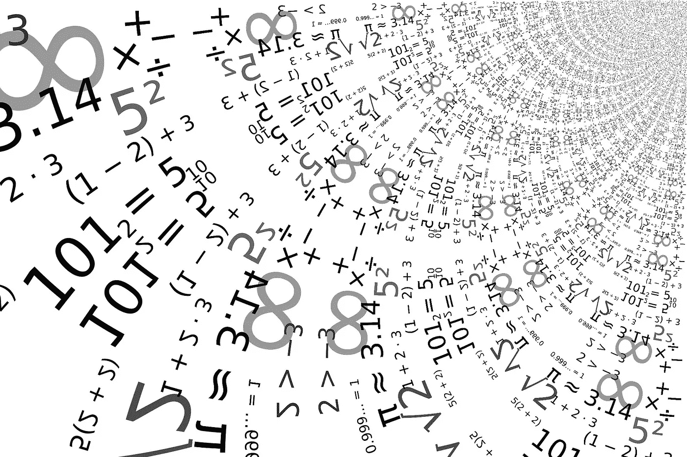

# 创建和使用分位数规格化器

> 原文：<https://towardsdatascience.com/creating-and-using-a-quantile-normalizer-5f4ea0332b6f?source=collection_archive---------34----------------------->

## 创建并使用分位数规格化器，然后将其性能与 z 分数规格化器进行比较。



(src =[https://pixabay.com/images/id-937884/](https://pixabay.com/images/id-937884/)

# 介绍

在数据科学和数据工程的奇妙世界中，能够处理数据的概念非常重要。典型格式的数据是不干净的，几乎任何模型都难以处理。这是数据科学缺乏自动化的一个重要因素，因为需要大量的观察来诊断和反复修复数据。此外，问题有时写得不清楚，很难发现数据中的一些问题。

经常观察到的连续值的一个问题是方差和数据的数量。当然，有几个很好的方法可以纠正甚至注意到这个问题。然而，我今天想看的方法是分位数法。我认为这是一个非常不寻常的方法，但我不认为这样做是正确的。

> [笔记本](https://github.com/emmettgb/Emmetts-DS-NoteBooks/blob/master/Julia/QuantileNormalizer.ipynb)

# 什么是分位数？

当然，为了使用分位数转换器或分位数规格化器，我们首先需要理解什么是分位数。分位数是数据中基于数字索引位置的逻辑点。考虑到这一点，这与用平均方法做同样的事情有着显著的区别和有趣的关系。最熟悉的分位数的一个例子是中位数。中位数也称为第二分位数。有两个额外的标记分位数，分位数 1，记录在 25%的指数上，同样记录在 75%的指数上。因为我们没有计算这种东西的函数，所以我们需要写一个。我将通过创建两个新参数来开始一个函数，x，它将是我们想要找到其分位数的数组，然后 q. Q 将是数据中的分割点。我还允许为这个参数提供一个数字和一个浮点数。

```
function quantile(x::Array, q::Real = .5)
```

接下来，我将为 Q1–Q3 创建一个带有数字键的新字典。这将允许我们简单地索引我们的字典，因此用户可以在这里提供整数和浮点数。当然，这也可以用多重分派来解决，但是我认为重要的是要注意，我们只是使用字典将这些数字转换成浮点数。

```
qdict = Dict(1 => .25, 2 => .5, 3 => .75)if q >= 1tryq = qdict[q]catchthrow(ArgumentError(" The quantile parameter is not set to a percentage, or quantile!"))endend
```

现在，如果我们的数字恰好在“qdict”中，我们的 q 参数将被设置为等于给定分位数的正确对应分数。如果这个值不在我们的字典中，但也大于 1，那么我们将抛出。基本上，使用这部分代码是为了既可以调用分位数 2–4，也可以调用具有任何特定级别的未标记分位数的浮点数。接下来，我们将对数组进行排序，这对于获得正确的数值距离至关重要。之后，我们会得到数组的长度。

```
sorted = sort(x)div = length(x)
```

最后，我们将索引我们的长度和我们选择的舍入长度的乘积，以便找到数组位置的特定部分:

```
return(x[Int64(round(div * q))])end
```

我们的最终分位数函数看起来有点像这样:

```
function quantile(x::Array, q::Real = .5)qdict = Dict(1 => .25, 2 => .5, 3 => .75)if q >= 1tryq = qdict[q]catchthrow(ArgumentError(" The quantile parameter is not set to a percentage, or quantile!"))endendsorted = sort(x)div = length(x)return(x[Int64(round(div * q))])end
```

现在我们可以通过调用第二个分位数或. 5 来创建一个中值函数:

```
median(x) = quantile(x, .5)
```

# 分位数标准化器

在我们使用分位数规格化器之前，我们需要了解它是如何工作的。这个规格化器背后的原理是，设置在第三分位数和第一分位数以下的值可能有点像异常值。我还将使用参数使位置可编辑。然后我会把这些数字插入到我们的分位数方法调用中。

```
mutable struct QuantileNormalizer <: LatheObjectq1q3function QuantileNormalizer(x::Array, lower::Float64 = .25, upper::Float64 = .75)q1 = quantile(x, lower)q3 = quantile(x, upper)endend
```

现在让我们修改这个内部构造函数来实际创建这个类型，以及一个真正的函数来计算一些东西。考虑到这一点，我向我们的 struct 添加了一段新数据，然后通过调用所述函数来完成这个构造函数，然后将它放入我们的 new()方法中。

```
mutable struct QuantileNormalizer <: LatheObjectq1::Realq3::Realpredict::Functionfunction QuantileNormalizer(x::Array, lower::Float64 = .25, upper::Float64 = .75)q1 = quantile(x, lower)q3 = quantile(x, upper)predict(x::Array) = qn_pred(x, q1, q3)new(q1, q3, predict)end
```

最后，最后一个组件是在新的 qn_pred()函数中规范化数据。下面是我想到的函数，它使用一个带有条件语句的迭代循环:

```
function qn_pred(x, q1, q3)[if i > q3 x[current] = q3 elseif i < q1 x[current] = q1else x[current] = i end for (current, i) in enumerate(x)]end
```

让我们快速检查一下这实际上会对一些数据产生什么影响:

```
x = [5, 10, 15, 20, 25, 30, 35, 40, 45, 50]5
 10
 15
 20
 25
 30
 35
 40
 45
 50
```

第一步是用这个数据做一个规格化器，像这样:

```
normalier = QuantileNormalizer(x)
```

最后，我们将它预测回我们的阵列:

```
normaledx = normalier.predict(x)10
 10
 15
 20
 25
 30
 35
 40
 40
 40
```

我们看到我们较低的数字变成了较大的数字，而我们较高的数字变成了最小的数字。这将有助于保持数据集中。这使我们能够显著改变数据的方差，而对平均值基本没有影响，这对于保持连续数据的一致性是不可或缺的:

```
using Lathe.stats: meanprintln(mean(x))println(mean(normaledx))26.5
26.5
```

# 结论

在统计和度量的世界中，分位数度量是一个非常酷的度量，但也经常被使用不足。分位数可以告诉我们许多关于数据间距的信息，这是处理数据时需要理解的一件非常重要的事情。我认为这个分位数归一化器肯定会派上用场，尽管它的应用可能更适合正态分布或标准标度的数据。无论如何，在这篇文章中，我只想写一个，然后继续展示它。记住这一点，非常感谢您的阅读；它对我来说意味着一切！