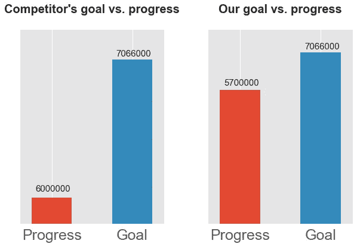
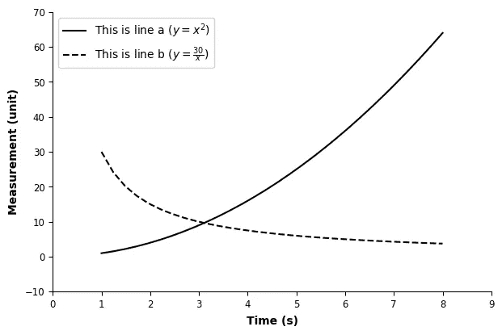
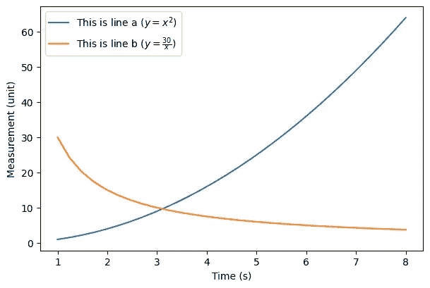
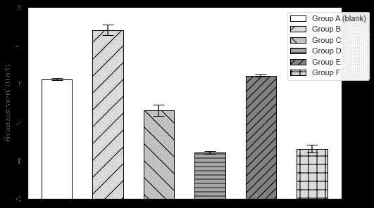
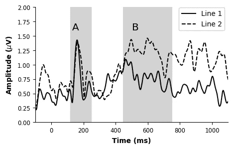
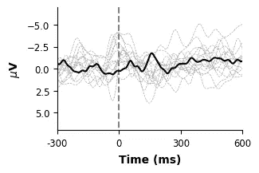

# 用最少的代码在 Python 中创建 APA 样式的绘图

> 原文：<https://towardsdatascience.com/creating-apa-style-plots-in-python-e8adddc3421?source=collection_archive---------57----------------------->

## 完全基于 Python 的心理学研究管道的最后一步


[绿色变色龙](https://unsplash.com/@craftedbygc?utm_source=unsplash&utm_medium=referral&utm_content=creditCopyText)在 [Unsplash](https://unsplash.com/collections/3525469/education?utm_source=unsplash&utm_medium=referral&utm_content=creditCopyText) 上的照片

## APA 是什么？

APA 是一个神奇的词，很可能是你阅读这篇文章的原因。

像许多心理学学生一样，我学会了如何收集、分析和解释数据。但这还不是全部。

如果你读过这些教程，你可能会有同感。在这些教程中，准心理学家学会掌握引用研究论文的艺术，加上牛津逗号，以及构成一篇好的心理学论文的其他一切。(关于通用预约定价安排的更多信息:【APA.org】T4。)

心理学(和其他实验科学)教育让学生们有能力以最好的方式(*阅读:最清晰的*)解释和呈现数据。这里有一个反例:



为灌输虚假信心而制造的欺骗性阴谋(作者图片，灵感来自[梅塔和古兹曼](https://doi.org/10.23860/JMLE-2018-10-2-6))

通过省略轴值和*巧妙地*操纵轴起点，不知情的读者可能会被骗以为竞争对手失败了。虽然这看起来像是一个高度人为的例子，但真实的案例在媒体中比比皆是。

当你花了几年时间学习如何设计无偏见的实验，收集适当的数据，并进行无偏见的分析时，你最不希望的事情就是以一种分散——或者更糟的是欺骗——你的读者的方式呈现结果。

研究中的数据可视化不仅仅是拥有漂亮的图表，也不意味着改变观点。因此，APA 的指导方针已经到位，以促进无偏见的数据呈现，传递真实的信息。

## 为什么是 Python？

鉴于对样式和格式的强调，基本的数据可视化(想想 Excel 中自动生成的图表)不被认可就不足为奇了。清晰度和美感—*风格—* 必须与来之不易的数据相称。

这就是 Python 和 R 出现的原因。如果您可以使用 R 和 ggplot2 包，那么设计一个您想要的美学定制的图形应该不成问题。

但是如果你可以用 Python 做同样的事情呢？毕竟，越来越多的实验是用 Python 设计和运行的(例如，参见 psychopy 和 pygame ),而不是使用专有的实验软件。开源软件包提供了更多的统计分析。想象一下，有一个完整的管道，您可以在其中收集、分析和可视化数据，所有这些都在一个工具中完成。很神奇，不是吗？另外，它开辟了新的职业机会；)

与使用简单图形用户界面创建图形的软件相比，使用 Python 和 R 代码的一些优势包括:

1.  **准确性**:用代码进行数据分析和可视化，不容易出现人工错误。(错误仍然会发生，但也更容易被发现和纠正。)例如，在一个图形上，你不可能意外地把你的对照组标为实验组。
2.  **便利**:从长远来看，你节省了时间。代码可重复用于相同的分析，即使是在多年以后。
3.  **开放科学**:分享实验程序和数据分析代码的能力将极大地帮助你的读者和任何对复制你的工作感兴趣的人。快速浏览脚本后，任何错误都会变得明显，正确的实现也是如此。

## 你能实现什么？

美丽的情节，可以传达和突出你的结果，在几行代码内完成。创建自定义的“APA style”样式表后，样式将在后台完成。

这里有一个例子:

```
import matplotlib
import matplotlib.pyplot as pltmatplotlib.style.use(matplotlib.get_data_path()+'/stylelib/apa.mplstyle') # selecting the style sheetx = np.linspace(1., 8., 30) # create dummy dataplt.figure()
plt.plot(x, x**2, label=r'This is line a ($y=x^2$)')
plt.plot(x, 30/x, label = r'This is line b ($y=\frac{20}{x}$)')
plt.xlabel('Time (s)')
plt.ylabel('Measurement (unit)')
plt.legend()
```



APA 样式线图示例(图片由作者提供)

与使用相同代码但不使用自定义样式表的绘图相比:



默认样式线图示例(作者提供的图片)

matplotlib 附带了相当多的样式表。你可以在这里[看看它们，或者自己测试一下:](https://matplotlib.org/3.1.0/gallery/style_sheets/style_sheets_reference.html)

```
import matplotlib
print(matplotlib.style.available)matplotlib.style.use('seaborn') # or any other style
```

虽然这种现成的款式确实很漂亮，但除了“灰度”、“seaborn-colorblind”和“tableau-colorblind”之外，大多数都使用了不太容易接近的颜色。

但是我们可以做得更好。[建议](https://apastyle.apa.org/style-grammar-guidelines/tables-figures/colors)“结合色彩使用图案，使元素的区分不仅仅依靠色彩。”在让情节更容易出版的同时，加入你的个人风格也没有坏处。

下面是它可能的样子，稍微详细一点:



APA 样式条形图示例(图片由作者提供)

对于神经心理学中的梅西耶图:



用 ax.vlines 添加阴影，用 ax.annotate 添加注释(图片由作者提供)



带 ax.vlines 的垂直虚线和多条线以及它们的平均值(图片由作者提供)

所有的数据和标签都被故意混淆了。

## 如何创建样式表？

matplotlib 文档[解释了这一切](https://matplotlib.org/3.3.3/tutorials/introductory/customizing.html)。以下是基本步骤:

1.  创建一个空白的纯文本文件，并将其命名为 YOUR_CHOICE.mplstyle(在我的例子中是 apa.mplstyle)。记住你把这个文件放在哪里，例如，在你的 matplotlib 路径中。
2.  在这个文件中写下你想要定制的所有方面。浏览文档或你的 [matplotlibrc](https://matplotlib.org/3.3.3/tutorials/introductory/customizing.html#the-matplotlibrc-file) 文件以获得灵感。
3.  打开 Python IDE，导入 matplotlib，选择样式表，然后像平常一样开始绘图。

```
import matplotlib
import matplotlib.pyplot as pltmatplotlib.style.use(matplotlib.get_data_path()+'/stylelib/apa.mplstyle') # selecting the style sheet
```

一些想法:

```
font.family:  sans-serif # APA requires sans-serif fontfigure.titleweight: bold # weight of the figure titleaxes.facecolor:  white   # figure background coloraxes.spines.top:    False # remove top axis (the "frame")
axes.spines.right:  False # remove right axis (the "frame")
axes.spines.bottom: True  # only display the x axis on the bottom
axes.spines.left:   True  # only display the y axis on the leftsavefig.format:     svg   # save as vector image by default
```

另一个有用的工具是`cycler`，它允许完全控制线条类型和颜色，所以你可以有黑色实线、黑色虚线等等。，直到循环结束:

```
axes.prop_cycle: cycler('color', ['k', 'k', '0.5', '0.5', 'b', 'b', 'r', 'r']) + cycler('linestyle', ['-', '--', ':', '-.','-', '--',':', '-.']) # 'k' for black, 'r' for red, '0.5' for midgray
```

我已经把我最后的 apa.mplstyle 文件[放在这里了，](https://github.com/sollan/apa.mplstyle)它一点也不完美，也不完整(我在假期不得不做几十个纸图的时候匆忙做的)，但它可能是一个好的开始(请让我知道你的改进想法！)

希望这有助于更容易地将 Python 整合到您的研究管道中，我希望您能像我一样喜欢处理数据。