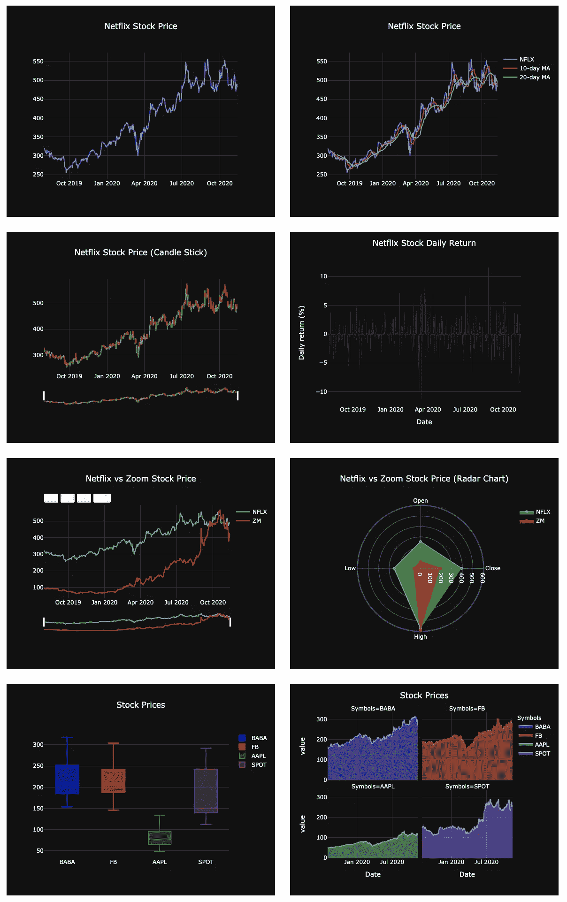
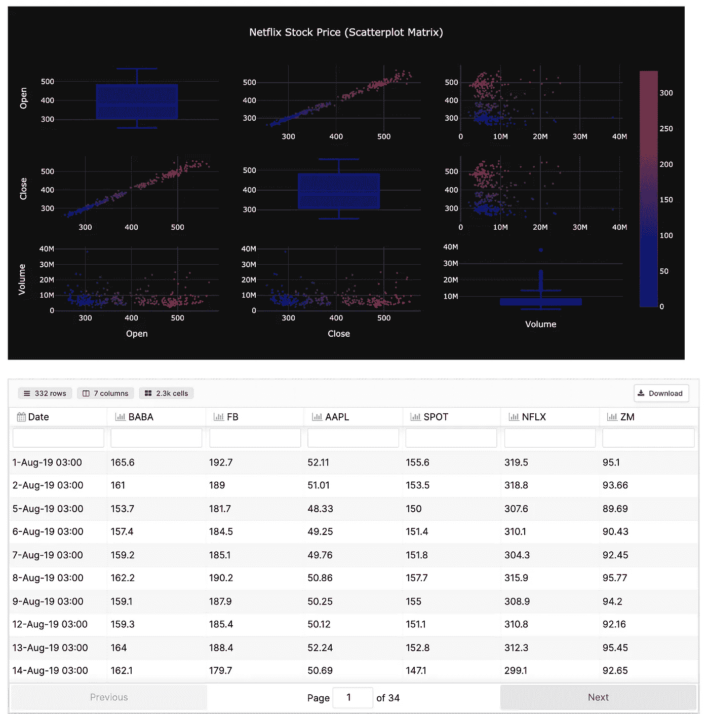

# 使用 Plotly、Datapane 和 GitHub 操作创建自动化 Python 仪表板

> 原文：<https://towardsdatascience.com/creating-automated-python-dashboards-using-plotly-datapane-and-github-actions-ff8aa8b4e3?source=collection_archive---------2----------------------->

[来源](https://haberler.boun.edu.tr/tr/haber/dunya-kentlerini-gezen-duvarlarin-otesinde-projesi-bogazicinde)

今天，大多数在线数据科学课程都教你机器学习和深度学习；您将学习如何优化超参数，而不是 SQL、数据分析、报告、云服务等基础知识。但在现实世界中，分析数据，学习如何“自动化枯燥的东西”，创建 ETL 管道和仪表板，并引导利益相关者或客户走上正确的道路，往往会带来更多的价值。更多的数据团队失败是因为数据科学从未影响业务决策，而不是因为他们的模型没有优化。

在现实世界中，数据科学家面临的问题不仅仅是如何调整 ML 模型和比较指标，就像他们在 Kaggle 比赛中一样。他们面临的问题是被困在当地的 Jupyter 笔记本上，无法与使用他们分析的人联系。如果我们构建的数据产品(如 ML 模型、自动化平台或报告)对利益相关者或客户的决策过程没有帮助，我们就会失去最初的“存在理由”

> 高层主管对数字和见解感兴趣；而不是你在神经网络中使用的激活函数。

好的数据产品的主要驱动因素是与业务单元协作并定期获得反馈。你**越积极**参与决策过程，你就越了解如何检验假设和解决“真正的”问题，而不是教科书上的问题。在一天结束时，你的发现和故事将转化为推动结果的行动。

不幸的是，你不能把你的笔记本发给一个利益相关者，然后期望他们自己理解并运行它。这意味着，在许多公司中，您会收到一封来自业务部门的电子邮件，其中包含一个请求，重新运行 Jupyter 笔记本，然后手动构建 PowerPoint 或 Excel 电子表格。这种手动流程意味着数据科学家是洞察的瓶颈，他们花费大量时间手动构建报告，而不是解决难题。

处理问题的第一步也是关键的一步是创建 KPI 和精心制作的自动化报告和仪表板，它们可以提供价值，并消除您参与每个问题或数据刷新的需要。在与利益相关者(产品、增长、营销经理等)集思广益并与工程师合作后，您可以开始这个过程。幸运的是，Python 生态系统提供了一些方便的工具来构建工作流。

在本文中，我们将使用 Python 通过 **pandas datareader** 实时拉动股票市场价格，并使用 **Plotly** 和 **Datapane** 创建一个交互式报告。然后我们将使用 **GitHub actions** 来触发我们的代码每天运行以更新我们的报告。

每天早上 6 点(UTC)创建自动化仪表板有 4 个步骤:

1.  为我们的可视化创建 Plotly 函数

2.使用 Datapane 的库在 Python 中创建报告

3.为 GitHub 操作编写一个. yml 文件

4.在线分享报告或将其嵌入博客

**Plotly** 是一个开源库，可以轻松创建交互式可视化。

**Datapane** 是一个开源框架，帮助我们轻松地与团队成员和利益相关者分享见解，而不需要第三方 BI 工具或 web 服务。

**Github Actions** 是一个运行代码的自动化平台，它使得直接在您的 Github 存储库中创建定制的软件开发生命周期工作流变得非常容易。

1.  **为仪表板创建 Plotly 函数**

*   创建了一个网飞股票价格散点图
*   添加了 10 天、20 天移动平均线
*   更新的标题布局

**2。为报告创建数据面板功能**

*   所有数字相加
*   定义的列和行

你可以接触到 GitHub 回购中的所有数字。

有关布局和定制的更多详细信息，请阅读文档。

<https://docs.datapane.com/reports/layout-and-customization>  

**3。为 GitHub 动作编写一个. yml 文件**

*   新增要求(熊猫-阅读器)
*   计划的 cron 作业(每天早上 6 点)
*   添加了脚本和令牌

有关构建 GitHub 动作的更多详细信息，请阅读文档。

<https://github.com/marketplace/actions/datapane-build>  

**4。在线分享报告或将其嵌入博客**

[https://datapane.com/u/kaan/reports/stock-analysis/](https://datapane.com/u/kaan/reports/stock-analysis/)

[https://github . com/data pane/gallery/blob/master/stock-reporting/stocks . ipynb](https://github.com/datapane/gallery/blob/master/stock-reporting/stocks.ipynb)

如果你有任何问题，你可以通过推特或 LinkedIn 联系我。