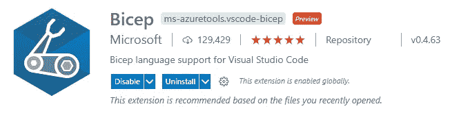
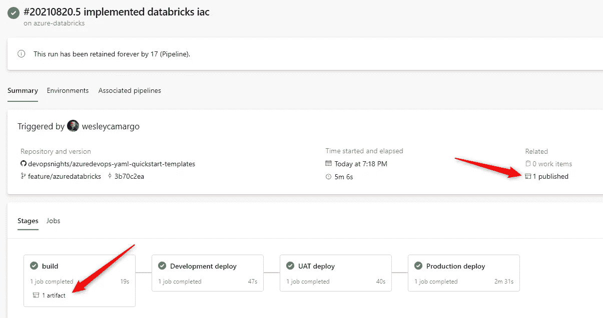
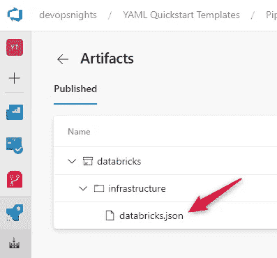

# 使用 Bicep 和 Azure DevOps YAML 管道创建 Azure 数据块

> 原文：<https://towardsdatascience.com/creating-azure-databricks-with-bicep-and-azure-devops-yaml-pipelines-4bf85be30cc7?source=collection_archive---------20----------------------->

## 继续 DataOps 自动化系列，在这篇文章中，我将演示如何使用基础设施作为代码，通过 Bicep 和 Azure DevOps YAML 管道在 Azure 中部署它，来创建您的 Databricks 工作区。我们去看看吧！


由[本杰明·乔朋](https://unsplash.com/@benjopen?utm_source=unsplash&utm_medium=referral&utm_content=creditCopyText)在 [Unsplash](https://unsplash.com/s/photos/brick-construction?utm_source=unsplash&utm_medium=referral&utm_content=creditCopyText) 拍摄的照片

在之前的文章中，您可以查看如何[使用 Bicep](/dataops-automation-creating-azure-data-factory-with-git-integration-using-bicep-376fd3b5bc81) 创建具有 git 集成的 Azure 数据工厂，以及为 Azure 数据工厂创建 CI/CD 管道的最简单的方法

在文章的最后，你可以检查一个完整的 YAML 管道阅读使用！

# 什么是二头肌模板？

如果您不熟悉 Bicep，这是一个用于 ARM 模板的 DSL，它具有更清晰的语法、对模块更好的支持以及其他出色的特性。它还有一个很好的 [Visual Studio 代码扩展](https://docs.microsoft.com/en-us/azure/azure-resource-manager/bicep/quickstart-create-bicep-use-visual-studio-code?tabs=CLI&WT.mc_id=devops-34401-jagord)，在从头构建模板方面帮助很大。



Visual Studio 代码的很好的扩展！—图片来自[微软文档](https://docs.microsoft.com/en-us/azure/azure-resource-manager/bicep/install#development-environment)

当您使用 bicep 模板运行部署时，它会转换文件并生成本机 ARM 模板，类似于 Typescript 和 Javascript 之间发生的情况。

如果你想了解更多，查看官方文档[这里](https://docs.microsoft.com/en-us/azure/azure-resource-manager/bicep/overview)。

# 将基础设施创建为 Azure 数据块的代码

## 使用 Azure CLI 创建资源组

要部署我们的 Databricks 工作区，我们需要在您的 Azure 订阅中创建一个资源组。最简单的方法是通过 Azure CLI。为此，您需要使用命令`az login`登录，然后运行以下命令:

```
az group create -name RG-Databricks -location northeurope
```

将参数名称和位置替换为最适合您需求的名称和位置。

## 为 Azure 数据块创建 Bicep 模板

Azure Databricks 的 Bicep 模板非常简单，有 4 个主要部分:

**参数:**

*   工作区名称:如果您不提供值，它将使用一个`uniqueString`函数，这将确保它总是相同的，因为这是基于资源组 id 的。
*   位置:默认情况下，这是使用资源组位置
*   SKU:默认值是试用，所以请务必在您的现实生活场景中替换它；).

**变量:**模板也有变量`managedResourceGroupName`。该资源组将由 Azure Databricks 管理，以便稍后创建您的集群。

**资源:**这里我们只有一个资源，即 Databrics 工作区。这是消费 API 版本`2018–04–01`。

**输出:**这个部分包含了您需要公开的变量。这意味着它们可以在部署过程的后期被其他过程访问。

# 使用 Azure DevOps YAML 管道部署 Bicep

## 构建二头肌模板

正如我之前所说，将二头肌模板移植到手臂模板中是可能的。因此，为了确保我们的模板是有效的，让我们这样做！

为了构建它，您还将使用 Azure CLI。命令也很简单:

```
az bicep build --file <your file> --outdir <your directory>
```

为了创建 Azure DevOps YAML 管道，我们将在 AzureCLI 任务中运行上面的命令:

将二头肌移植到手臂模板后，它将作为部署人工制品部署，读取以供使用:



作者准备的图像



作者准备的图像

构建您的二头肌是一个很好的实践，因为您可以验证其中没有错误，并收集所有需要部署的文件。

## 使用 YAML 管道部署 Bicep

有了构建步骤中生成的工件，现在我们就可以在我们的环境中部署它们了。为此，有必要在构建 YAML 中再添加一个阶段，其中包含运行 ARM 模板的指令:

它使用负责将 ARM 模板运行到 Azure 订阅中的任务`AzureResourceManagerTemplateDeployment@3`。你可以在这里获得关于这个任务[的更多信息。](https://docs.microsoft.com/en-us/azure/devops/pipelines/tasks/deploy/azure-resource-group-deployment?view=azure-devops)

这个阶段代表发展阶段。要在其他环境中部署它，您只需复制它并根据您的环境替换值:)

# 现实生活中的例子

为了在更现实的情况下检查这些例子，我一直在 GitHub 存储库中工作，其中有一些管道配置和工作的例子。你可以在 DevOps Nights GitHub 这里查看:[DevOps Nights/azuredevops-YAML-quick start-templates(github.com)](https://github.com/devopsnights/azuredevops-yaml-quickstart-templates)

# 数据布里克斯 YAML 管道公司

正如下面所承诺的，你可以检查一个完整的 Azure DevOps YAML 管道配置和工作:

# 结论

Bicep 已经成为 Azure 的一个非常相关的工具，并且很有可能成为 Azure 中基础设施的默认工具。所以现在就开始熟悉吧，以后会很有关系的:)

我希望这篇文章能帮到你，下次再见！