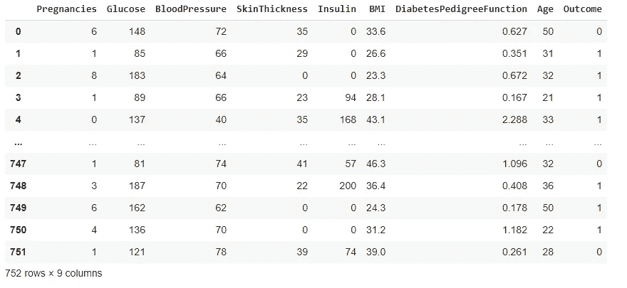
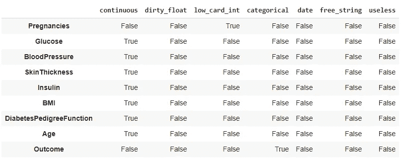
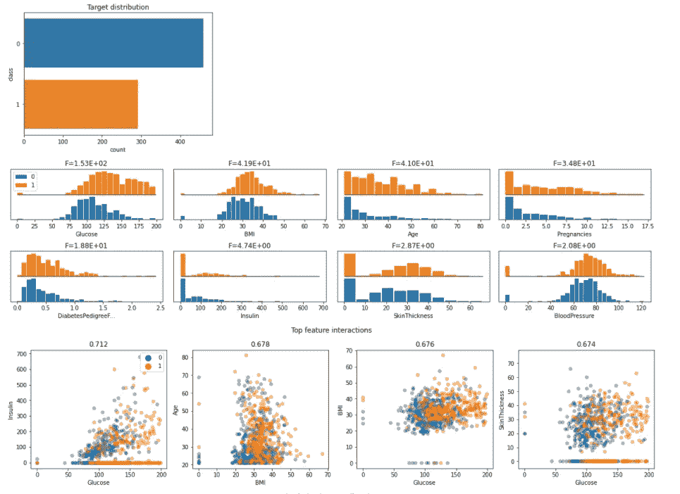
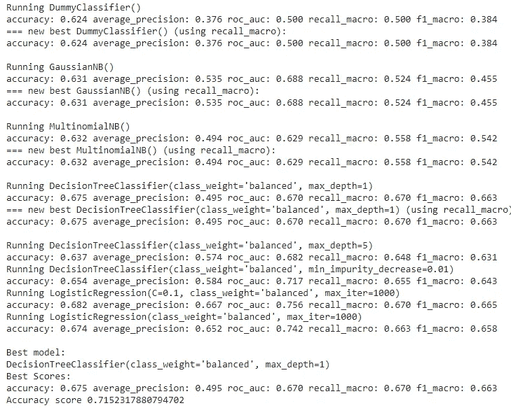

# 创建基线机器学习模型

> 原文：<https://towardsdatascience.com/creating-baseline-machine-learning-models-d40c99243311?source=collection_archive---------32----------------------->

## 使用 Dabl 进行数据预处理和机器学习建模


[Firmbee.com](https://unsplash.com/@firmbee?utm_source=medium&utm_medium=referral)在 [Unsplash](https://unsplash.com?utm_source=medium&utm_medium=referral) 上拍照

创建机器学习模型包括许多预处理，其中我们操纵特征和目标变量来为机器学习模型准备数据。这种预处理包括检查数据中是否有丢失的值，清除垃圾值，以及可视化数据以进行探索性的数据分析。

在对数据执行所有这些操作之后，我们开始新的努力，以创建一个具有更高准确性和良好性能的机器学习模型。为了做到这一点，我们首先创建不同的机器学习模型，然后选择性能最佳的模型作为基线模型。

如果我告诉你，你可以在几行代码中完成所有这些，并节省你的时间和精力来优化你的模型，会怎么样？是的，Dabl 可以做到这一切。它是一个开源 python 库，用于执行数据预处理、数据可视化和创建基线模型。

让我们开始吧…

# 安装所需的库

我们将从使用 pip 安装 Dabl 开始。下面给出的命令可以做到这一点。

```
pip install dabl
```

# 导入所需的库

在这一步中，我们将导入加载数据、执行 EDA 以及为该数据集创建基线模型所需的库。

```
import dabl
import pandas as pd
from sklearn.model_selection import train_test_split
from sklearn.datasets import load_digits
```

# 正在加载数据集

在这篇文章中，我们将使用著名的糖尿病数据集，可以很容易地从网上下载。

```
df = pd.read_csv("Diabetes.csv")
```

# 预处理数据

在这一步中，我们将使用 Dabl 的 clean 函数清理数据，并找出所有特征和目标变量的数据类型。

```
dia_clean = dabl.clean(df, verbose=0)
```



干净的数据(来源:作者)

```
types = dabl.detect_types(dia_clean)
types
```



数据类型(来源:作者)

# 执行 EDA

在这一步中，我们将创建可视化来查看数据模式，并收集一些关于数据的初步见解。

```
dabl.plot(dia_clean, 'Outcome')
```



EDA(来源:作者)

# 创建基线模型

这是最后一步，我们将在一行代码中找到数据的基线模型。Dabl 在后台运行不同的模型，找出表现最好的模型。

```
features = ['Pregnancies', 'Glucose','BloodPressure','SkinThickness','Insulin','BMI','DiabetesPedigreeFunction','Age']
Y = df['Outcome']
X =  df[features]
X_train, X_test, Y_train, Y_test = train_test_split(X, Y, test_size = 0.2)
sc = dabl.SimpleClassifier().fit(X_train, Y_train)
print("Accuracy score", sc.score(X_test, Y_test))
```



基线模型(来源:作者)

在这里，您可以看到 Dabl 如何向我们展示最佳性能模型及其准确性得分。我们可以选择这个模型进行进一步的调整和优化。

在本文中，我们看到了 Dabl 如何用于数据预处理、执行 EDA 和创建基线模型。继续尝试使用不同的数据集，并让我知道您在回复部分的评论。

本文是与[皮尤什·英加尔](https://medium.com/u/40808d551f5a?source=post_page-----d40c99243311--------------------------------)合作完成的。

# 在你走之前

***感谢*** *的阅读！如果你想与我取得联系，请随时通过 hmix13@gmail.com 联系我或我的* [***LinkedIn 个人资料***](http://www.linkedin.com/in/himanshusharmads) *。可以查看我的*[***Github***](https://github.com/hmix13)**简介针对不同的数据科学项目和包教程。还有，随意探索* [***我的简介***](https://medium.com/@hmix13) *，阅读我写过的与数据科学相关的不同文章。**