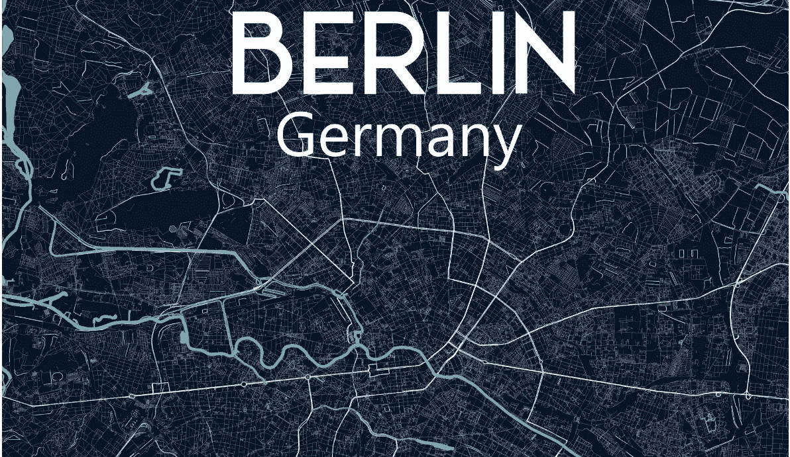
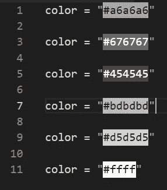
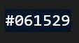
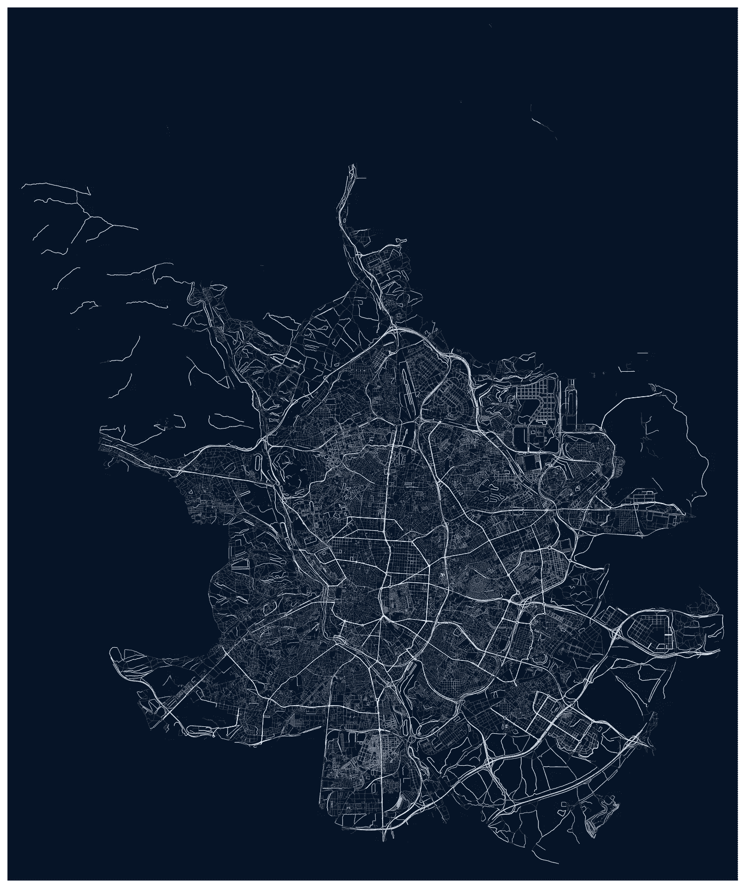
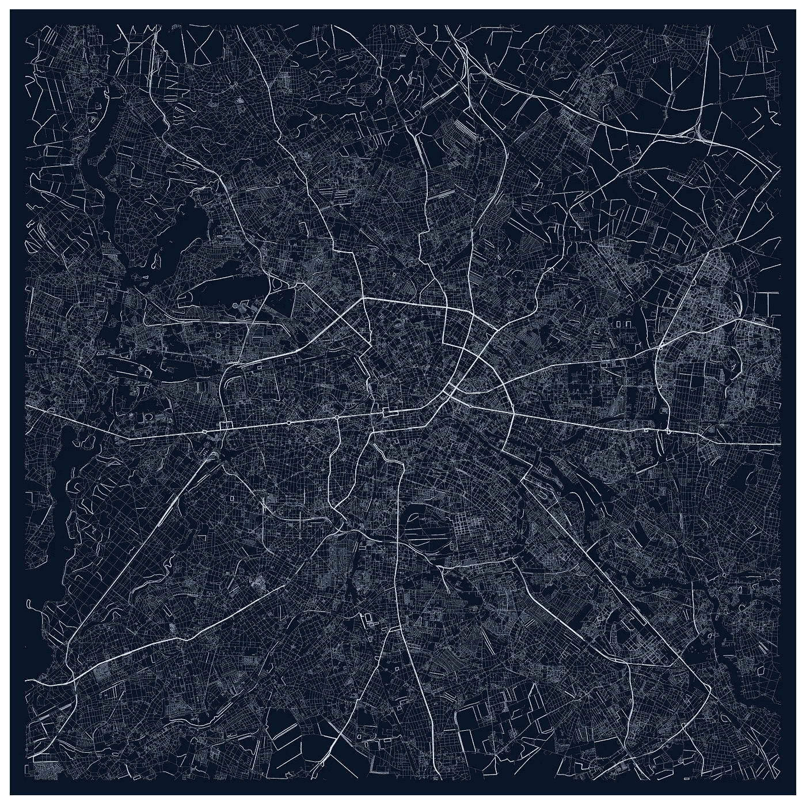
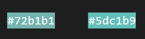
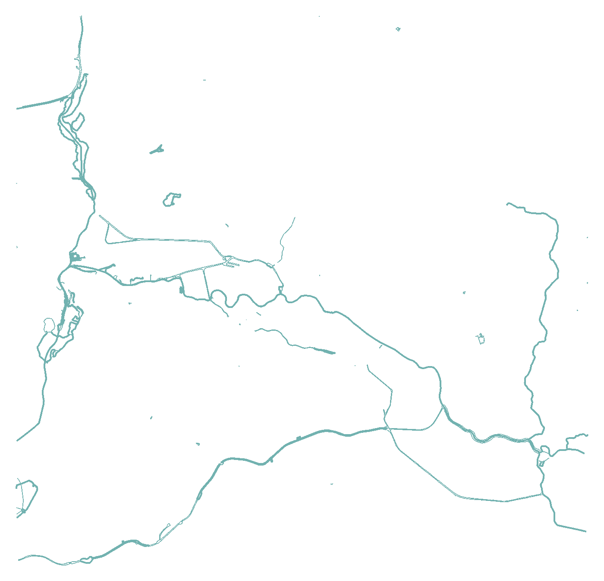
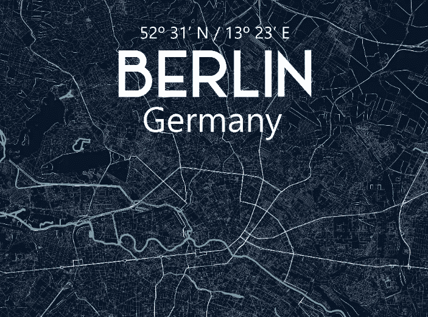
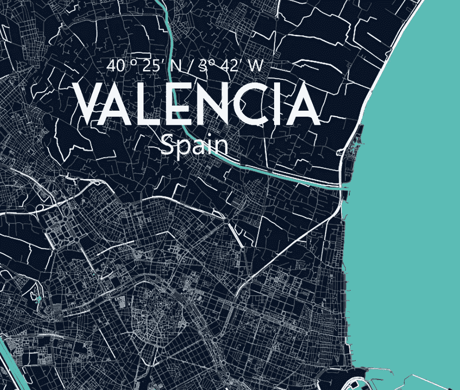

# 用 Python 创建漂亮的地图

> 原文：<https://towardsdatascience.com/creating-beautiful-maps-with-python-6e1aae54c55c?source=collection_archive---------5----------------------->

## Python + OSMnx



柏林地图——作者图片

我一直喜欢城市地图，几周前，我决定建立自己的艺术版本。谷歌了一下之后，我发现了这个令人难以置信的[教程](/making-artistic-maps-with-python-9d37f5ea8af0)，作者是[弗兰克·塞瓦洛斯](https://frank-ceballos.medium.com/)。这是一个迷人和方便的教程，但我更喜欢一个更详细/现实的蓝图地图。正因为如此，我决定建立自己的版本。因此，让我们看看如何用一点 python 代码和 OpenStreetMap 数据创建漂亮的地图。

# 安装 OSMnx

首先，我们需要有一个 Python 安装。我推荐使用 [Conda](https://docs.conda.io/en/latest/) 和虚拟环境(venv)来实现整洁的工作空间。此外，我们将使用 OSMnx Python 包，它将允许我们从 OpenStreetMap 下载空间数据。我们只需编写两个 Conda 命令就可以完成 venv 的创建和 OSMnx 的安装:

```
conda config --prepend channels conda-forge
conda create -n ox --strict-channel-priority osmnx
```

# 下载街道网络

成功安装 OSMnx 后，我们就可以开始编码了。我们需要做的第一件事是下载数据。下载数据可以通过不同的方式实现，最简单的方式之一是使用`graph_from_place()`。

下载柏林街道网络

`graph_from_place()`有几个参数。`place` 是将在 OpenStreetMaps 中用于检索数据的查询，`retain_all`将给出所有街道，即使它们没有连接到其他元素，`simplify`稍微清理一下返回的图，`network_type` 指定要获取的街道网络的类型。

我正在寻找检索`all`可能的数据，但你也可以下载只有驱动道路，使用`drive`，或使用`walk` *步行路径。*

另一种可能是使用`graph_from_point()` ，它允许我们指定一个 GPS 坐标。这个选项在多种情况下更方便，比如有普通名称的地方，并且给我们更多的精确性。使用`dist` 我们可以只保留那些在图中心几米内的节点。

正在下载马德里街道网络

此外，有必要考虑到，如果你是从更大的地方下载数据，如马德里或柏林，你将需要等待一点，以便检索所有的信息。

# 打开包装并给我们的数据着色

`graph_from_place()`和`graph_from_point()`都将返回一个多图，我们可以将其解包并存储在列表中，如 [Frank Ceballos 教程](/making-artistic-maps-with-python-9d37f5ea8af0)所示。

达到这一点，我们只需要迭代数据并给它着色。我们可以给它上色，并根据街道*长度调整*线宽*。*

但是也有识别某些道路的可能性，只是它们的颜色不同。

在我的例子中，我只使用了下面的颜色。



color = "#a6a6a6 "

color = "#676767 "

color = "#454545 "

color = "#bdbdbd "

color = "#d5d5d5 "

color = "#ffff "

但是你可以随意改变颜色或条件来创建符合你口味的新地图。

# 绘制并保存地图

最后，我们只需要做一件事，就是绘制地图。首先，我们需要确定地图的中心。选择您想要作为中心的 GPS 坐标。然后我们将添加一些边界和背景颜色，`bgcolor`。`north`、`south`、`east`和`west`西部将是我们地图的新边界。这个坐标将基于这些边界裁剪图像，只需在你想要的更大的地图中增加边界。考虑到如果你使用`graph_from_point()`方法，你将需要根据你的需要增加`dist`值。对于`bgcolor`,我选择了蓝色，深蓝色#061529，来模拟一个蓝图，但是你也可以根据自己的喜好来调整。



之后，我们只需要绘制和保存地图。我建议使用`fig.tight_layout(pad=0)`来调整剧情参数，这样支线剧情就能很好的配合。

# 结果

使用这段代码我们可以构建下面的例子，但是我建议你调整你的设置，比如每个城市的线宽或者边界限制。



马德里城市地图—海报尺寸

在`graph_from_place()`和`graph_from_point()`之间需要考虑的一个区别是`graph_from_point()`将根据您设置的`dist`从周围获取街道数据。这取决于你想要简单的地图还是更详细的地图，你可以在它们之间进行交换。使用`graph_from_place()`创建了马德里城市地图，使用`graph_from_point()`创建了柏林城市地图。



柏林城市地图

最重要的是，你可能想要一张海报大小的图片。一种简单的方法是在`ox.plot_graph()`中设置`figsize`属性。`figsize`可以调整宽度，高度以英寸为单位。我一般选择大一号的像`figsize=(27,40)`。

# 奖励:加水

OpenStreetMap 也有来自河流和其他自然水源的数据，如湖泊或水渠。再次使用 OSmnx，我们可以下载这些数据。

下载自然水源

用和以前一样的方法，我们可以迭代这个数据并给它着色。在这种情况下，我更喜欢蓝色，如#72b1b1 或#5dc1b9。



最后，我们只需要保存数字。在这种情况下，我没有使用任何带有`plot_graph`内`bbox`的边框。这是另一个你可以玩的东西。

成功下载 rivers 和 like 后，我们只需要将这两幅图像连接起来。只需要一点 Gimp 或者 Photoshop 就可以了，记住用相同的`fig_size`或者限制边框`bbox`来创建两幅图像，这样更容易插值。



柏林天然水源

# 收尾

我喜欢添加的一件事是带有城市名称、GPS 坐标和国家名称的文本。再来一次 Gimp 或 Photoshop 就行了。



此外，如果你添加水，你需要填充一些空间或油漆其他水源，如海水。河流的线条不是恒定的，但是使用油漆桶工具你可以填充这些缝隙。



# 代码和结论

创建这些地图的代码可以在我的 [GitHub](https://github.com/CarlosLannister/beautifulMaps) 上找到。请随意使用，并向我展示您的结果！！希望你喜欢这篇文章，再次感谢弗兰克·塞巴洛斯和媒体社区。另外，如果你们中的任何人想打印一些海报，我在 Etsy 上开了一个小店，里面有我的地图作品。

感谢阅读我和分享知识将引导我们更好的和不可思议的结果！！