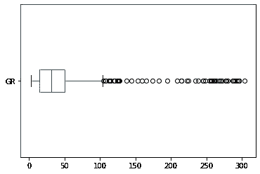

# 在 Python 中使用 Matplotlib 创建箱线图

> 原文：<https://towardsdatascience.com/creating-boxplots-of-well-log-data-using-matplotlib-in-python-34c3816e73f4?source=collection_archive---------1----------------------->

## 使用箱线图了解数据分布，识别岩石物理和测井数据中的异常值


使用 python 中的 matplotlib 生成具有不同 y 轴范围的多个箱线图。图片作者。

箱线图是一个很好的数据可视化工具，它们可以用来了解数据的分布，无论它是否偏斜，以及是否存在异常值。在本文中，我们将看看什么是盒图，以及如何使用 pandas 和 matplotlib 显示它们。

为了配合这篇文章，我制作了以下 [YouTube 视频](https://youtu.be/IpMhMUcmLJw)。

## 什么是箱线图？

箱线图是一种基于五个关键数字显示数据分布的图形和标准化方法:最小值、第一个四分位数(第 25 个百分位数)、中值(第二个四分位数)。/第 50 个百分位数)、第 3 个四分位数(第 75 个百分位数)和“最大值”。最小值和最大值分别定义为 Q1-1.5 * IQR 和 Q3 + 1.5 * IQR。任何超出这些限制的点都被称为异常值。


箱线图的图形描述，突出显示关键组成部分，包括中位数、四分位数、异常值和四分位数间距。作者创建的图像。

箱线图可用于:

*   识别异常值或异常数据点
*   来确定我们的数据是否有偏差
*   了解数据的分布/范围

为了构建箱线图，我们首先从中值/第 50 百分位(Q2)开始。这代表了我们数据中的中间值。

然后在第 25 和第 75 个百分点之间形成一个方框(分别为 Q1 和 Q3)。这个方框表示的范围称为四分位间距(IQR)。

从这个盒子里延伸出线条，也就是众所周知的胡须。这些延伸到 Q1-1.5 * IQR 和 Q3 + 1.5 * IQR，或者延伸到小于该值的最后一个数据点。

任何超出晶须极限的点都称为异常值。

## 导入库和数据

我们将在 Jupyter 笔记本中执行的前几个步骤包括加载库和数据。在这种情况下，我们将使用 [lasio](https://lasio.readthedocs.io/en/latest/) 加载我们的日志 ASCII 标准(LAS)文件， [pandas](https://pandas.pydata.org/) 存储我们的测井数据，以及 [matplotlib](https://matplotlib.org/) 可视化我们的数据。

Lasio 是一个您可能不熟悉的库，但它用于加载 LAS 文件，石油和天然气行业通常使用这些文件来存储和传输测井数据。你可以看看我的第一个 YouTube 视频[，它解释了如何使用这个库。](https://youtu.be/8U4gxMJybJs)

```
import pandas as pd
import matplotlib.pyplot as plt
import lasio
```

接下来，我们将加载并查看我们的数据。我们可以使用`lasio.read()`并传入一个文本字符串来做到这一点。为了将它转换成熊猫数据帧，我在它的末尾添加了`.df()`。

我们正在使用的数据集来自于 2018 年发布的 [Equinor Volve Field 数据集。本教程中使用的文件来自 15/9- 19SR 井，其中包含一组标准测井测量值。](https://www.equinor.com/en/what-we-do/norwegian-continental-shelf-platforms/volve.html)

```
df = lasio.read("Data/15-9-19_SR_COMP.LAS").df()
```


Pandas 数据框显示了测井数据的前五行和后五行。

当我们调用 dataframe 时，我们可以看到我们有一个表示前 5 行和后 5 行数据的表。每一列代表一个测井测量值。从左到右，我们用 AC 表示声波压缩慢度，用 CALI 表示井径，用 DEN 表示体积密度，用 GR 表示伽马射线，用 NEU 表示中子孔隙度和 RDEP，用 RMED 表示深层和中层电阻率。

为了使用一些 matplotlib 图，有必要删除由 NaN 表示的缺失值。我们可以通过使用`.dropna()`来移除这些。添加`inplace=True`允许我们从原始数据帧而不是它的副本中删除这些。

```
df.dropna(inplace=True)
```

当我们再次调用`df`时，我们可以看到行数从 6701 减少到 6579。


Pandas 数据框显示了移除 nan 后的前五行和后五行测井数据。

## 使用熊猫的简单方框图

现在我们的数据已经加载，我们可以生成我们的第一个箱线图。我们可以通过键入`df['GR']`从数据帧中选择 GR 列，然后键入`.plot()`来做到这一点。

在 plot 方法的参数中，我们传入`kind=box`来告诉函数我们想要一个 boxplot。

```
#Simple boxplot using pandas
df['GR'].plot(kind='box');
```


数据中 GR 列的简单箱线图。图片作者。

当我们运行这个单元时，我们得到一个非常基本的箱形图。我们有四分位数范围框，它包含中线。从两边延伸的是胡须，延伸到四分位间距的 1.5 倍。在顶部，我们有一系列圆圈，代表异常值。

## 带对数轴的箱线图

我们可以看看另一条曲线，在这种情况下，RDEP(深电阻率)。

```
#Viewing logarithmically scaled data
df['RDEP'].plot(kind='box');
```


数据中 RDEP 柱的简单箱线图。图片作者。

如果我们重复上面的代码，我们可以看到在图的底部有一个小方框，上面有大量的异常值。根据经验和现有知识，RDEP 通常以对数标度绘制，其范围可以从大约 0.01 欧姆毫米到大约几千欧姆毫米。

为了解决这个问题，我们可以通过添加`plt.semilogy()`将 Y 轴切换到对数刻度。你会看到我们现在使用 matplotlib 符号，这是因为 pandas 调用 matplotlib 来构建这个方框图。

```
df['RDEP'].plot(kind='box')
plt.semilogy();
```


使用半对数将 Y 轴设置为对数后，数据中 RDEP 列的简单箱线图()。图片作者。

## 使箱线图水平

如果我们更喜欢水平查看我们的盒状图，我们可以添加一个`vert`参数，它用来告诉这个图是垂直显示(真)还是水平显示(假)。默认情况下，它被设置为 True。

```
#Rotating the box plot so it is horizontal
df['GR'].plot(kind='box', vert=False);
```



GR 列的水平箱线图。作者图片

## 带 Matplotlib 的箱线图

上面的代码单元是使用 matplotlib 周围的 pandas 包装器完成的，如果我们想要使用 matplotlib 函数和语法，我们可以生成如下所示的相同图形。首先，我们调用`plt.boxplot()`，然后将 x 参数设置为`df['GR']`。

```
#Using matplotlib to make a boxplot
plt.boxplot(x=df['GR'], vert=False);
```


使用 matplotlib 创建的水平箱线图。图片作者。

## 设计箱线图的样式

Matplotlib 图不是很时尚，用于生成它们的代码非常低级。这就是为什么有许多基于 matplotlib 开发的库，如 seaborn，并引入了更多的功能，使可视化更具吸引力。

首先，我们将通过改变异常圆的颜色来给我们的图添加一些颜色。为此，我们创建一个名为`red_circle`的新变量，然后创建一个字典。在这个字典中，我们将设置`markerfacecolor`和`marker`。这些将分别设置为红色和圆形。

```
#Changing the outlier markers
red_circle = dict(markerfacecolor='red', marker='o')
plt.boxplot(x=df['AC'], vert=False, flierprops=red_circle);
```


Boxplot 突出显示 matplotlib 中的异常值并使用 fliersprops 参数。图片作者。

当我们运行这段代码时，我们现在用一些颜色来突出我们的异常值。

在当前箱线图上，我们的 IQR 框内有一条橙色线代表的中值。我们还可以通过创建另一个名为`mean_shape`的字典变量来添加数据的平均值。

我们为`markerfacecolor`和`marker`设置了与之前相同的参数，它们都将被设置为绿色和菱形。要选钻石，我们可以用字母 d。

此外，我们将通过添加一个`markeredgecolor`变量来改变均值标记的边缘颜色。默认情况下，它被设置为黑色，但这里我们将它设置为绿色。

```
#Adding the mean
red_circle = dict(markerfacecolor='red', marker='o')
mean_shape = dict(markerfacecolor='green', marker='D', markeredgecolor='green')

plt.boxplot(x=df['AC'], vert=False, flierprops=red_circle, 
             showmeans=True, meanprops=mean_shape);
```


Matplotlib boxplot 使用 meanprops 和 showmeans 参数绘制平均值。图片作者。

## 添加槽口

我们可以用凹口代替线来表示中位数。这可以通过添加参数`notch`并将其设置为 True 来实现。

```
#Adding the median notch to the box
red_circle = dict(markerfacecolor='red', marker='o')
plt.boxplot(x=df['DEN'], vert=False, flierprops=red_circle, 
             showmeans=True, meanprops=mean_shape, notch=True);
```


Matplotlib 箱线图，带有表示中值的凹口。图片作者。

## 在图上显示多个箱线图

有时，我们可能希望在同一个图形上创建多个箱线图。最简单的方法就是调用`df.plot()`，传入`kind=True`。

```
#Displaying all columns in the dataframe on a single figure
df.plot(kind='box');
```


使用 df.plot 绘制 dataframe 中所有列的箱线图(kind='box ')

这将生成一个包含我们所有列的图，但它并不十分吸引人。此外，我们所有的测量都在不同的测量范围内。GR 的典型范围为 0 至 200 API，而 DEN 的典型范围为约 1.5 克/立方厘米至约 3 克/立方厘米。

这使得读取和识别数据中的异常值变得非常困难。为了制作具有不同 y 轴的箱线图，为了制作一个既可读又可用的图形，我们需要使用支线图。如果你想在 matplotlib 中找到更多关于支线剧情的信息，请查看我之前的视频。

首先，我们首先将异常值定义为红色下划线圆圈。

```
red_circle = dict(markerfacecolor='red', marker='o', markeredgecolor='white')
```

然后我们将 fig，axs 定义为 plt.subplots。在参数中，我们传入我们想要的 1 行，然后是列数。列的数量将等于 df.columns 的长度。最后，我们将 figsize 设置为 20 乘 10。

```
fig, axs = plt.subplots(1, len(df.columns), figsize=(20,10))
```

然后我们需要创建一个小的 for 循环，它将在我们的每个绘图轴上循环。我们在这里使用枚举函数来跟踪 I，我们的索引值。

```
for i, ax in enumerate(axs.flat):
```

接下来，我们可以通过调用`ax.boxplot()`并传入 df.iloc 来添加我们的 boxplot，这允许我们通过索引变量来获取列，我们通过创建方括号来做到这一点，冒号后跟逗号。这告诉 iloc 函数获取所有行，然后我们传入列索引。接下来，我们指定离群属性并传入 red_circle。

```
ax.boxplot(df.iloc[:,i], flierprops=red_circle)
```

接下来的几行允许我们设置标题和 y 刻度标签的字体大小。最后，我们呼吁`plt.tight_layout`以一种很好的方式来安排剧情。

```
#Creating subplot of each column with its own scale
red_circle = dict(markerfacecolor='red', marker='o', markeredgecolor='white')

fig, axs = plt.subplots(1, len(df.columns), figsize=(20,10))

for i, ax in enumerate(axs.flat):
    ax.boxplot(df.iloc[:,i], flierprops=red_circle)
    ax.set_title(df.columns[i], fontsize=20, fontweight='bold')
    ax.tick_params(axis='y', labelsize=14)

plt.tight_layout()
```


使用子图分隔箱线图，以允许不同的 y 轴刻度/数据范围。图片作者。

当我们运行细胞时，我们有一个更好看的图，我们可以阅读。每个子情节都有自己的 y 轴刻度。我们可以看到卡利、GR 和 NEU 都有大量的异常值。最后两个副曲线 RMED 和 RDEP 应该用对数来表示。

为了捕捉这些，我们可以添加一个简单的 if 语句来检查列名是否等于 RDEP 和 RMED，然后调用`ax.semilogy()`。

```
red_circle = dict(markerfacecolor='red', marker='o', markeredgecolor='white')

fig, axs = plt.subplots(1, len(df.columns), figsize=(20,10))

for i, ax in enumerate(axs.flat):
    ax.boxplot(df.iloc[:,i], flierprops=red_circle)
    df.iloc[:,i]
    ax.set_title(df.columns[i], fontsize=20, fontweight='bold')
    ax.tick_params(axis='y', labelsize=14)

    #Checking if column names are equal to columns we expect to be logarithmic
    if df.columns[i] == 'RDEP' or df.columns[i] == 'RMED':
        ax.semilogy()

plt.tight_layout()
```


使用子图分隔箱线图，以允许不同的 y 轴刻度/数据范围。图片作者。

# 摘要

在本教程中，我们已经了解了如何使用 matplotlib 和 pandas 创建测井数据的基本箱线图，以及如何使用具有不同 y 轴/数据范围的多个箱线图创建单个图形。箱线图是非常有用的数据可视化工具，允许我们了解数据的范围和分布，以及识别异常数据点，也称为异常值。

这是在项目的探索性数据阶段可以使用的许多方法之一。

*感谢阅读。在你走之前，你一定要订阅我的内容，把我的文章放到你的收件箱里。* [***你可以在这里做！***](https://andymcdonaldgeo.medium.com/subscribe)**或者，您可以* [***注册我的简讯***](https://fabulous-founder-2965.ck.page/2ca286e572) *免费获取更多内容直接发送到您的收件箱。**

*其次，通过注册会员，你可以获得完整的媒介体验，并支持我自己和成千上万的其他作家。它每个月只花你 5 美元，你可以完全接触到所有令人惊叹的媒体文章，也有机会用你的写作赚钱。如果你用 [***我的链接***](https://andymcdonaldgeo.medium.com/membership)**报名，你直接用你的一部分费用支持我，不会多花你多少钱。如果你这样做了，非常感谢你的支持！***