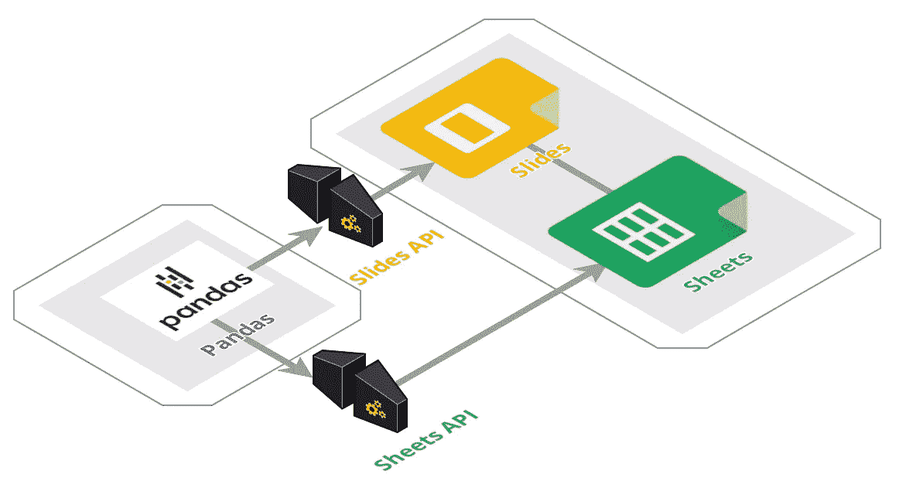
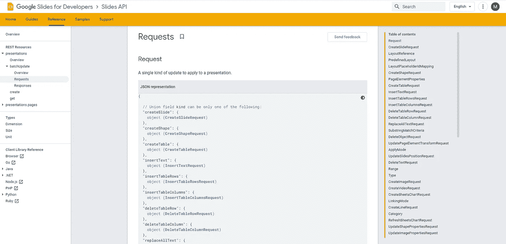
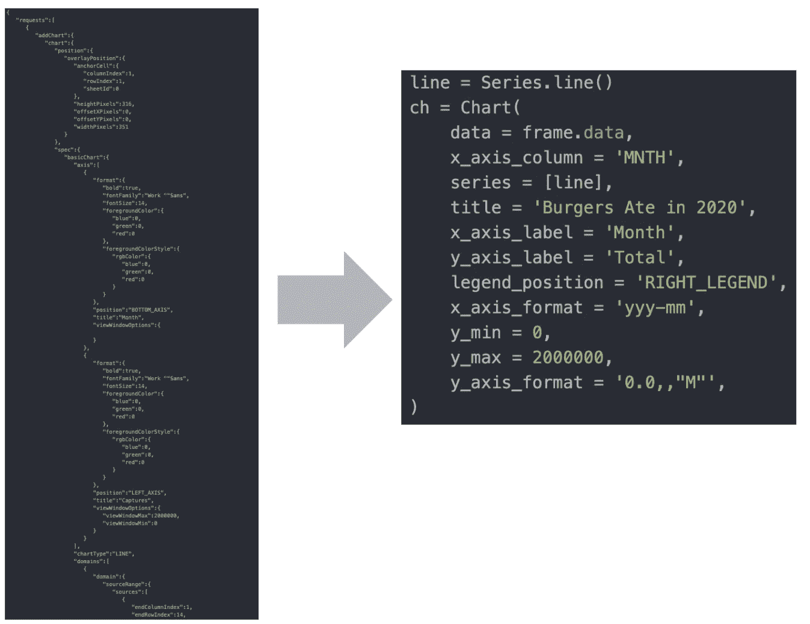
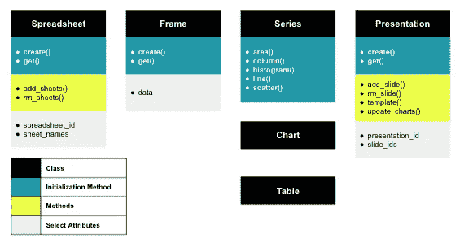
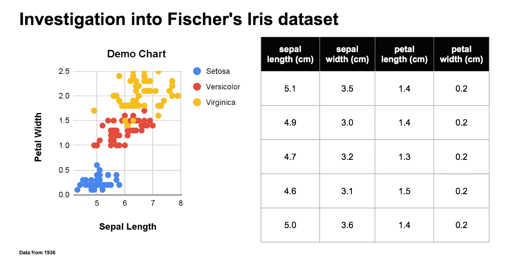
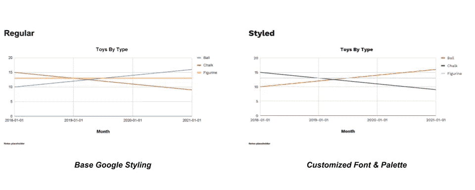
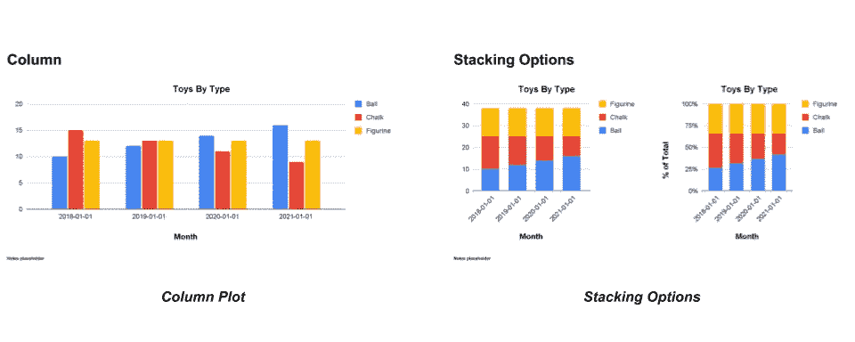
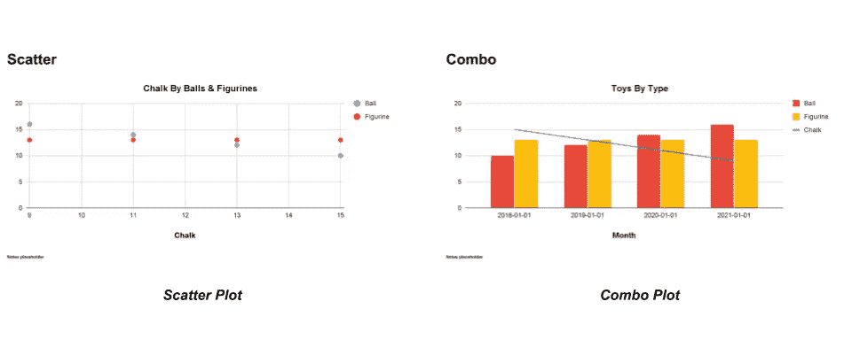
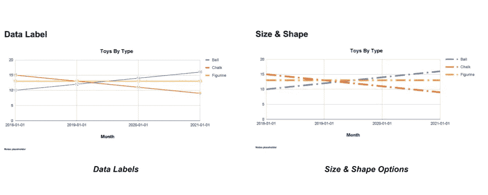
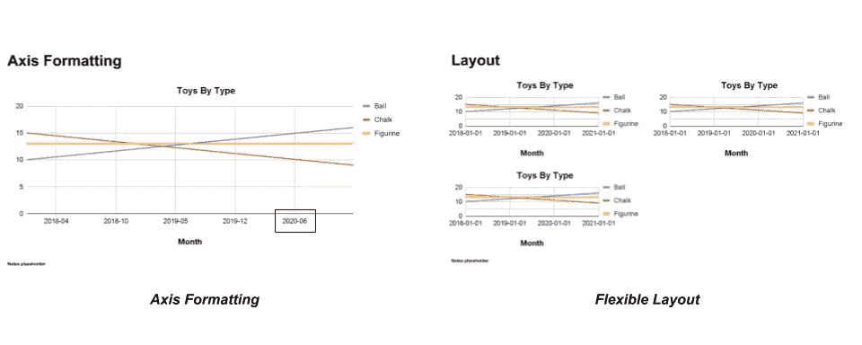

# 使用 Python 在 Google Slides 中创建图表

> 原文：<https://towardsdatascience.com/creating-charts-in-google-slides-with-python-896758e9bc49?source=collection_archive---------7----------------------->

## 利用 Google 的 API 和 gslides 包给你的观众留下深刻印象

数据科学家遇到的一个常见问题是如何在幻灯片中以编程方式创建简单、格式优雅且带有公司品牌的可视化效果。

利用谷歌 API 和包`**gslides**`你可以很容易地**在谷歌幻灯片**中创建图表和表格，这将会给你的观众留下深刻印象，这一切都是用 Python 实现的！

无论您是希望提高演示水平的数据科学家，还是希望在幻灯片和工作表中实现手工自动化的分析师，本教程都将带您了解如何将`**gslides**`集成到您的工作流程中。

# **我们正在尝试解决的示例场景**

## **场景 1**

数据科学家使用绘图包(matplotlib、plotly、ggplot2)在 Jupyter 笔记本中进行分析。为了分享他们的成果，他们**将笔记本上的一张图片复制到幻灯片中**。

虽然他们的分析可能很出色，但熟悉表格和幻灯片的非技术利益相关者必须调整他们的思维模式，以解释用 python 创建的非标准格式的可视化。出现的问题有:

> 我可以查看图表中的基础数据吗？
> 
> 我们想将这些材料分享给高级利益相关者，你能根据公司的品牌指导方针格式化图表吗？

## **场景二**

出于监控目的，数据分析师必须每月更新一组数据。他们必须从数据仓库中获取数据，导出结果，将其复制到 Google 工作表中，并更新必要的图表。

这种工作流程是高度手动和重复的，这使得工作变得单调乏味，并降低了分析师的积极性。

# 解决方案



创建图表和表格的数据流。作者图片

为了在 Google slides 中创建图表，我们可以使用 python 将数据从 pandas 传递到 Google Slides & Sheets API。这些 API 是做什么的？在这些平台中，您可以手动执行的大多数操作都可以通过创建请求并将其传递给适当的 API 来复制。



Google 关于幻灯片 API 请求的[文档](https://developers.google.com/slides/api/reference/rest)截图。作者图片

这变得复杂的地方在于，你需要熟悉许多请求，并且创建这些请求，你通常需要编写数百行的 json。为了避免直接处理复杂的 Google API 请求，我们可以使用`**gslides**`，一个创建和执行请求的 Google API 包装器。通过为用户配置这些请求，`**glides**`使用户能够通过简单的 python 命令操作 Google Sheets &幻灯片，而不是冗长的 json 请求。



gslides 中的等效 json 请求。作者图片

# `gslides`简介

`**gslides**`是面向对象的，其中每个类代表 Google Sheets 或 Slides 中的一个对象。



gslides API 中的类和方法。图片来自经许可发布的[g 幻灯片](https://michael-gracie.github.io/gslides/basic.html)

*   **电子表格**代表一个谷歌表单
*   **框架**表示谷歌工作表中的数据范围
*   [**系列**](https://michael-gracie.github.io/gslides/chart.html) 代表图表中的一个系列或多个系列
*   [**图表**](https://michael-gracie.github.io/gslides/chart.html) 表示将在 google sheets 中创建然后移动到 google slides 中的图表
*   [**表格**](https://michael-gracie.github.io/gslides/table.html) 表示将在 google slides 中创建的表格
*   **演示**表示一个谷歌幻灯片演示。

`Spreadsheet`、`Frame`和`Presentation`类的初始化方法`get()`或`create()`允许用户获取现有对象或创建新对象。

欲了解更多关于该包的信息，请参考文档[此处](https://michael-gracie.github.io/gslides/index.html)。

## [设置](https://michael-gracie.github.io/gslides/byoc.html)

使用`**gslides**`依赖于在 Google 云平台中创建一个项目和凭证。以下是你必须遵循的步骤。

1.  [在谷歌云平台中创建一个项目](https://developers.google.com/workspace/guides/create-project)，启用幻灯片&表单 API。
2.  [创建](https://michael-gracie.github.io/gslides/byoc.html)服务帐户或 OAuth 2.0 凭证。这里的关键区别是，如果你使用 OAuth 2.0，你运行的任何命令都会像你的个人谷歌帐户是创建者&编辑器一样运行。如果您使用服务帐户，域为`<project>.iam.gserviceaccount.com`的帐户将成为创建者&编辑者。更多关于使用服务账户利弊的评论可以在[这里](https://michael-gracie.github.io/gslides/byoc.html#service-account-or-oauth-2-0)找到。
3.  建立您的凭证

对于 OAuth 2.0，您将运行:

```
**import** **os.path**
**from** **googleapiclient.discovery** **import** build
**from** **google_auth_oauthlib.flow** **import** InstalledAppFlow
**from** **google.auth.transport.requests** **import** Request
**from** **google.oauth2.credentials** **import** Credentials

*# These scopes are read & write permissions. Necessary to run gslides*
SCOPES = ['https://www.googleapis.com/auth/presentations',
         'https://www.googleapis.com/auth/spreadsheets']

creds = **None**
*# The file token.json stores the user's access and refresh tokens, and is*
*# created automatically when the authorization flow completes for the first*
*# time.*
**if** os.path.exists('token.json'):
    creds = Credentials.from_authorized_user_file('token.json', SCOPES)
*# If there are no (valid) credentials available, let the user log in.*
**if** **not** creds **or** **not** creds.valid:
    **if** creds **and** creds.expired **and** creds.refresh_token:
        creds.refresh(Request())
    **else**:
        flow = InstalledAppFlow.from_client_secrets_file(
            '<PATH_TO_CREDS>', SCOPES)
        creds = flow.run_local_server()
    *# Save the credentials for the next run*
    **with** open('token.json', 'w') **as** token:
        token.write(creds.to_json())
```

对于服务帐户:

```
**from** **google.oauth2** **import** service_account

SCOPES = ['https://www.googleapis.com/auth/presentations',
         'https://www.googleapis.com/auth/spreadsheets']

credentials = service_account.Credentials.from_service_account_file(
    '<PATH_TO_CREDS>')

creds = credentials.with_scopes(SCOPES)
```

4.下载`**gslides**`

`pip install gslides`

## 基本用法

在最基本的用法中，`**gslides**`将数据从`**pandas**`数据框架传递到 Google Sheets，然后使用 Google Sheets 中的数据在 Sheets &幻灯片中创建图表或表格。见下面这个流程，完整的笔记本[在这里](https://github.com/michael-gracie/gslides/blob/main/notebooks/usage.ipynb)。

**1。初始化与 Google APIs 的连接**

```
**import** **gslides**
**from** **gslides** **import** (
    Frame,
    Presentation,
    Spreadsheet,
    Table,
    Series, Chart
)
gslides.initialize_credentials(creds) *#BringYourOwnCredentials*
```

**2。创建演示文稿**

```
prs = Presentation.create(
    name = 'demo pres'
)
```

**3。创建电子表格**

```
spr = Spreadsheet.create(
    title = 'demo spreadsheet',
    sheet_names = ['demo sheet']
)
```

**4。将数据载入电子表格**

```
plt_df = *#Pandas DataFrame with Iris data*
frame = Frame.create(
    df = plt_df,
    spreadsheet_id = spr.spreadsheet_id,   
    sheet_id = sp.sheet_names['demo sheet'],
    sheet_name = 'demo sheet',
    overwrite_data = **True**
)
```

**5。创建散点图**

```
sc = Series.scatter()
ch = Chart(
    data = frame.data,       #Passing the data from the frame
    x_axis_column = 'sepal length (cm)',
    series = [sc],           #Passing the series object
    title = 'Demo Chart',
    x_axis_label = 'Sepal Length',
    y_axis_label = 'Petal Width',
    legend_position = 'RIGHT_LEGEND',
)
```

**6。创建一个表格**

```
tbl = Table(
    data = plt_df.head()
)
```

**7。用散点图&表**制作一张幻灯片

```
prs.add_slide(
    objects = [ch, tbl],
    layout = (1,2),             #1 row by 2 columns
    title = "Investigation into Fischer's Iris dataset",
    notes = "Data from 1936"
)
```

结果是这张幻灯片:



基本用法的输出。图片来自 [gslides](https://michael-gracie.github.io/gslides/basic.html) 经许可发布

使用该软件包，用户可以:

*   创建新演示文稿
*   创建带有图表或表格的新幻灯片
*   删除幻灯片
*   创建新的电子表格
*   在电子表格中添加或删除标签
*   将数据从熊猫数据框添加到电子表格
*   从电子表格获取数据到熊猫数据框架
*   模板文本到类似于 J [inj](https://jinja.palletsprojects.com/en/3.0.x/) a 的演示文稿中
*   用刷新的基础数据强制更新演示文稿中的所有链接图表

## 可配置性

在众多可配置参数中，`**gslides**`的亮点在于灵活性。这种可配置性的全部细节可以在[这里](https://github.com/michael-gracie/gslides/blob/main/notebooks/advanced_usage.ipynb)找到，但是看看下面什么是可行的快照。



作者图片

# 总结

`**gslides**`支持分析师在 Google Slides 中轻松创建图表&表格。基于这篇教程，希望你对`**gslides**`有一个很好的理解，以及如何将它应用到你的工作流程中。如有任何疑问，请务必查看此处的文档。