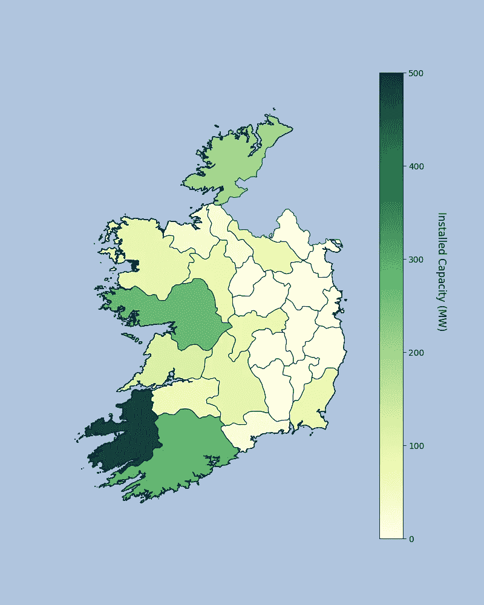

# 利用 geo pandas——爱尔兰风能数据集创建 Choropleth 地图

> 原文：<https://towardsdatascience.com/creating-choropleth-map-using-geopandas-irish-wind-energy-dataset-58dbeff913ed?source=collection_archive---------23----------------------->

## 用 Python 在 choropleth 地图上表示您感兴趣的数据。

在我之前的[文章](/green-like-ireland-choropleth-map-of-irish-wind-energy-26603106fe3e) [1]中，我讨论了爱尔兰风能在电网中的渗透。在那篇文章中，我报告了代表过去几年每个国家风力涡轮机数量变化的数字。下面，我将介绍创建您自己的 choropleth 地图的步骤，以便可视化您选择的任何数据！

为了便于说明，下面的代码用于生成我在上一篇文章中报告的数字。但是，这些步骤适用于任何数据！

按照下面详述的步骤，我们将生成如下所示的 choropleth 图。这张地图根据风力涡轮机的装机容量对不同的爱尔兰郡进行了颜色编码。每个县安装的风力涡轮机的数量用圆点表示，每个圆点代表一台风力涡轮机。


爱尔兰风力涡轮机的 Choropleth 地图(图片由作者提供)

你所需要的是创建这个地图是一些关于 Python(熊猫，Matplotlib)的手，我会帮助你与 GeoPandas。

我们将生成 choropleth 图分解为以下步骤:

1.  **数据整理:**

因为我在都柏林工作，研究可再生能源；我将根据涡轮机数量和容量绘制风力涡轮机安装图，您可以按照您的数据创建自己的数据。

能源数据来自 [EirGrid](http://www.eirgridgroup.com/site-files/library/EirGrid/TSO-Connected-Renewable-Generation.pdf) 网站【2】。数据是 PDF 格式的。我把它转换成 CSV 文件，对它做了一点预处理，然后上传到我的 [GitHub](https://github.com/SaM-92/Choropleth-map-Ireland) 。精选的数据非常适合我们的演示目的。

我们还需要能接触到有问题的地图。我使用了爱尔兰共和国的地图，这是我从下面的[网站](https://www.eea.europa.eu/data-and-maps/data/eea-reference-grids-2/gis-files/ireland-shapefile)下载的，我也上传到了我的 [GitHub](https://github.com/SaM-92/Choropleth-map-Ireland) 中。

**2。让我们开始编码:**

我知道这可能是你第一次使用 GeoPands，所以首先你需要安装它。这可以通过运行以下代码行来完成:

```
pip install geopandas
```

如果你得到了一个错误，不要惊慌，有其他方法来安装它。看看[这个](https://geopandas.org/install.html)。

要加载有问题的 CSV 文件，请执行以下代码行:

```
import pandas as pd
path = 'Give it the data path'  
df = pd.read_csv(path+'Tdata.csv')
df.head() # to see how data look likes
```


风力涡轮机数据集

如图所示，在加载的数据集中，我们有爱尔兰每个县的**装机容量**和**涡轮机数量**。现在，我们需要加载正在讨论的地图，在本例中是爱尔兰地图。

```
import geopandas as gpd
ROI_map= gpd.read_file(path+'IRL_adm1.shp')  #reading the map 
ROI_map.NAME_1 #you can see names of counties here
```

现在，我们有了一个表示我们数据的 Pandas 数据帧( *df* )和一个表示爱尔兰地图的 GeoPandas 数据帧( *ROI_map* )。我们需要做的是根据县名合并这两个数据集:

```
ROI_map=ROI_map.set_index('NAME_1')
df=df.set_index('County')
df2= ROI_map.join(df)
# we need to replace NaN rows with 0 since there are some counties #without any wind turbines 
df2['Installed Capacity (MW)']=df2['Installed Capacity (MW)'].fillna(value=0)
df2['No of Turbines']=df2['No of Turbines'].fillna(value=0)
df2['name1'] = df2.index
df2.head() # it is the new data frame that we created merging map and wind data sets
```

**2。准备好剧情了吗？**

为了绘制相关数据，我们使用 Python 中的 MatPlotlib 库。我根据装机容量给每个县标上了颜色。我选择绿色是因为我在谈论绿色能源。我想在这里提到的一点是，由于我们是基于装机容量来给地图着色的，所以我们需要一个颜色条来显示装机容量的范围是如何随颜色变化的，因此您还需要为颜色条定义装机容量的最小值( *vmin* )和最大值( *vmax* )。等等！我们正在谈论爱尔兰岛，所以我喜欢我的地块的脸颜色是浅蓝色(*face color = ' lightsteelblue '*)，如果你想它是白色，你可以删除它。

```
import matplotlib.pyplot as plt
vmin, vmax = 0, 500 #Range of variable you use as map color (here #range of Installed Capacity (MW)
fig, ax = plt.subplots(figsize=(6,8),facecolor='lightsteelblue')
fig=df2.plot(column='Installed Capacity (MW)', cmap='YlGn', linewidth=0.8, ax=ax, edgecolor='#140656',facecolor='lightslategray',vmin=vmin, vmax=vmax,
legend=True, norm=plt.Normalize(vmin=vmin, vmax=vmax))
ax.axis('off')
```

向颜色栏添加图例:

```
ax.annotate('Installed Capacity (MW)',xy=(0.9, .65),rotation=270, xycoords='figure fraction', horizontalalignment='left', verticalalignment='top', fontsize=12, color='black')
```

这是你目前的计划:



爱尔兰风力装机容量的 Choropleth 地图(图片由作者提供)

**3。我们可以添加县名吗？**

是啊！您可以通过指定经度和纬度来指定您想要的任何内容。您可能有兴趣将县的名称添加到您的绘图中，所以让我们获取每个县的经度和纬度，并要求 Python 在此基础上添加名称。

```
#Getting the lan and lat here from geometry data
df2['coords']=df2['geometry'].apply(lambda x: x.representative_point().coords[:])
df2['coords']=[coords[0] for coords in df2['coords']]
#Add names of county here
for idx, row in df2.iterrows():
    plt.annotate(s=row['name1'], xy=row['coords'],
                 horizontalalignment='center', color='black',fontsize=10, fontweight='light')
```


爱尔兰风力装机容量的 Choropleth 地图(图片由作者提供)

有一些名称重叠，但您可以通过调整布局或更改图形的大小来避免。

**4。风力涡轮机的数量呢？**

当然啦！它与第 3 部分非常相似，但有一点小小的不同，不是添加名称，而是添加风力涡轮机的数量！但是，**要小心**，我喜欢将圆圈分布在整个县，以清楚地显示风力涡轮机的累积，因为否则，所有的圆圈将在同一点重叠，我们不会告诉有多少！，所以我只是为每个县和每个涡轮机产生了一些随机数；因此；每个县都有相同数量的圆圈和风力涡轮机。

```
from random import gauss 
# Add turbine numbers here
for idx, row in df2.iterrows():
    if row['No of Turbines']!=0:
        s=row['No of Turbines']
        ss=int(s)
        for i in list(range(ss)):
            z=row['No of Turbines']/1000+gauss(0, 0.1)
            DFF=plt.scatter(x=z+row['coords'][0],y=gauss(0, 0.03)+row['coords'][1],c='#ec1313',alpha=0.5)
```

最后，我们有:


爱尔兰风力涡轮机的 Choropleth 地图；代表风力发电装机容量和涡轮机数量(图片由作者提供)

**5。停下来。我们的数据总是需要传奇！**

通过以下代码向地图添加图例:

```
#Add legend to red circles i.e. wind turbines
plt.legend([DFF, DFF], ["Wind turbines"],loc='upper left')
```

我们开始吧:


爱尔兰风力涡轮机的 Choropleth 地图；代表风力发电装机容量和涡轮机数量(图片由作者提供)

**6。我可以保存我的地图吗？**

您可以通过以下代码保存地图:

```
import os 
path2='your path here!'
filepath = os.path.join(path2,'mymap.jpg')
chart = fig.get_figure()
chart.savefig(filepath, dpi=300)
```

**6。再见！**

我希望你喜欢这篇文章，我希望它能帮助你的学习或工作。

你可以在我的 [GitHub](https://github.com/SaM-92/Choropleth-map-Ireland) 上访问代码和数据。

值得注意的是，我受到了这两篇关于走向数据科学的文章[3，4]的启发。

# 确认


我要感谢 UCD 能源研究所和 ESIPP 集团对我的支持。另外，我推荐你看看我的同事们在这个[研究所](https://esipp.ie/)的有趣作品。

# 参考

[1]:绿色如爱尔兰:爱尔兰风能 Choropleth 地图，走向数据科学；2021 年 2 月 23 日[https://towards data science . com/green-like-Ireland-choropleth-map-of-Irish-wind-energy-26603106 fe3e？source=social.tw](/green-like-ireland-choropleth-map-of-irish-wind-energy-26603106fe3e?source=social.tw)

[2]: TSO 联网可再生能源—年装机容量，EirGrid，2021 年 2 月。[http://www . eirgridgroup . com/site-files/library/EirGrid/TSO-Connected-Renewable-generation . pdf](http://www.eirgridgroup.com/site-files/library/EirGrid/TSO-Connected-Renewable-Generation.pdf)

[3]:用 Python 创建 Choropleth 地图的完整指南，走向数据科学；2020 年 10 月 4 日[https://towards data science . com/a-complete-guide-to-creating-choropleth-maps-in-python-728 ee 2949 db4](/a-complete-guide-to-creating-choropleth-maps-in-python-728ee2949db4)

【4】:我们来做个地图吧！利用 Geopandas、pandas 和 Matplotlib 制作 Choropleth 图；2018 年 6 月 25 日。[https://towards data science . com/let-make-a-map-using-geo pandas-pandas-and-matplotlib-to-make-a-chloroleth-map-dddc 31 c 1983d](/lets-make-a-map-using-geopandas-pandas-and-matplotlib-to-make-a-chloropleth-map-dddc31c1983d)