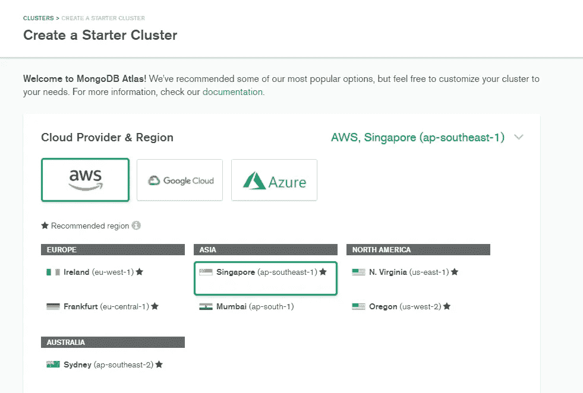
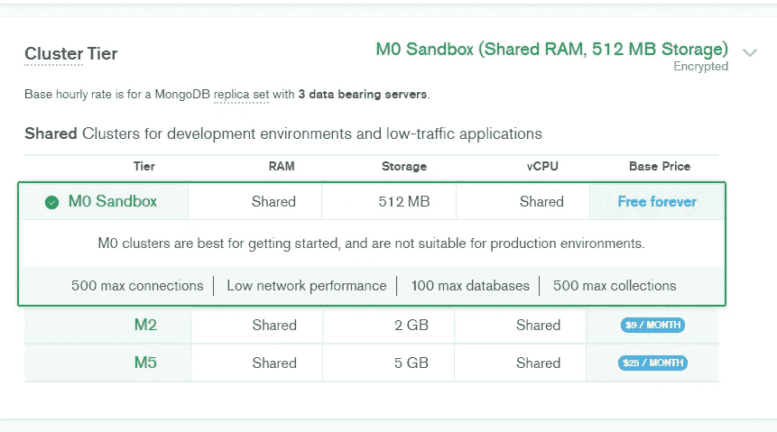
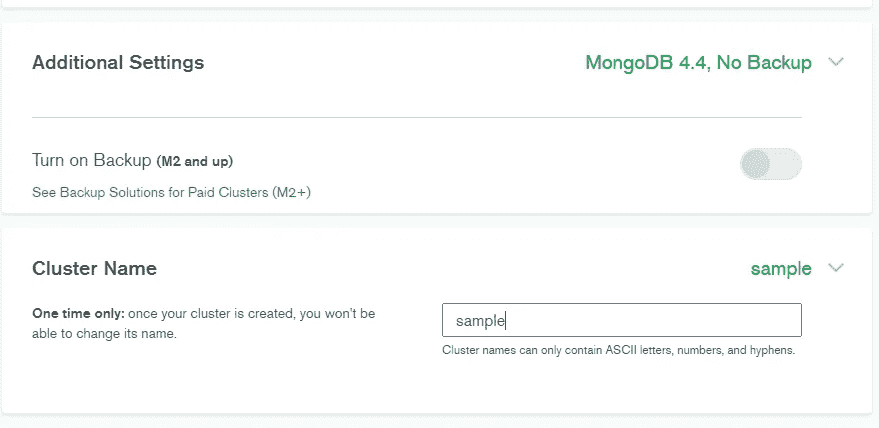
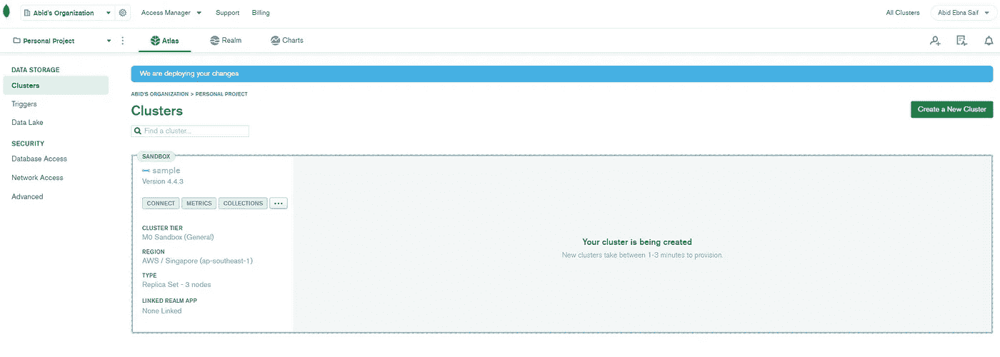
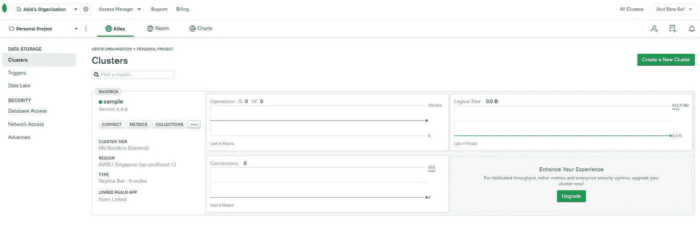
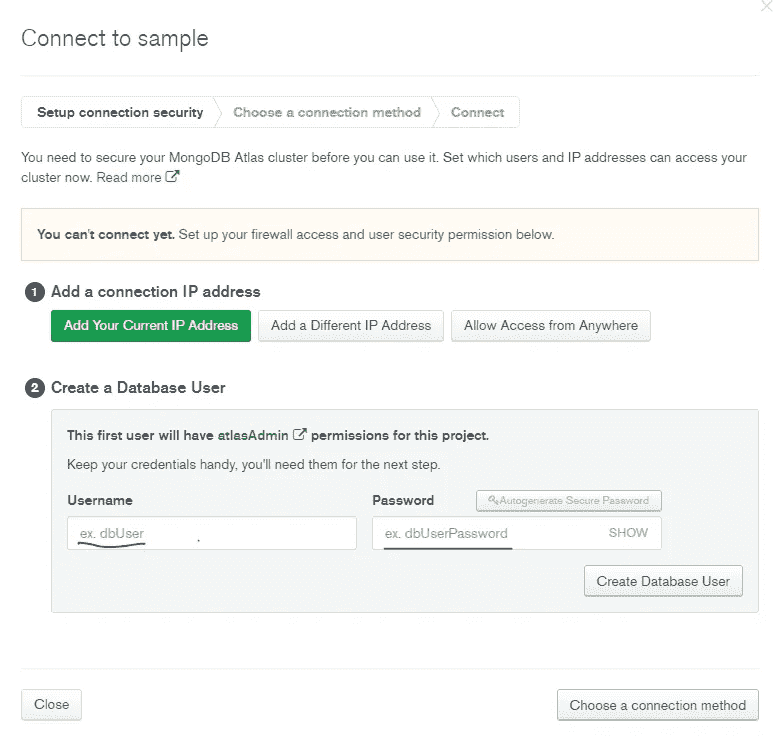
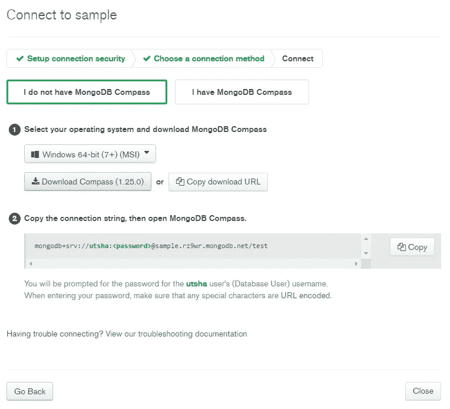
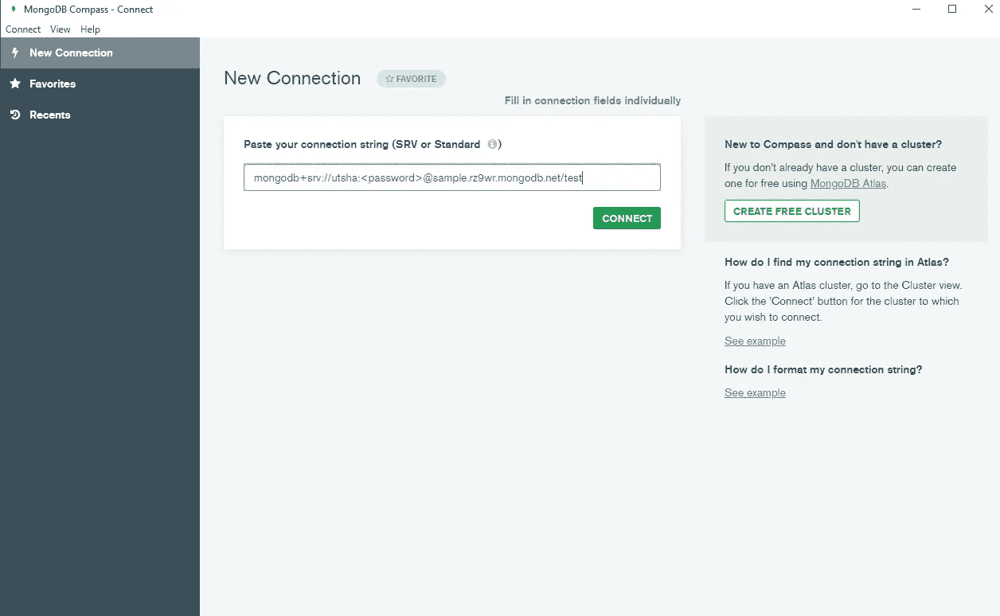
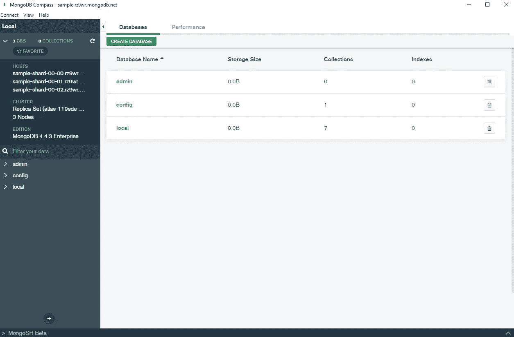

# 在 MongoDB 中创建云数据库

> 原文：<https://towardsdatascience.com/creating-cloud-database-in-mongodb-e941739a9e61?source=collection_archive---------53----------------------->

## 如何使用 MongoDB Atlas 创建免费的云 NoSQL 数据库

在 [Unsplash](https://unsplash.com?utm_source=medium&utm_medium=referral) 上由 [Daniel Páscoa](https://unsplash.com/@dpascoa?utm_source=medium&utm_medium=referral) 拍照

NoSQL 数据库近年来大受欢迎。NoSQL 数据库提供了更多的灵活性，而不是将所有内容存储在行和列值中。有相当多的面向文档的 NoSQL 数据库可用，如 AWS SimpleDB、MongoDB 等。MongoDB 提供了比其他 NoSQL 云数据库更多的灵活性和操作性。这将是一系列文章，包含如何为云数据库创建 MongoDB 集群，如何创建集合，以及通过 MongoDB compass (GUI)或 Python (pyMongo)执行创建、读取、更新和删除(CRUD)操作的信息。此外，以后的文章还将包含一些高级操作。如果您已经知道如何创建一个 MongoDB 集群并通过 MongoDB compass GUI 连接到它，那么您可以忽略这篇文章，转到下一篇文章。

首先，你需要在 MongoDB 中创建一个帐户，它是完全免费的，不需要信用卡信息就可以获得 MongoDB atlas。您可以通过[这里](https://www.mongodb.com/cloud/atlas/register)报名。MongoDB Atlas 提供了云数据库。注册后，您可以选择想要的集群。有三个选项可用，我们将使用的是共享集群，因为它非常适合小型项目和学习目的，而且是免费的。顾名思义，它将是一个共享集群，而其他集群提供更高级和专用的服务。

选择共享集群

下一步是选择云提供商，有三个选项——AWS、Google Cloud 和微软 Azure。此外，基于云提供商，您可以选择您的集群的区域。我选择 AWS 和地区为新加坡。

选择云提供商和地区

现在，下一步将是选择群集层，有多个选项可用，但由于我们更多地将数据库用作学习项目，因此将继续使用 M0 沙盒，该沙盒提供共享 RAM 和 vCPU 以及 512 MB 存储。我们还可以在部署后随时纵向扩展集群层。

选择集群层

因为我们使用的是免费的共享集群，所以没有选择任何备份选项，我们可以根据需要更改集群名称。请记住，集群只能命名一次，之后就不能再更改了。

集群名称

完成上述步骤后，MongoDB 将继续供应和引导您的集群。部署群集只需几分钟。

集群创建

创建并部署集群后，您可以看到如下所示的状态:

创建的集群

现在，您可以选择“连接”选项来设置连接配置。您可以选择设备的 IP 地址或允许从任何地方访问。另外，您需要设置一个用户名和密码来访问您的 MongoDB 数据库。

连接设置

接下来，您需要选择一种连接方法，我通过 MongoDB compass 选择了，您也可以选择 MongoDB shell。MongoDB Compass 基本上是一个更容易操作的图形用户界面。但它的限制很少，看到集合并熟悉 MongoDB 很好，但它缺乏一些可以通过 shell 命令或 python 脚本完成的高级功能。

获取 MongoDB 指南针

如果您的机器上没有安装 MongoDB compass，您可以下载并安装该应用程序。在您安装了 MongoDB compass 并打开应用程序之后，您将看到一个字段，您可以在其中粘贴您将在上面的阶段中获得的连接字符串。

MongoDB 指南针 GUI

输入密码并完成身份验证后，您将会看到如下内容。

MongoDB 集群

如果您按照目前为止的步骤，一直到达最后一个图像，这意味着现在您可以通过 MongoDB compass 访问您的 MongoDB 集群。现在，您可以创建多个数据库，在每个数据库中，您可以创建多个集合。所有这些都将在下一篇文章中讨论。

希望本文能帮助您创建一个免费的 MongoDB 集群。