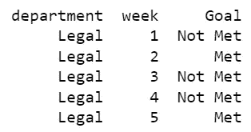
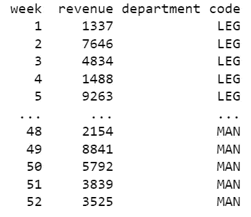
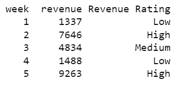
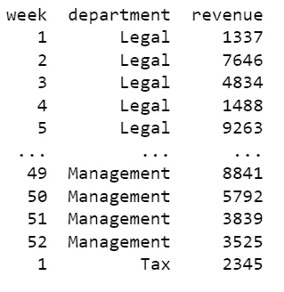

# 在 SQL 查询中创建条件语句

> 原文：<https://towardsdatascience.com/creating-conditional-statements-in-sql-queries-a25339c4f44d?source=collection_archive---------9----------------------->

## IF、CASE 和 IFNULL 语句快速指南


[活动发起人](https://unsplash.com/@campaign_creators?utm_source=medium&utm_medium=referral)在 [Unsplash](https://unsplash.com?utm_source=medium&utm_medium=referral) 上的照片

尽管 SQL 不是一种通用语言，但它包含了与其他语言结构相似的条件语句。经典的 IF 和 CASE 语句允许在查询级别更改数据，而不是在另一个环境(如工作表或数据框)中修改它们。

虽然这些语句都不难掌握，特别是在以前接触过编程语言的情况下，但是它们提供了修改查询结果的强大功能和灵活性。为了演示如何使用这些语句，将创建一个简单的表，详细说明销售 ID、周、部门和收入。

```
CREATE TABLE SALES_2021(
sales_id INTEGER PRIMARY KEY AUTOINCREMENT,
week INTEGER,
department VARCHAR(255),
revenue INTEGER
);
```

# IF 语句

SQL 中最基本形式的 [IF](https://www.w3schools.com/sql/func_mysql_if.asp) 语句与大多数工作表软件中的条件语句非常相似。

```
IF(*condition*, True, False) from *table*;
```

IF 语句简单地引入一些条件，然后根据条件是真还是假返回一个结果。当条件为真时，返回第二个参数，当条件为假时，返回第三个参数。注意，代替 IF 语句，一些实现使用了 [IIF 语句](https://docs.microsoft.com/en-us/sql/t-sql/functions/logical-functions-iif-transact-sql?view=sql-server-ver15)，但是它的操作完全相同。

举一个更具体的例子，假设一个利益相关者请求对每周是否达到 5000 美元收入的部门目标进行细分。他们不一定关心该部门的收入。他们只关心是否达到了目标。

此外，他们不想要一个经过筛选的实现目标的周列表。他们想要所有 52 周的完整列表以及他们的收入目标状态。

```
SELECT department, week, 
IF(revenue > 5000, 'Met', 'Not Met') as 'Goal' 
FROM SALES_2021;
```

SELECT 语句按预期返回部门和星期，但还包括一个 IF 语句。第一个参数引入了收入是否大于$5，000 的条件。当实现收入目标时，返回第二个参数“已达到”，当未达到时返回“未达到”。为了使结果查询更具可读性，在 IF 语句中添加了一个别名。



查询的前五个结果

结果查询返回部门、周以及目标是否达到，如涉众所指定的。

# 案例陈述

虽然 IF 语句提供了一个基本的条件语句，但它不支持多个条件。在这种情况下，必须使用一个 [CASE](https://www.w3schools.com/sql/func_mysql_case.asp) 语句。

```
CASE *field*
WHEN *expression_1* THEN *statement_1*
WHEN *expression_2* THEN *statement_2*
ELSE *statement_3*
END
FROM *table*;
```

案例从指定表中的字段开始。WHEN…THEN 语句随后创建一个特定的条件和返回语句。当*表达式 _1* 为真时，则返回*语句 _1* 。这同样适用于 *expression_2 和 statement_2* 。

如果没有一种情况得到满足，可选的 ELSE 语句(有时称为默认情况)将返回 *statement_3* 。请注意，CASE 语句必须以结尾结束。

假设一个涉众喜欢用部门代码而不是部门名称来查看数据。在这种情况下，他们希望看到法律作为腿，财产作为亲，管理作为人。

```
SELECT week, revenue, 
CASE department 
WHEN 'Legal' THEN 'LEG' 
WHEN 'Property' THEN 'PRO' 
WHEN 'Management' THEN 'MAN' 
END as 'department code' 
FROM SALES_2021;
```

考虑到这些查询会很快变得复杂，通常建议使用可选的空格来使其更具可读性。

```
SELECT week, revenue, 
    CASE department 
        WHEN 'Legal' THEN 'LEG' 
        WHEN 'Property' THEN 'PRO' 
        WHEN 'Management' THEN 'MAN' 
    END as 'department code' 
FROM SALES_2021;
```

注意，CASE 语句指定了 department 字段。在下面的 WHEN…THEN 子句中，该条件因此也适用于 department 字段中的条目。当部门等于“合法”时，则返回“LEG”。同样适用于“财产”和“亲”，“管理”和“人”。END 关闭 CASE 语句，并包含一个别名以使结果更具可读性。



查询的截断结果

因此，查询返回部门代码，而不是部门名称。

虽然这个例子为具有精确等式的数据提供了一个简单的例子，但是假设一个利益相关者想要将一个部门的收入分为高、中或低。

```
SELECT week, revenue, 
    CASE 
        WHEN revenue > 6000 THEN 'High' 
        WHEN revenue < 3000 THEN 'Low' 
        ELSE 'Medium' 
    END as 'Revenue Rating' 
FROM SALES_2021;
```

该查询遵循相同的基本模式，只是 CASE 语句没有明确声明它适用于收入字段。相反，在每个 WHEN…THEN…语句中，该表达式都包含对 revenue 字段的显式比较。

在这种情况下，当收入高于 6，000 美元时，查询返回“高”,低于 3，000 美元时，查询返回“低”。ELSE 将任何其他数量作为“中等”返回，因为它应该在$3，000 和$6，000 之间，包括这两个值。



查询的前五个结果

# IFNULL 语句

当数据中出现空值时，数据专业人员通常会很担心。它们通常代表在数据清理时必须解决的不完整信息或错误。

考虑到对确认空值的高需求，SQL 提供了 [IFNULL](https://www.w3schools.com/sql/func_mysql_ifnull.asp) 语句来标记出现的空值。

```
IFNULL(*field*, *expression*) FROM *table*;
```

IFNULL 有两个参数。第一个参数指定表中的字段，如果条目为空，第二个参数给出返回值。

假设添加了一个新部门，Tax，但是其数据的初始条目省略了名称，使其为空。一个简单的 IFNULL 语句将在查询数据时填充这些信息。

```
SELECT week, IFNULL(department, 'Tax') as 'department', revenue 
FROM SALES_2021;
```

SELECT 语句包含 IFNULL 函数，该函数确定部门字段中的条目是否为空值。如果是，则返回“税”。此外，还添加了一个别名，以提高可读性。



查询的截断结果

最后一行最初省略了任何部门，但是查询添加了税务部门，使得数据清理过程更加简单。

# 结论

SQL 使得向查询添加条件语句变得很简单。有了它们，数据专业人员可以开始将逻辑注入到他们的查询中。它们构成了增加复杂性的基础，允许更复杂的技术来改变和查看数据库中的信息。