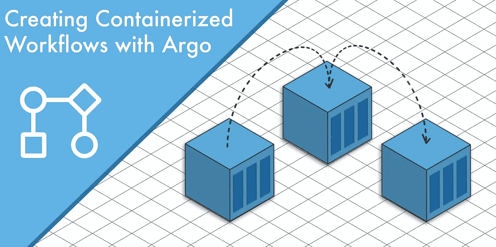
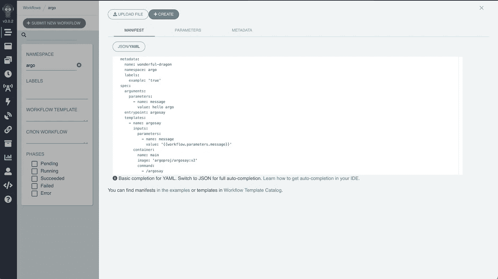
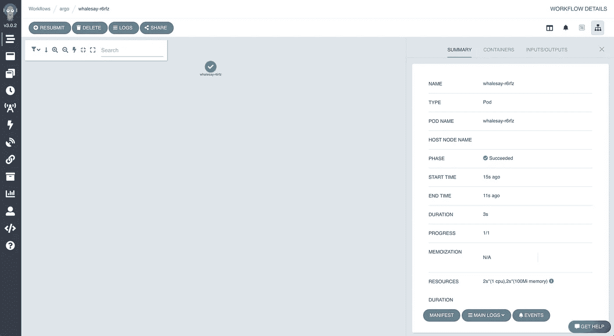
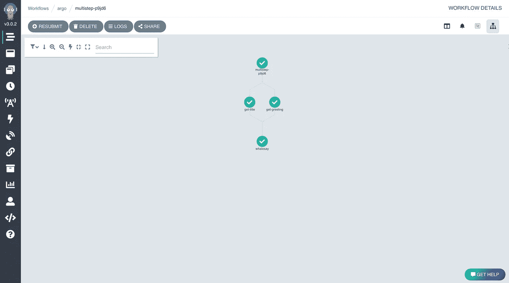
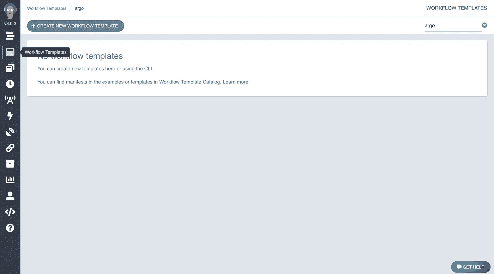
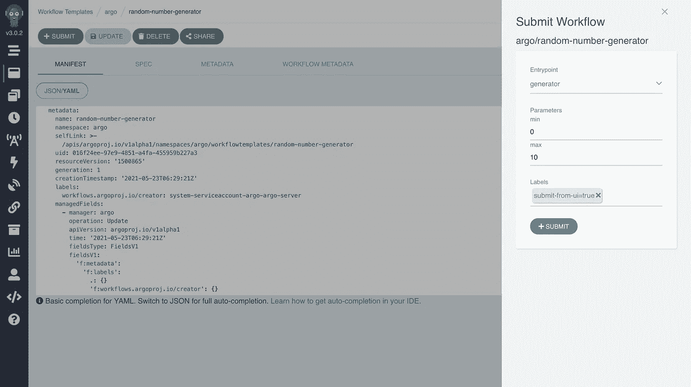
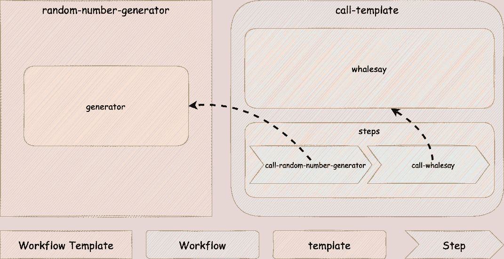
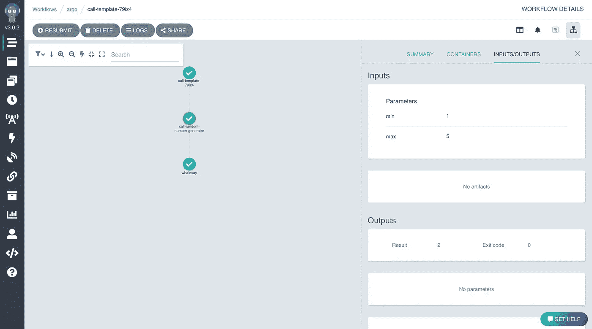

# 使用 Argo 创建容器化的工作流

> 原文：<https://towardsdatascience.com/creating-containerized-workflows-with-argo-ec1011b04370?source=collection_archive---------9----------------------->



## Kubernetes 上的 Argo 工作流入门

## 探索 Argo 工作流的核心概念

在[的上一篇文章](/machine-learning-pipelines-with-kubeflow-4c59ad05522)中，我探索了 Kubeflow 管道，并完成了创建和执行一个简单的机器学习管道的过程。在本文中，我将仔细研究 Argo，这是一个开源的工作流编排引擎，它被用作 Kubeflow 管道的默认编排平台。

# 建立 Kubernetes 集群

为了开始玩 Argo，我们首先需要一个正在运行的 Kubernetes 集群。我将使用 EKS，AWS 上的托管 Kubernetes 服务，并通过所需的步骤让 Argo 在 EKS 上运行。只要部署了 Argo 并且拥有在集群上运行工作流所需的权限，任何 Kubernetes 集群都可以工作。

开始使用 EKS 最简单的方法是使用 *eksctl* 命令行工具。安装 *eksctl* 的说明可以在这里找到:[https://github.com/weaveworks/eksctl/blob/main/README.md](https://github.com/weaveworks/eksctl/blob/main/README.md)

一旦安装了 eksctl，我们将通过运行以下命令来创建 Kubernetes 集群:

```
eksctl create cluster
```

**注意**:上面的命令创建了 AWS 资源，这将在您的账户上产生费用。默认情况下，`eksctl create cluster`命令创建一个包含 2 个 m5.large 类型 EC2 实例的 Kubernetes 集群，在撰写本文时，每个实例的成本约为每小时 0.10 美元。

此命令可能需要 15–20 分钟来完成群集资源调配。一旦完成，我们要做的第一件事就是创建一个命名空间来存放我们的 Argo 资源。我们将使用`kubectl`来做到这一点:

```
kubectl create namespace argo
```

接下来，我们将从 Argo GitHub 库下载 Argo 安装清单:

```
wget [https://raw.githubusercontent.com/argoproj/argo-workflows/stable/manifests/install.yaml](https://raw.githubusercontent.com/argoproj/argo-workflows/master/manifests/install.yaml) .
```

这将下载一个名为 install.yaml 的 YAML 清单文件，它描述了我们启动和运行 Argo 所需的所有 Kubernetes 资源。

为了访问 Argo 服务器用户界面，我们必须对这个文件做一些修改。

1.  将 *argo-server* 服务更新为*负载平衡器类型。*这将在 AWS 中提供一个网络负载平衡器，将请求路由到 *argo-server* 服务。生成的资源定义应该如下所示:

2.更新 argo-server 部署，添加一个名为 *BASE_HREF* 的环境变量，其值为“/”。结果应该如下所示(为简洁起见，资源定义被截断):

完成这些修改后，我们可以创建清单中定义的资源:

```
kubectl apply -n argo -f install.yaml
```

接下来，我们需要创建一个入口资源:

最后，为了让 Argo 能够访问其他 Kubernetes 资源，我们需要为 Argo 服务帐户分配一个角色。在实际的生产集群中，我们希望将这个服务帐户分配给一个具有特定有限权限的角色，但是现在，我们只授予这个帐户 admin 访问权限。我们可以使用以下命令来实现这一点:

```
kubectl -n argo create rolebinding default-admin --clusterrole=admin --serviceaccount=argo:default
```

这就是我们开始之前需要完成的所有设置。现在，我们将通过运行以下命令来获取 Argo 服务器 UI 的公共 URL:

```
kubectl get svc argo-server -n argo
```

该命令将在 EXTERNAL-IP 列中返回公共 URL。应该以*. elb . Amazon AWS . com*结尾

现在打开浏览器，导航到:[*https://{ YOUR _ EXTERNAL _ IP }:2746*](/{YOUR_EXTERNAL_IP}:2746)

**注意**:如果你在 MacOS 上使用 Chrome，并且在导航到 Argo 服务器 UI 时很难绕过浏览器发出的安全警告，Chrome 中有一个隐藏的解决方法:只需单击浏览器窗口中的任意位置以确保窗口处于焦点状态，然后键入*this insural。*有关此变通办法的更多详细信息，请参见[这是不安全的——绕过谷歌浏览器的“您的连接不是私人的”警告](https://deployhappiness.com/this-is-unsafe-bypassing-the-google-chrome-your-connection-is-not-private-warning/)

如果一切正常，您应该会看到一个 Argo 服务器登录页面，如下所示:


Argo 服务器用户界面登录页面

# 执行您的第一个工作流程

设置完成后，让我们执行 Argo 的第一个工作流。

导航至**工作流**(这是侧边栏中的顶部图标)> **提交新工作流>使用完整工作流选项编辑**

这将打开工作流创建体验，其中包括一个填充了基本工作流 YAML 清单的文本编辑器，以及工作流参数和元数据的附加选项卡。



Argo 工作流创建

让我们用一个运行如下所示的 [Whalesay](https://hub.docker.com/r/docker/whalesay/) 容器的简单工作流来替换这个默认工作流清单，然后单击 **Create** 来运行工作流:

一旦您开始工作流程，您将看到一个工作流程图，它将随着工作流程的进展而更新(在这种情况下，它只是一个单独的步骤)。在此页面中，您将能够查看工作流的详细信息、输入、输出和日志。在我们的准系统 Hello World 工作流程中，这里没有太多可看的，但是你可以导航到**主日志**来确认 Whalesay ASCII 艺术被记录。



简单的 Argo 工作流程图

# 了解工作流清单

现在我们知道了如何执行工作流，让我们仔细看看我们用来定义工作流的 YAML 清单。

## [计]元数据

清单的前几行定义了工作流元数据，特别是 *generateName* 字段，它将与一个随机生成的字符串组合起来形成我们工作流的名称(我们也可以使用 *name* 字段来显式定义名称，但是这个名称必须是唯一的)，以及 *namespace* 字段，它定义了工作流将在其中执行的 Kubernetes 名称空间。

## 工作流规范

清单的其余部分定义了工作流规范，这是定义实际工作流逻辑的地方。在上例中，工作流规范有两个顶级字段:

*   *入口点*:指定首先执行的模板。
*   *模板*:定义工作流程中使用的所有模板。正如我们将很快看到的，*模板*在 Argo 中是一个加载的术语，但在这里模板只是表示工作流执行的一个单元。在我们的 Whalesay 工作流中，我们只有一个名为 **whalesay** 的类型为**的容器模板。**由于这个模板定义了一个要执行的容器，我们指定了要使用的容器图像、要执行的命令和要传入的参数。

# 创建多步骤工作流

现在让我们介绍一个更复杂的工作流，它按顺序执行几个不同的步骤。这个工作流将接受 2 个参数、一个称呼和一个用户名，它将通过使用提供的参数执行 Whalesay 容器来创建一个问候消息来结束。

虽然我们可以很容易地用 Whalesay 容器来实现这一点，但是为了展示 Argo 提供的其他一些特性，我们将采取一种更迂回的方法。

这是我们新工作流程的 YAML 清单:

让我们来分解一下:

*   您会注意到的第一个区别是在第 6 行添加了*参数*字段。这是我们定义将被传递到我们的工作流中的*称呼*和*用户名*参数的地方。
*   这个工作流中定义的第一个模板在第 14 行。这个模板名为*问候语*，接受名为*问候语*的参数，类型为 Script。脚本模板类似于容器模板，因为它们需要容器图像和命令；然而，脚本模板允许我们传入一个内联脚本来在容器上执行。该模板执行一个简单的 Python 脚本，该脚本检索 *salutation* 参数的值，然后将其打印出来。
*   下一个模板叫做*用户*，也是脚本类型。这个模板就像 salutation 模板一样，只是这个模板使用了一个 shell 脚本而不是 Python 脚本(这里没有特别的理由不使用 Python；这只是为了说明我们并不局限于 Python 作为我们的脚本语言)。
*   第三个模板与我们之前使用的 Whalesay 容器模板相同，只是现在它接受两个参数，*问候语*和*用户名*，并使用这些参数创建问候语。
*   第四个模板是一个步骤模板。步骤模板允许我们将一系列其他模板链接在一起，创建一个多步骤工作流，其中一个模板的输出可以用作另一个模板的输入。第一步使用*问候语*模板并传入工作流参数*问候语*，第二步使用*用户*模板并传入工作流参数*用户名*，最终模板使用 *whalesay* 模板并传入前两步的输出。

以下是此工作流程的工作流程图:



多步骤工作流程图

**注意**:如果你执行了这个工作流程(或者只是仔细看了一下这个图)，你可能已经注意到*获取标题*和*获取问候*步骤是并行执行的，然后在两个步骤都完成*之后，再运行*步骤。这是因为步骤模板实际上接受步骤列表的列表。内部列表中的步骤将并行运行，外部列表中的步骤将按顺序运行。例如，上面工作流的列表结构如下所示:

```
[[get-title, get-greeting], [whalesay]]
```

这就是为什么 *get-title* 和 *get-greeting* 并行运行，而 *whalesay* 在两者完成后运行。

## 重用工作流步骤

工作流编排平台最重要的特性之一是能够跨多个工作流共享常用步骤。这允许平台的用户通过使用其他用户已经实施的通用步骤库来快速开始创建工作流。例如，您可以为常见的数据转换或与外部服务的集成创建可重用的步骤。

Argo 中表示可重用步骤(或一组步骤)的结构称为工作流模板。这不要与我们之前在定义工作流 YAML 清单时讨论的模板相混淆。为清楚起见，区别如下:

*   模板:表示工作流中的单个执行单元。有许多不同类型的模板，包括*容器*、*脚本*和*步骤*。
*   工作流模板:保存在集群中的工作流定义，可以作为独立工作流或任何其他工作流的一部分执行。

让我们创建一个工作流模板来看看它是如何工作的。我们的工作流模板将是一个随机数生成器，它接受最小值和最大值，并返回指定范围内的随机整数。

Argo 服务器 UI 中的工作流模板选项卡是我们可以查看和创建工作流模板的地方。



Argo 用户界面-工作流模板

创建工作流模板与创建工作流非常相似，只是当我们创建工作流模板时，它会被保存以供以后使用，而不是像工作流那样立即执行。

以下是我们将使用的工作流模板的 YAML 清单:

工作流模板清单

正如您所看到的，这个清单就像我们之前创建的工作流清单一样:它接受两个参数， *min* 和 *max* ，并且有一个 Python 脚本模板，该模板在指定的范围内生成一个随机数。

创建此工作流模板后，我们将能够从 UI 中的“工作流模板”选项卡查看它，并通过选择它并单击**提交**将其作为独立工作流提交



将工作流模板作为独立工作流提交

我们也可以在其他工作流中使用此工作流模板。让我们看看这是如何工作的。我们将返回工作流选项卡，选择**提交新工作流**，然后输入以下 YAML 清单:

这个工作流很像我们已经讨论过的多步骤工作流，只是这次步骤模板不仅仅是将在这个工作流中直接定义的模板链接在一起。步骤模板中的第一步(上面的第 19 行)使用`templateRef`字段而不是`template`字段来引用工作流模板中定义的模板。在这个特殊的例子中，我们引用了在`random-number-generator`工作流模板中定义的`generator`模板。

如果这仍然有点混乱，下面的图表说明了本例中工作流、工作流模板和模板之间的关系:



当我们执行这个工作流时，*call-random-number-generator*步骤将像它是一个直接在工作流中定义的模板一样运行，而实际上它的实现被封装在*random-number-generator*工作流模板中。



从工作流中引用工作流模板

这意味着我们可以创建许多其他工作流(或其他工作流模板)来使用该功能，而无需考虑其实现的细节，如果我们需要修改该功能(例如，当前随机范围不包括 *max* 值，这可能是也可能不是期望的行为；或者，我们可能希望将它重构到一个容器映像中，而不是一个内联脚本中，以便更容易地测试该功能)，我们可以在工作流模板中这样做，因为我们知道所有的消费者都将开始使用这些修改，而无需在他们端做任何额外的工作。

## 结论

在本文中，我们看到了如何通过创建几个简单的工作流来开始使用 Argo 工作流。我们研究了如何在工作流中的多个模板之间传递参数，以及如何使用工作流模板封装共享逻辑。

虽然我们在这里探索的例子非常简单，但是这些相同的核心概念可以用来在 Kubernetes 上构建和执行强大的容器化工作流，如果您决定继续探索 Argo 必须提供的其他功能，它们将成为一个强大的基础。

你可以在【https://github.com/gnovack/argo-workflows-getting-started】的*Argo-workflows-getting-started*库中找到我们创建的所有 YAML 清单

## 参考资料:

*   [https://argoproj.github.io/argo-workflows/quick-start/](https://argoproj.github.io/argo-workflows/quick-start/)
*   [https://www.eksworkshop.com/advanced/410_batch/](https://www.eksworkshop.com/advanced/410_batch/)

感谢阅读。如有任何问题或意见，请随时联系我们。