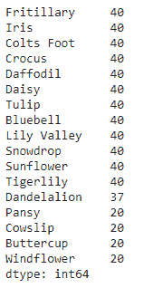
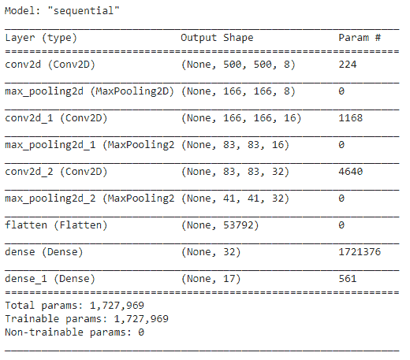
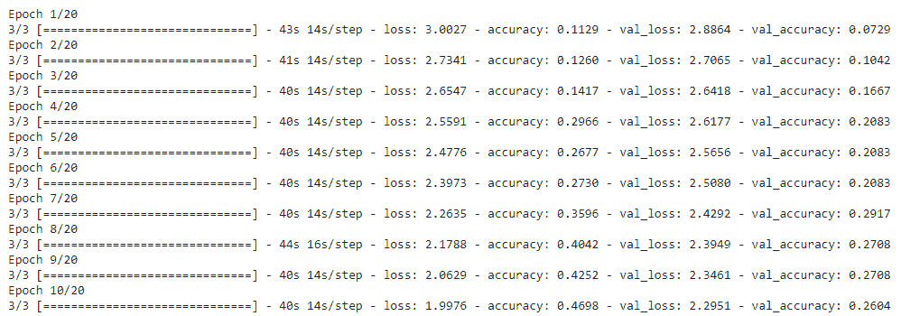
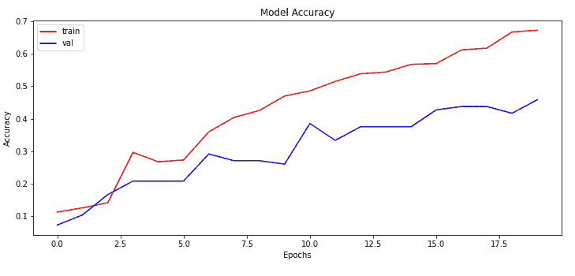
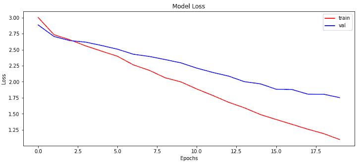
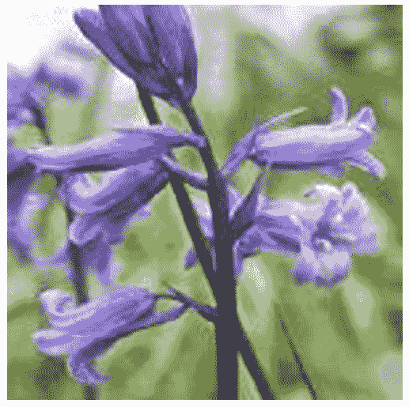
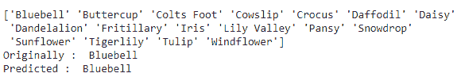

# 从头开始创建卷积神经网络

> 原文：<https://towardsdatascience.com/creating-convolutional-neural-network-from-scratch-d3a8389dfb80?source=collection_archive---------16----------------------->

## 在 Graviti 数据平台上使用 CNN 建立图像分类模型


艾莉娜·格鲁布尼亚克在 [Unsplash](https://unsplash.com?utm_source=medium&utm_medium=referral) 上的照片

图像分类基本上帮助我们将图像分类到不同的标签中。这就像将不同的图像放入它们所属的桶中。例如，被训练来识别猫和狗的图像的模型将有助于分别分离不同的猫和狗的图像。有多种深度学习框架，如 Tensorflow、Keras、Theano 等，可用于创建图像分类模型。今天我们将使用 Keras 和 Tensorflow 从头开始创建一个图像分类模型。

用于创建图像的相关建模可以使用 CNN 来完成。卷积神经网络主要用于图像相关的建模。它是执行图像分类、图像检测、图像分割等的最简单的方法之一。它包含不同类型的卷积层，有助于使用不同大小的内核过滤掉图像中最重要的特征。一些最重要的层是:

1.  **Conv2D**

它用于创建卷积核，卷积核与输入层卷积以产生输出张量。

**2。MaxPooling2D**

这是一种缩减采样技术，根据池大小取最大值。

3.**展平**

它使输入变平并创建一维输出。

有多个超参数可以用来相应地提高模型性能。这些超参数可以包括神经元的数量、内核大小、池大小、激活函数等。

在本文中，我们将从头开始使用 CNN 创建一个网络。我将向您展示如何从在线数据源加载数据，预处理数据并为建模做好准备，最后设计模型架构。

让我们开始吧…

# 安装所需的库

我们将从安装所有需要的库开始。我们将安装 Keras、TensorFlow，还将安装用于加载数据集的 [TensorBay](https://docs.graviti.com/guide/tensorbay?utm_source=medium&utm_medium=referral&utm_campaign=20211108-himanshu-doc) (在 [Graviti](https://www.graviti.com/?utm_source=medium&utm_medium=referral&utm_campaign=20211109-himanshu-blog) 数据平台上的 SDK)。下面给出的命令可以做到这一点。

```
!pip install tensorflow
!pip install tensorbay
!pip install keras
```

# 导入所需的库

在这一步中，我们将导入所有必需的库和函数来加载数据、预处理数据并创建模型。

```
# Library imports
from tensorbay import GAS
from PIL import Image
import matplotlib.pyplot as plt
from tensorbay.dataset import Data, Dataset
import numpy as np
import pandas as pd
import matplotlib.pyplot as plt
from matplotlib.image import imread
import cv2
import random
from os import listdir
from sklearn.preprocessing import LabelBinarizer
from keras.preprocessing import image
from keras.preprocessing.image import img_to_array, array_to_img
from tensorflow.keras.optimizers import Adam
from keras.models import Sequential
from keras.layers import Conv2D, MaxPooling2D, Activation, Flatten, Dropout, Dense
from sklearn.model_selection import train_test_split
```

# 加载数据集

这是第一步，我们将从 TensorBay 加载数据。为了从 TensorBay 下载数据集，我们需要创建一个帐户，并派生出一个我们想要处理的数据集，它包含大量不同的图像数据集。为了在我们的 Jupyter 笔记本中加载数据集，我们需要有 TensorBay 的访问密钥，我们可以从我们的帐户中的开发者工具下载该密钥。

```
gas = GAS("<Your Key>")
dataset = Dataset("Flower17–1", gas)
segment = dataset[1]
```

对于这篇文章，我使用的是 [Flower 17 数据集](https://gas.graviti.com/dataset/hellodataset/Flower17?utm_source=medium&utm_medium=referral&utm_campaign=20211108-himanshu-datasets)，你可以看到我已经用 TensorBay 加载了它。

# **预处理数据集**

在这一步，我们将预处理数据，并为建模做好准备。我们将从创建图像和标签列表并向其中加载数据开始。

```
image_list, label_list = [], []
for data in segment:
with data.open() as fp:
image_list.append(img_to_array(Image.open(fp).resize((500, 500))))
label_list.append(data.label.classification.category)
```

接下来，让我们直观地看到这个数据集中的类的数量。

```
# Visualize the number of classes count
label_counts = pd.DataFrame(label_list).value_counts()
label_counts
```



数据标签(来源:作者)

接下来，我们将分割数据集，对其进行规范化，并对标签进行二值化。

```
# Splitting dataset
x_train, x_test, y_train, y_test = train_test_split(image_list, label_list, test_size=0.2, random_state = 10)
# Normalize and reshape data
x_train = np.array(x_train, dtype=np.float16) / 225.0
x_train = x_train.reshape( -1,500,500,3)
x_test = np.array(x_test, dtype=np.float16) / 225.0
x_test = x_test.reshape( -1,500,500,3)
# Label binarizing
lb = LabelBinarizer()
y_train = lb.fit_transform(y_train)
y_test = lb.fit_transform(y_test)
print(lb.classes_)
```


标签二进制化(来源:作者)

# **创建模型**

这是最后一步，我们将创建模型架构，编译模型并训练它。在创建模型架构之前，让我们将训练数据分为训练和验证。

```
# Splitting the training data set into training and validation data sets
x_train, x_val, y_train, y_val = train_test_split(x_train, y_train, test_size = 0.2)
# Building model architecture
model = Sequential()
model.add(Conv2D(8, (3, 3), padding="same",input_shape=(500,500,3), activation="relu"))
model.add(MaxPooling2D(pool_size=(3, 3)))
model.add(Conv2D(16, (3, 3), padding="same", activation="relu"))
model.add(MaxPooling2D(pool_size=(2, 2)))
model.add(Conv2D(32, (3, 3), padding="same", activation="relu"))
model.add(MaxPooling2D(pool_size=(2, 2)))
model.add(Flatten())
model.add(Dense(32, activation="relu"))
model.add(Dense(num_classes, activation="softmax"))
model.summary()
```



模型架构(来源:作者)

```
# Compiling model
model.compile(loss = 'categorical_crossentropy', optimizer = Adam(0.0005),metrics=['accuracy'])
# Training the model
epochs = 20
batch_size = 128
history = model.fit(x_train, y_train, batch_size = batch_size, epochs = epochs, validation_data = (x_val, y_val))
```



培训(来源:作者)

正如您在上面看到的，我们已经使用一些超参数创建并训练了模型，模型精度不是很好，但您可以随时调整超参数以提高性能。我们也可以使用下面给出的命令保存模型。

```
# Saving model
model.save("/content/flower_species.h5")
Let's visualize the model training and loss history.
#Plot the training history
plt.figure(figsize=(12, 5))
plt.plot(history.history['accuracy'], color='r')
plt.plot(history.history['val_accuracy'], color='b')
plt.title('Model Accuracy')
plt.ylabel('Accuracy')
plt.xlabel('Epochs')
plt.legend(['train', 'val'])
plt.show()
```



准确性(来源:作者)

```
#Plot the loss history
plt.figure(figsize=(12, 5))
plt.plot(history.history['loss'], color='r')
plt.plot(history.history['val_loss'], color='b')
plt.title('Model Loss')
plt.ylabel('Loss')
plt.xlabel('Epochs')
plt.legend(['train', 'val'])
plt.show()
```



损失(来源:作者)

最后，让我们也使用该模型创建一些预测。

```
# Storing predictions
y_pred = model.predict(x_test)
Let's verify one of the predictions.
# Plotting image to compare
img = array_to_img(x_test[4])
img
```



花卉图像(来源:作者)

```
# Finding max value from prediction list and comparing original value vs predicted
labels = lb.classes_
print(labels)
print("Originally : ",labels[np.argmax(y_test[4])])
print("Predicted : ",labels[np.argmax(y_pred[4])])
```



预测(来源:作者)

继续，使用不同的数据集尝试这种方法，并按照本文轻松创建 CNN 模型。如果您发现任何困难，请在回复部分告诉我。

# 在你走之前

***感谢*** *的阅读！如果你想与我取得联系，请随时通过 hmix13@gmail.com 联系我或我的*[****LinkedIn 个人资料****](http://www.linkedin.com/in/himanshusharmads) **。可以查看我的*[****Github****](https://github.com/hmix13)**简介针对不同的数据科学项目和包教程。还有，随意探索* [***我的简介***](https://medium.com/@hmix13) *阅读我写过的与数据科学相关的不同文章。***