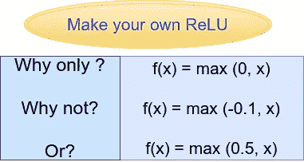
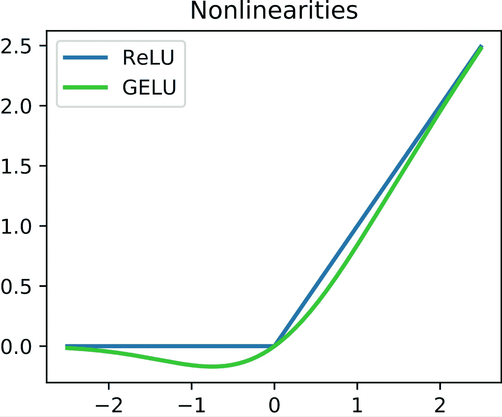

# 在 TensorFlow 2 中使用 Lambda 层创建自定义激活函数

> 原文：<https://towardsdatascience.com/creating-custom-activation-functions-with-lambda-layers-in-tensorflow-691398b8a52d?source=collection_archive---------17----------------------->

## 学习在 TensorFlow 2 中使用 lambda 层创建一个简单的自定义 ReLU 激活函数

之前我们已经看到了如何创建自定义损失函数— [使用 TensorFlow 2](/creating-custom-loss-functions-using-tensorflow-2-96c123d5ce6c) 创建自定义损失函数



自定义 ReLU 函数(来源:图片由作者创建)

**简介**

在本文中，我们看看如何创建自定义激活函数。虽然 TensorFlow 已经包含了一系列内置的激活函数，但仍有方法可以创建您自己的自定义激活函数或编辑现有的激活函数。

ReLU(整流线性单元)仍然是任何神经网络结构的隐藏层中最常用的激活函数。ReLU 也可以表示为函数 f(x ),其中，

f(x) = 0，当 x<0,

and, f(x) = x, when x ≥ 0.

Thus the function takes into consideration only the positive part, and is written as,

**f(x)= max(0，x)**

或者在代码表示中，

```
**if input > 0:
   return input
else:
   return 0**
```

但是这个 ReLU 函数是预定义的。如果我们想自定义这个函数或者创建自己的 ReLU 激活怎么办？在 TensorFlow 中有一个非常简单的方法来做到这一点——我们只需使用 *Lambda 层*。



ReLU 和 GeLU 激活功能(资料来源:由 Ringdongdang —自己的作品，CC BY-SA 4.0，[https://commons.wikimedia.org/w/index.php?curid=95947821](https://commons.wikimedia.org/w/index.php?curid=95947821))

**如何使用 lambda 图层？**

```
**tf.keras.layers.Lambda(lambda x: tf.abs(x))**
```

Lambda 只是另一个可以在 TensorFlow 中直接调用的层。在 lambda 层中，首先指定参数。在上面的代码片段中，这个值是‘x’(λx)。在这种情况下，我们希望找到 x 的绝对值，所以我们使用 tf.abs(x)。所以如果 x 的值为-1，这个 lambda 层会将 x 的值更改为 1。

**如何使用 lambda 图层创建自定义 ReLU？**

```
**def custom_relu(x):
    return K.maximum(0.0,x)****model = tf.keras.models.Sequential([
     tf.keras.layers.Flatten(input_shape=(128,128)),
     tf.keras.layers.Dense(512),
     tf.keras.layers.Lambda(custom_relu),
     tf.keras.layers.Dense(5, activation = 'softmax')
])**
```

上面的代码片段展示了如何在 TensorFlow 模型中实现自定义 ReLU。我们创建一个函数 custom_relu，并返回最大值 0 或 x(与 relu 函数一样)。

在下面的顺序模型中，在密集层之后，我们创建一个 Lambda 层，并在自定义激活函数中传递它。但是这段代码仍然没有做任何与 ReLU 激活函数不同的事情。

当我们开始摆弄自定义函数的返回值时，乐趣就开始了。假设我们取 0.5 和 x 的最大值，而不是 0 和 x 的最大值。然后可以根据需要更改这些值。

*def custom _ relu(x):
return k . maximum(0.5，x)*

```
**def custom_relu(x):
    return K.maximum(0.5,x)****model = tf.keras.models.Sequential([
     tf.keras.layers.Flatten(input_shape=(128,128)),
     tf.keras.layers.Dense(512),
     tf.keras.layers.Lambda(custom_relu),
     tf.keras.layers.Dense(5, activation = 'softmax')
])**
```

**在 mnist 数据集上使用 lambda 激活的示例**

```
***#using absolute value (Lambda layer example 1)*****import tensorflow as tf
from tensorflow.keras import backend as K****mnist = tf.keras.datasets.mnist****(x_train, y_train),(x_test, y_test) = mnist.load_data()
x_train, x_test = x_train / 255.0, x_test / 255.0****model = tf.keras.models.Sequential([
  tf.keras.layers.Flatten(input_shape=(28, 28)),
  tf.keras.layers.Dense(128),
  tf.keras.layers.Lambda(lambda x: tf.abs(x)), 
  tf.keras.layers.Dense(10, activation='softmax')
])****model.compile(optimizer='adam',
              loss='sparse_categorical_crossentropy',
              metrics=['accuracy'])****model.fit(x_train, y_train, epochs=5)
model.evaluate(x_test, y_test)**
```

用 mnist 数据集上的绝对值替换 ReLU 激活给出了 97.384%的测试准确度。

```
***#using custom ReLU activation (Lambda layer example 2)*****import tensorflow as tf
from tensorflow.keras import backend as K****mnist = tf.keras.datasets.mnist****(x_train, y_train),(x_test, y_test) = mnist.load_data()
x_train, x_test = x_train / 255.0, x_test / 255.0****def my_relu(x):
    return K.maximum(-0.1, x)****model = tf.keras.models.Sequential([
    tf.keras.layers.Flatten(input_shape=(28, 28)),
    tf.keras.layers.Dense(128),
    tf.keras.layers.Lambda(my_relu), 
    tf.keras.layers.Dense(10, activation='softmax')
])****model.compile(optimizer='adam',
              loss='sparse_categorical_crossentropy',
              metrics=['accuracy'])****model.fit(x_train, y_train, epochs=5)
model.evaluate(x_test, y_test)**
```

在 mnist 数据集上，用定制的 ReLU 激活替换 ReLU 激活，取最大值-0.1 或 x，给出 97.778%的测试准确度。

**结论**

尽管 lambda 层使用起来非常简单，但它们有许多限制。在下一篇文章中，我将讲述如何在 TensorFlow 中创建完全自定义的层，这些层也是可训练的。