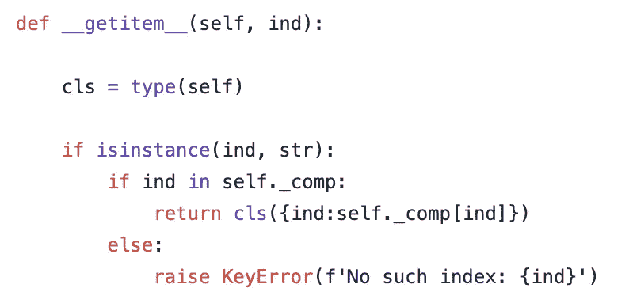

# 在 Python 中创建自定义列表

> 原文：<https://towardsdatascience.com/creating-custom-lists-in-python-4f413b65282a?source=collection_archive---------13----------------------->

## 探索 OOP 基础，尝试 Python 中的自定义数据类型


克里斯里德在 [Unsplash](https://unsplash.com?utm_source=medium&utm_medium=referral) 上的照片

在本文中，我们将了解面向对象编程的基础，以及如何使用 Python 类来创建我们自己的定制列表。我们将在不使用任何包的情况下这样做(没有导入语句！).

假设我们想要创建一个新的数据容器类型，它将充当一个列表(例如，我们可以对它进行索引和切片)，但同时可以包含来自多个来源的数据，我们可以像在字典中一样提取这些数据。

比方说，我们有一个列表字典:

```
d ={‘key1’ : [‘val11’, ‘val12’, ‘val13’],
    ‘key2’ : [‘val21’, ‘val22’, ‘val23’],
    ‘key3’ : [‘val31’, ‘val32’, ‘val33’]}
```

但是我们希望能够轻松地处理 d.values()中的所有列表，就像它是一个大列表一样:

```
l = [‘val11’, ‘val12’, ‘val13’,
     ‘val21’, ‘val22’, ‘val23’,
     ‘val31’, ‘val32’, ‘val33’]
```

但同时，我们不想失去字典的键值绑定。想象一个具有这些特征的物体:


作者截图

因此，它是一个充当列表的对象，但在后台为每个元素保留键。姑且称之为 *dinx* 。

首先，我们知道要初始化这个对象，我们需要一个列表字典。让我们也允许元组，并说它们将表示静态元素，如果我们改变 dinx 'list '，它们将不会改变。因此，我们需要断言输入(姑且称之为 *comp，【components)是一个字典，并且包含列表或元组。后者可以用 *isinstance* 第二个自变量中的*【list，tuple】*或 *(list，tuple)* 来实现。我们还应该在字典键中只允许字符串，以避免在调用数字索引时产生混淆。*

我们将把 *comp* 赋值给 self，并加上一个下划线前缀，表示它是供类内部使用的。


作者截图

我们还需要定义一个函数来获得一个映射变量，我们可以用它来获得字典的列表表示中元素的顺序，我们将调用 *_comp_map* (稍后会用到):


作者截图

所以，*自我。_comp_map* 看起来像这样:

```
[(‘key1’, ‘val11’),
 (‘key1’, ‘val12’),
 (‘key1’, ‘val13’),
 (‘key2’, ‘val21’),
 (‘key2’, ‘val22’),
 (‘key2’, ‘val23’),
 (‘key3’, ‘val31’),
 (‘key3’, ‘val32’),
 (‘key3’, ‘val33’)]
```

这已经是一个键-值元组的列表，但是我们想让它看起来更漂亮。

我们现在需要做的是编写一个 *dinx* 的 *dunder* 方法，名为 *__repr__* ，它会在我们每次调用时显示 *dinx* 的表示。因为我们想让我们的 *dinx* 在调用时看起来像一个列表，我们将从 *_sum_lists* 和 *_getall* 方法开始，我们可以用它们来展平 *_comp* 中的列表字典。


作者截图

然后我们可以使用 *__repr__* 中的 *_getall* 输出来指定当我们在控制台中调用 *dinx* 时它的样子:


作者截图

现在，我们可以初始化并调用我们的 *dinx:*


作者截图

## 索引和切片

太好了！让我们实现通过索引和切片调用值的能力。这个想法是我们想要结合字典和列表索引。所以，假设上面例子中的一个项 l[0]应该是一个 *dinx(1)* ，即有一个值 1 和一个键*‘A’*。一个切片 *l[:5]* 应该是一个 *dinx(1，2，3，0，1)* ，分别带有关键字*‘A’*和*‘B’*。

由于我们只允许在 *_comp* 中使用字符串字典键，我们可以假设如果它看到字符串索引输入，它应该返回底层 *_comp* 键的值。因此，我们可以在 *dinx* 中结合列表和字典类型的索引。

首先，当我们通过索引获取 *dinx* 的值时，我们希望返回一个 *dinx* 。因此，我们需要将 *cls* 变量定义为 *type(self)* ，然后我们可以使用它在 return 语句中启动一个新的 *dinx* :



*如果传递的索引(ind)是一个字符串，则返回一个以 ind 为关键字的新 dinx(s*作者捕获的屏幕截图)

为了从 *int* 或 *slice* 类型生成 *dinx* ，我们需要定义一个方法，将我们的 *_comp_map* 元组列表转换成一个字典，我们可以使用它在 *return* 语句中启动一个新的 *dinx* :


作者截图

回到 *__getitem__:*


作者截图

让我们做几个测试:


在上面的例子中，我们是用 ***struct*** 方法单独定义的。它返回 *dinx* 的字典表示。在文章的最后将提供关于 *dinx* 类的完整代码。(作者截图)

## 将 dinxs 相加

在 Python 中，实现加法运算最常用的 *dunder* 方法有两种: *__add__* (+) 和 *__iadd__* (+=)。我们将从后者开始:


作者截图

这里我们取两个输入， *self* 和 *other* ，其中 *other* 是另一个 *dinx* ，我们迭代 *other 中的每个元素。_comp* 并将其添加到 *self。_comp* 如果密钥存在，或者在 *self 中创建一个新密钥。_comp* 否则。我们只对列表这样做，从而保持元组不变，这允许我们在我们的 *dinx* 中定义我们不想变异的元素。

定义了原地加法方法(x+=y)之后，我们现在可以用它来定义 x+y 类型的加法。这个想法很简单，我们将使用 *dinx* 的一个临时深度副本，在它上面做一个 *other* 的就地添加，并返回结果:


作者截图

让我们测试一下，看看它是如何工作的:


作者截图

## 分类索引

列表的另一个重要特性是排序的能力。我们也可以使用*排序*方法中的*键*参数，根据自己的功能对列表进行排序。在本节中，我们将为 *dinx* 创建*排序*方法

首先要记住的是，我们已经有了一个键-值元组列表，我们用它来获得 *dinx* 元素( *self)的顺序。_comp_map* 。因此，我们对 *dinx* 应用的任何排序函数都可以简单地传递给 *self。_comp_map* 。唯一的问题是，我们需要按照元组的第二个元素进行排序。这可以使用 *lambda x: x[1]* 作为密钥来完成。然后，如果我们想将*键*应用于 *dinx* ，我们可以通过*λx:key(x[1])在内部将其应用于 *x[1]* 。*最后，我们可以对应用排序*或者让它返回一个新的 *dinx* :*


作者截图

让我们测试一下新的*排序*方法:


在最后两个例子中，我们先排列偶数，然后排列奇数(作者截图)

## 结论

本文的目的是展示 Python 提供了相当简单易用的工具，我们可以利用这些工具来配置项目以满足我们的需求。上面的自定义数据容器的例子不一定适用于真实世界的场景，但仍然证明了我们可以构建自己的基本数据结构，以便更好地控制和管理正在处理的数据。

我还实现了一些更小的东西，比如 *__contains__* 向 dinx 中的 *x 返回一个布尔值， *__len__* 获取 *dinx* 的长度， *count* 返回传递给它的变量的计数，以及 *update、values* 和 *keys* 字典方法。以下是完整的代码:*