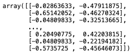

# 为 sklearn 管道创建自定义转换器

> 原文：<https://towardsdatascience.com/creating-custom-transformers-for-sklearn-pipelines-d3d51852ecc1?source=collection_archive---------2----------------------->

## 了解如何创建适合并转换数据的自定义转换器


照片由[伊克拉姆-奥-道拉·沙文](https://unsplash.com/@iqram_shawon?utm_source=medium&utm_medium=referral)在 [Unsplash](https://unsplash.com?utm_source=medium&utm_medium=referral) 上拍摄

在我之前的文章中，我谈到了如何使用 sklearn 中的`Pipeline`类来简化您的机器学习工作流程。特别是，我谈到了如何使用各种转换器类(比如`SimpleImputer`、`StandardScaler`和`OneHotEncoder`)来转换管道中的数据。

[](/using-sklearn-pipelines-to-streamline-your-machine-learning-process-a27721fdff1b) [## 使用 Sklearn 管道简化您的机器学习过程

### 了解 Pipeline 类如何简化和自动化您的机器学习工作流

towardsdatascience.com](/using-sklearn-pipelines-to-streamline-your-machine-learning-process-a27721fdff1b) 

有些时候 sklearn 没有提供你需要的变压器。所以在这种情况下，你必须写你自己的 transformer 类，sklearn 的`Pipeline`类可以使用。

# 定义我们的定制转换器

让我们从您能想到的最简单的转换器开始——一个过滤熊猫数据帧中的列的定制转换器。这是为 transformer 类结构奠定基础的好机会:

```
from sklearn.base import BaseEstimator, TransformerMixin
from sklearn.utils.validation import check_is_fitted# The ColumnsSelector class inherits from the sklearn.base classes 
# (BaseEstimator, TransformerMixin). This makes it compatible with 
# scikit-learn’s Pipelinesclass ColumnsSelector(BaseEstimator, TransformerMixin):
    # initializer 
    def __init__(self, columns):
        # save the features list internally in the class
        self.columns = columns

    def fit(self, X, y = None):
        return self def transform(self, X, y = None):
        # return the dataframe with the specified features
        return X[self.columns]
```

上面定义了一个名为`ColumnsSelector`的 Python 类，它继承了`sklearn.base`类— `BaseEstimator`和`TransformerMixin`。它具有以下功能:

*   初始化器— `__init__`。在这里，您将传递到这个定制转换器中的列的名称保存为一个内部变量— `self.columns`。该内部变量的名称必须与参数名称相匹配(即`columns`)。
*   一个拟合函数— `fit()`。此函数用于计算自定义变压器的参数。在这个例子中，我们不需要做任何事情，因为我们的转换只是过滤列。在其他转换器(如`StandardScalar`)中，`fit()`函数将计算数据集中各列的平均值和标准偏差值，以便`transform()`函数稍后执行转换。同样，我将在后面的部分用另一个例子来说明这一点。
*   一个变换函数— `transform()`。这个函数用于将实际的转换应用到您的自定义转换器打算执行的数据帧。在我们的示例中，您希望根据用户传入的列列表来过滤 dataframe。

注意，`fit()`和`transform()`函数都接受两个参数— `X`和`y`(可选；值`None`的默认参数)。

# 使用我们的定制变压器

定义了自定义转换器后，让我们使用我在上一篇文章中使用的相同数据集来尝试一下:

```
import pandas as pd
import numpy as np
from sklearn.model_selection import train_test_splitdf = pd.read_csv('train.csv')
df = df[['Survived','Pclass','Sex','Age','Fare','Embarked']]X = df.iloc[:,1:]
y = df.iloc[:,0]
X_train, X_test, y_train, y_test = train_test_split(X, y, 
                                                  test_size = 0.3, 
                                                  stratify = y, 
                                                  random_state = 0)
X_train
```

> ***数据来源*** *:本文数据来源来自*[*https://www.kaggle.com/c/titanic/data.*](https://www.kaggle.com/c/titanic/data)

下面是我们将在本文中使用的数据框架:


作者图片

要使用`ColumnsSelector`转换器，让我们创建一个`Pipeline`对象，并将我们的`ColumnsSelector`转换器添加到其中:

```
from sklearn.pipeline import Pipelinenumeric_transformer = Pipeline(steps=[
    **('columns selector', ColumnsSelector(['Age','Fare'])),**
])
```

在上面的语句中，我想从 dataframe 中提取出`Age`和`Fare`列，稍后我将使用`fit()`函数传递给它。

现在，我可以通过调用`Pipeline`对象上的`fit()`函数并向其传递`X_train` dataframe 来调用自定义转换器中的`fit()`函数:

```
numeric_transformer.**fit**(X_train)
```

您将看到以下输出:

```
Pipeline(steps=[('columns selector', ColumnsSelector(columns=['Age', 'Fare']))])
```

> 回想一下，我们的`fit()`函数在这里没有做任何有用的事情。因此在这里调用`fit()`并不会真正在类内部做任何事情。

`transform()`功能怎么样？现在让我们使用`X_train`数据帧从`Pipeline`对象调用`transform()`函数:

```
numeric_transformer.**transform**(X_train)
```

您将看到以下输出:


作者图片

您可以使用`fit_transform()`功能合并对`fit()`和`transform()`的调用:

```
numeric_transformer.fit_transform(X_train, y_train)
```

`fit_transform()`函数调用`fit()`，然后在您的自定义转换器中调用`transform()`。

> 很多变形金刚里，需要先调用`fit()`，才能调用`transform()`。但是在我们的例子中，由于我们的`fit()`不做任何事情，所以您是否调用`fit()`并不重要。

基于您目前所看到的，值得记住以下`fit_transform()`和`transform()`函数的用例:

*   您在训练数据集上使用`fit_transform()`来拟合和转换数据
*   您使用`transform()`来应用您在*测试*集合上的*训练*数据集上使用的转换

继续我们的讨论，让我们将`SimpleImputer`转换器添加到`Pipeline`对象中:

```
from sklearn.pipeline import Pipeline
**from sklearn.impute import SimpleImputer**numeric_transformer = Pipeline(steps=[
    ('columns selector', ColumnsSelector(['Age','Fare'])),
  **  ('imputer', SimpleImputer(strategy='median')),**
])
```

如果您现在尝试在`Pipeline`对象上调用`transform()`:

```
numeric_transformer.transform(X_train)
```

您将得到一个错误:

```
NotFittedError: This SimpleImputer instance is not fitted yet. Call 'fit' with appropriate arguments before using this estimator.
```

如前所述，对于某些变压器，您需要调用`fit()`或`fit_transform()`函数来确保数据首先被拟合。在本例中，`SimpleImputer`对象需要计算指定列的中值(在`fit()`函数中),然后才能替换`transform()`函数中列的所有`NaNs`。

要解决这个问题，用`X_train`数据帧调用`fit_transform()`函数:

```
numeric_transformer.**fit_transform**(X_train)
```

您将看到如下所示的结果:


作者图片

您可以通过以下方式可视化工作流:


作者图片

现在让我们继续添加`StandardScaler`转换器到`Pipeline`对象:

```
from sklearn.pipeline import Pipeline
from sklearn.impute import SimpleImputer
**from sklearn.preprocessing import StandardScaler**numeric_transformer = Pipeline(steps=[
    ('columns selector', ColumnsSelector(['Age','Fare'])),
    ('imputer', SimpleImputer(strategy='median')),
 **('scaler', StandardScaler())**
])numeric_transformer.fit_transform(X_train)
```

现在，您应该可以看到标准化的`Age`和`Fare`列中的值:



作者图片

使用标准化的*训练*集合中的值，您现在可以使用`transform()`函数将转换应用到*测试*集合:

```
numeric_transformer.**transform**(X_test)
```

您应该会看到以下结果:

```
array([[-0.65142052, -0.47989005],
       [-1.97483693,  0.09842973],
       [ 3.20205667, -0.47958116],
       [-0.41787645,  0.91519704],
       [-0.06756034, -0.48921406],
       [-0.80711657, -0.06803741],
       [-0.04809833, -0.47958116],
```

# 创建我们自己的定制标准转换器

既然您已经看到了如何创建定制转换器的简单示例，那么让我们来看看另一个示例。这一次，让我们试着自己实现`StandardScaler`变压器。

首先，让我们声明一个类调用`MyStandardScaler`:

```
class MyStandardScaler(BaseEstimator, TransformerMixin): 
    def __init__(self):
        return None

    def fit(self, X, y = None):
        print(type(X))
        # the type of X might be a DataFrame or a NumPy array
        # depending on the previous transformer object that 
        # you use in the pipeline
        self.means = np.mean(X, axis=0)    # calculate the mean
        self.stds = np.std(X, axis=0)      # calculate the 
                                           # standard deviation
        return self def transform(self, X, y = None):
        return (X - self.means) / self.stds
```

像前面的例子一样，`MyStandardScaler`类实现了`fit()`和`transform()`函数:

*   在`fit()`函数中，您计算 2D 矩阵中每一列的平均值和标准偏差(作为 NumPy 数组或 Pandas 数据帧)
*   在`transform()`函数中，您使用以下公式计算标准化值:


作者图片

*其中* ***X*** *为列中的当前值，* ***μ*** *为数列的平均值，****【σ****为数列的标准差，Z 为新的标准化值。*

在`fit()`函数中，我特意打印了`X`的类型，向您展示您的管道中使用的前一个转换器如何影响您在当前转换器中接收的数据类型。

为了使用`MyStandardScaler`转换器，让我们修改一下之前的管道:

```
from sklearn.pipeline import Pipeline
from sklearn.impute import SimpleImputer
from sklearn.preprocessing import StandardScalernumeric_transformer = Pipeline(steps=[
    ('columns selector', ColumnsSelector(['Age','Fare'])),
 **('my scaler', MyStandardScaler())** 
])numeric_transformer.fit_transform(X_train)
```

> 对于我们的`MyStandardScaler`变压器，您需要直接调用`fit_transform()`或者同时调用`fit()`和`transform()`。如果您简单地调用`transform()`函数，它将不起作用，因为该类没有每列的平均值和标准偏差来计算每列的标准化值。

当管道运行时，您将看到以下输出:

```
<class 'pandas.core.frame.DataFrame'>
```

这意味着从`ColumnsSelector`传入的数据是熊猫数据帧。`fit_transform()`功能的输出为以下数据帧:


作者图片

现在，让我们在管道中的`MyStandardScaler`变压器之前添加一个`SimpleImputer`变压器:

```
numeric_transformer = Pipeline(steps=[
    ('columns selector', ColumnsSelector(['Age','Fare'])),
 **('imputer', SimpleImputer(strategy='median')),**
    ('my scaler', MyStandardScaler())  
])numeric_transformer.fit_transform(X_train)
```

这一次，当您运行代码时，您将看到以下内容:

```
<class 'numpy.ndarray'>
```

这表明`SimpleImputer`将转换后的数据作为 NumPy 数组返回。

`Pipeline`对象的`fit_transform()`函数的输出将是一个数组:

```
array([[-0.02863633, -0.47911875],
       [-0.65142052, -0.46270324],
       [-0.04809833, -0.32513665],
       ...,
       [ 0.20490775,  0.42203815],
       [-0.04809833, -0.22194182],
       [-0.5735725 , -0.45646073]])
```

输出中的值与使用`StandardScaler`时的值相同。

# 确保变压器已经安装

还记得我之前说过，对于`MyStandardScaler`转换器，您需要在转换发生之前调用`fit()`函数吗？如果用户没有拟合就调用`transform()`函数会怎么样？在这种情况下，重要的是向用户返回正确的错误消息，告诉他们首先拟合数据。您可以通过`check_is_fitted()`功能这样做，就像这样:

```
**from sklearn.utils.validation import check_is_fitted**class MyStandardScaler(BaseEstimator, TransformerMixin): 
    def __init__(self):
        return None

    def fit(self, X, y = None):
        print(type(X))
        # the type of X might be a DataFrame or a NumPy array
        # it depends on the previous transformer object that 
        # you use in the pipeline
        self.means = np.mean(X, axis=0)
        self.stds = np.std(X, axis=0)
        return self def transform( self, X, y = None ):
        **check_is_fitted(self, ['means','stds'])**
        return (X - self.means) / self.stds
```

在`check_is_fitted()`函数中，您只需要传入一个字符串(或字符串列表),指定需要出现在类中的对象属性(如果用户跳过`fit()`函数，将不会创建`means`和`stds`属性，因此该函数将引发`NotFittedError`异常)。

为了测试这一点，让我们使用`transform()`函数调用`Pipeline`对象:

```
numeric_transformer = Pipeline(steps=[
    ('columns selector', ColumnsSelector(['Age','Fare'])),
    ('imputer', SimpleImputer(strategy='median')),
    ('my scaler', MyStandardScaler())  
])numeric_transformer.**transform**(X_train)
```

正如所料，您将看到错误消息:

```
NotFittedError: This SimpleImputer instance is not fitted yet. Call 'fit' with appropriate arguments before using this estimator.
```

# 摘要

我希望这篇文章能揭示出变形金刚在幕后是如何工作的。特别是，我希望你现在理解`fit()`、`transform()`和`fit_transform()`功能之间的区别以及它们是如何工作的。更具体地说，我还希望您现在已经掌握了创建自己的自定义转换器的知识，它可以与`Pipeline`对象一起工作。

[](https://weimenglee.medium.com/membership) [## 加入媒介与我的介绍链接-李伟孟

### 作为一个媒体会员，你的会员费的一部分会给你阅读的作家，你可以完全接触到每一个故事…

weimenglee.medium.com](https://weimenglee.medium.com/membership)