# 使用 Scikit-Learn 创建自定义变压器

> 原文：<https://towardsdatascience.com/creating-custom-transformers-using-scikit-learn-5f9db7d7fdb5?source=collection_archive---------4----------------------->

## 本文讨论了使用 Scikit-Learn 创建定制转换器的两种方法，以及它们在 Pipeline 和 GridSearchCV 中的实现。


阿瑟尼·托古列夫在 [Unsplash](https://unsplash.com/s/photos/transformers?utm_source=unsplash&utm_medium=referral&utm_content=creditCopyText) 上的照片

转换器是在为机器学习预处理数据时实现数据转换的类。Scikit-Learn 中的转换器示例有 SimpleImputer、MinMaxScaler、OrdinalEncoder、PowerTransformer 等等。有时，我们可能需要执行流行的 Python 包中没有预定义的数据转换。在这种情况下，定制变压器来拯救。在本文中，我们将讨论使用 Scikit-Learn 在 Python 中定义定制转换器的两种方法。我们将使用 Scikit-Learn 中的“虹膜数据集”,并使用 IQR 方法定义一个用于异常值消除的自定义转换器。

## 方法 1

该方法通过继承 Scikit-Learn 的 BaseEstimator 和 TransformerMixin 类来定义自定义转换器。Scikit-Learn 的“BaseEstimator”类通过添加“set_params”和“get_params”方法来启用超参数调优。而“TransformerMixin”类添加了“fit_transform”方法，但没有显式定义它。在下面的代码片段中，我们将导入所需的包和数据集。

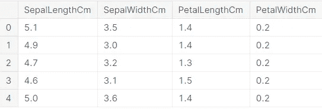

作者图片

在上面的代码片段中，我们定义了一个名为“OutlierRemover”的类，这是我们的自定义转换器，用于删除异常值，即使用 NaN 替换异常值。该类有一个名为“factor”的属性，它是一个超参数，用于控制异常值移除过程。“因子”越高，极端值将被移除。默认情况下，“因子”初始化为 1.5。该类有三个方法，即“离群值移除”、“拟合”和“转换”。继承 BaseEstimator 和 TransformerMixin 类增加了另外三个方法，即，' fit_transform '，' get_params '和' set_params '。我们还创建了一个名为“OutlierRemover”类的“outlier_remover”实例。

__init__ '是创建该类的实例/对象时调用的第一个方法。这用于初始化类属性。我们将用 1.5(默认值)初始化 IQR 方法的因子。“异常值移除”方法用 NaN 替换系列中的异常值。“fit”方法总是返回 self。“transform”方法接受一个数组/数据帧作为输入，并将 outlier_removal 方法应用于数据帧/数组的所有列并返回它。

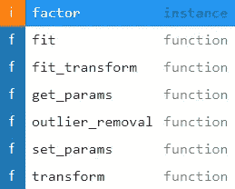

作者图片

我们将使用“OutlierRemover”通过创建一个名为“test”的包含三列和四条记录的数据框来应用异常值移除转换。

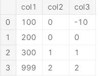

作者图片

我们可以看到“col1”有一个异常值(999)，而“col3”也有一个异常值(-10)。我们将首先使“OutlierRemover”适合“test”数据框(使用已经创建的实例“outlier_remover”)，并对其应用变换。

```
outlier_remover.fit(test)
```

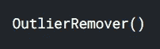

作者图片

```
outlier_remover.transform(test)
```

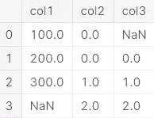

作者图片

我们可以看到，“列 1”(999)中的异常值被替换为 NaN，“列 3”(10)中的异常值被替换为 NaN。我们可以使用如下所示的一个“fit_transform”方法来应用转换。这与上面的结果相同。

```
outlier_remover.fit_transform(test)
```


作者图片

我们将通过将“因子”设置为 100 来创建“OutlierRemover”类的一个名为“outlier_remover_100”的实例。如前所述,“因子”越高，极端值将被剔除。

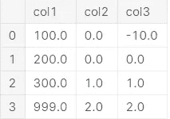

作者图片

我们可以看到，“列 1”中的“999”和“列 2”中的“-10”这次没有被视为异常值，因为“因子”属性很高。现在，我们将离群点去除器变换应用于虹膜数据集。在此之前，我们将使用箱线图显示 Iris 数据集的四列中的异常值。

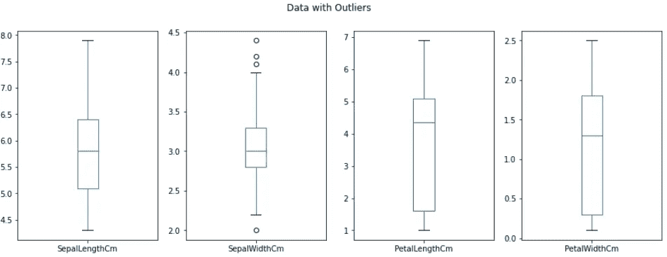

作者图片

在上面的方框图中，我们可以看到列“SepalWidthCm”有几个异常值，准确地说是四个。其他三列没有异常值。我们将创建一个 ColumnTransformer，将“OutlierRemover”应用于 Iris 数据集的所有变量，并使用箱线图可视化离群点移除后的变量。

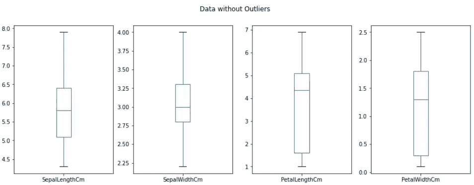

作者图片

在上面的方框图中，我们可以看到“SepalWidthCm”列中的异常值已被移除，即替换为 NaN。我们将找出从每一列中删除了多少个异常值以及哪些异常值。

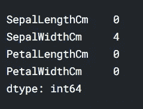

作者图片

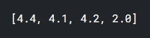

作者图片

我们可以看到，大于 4 且小于或等于 2 的“SepalWidthCm”的值被移除，因为它们是异常值。在前面显示异常值的箱线图中也可以看到同样的情况。现在，我们将创建一个移除异常值的管道，估算移除的异常值并拟合逻辑回归模型。我们将使用 GridSearchCV 调优超参数。

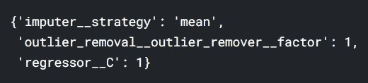

作者图片

## 方法 2

创建自定义转换器的第二种方法是使用 Scikit-Learn 的“FunctionTransformer”类。这是一种更简单的方法，不需要定义类，但是，我们需要定义一个函数来执行所需的转换。类似于方法 1，我们将创建一个定制的转换器来删除离群值。下面的函数将数组/数据框以及“因子”作为输入，并用 NaN 替换每列中的异常值。

在上面的代码片段中，我们还创建了一个名为“FunctionTransformer”类的“outlier_remover”的实例，方法是传递我们为异常值删除定义的自定义函数(“outlier_removal”)以及参数“factor”。在此方法中，我们需要使用“FunctionTransformer”的“kw_args”参数将附加参数(而不是输入数组/数据帧)作为字典传递给“Functiontransformer”中的函数。我们还创建了方法 1 中使用的“测试”数据框。


作者图片

我们可以看到“col1”有一个异常值(999)，而“col3”也有一个异常值(-10)。我们将使用已经创建的实例“outlier_remover”对数据进行拟合和应用“OutlierRemover”转换。

```
outlier_remover.fit_transform(test)
```


我们可以看到，“列 1”(999)中的异常值被替换为 NaN，“列 3”(10)中的异常值被替换为 NaN。使用“FunctionTransformer”创建一个自定义转换器为我们提供了一些额外的方法，如下所示。

```
[i for i in dir(outlier_remover) if i.startswith('_') == False]
```


作者图片

现在，我们将创建一个移除异常值的管道，估算移除的异常值并拟合逻辑回归模型。我们将使用 GridSearchCV 调优超参数。

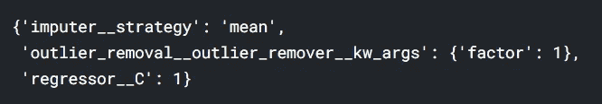

作者图片

方法 2 的主要区别在于，我们需要调整“kw_args”超参数，这与其他变压器(包括方法 1 中讨论的变压器)不同。在上面的代码片段中，我们使用值列表[{'factor':0}、{'factor':1}、{'factor':2}、{'factor':3}、{'factor':4}]调整了' kw_args '超参数。这可能使得难以调整定制变压器的多个超参数。

这是使用 Scikit-Learn 定义定制转换器的两种方法。定义自定义转换器并将它们包含在管道中简化了模型开发，还防止了使用 k-fold 交叉验证时的数据泄漏问题。