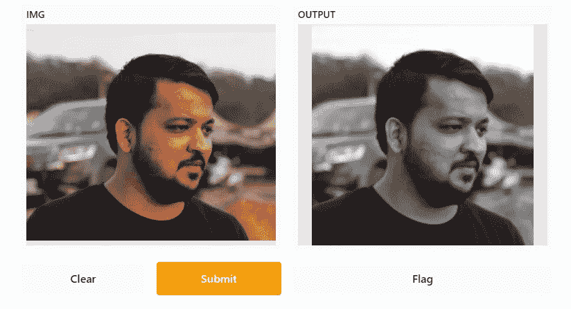
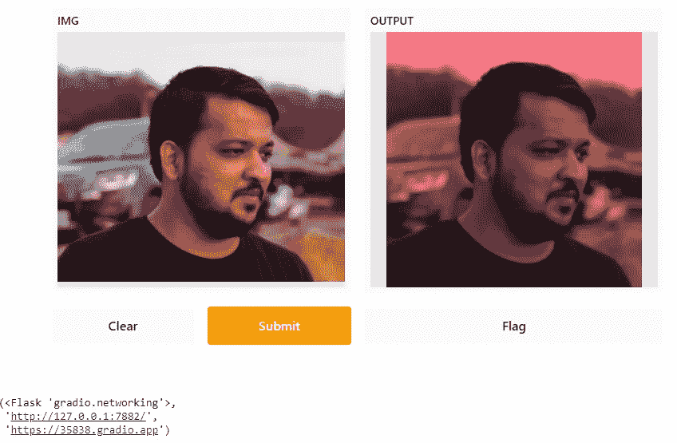

# 创建定制的 ML Web 应用程序

> 原文：<https://towardsdatascience.com/creating-customized-ml-webapps-984874b6d858?source=collection_archive---------36----------------------->

## 使用 Gradio 创建基于 UI 的应用程序



来源:作者

如果你曾经创建过一个 web 应用程序，那么你应该知道构建一个需要付出的努力。创建 web 应用程序需要花费大量时间，因为我们需要寻找 UI 组件，创建机器学习模型，创建管道以在应用程序中呈现它，等等。这需要一点经验和知识来使它工作。

Gradio 是一个开源 python 库，用于创建漂亮的 web 应用程序。我们可以围绕 ML 模型创建一个 UI 包装器，并将其呈现给期望的受众。它易于使用，只用几行代码就能创建应用程序。

在本文中，我们将探索 Gradio 的基础知识，并通过应用不同的过滤器创建一个图像编辑应用程序。

让我们开始吧…

# 安装所需的库

我们将从使用 pip 安装 Gradio 开始。下面给出的命令可以做到这一点。

```
!pip install gradio
```

# 导入所需的库

在这一步中，我们将导入所需的 Gradio & Numpy 库。

```
import gradio as gr
import numpy as np
```

# 创建 Web 应用程序

在这里，我们将创建 web 应用程序，其中我们将使用 NumPy 数组创建不同的过滤器进行图像编辑，并使用 Gradio 渲染该应用程序，以创建一个漂亮的界面，我们将上传任何图像并在其上应用过滤器。

```
def sepia(img):  

  sepia_filter1 = np.array([[.99, .99, .9],
                           [.29, .19, .9],
                           [.98, .345, .234]])
  sepia_img1 = img.dot(sepia_filter1.T)
  sepia_img1 /= sepia_img1.max()      

  return sepia_img1iface = gr.Interface(sepia, gr.inputs.Image(shape=(200, 200)), "image")
iface.launch()
```



来源:作者

你可以看到我们使用 Gradio 用一行代码创建了一个多么漂亮的界面。在接下来的文章中，我将向您展示如何为您的机器学习、深度学习和 NLP 应用程序创建 UI 界面。

继续尝试不同的图像和过滤器。如果您发现任何困难，请在回复部分告诉我。

本文是与 [Piyush Ingale](https://medium.com/u/40808d551f5a?source=post_page-----984874b6d858--------------------------------) 合作完成的。

# 在你走之前

***感谢*** *的阅读！如果你想与我取得联系，请随时联系我在 hmix13@gmail.com 或我的* [***LinkedIn 简介***](http://www.linkedin.com/in/himanshusharmads) *。可以查看我的*[***Github***](https://github.com/hmix13)**简介针对不同的数据科学项目和包教程。还有，随意探索* [***我的简介***](https://medium.com/@hmix13) *，阅读我写过的与数据科学相关的不同文章。**