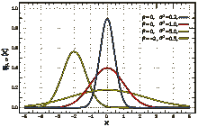
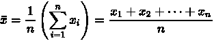
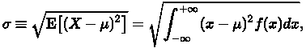
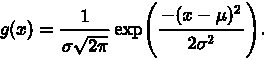
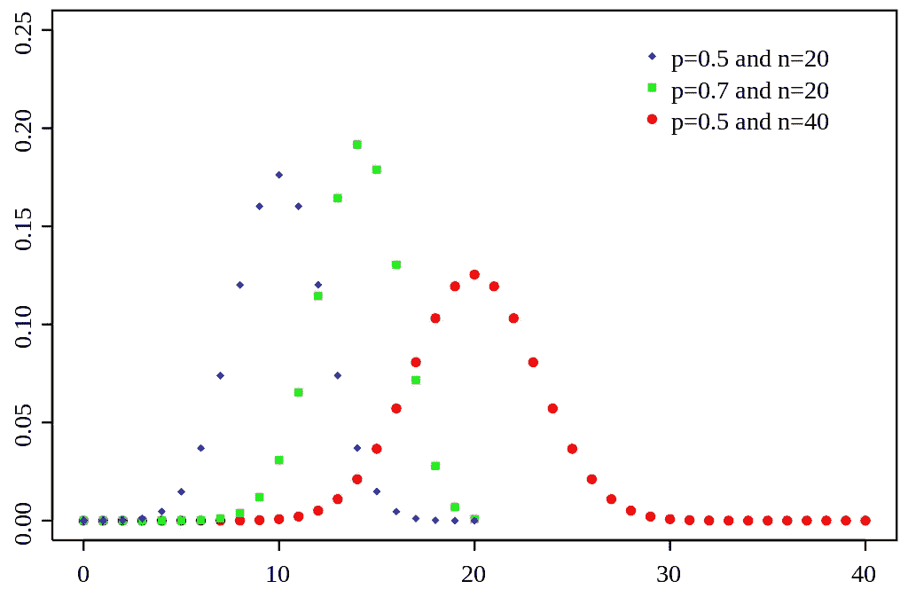
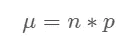
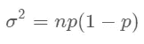
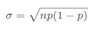
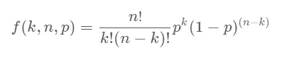
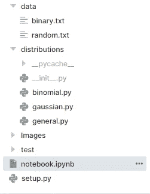

# 使用 Jupyter Notebook 创建数据科学 Python 包

> 原文：<https://towardsdatascience.com/creating-data-science-python-package-using-jupyter-notebook-6fa6e6b74a87?source=collection_archive---------12----------------------->

## 了解面向对象编程如何帮助您使用 Jupyter notebook 构建第一个 Python 包。


图片作者|元素作者 [katemangostar](https://www.freepik.com/katemangostar)

# 介绍

你想知道像 Scikit-learn、pandas 和 NumPy 这样的 Python 包是如何构建的吗？它们都基于面向对象编程(OOP)来创建复杂且易于使用的包。对于一个数据科学家来说，学习 OOP 是必要的，这样他们就可以在生产就绪产品的开发中使用它。

我们将使用 cloud Jupyter 笔记本来简化环境的设置，并完全专注于创建一个包。该项目包括面向对象的基础知识，如继承，对象，类和神奇的功能。这个项目受 AWS 机器学习基础课程的影响很大，一旦我知道如何构建它，我花了 10 分钟来重新创建这个包。

# 分布

## 父类

让我们深入编码并讨论我们的**父**类“分布**”**，它将被高斯和二项式类使用。我们将使用 Jupyter 笔记本的神奇功能`%%witefile` *来创建 python 文件。*

```
%%writefile distributions/general.py
```

上面的代码将在发行版文件夹中创建一个 python 文件，为了简单起见，您需要创建一个包含测试文件的**测试**文件夹，一个包含所有软件包文件的**发行版**文件夹，以及一个包含`.txt`的**数据**文件夹。

分布类有两个参数，**表示**和**标准差**，它还包含用于访问数据文件的`read_data_file()`函数。

`__init__`函数初始化变量。

## 测试分布类

这个班的一切都很顺利。我们添加了均值、标准差，并加载了`random.txt`文件来测试我们的`Distribution`类。

# 高斯分布

高斯分布在统计学中很重要，在社会科学中常用来表示分布未知的真实随机变量。 [—维基百科](https://en.wikipedia.org/wiki/Normal_distribution)



图 1 | [维基百科](https://en.wikipedia.org/wiki/Normal_distribution)

## 平均



一列数字的平均值是所有数字的总和除以样本数。[意思是——维基百科](https://en.wikipedia.org/wiki/Mean)

## 标准偏差



这是对数据变化的一种度量。[BMJ](https://www.bmj.com/content/312/7047/1654)

## 概率密度函数



参数`mu` 是均值，而参数 sigma 是标准差。`x`是一个列表中的值。

## 高斯类

我们将从父类`Distribution`继承值和函数，并使用 python 这个神奇的函数。

1.  初始化父类**分配**
2.  创建`plot_histogram_pdf`函数→ **数据的归一化直方图，并可视化** **概率密度函数。**
3.  创建魔法函数`__add__` → **将两个高斯分布对象相加。**
4.  创建魔法函数`__repr__` → **输出高斯实例的特征。**

## 做实验

测试`__repr__`魔法功能。

用 25 个平均值和 2 个标准偏差初始化`gaussian1` 对象，然后从数据文件夹中读取`random.txt`文件。

计算数据上 *25* means 和 *2* Stdev 的概率函数。然后，计算`random.txt`的均值和标准差。新的均值是 *125.1* 和 Stdev 到 *210.77* ，这使得我们的概率密度函数值从 *0.19947* 变为 *0.00169* 。

绘制概率密度函数的直方图和线图。

## 单元测试

unittest 是一个测试框架，最初受 JUnit 的启发，与其他语言中的主要单元测试框架有相似的风格。它支持测试自动化，共享测试的设置和关闭代码，将测试聚合到集合中，以及测试独立于报告框架，参见[文档](https://docs.python.org/3/library/unittest.html)。

## 创建高斯类测试文件

> 测试优先是一个很好的工具。它在团队中创造了更好的理解和生产力。结果是高质量的代码——无论是在早期成功发现错误还是正确实现功能方面。— [吉尔·齐伯菲德](https://www.infoq.com/news/2016/01/test-first-TDD-BDD/)

我们将使用 unittest 库来测试我们所有的函数，以便将来如果我们做了任何更改，我们可以在几秒钟内检测到错误。

创建包含所有函数的`TestGaussianClass`来测试`Gaussian` 类中的函数。我们使用了`assertEqual`方法来破解函数的有效性。

> 我自己测试了这些值，然后将它们逐个添加，以测试每种可能性。

## 试探性试验

让我们使用`!python` *运行测试文件夹中的测试文件。*

如你所见，所有测试都通过了。一开始我得到了多个，调试这些问题帮助我更好地理解了`Gaussian` 类是如何在每一级工作的。

# 二项分布

带参数`n` 和`p` 的二项式分布是一系列`n`独立实验中成功次数的离散概率分布，每个实验都提出是或否的问题，并且每个实验都有自己的布尔值结果:成功(概率为 p)或失败(概率为 q = 1p)。[二项式分布—维基百科](https://en.wikipedia.org/wiki/Binomial_distribution)



[二项分布图|维基百科](https://en.wikipedia.org/wiki/File:Binomial_distribution_pmf.svg)

## 平均



## 差异



## 标准偏差



## 概率密度函数



## 二项式类

我们将使用上面提到的数学函数来创建均值、标准差和概率密度函数。我们已经在上一个类中完成了具有挑战性的工作，现在我们将使用类似的模式来编写`Binomial` 类。

1.  初始化概率和大小变量→ **p，n**
2.  初始化父类分布→ **计算** `**mean**` **和** `**Stdev**` **并将其添加到父类中。**
3.  创建`replace_stats_with_data` 函数 *→* **，从导入的数据中计算概率、大小。新的平均值和标准偏差将被更新。**
4.  使用 matplotlib 库创建`*plot_bar*`函数→ **显示条形图。**
5.  创建`*pdf*` 函数→ **使用均值和标准差计算数据的概率密度函数。**
6.  创建`*plot_bar_pdf*`函数→ **绘制二项分布的 pdf。**
7.  创建魔法函数`*__add__*` → **用两个** `**Binomial**` **分配对象相加。**
8.  创建魔法函数`*__repr__*` → **输出** `**Binomial**` **实例的特征**

## 做实验

测试`__repr__`魔法功能

测试`Binomial` 对象和`read_data_file`功能。

测试 **p** 0.4 和 **n** 20 的初始值的 pdf。我们将使用`replace_stats_with_data`来计算数据的 **p** 和 **n** ，然后重新计算 **PDF。**

测试条形图

测试概率密度函数柱状图。

## 二项式类别测试函数

我们将使用 unittest 库来测试我们所有的函数，以便将来如果我们做了任何更改，我们可以在几秒钟内检测到错误。

创建`TestBinomialClass`，它具有测试`Binomial` 类的所有函数。

## 试探性试验

运行 *test_binomial.py* 显示在测试过程中没有发现错误。

# 正在创建 __init__。py 函数

我们需要在 distributions 文件夹中创建`__init__.py`文件来初始化 python 文件中的类。这将帮助我们直接调用特定的类。

我们已经启动了二项式和高斯类。

# 创建 setup.py 函数

这个`setuptools`是构建 python 包所必需的。设置功能需要软件包信息、版本、描述、作者姓名和电子邮件。

# 目录

下图显示了包含所有必需文件的包目录。



# 安装分发包

`(venv) [[email protected]](https://www.analyticsvidhya.com/cdn-cgi/l/email-protection):~/work # pip install -U .`

使用`pip install .`或`pip install -U .`来安装我们可以在任何项目中使用的 python 包。正如我们所看到的，我们的分发包已经成功安装。

```
**Processing /work**
Building wheels for collected packages: distributions
  Building wheel for distributions (setup.py) ... done
  Created wheel for distributions: filename=distributions-0.2-py3-none-any.whl size=4800 sha256=39bc76cbf407b2870caea42b684b05efc15641c0583f195f36a315b3bc4476da
  Stored in directory: /tmp/pip-ephem-wheel-cache-ef8q6wh9/wheels/95/55/fb/4ee852231f420991169c6c5d3eb5b02c36aea6b6f444965b4b
**Successfully built distributions**
Installing collected packages: distributions
  Attempting uninstall: distributions
    Found existing installation: distributions 0.2
    Uninstalling distributions-0.2:
      Successfully uninstalled distributions-0.2
Successfully installed distributions-0.2
```

# 测试我们的包

我们将在 Linius 终端中运行 Python 内核，然后测试这两个类。

> 做得好，你已经创建了你的第一个 Python 包。

```
>>> from distributions import Gaussian
>>> from distributions import Binomial
>>> 
>>> print(Gaussian(20,6))
**mean 20, standard deviation 6**
>>> print(Binomial(0.4,50))
**mean 20.0, standard deviation 3.4641016151377544, p 0.4, n 50**
>>>
```

[](https://github.com/kingabzpro/Creating-Python-Package-using-Jupyter-Notebook) [## GitHub-kingabzpro/Creating-Python-Package-using-Jupyter-Notebook:创建您的第一个数据…

### 直接从 Jupyter 笔记本创建您的第一个数据科学 python 包。创建您的第一个数据科学 python…

github.com](https://github.com/kingabzpro/Creating-Python-Package-using-Jupyter-Notebook) 

如果还面临问题，可以去看看我的[**GitHub**](https://github.com/kingabzpro/Creating-Python-Package-using-Jupyter-Notebook)**repo**或者**[**Deepnote**](https://deepnote.com/project/Creating-Python-Package-in-Jupyter-Notebook-JvApLhCiQIqj-0yR-PAfdQ/%2Fpython_packages.ipynb)**项目。********

> ******你可以关注我的领英和 T21，我每周都会在那里发表文章。******

*********本文中显示的媒体不归 Analytics Vidhya 所有，由作者自行决定使用。*********

*****原载于 2021 年 7 月 30 日 https://www.analyticsvidhya.com*[](https://www.analyticsvidhya.com/blog/2021/07/creating-data-science-python-package-using-jupyter-notebook)**。******