# 用 3 到 5 行代码创建深度神经网络

> 原文：<https://towardsdatascience.com/creating-deep-neural-networks-with-3-to-5-lines-of-code-baa83fa616ed?source=collection_archive---------8----------------------->

## [思想和理论](https://towardsdatascience.com/tagged/thoughts-and-theory)

## 我们可以通过改变已经提出的模型的很少几行代码来创建新的深度神经网络。

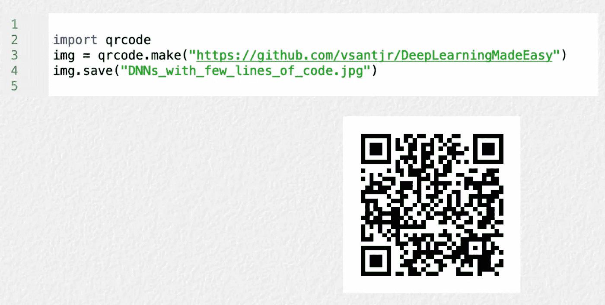

图片作者。

当在深度学习中处理监督学习时，我们可以说有一些经典的方法可以遵循。第一种解决方案是所谓的“英雄”策略，其中从零开始创建一个全新的深度神经网络(DNN ),并对其进行训练/评估。实际上，这种解决方案可能不是很有趣，因为现在有无数的 dnn 可用，如许多深度卷积神经网络(CNN)，可以重复使用。第二条路是简单地考虑一个可部署的 DNN，为某个环境训练，并在另一个环境中观察它的操作。尽管深度学习取得了诸多进步，但如果环境过于多样化，模型可能会表现不佳。

今天最著名的方法之一被称为[迁移学习](https://journalofbigdata.springeropen.com/articles/10.1186/s40537-016-0043-6)，它用于通过转移相关领域的信息来改进一个领域(上下文)的模型。依赖迁移学习的动机是当我们面临训练数据集中没有那么多样本的情况时。造成这种情况的一些原因是，收集和标记这些数据并不便宜，或者这些数据很少。

照片由[扬科·菲利](https://unsplash.com/@itfeelslikefilm) 在 [Unsplash](https://unsplash.com/) 上拍摄。

但是，迁移学习也有缺点。通常，模型是在大型数据集上训练的，因此这种预训练的模型可以在另一个上下文中重用。因此，我们不是从零开始训练，而是基于预训练模型中嵌入的后天“智能”。然而，即使我们有大量的图像要训练，训练数据集也必须足够通用，以处理不同的上下文。有许多有趣的基准映像集，如 ImageNet 和 COCO，旨在解决这个问题。但是，最终，我们可能会在一个具有挑战性的领域(例如自动驾驶、遥感)工作，其中基于这些经典数据集的迁移学习可能是不够的。

即使我们多次尝试增加训练样本，例如数据增加、生成对抗网络(GANs)，我们也可以通过重用和/或进行一些修改和/或组合其他已提出模型的不同特征来创建新模型。这种策略的一个最重要的例子是著名的对象检测 DNNs，称为 [YOLO](https://colab.research.google.com/github/ultralytics/yolov5/blob/master/tutorial.ipynb) 。这些模型，尤其是版本 4，是基于许多其他解决方案开发的。这种网络是一种不同概念的折衷混合，以获得一种新的模型，它们在检测图像和视频中的对象方面非常成功。请注意， [YOLOX](https://medium.com/@tastekinalperenn/yolox-main-idea-behind-latest-yolo-algorithm-5f8aa930c33c) 是 YOLO 网络的最新版本。

在 [Unsplash](https://unsplash.com/) 上由[安梅丽·莫里雄](https://unsplash.com/@amayli?utm_source=unsplash&utm_medium=referral&utm_content=creditCopyText) 拍摄的照片。

这篇文章的方向是通过在以前提出的方法中完成一些变化来创建新的模型。它展示了通过改变先前提出的模型的很少几行代码来创建“新的”dnn 是多么容易。请注意，由于我们所做的更改基本上与原始模型的层数有关，因此我们将下面介绍的网络称为“新”网络，这是对它的一点推动。但是，重点是鼓励实践者考虑这一点，并最终在实际环境中使用 DNNs 时重用/修改以前的想法以产生新的方法。

## **VGG12BN**

在 2014 年 [ImageNet 大规模视觉识别挑战赛](https://www.image-net.org/challenges/LSVRC/)(ils vrc)中，VGG 是一个经典的 DNN，今天仍有一些用途，尽管一些作者认为它是一个过时的网络。在最初的文章中，作者提出了具有 11、13、16 和 19 层的 vgg。在这里，我们展示了如何创建一个“新的”VGG 组成的 12 层和批量规格化(BN)只是通过增加/改变 5 行代码:VGG12BN。

我们依赖 PyTorch 团队的实现，并修改它来创建我们的模型。VGG 修改后的代码是[这里是](https://github.com/vsantjr/DeepLearningMadeEasy/blob/temp_23-09/vggmodified.py)，使用它的笔记本是[这里是](https://github.com/vsantjr/DeepLearningMadeEasy/blob/temp_23-09/PyTorch_VGG_ResNet_VGGout.ipynb)。此外，我们考虑了 fastai 的 [imagenette 320 px](https://github.com/fastai/imagenette) 数据集的一个稍微修改的版本。不同之处在于，原始验证数据集被分成两部分:包含原始验证集的 1/3 图像的验证数据集，以及组成测试数据集的 2/3 图像。因此，在训练中有 9，469 幅图像(70.7%)，在验证中有 1，309 幅图像(9.78%)，在测试集中有 2，616 幅图像(19.53%)。这是一个有 10 个类别的多类别分类问题。我们将数据集称为 [imagenettetvt320](https://www.kaggle.com/valdivinosantiago/imagenettetvt320) 。

我们现在展示我们在 PyTorch 团队的 VGG 实现中所做的修改:

*   首先，我们注释掉了`from .._internally_replaced_utils import load_state_dict_from_url`以避免依赖其他 PyTorch 模块。此外，为了完全确定我们不会使用预训练模型(默认情况下 pretrained = False)，我们注释掉了`model_urls`。这只是为了强调这一点，并不是真的有必要这样做；
*   第一个修改是增加了我们车型的名称:`"vgg12_bn”`；

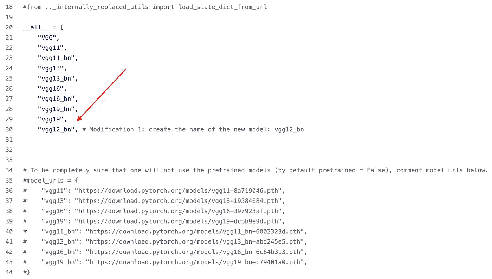

图片作者。

*   由于我们有 10 个类，所以我们把`num_classes`从 1000 改成了 10；

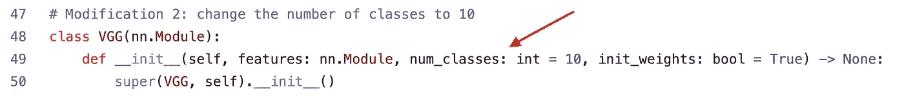

图片作者。

*   因此，我们创建一个新的配置，`"V"`，具有以下卷积层(每层的信道数量按顺序显示):64、64、128、128、256、256、512、512、512。请注意，下面的`"M"` 表示最大池。因为 VGG 默认有 3 个全连接(FC)层，所以我们总共有 12 个层；

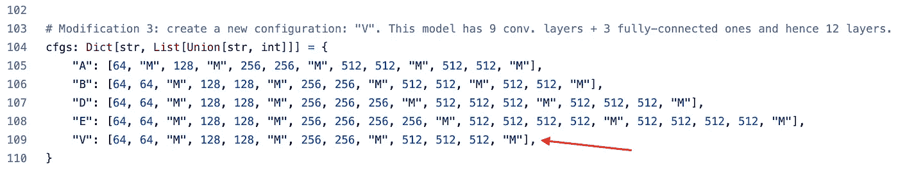

图片作者。

*   最后，我们创建一个函数`vgg12_bn`，其中只有一行代码调用另一个函数。请注意，我们看到参数`"vgg12_bn"`(网络名称)、`"V"`(配置)和`True`的值，其中后者激活批量标准化。

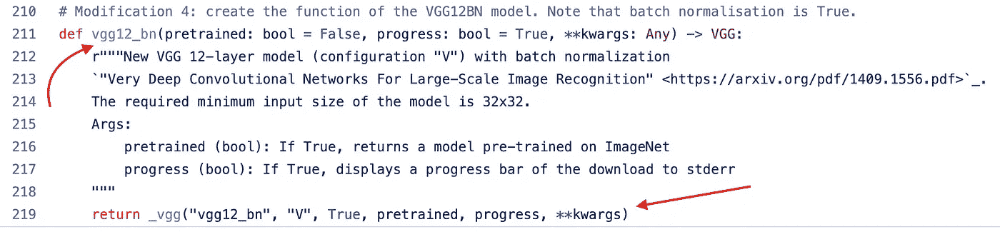

图片作者。

就是这样。通过添加/修改 5 行代码，我们创建了我们的模型。在笔记本中，我们需要导入`vggmodified`文件来使用 VGG12BN。

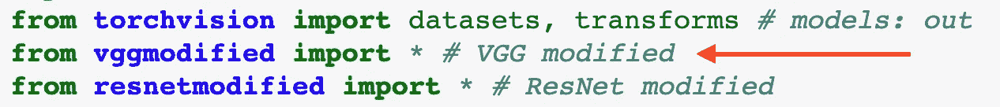

图片作者。

下图(表)显示了基于 10 个时期训练后的测试数据集的准确度(Acc)结果。我们比较了原始的 VGG16BN、VGG19BN 和提议的 VGG12BN 模型。列 **# Train Param (M)** 、 **# Param Mem (MB)** 、 **Time (s)** 表示每个模型的百万个可训练参数的数量，仅由模型参数决定的兆字节大小，以及使用 Google Colab 执行它们的时间。我们的“新”VGG12BN 获得了更高的精度。

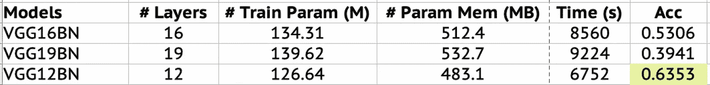

VGG:结果。图片作者。

## DenseNet-83 和 ResNet-14

在 [DenseNet](https://arxiv.org/abs/1608.06993) 模型中，每一层都以前馈方式与其他层相连，旨在最大化层间的信息流。2015 年 ILSVRC 的另一个获奖者， [ResNet](https://arxiv.org/abs/1512.03385) 是最受欢迎的 CNN 之一，其中已经提出了它的几个变体(ResNeXt、Wide ResNet、…)，它也作为其他 dnn 的一部分得到了重用。这是一种残差学习方法，其中堆叠层拟合残差映射，而不是直接拟合期望的底层映射。我们遵循了与刚才介绍的 VGG12BN 类似的过程，但现在我们只需更改 3 行代码，就可以创建 DenseNet-83 (83 层)和 ResNet-14 (14 层)。

访问[此处](https://github.com/vsantjr/DeepLearningMadeEasy/blob/temp_23-09/densenetmodified.py)dense net 修改后的代码及其对应的笔记本是[此处](https://github.com/vsantjr/DeepLearningMadeEasy/blob/temp_23-09/PyTorch_DenseNet.ipynb)。ResNet 修改后的代码在这里是，笔记本与 VGG12BN 相同，但现在我们通过运行 ResNet-14 来显示[的输出。由于创建这两个网络的修改是相似的，下面我们将只显示创建 DenseNet-83 的修改。因此，这就是我们所做的:](https://github.com/vsantjr/DeepLearningMadeEasy/blob/temp_23-09/PyTorch_VGG_ResNet_ResNetout.ipynb)

*   如前所述，我们注释掉了`from .._internally_replaced_utils import load_state_dict_from_url`以避免依赖其他 PyTorch 模块。但是注意，我们现在没有评论出`models_url`；
*   我们添加了我们模型的名称:`"densenet83"`；

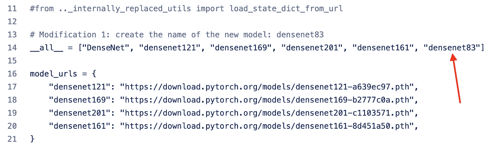

图片作者。

*   我们创建一个函数`densenet83`，它只有一行代码调用另一个函数。注意，我们看到参数`"densenet83"`(网络的名字)，和(3，6，18，12)的值分别是密集块 1，2，3，4 的重复次数。

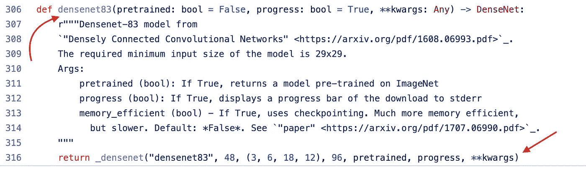

图片作者。

下图显示了 ImageNet 的 DenseNet 架构。我们将 DenseNet-161 作为参照，并将嵌段的重复次数减半以得到 DenseNet-83。

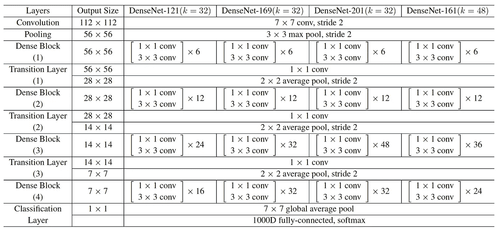

图片(表格)来自 [DenseNet](https://arxiv.org/abs/1608.06993) 的文章。

总共添加/修改了 3 行代码。对于 DenseNet，下图(表)显示了基于 10 个时期训练后的测试数据集的准确度(Acc)结果。我们比较了最初的 DenseNet-121、DenseNet-161 和提议的 DenseNet-83 型号。我们基本上看到了 DenseNet-161 和我们的“新”DenseNet-83 在性能方面的差距，DenseNet-161 略胜一筹。

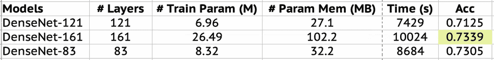

DenseNet:结果。图片作者。

关于 ResNet，比较 ResNet-18、ResNet-34 和“新”ResNet-14，ResNet-18 最好，ResNet-14 次之，如下图(表)所示。

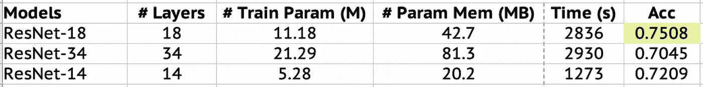

ResNet:结果。图片作者。

## **结论**

在本帖中，我们展示了通过修改先前提议的网络的几行代码来创建新的 dnn 是多么容易。我们声称重用以前的想法并通过适当的修改衍生出新的模型是一个很好的途径。