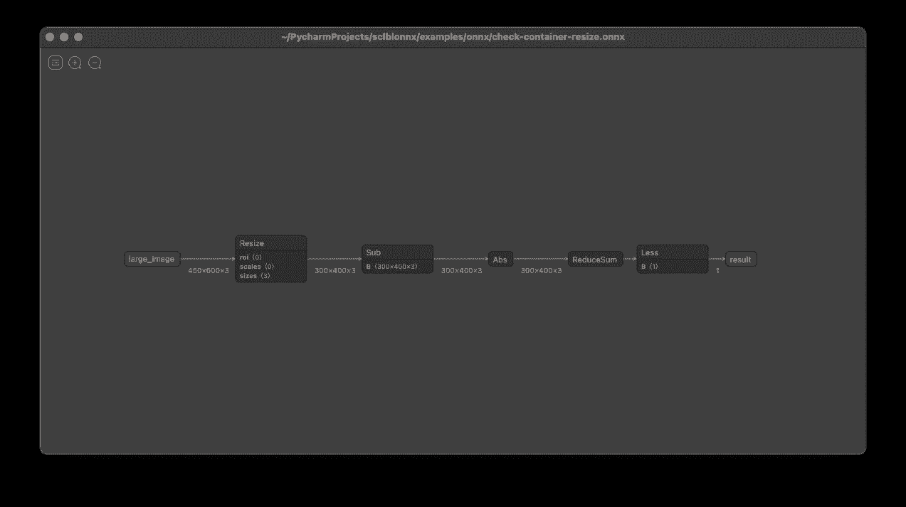

# 创建、编辑和合并 ONNX 管道。

> 原文：<https://towardsdatascience.com/creating-editing-and-merging-onnx-pipelines-897e55e98bb0?source=collection_archive---------7----------------------->



可视化一个简单的图像处理管道。

## ONNX 是一种非常有用的存储数据科学/人工智能工件的格式，用于版本控制和部署。我们很高兴分享`[sclblonnx](https://pypi.org/project/sclblonnx/)`，这是一个 python 包，可以轻松编辑和扩充 ONNX 图形。

在过去的一年里，在 [Scailable](https://scailable.net) ，我们大量使用 [ONNX](https://onnx.ai) 作为存储数据科学/人工智能工件的工具:ONNX 图有效地指定了对输入数据执行的所有必要操作，以生成所需的输出。因此，ONNX 不仅可以用于存储复杂的人工智能/人工智能模型(像 [TensorFlow](https://github.com/onnx/tensorflow-onnx) 和 [PyTorch](https://pytorch.org/tutorials/advanced/super_resolution_with_onnxruntime.html) 这样的流行的人工智能框架将允许您开箱即用)，而且还可以*在某些特定的上下文中部署经过训练的模型所必需的所有预处理和后处理*。因此，我们使用 ONNX 作为 DS / AI 模型和管道的版本控制工具。此外，一旦 ONNX 中的管道可用，就可以很容易地高效部署。

因为在 Scailable，我们经常使用 ONNX，并且因为我们对 ONNX 模型/管道的使用几乎总是(远远)超出简单地将一个合适的模型存储在一个环境中，以便以后在完全相同的环境中使用它，我们经常发现自己处于这样的情况，我们想要检查、改变、测试或合并现有的 ONNX 图。例如，我们经常将图像大小调整添加到现有的视觉模型中，这样所得到的 ONNX 管道就可以用于不同分辨率的相机。然而，在我们看来，现有的`onnx.helper` [API](https://github.com/onnx/onnx/blob/master/docs/PythonAPIOverview.md) 使用起来有点困难。因此，在内部，我们正在开发(并不断尝试改进)一个用于操作 ONNX 图形的高级 API。今天，我们正在开源我们当前的版本；请[下载、探索、追加](https://pypi.org/project/sclblonnx/)或[提交问题/功能请求](https://github.com/scailable/sclblonnx/issues/new)。

在本文的剩余部分，我将提供一个`sclblonnx` python 包的概述，该包旨在使手动操作 ONNX 图变得容易。

# 基本用法

简单地说，`sclblonnx`包提供了许多高级实用函数来处理 ONNX 图。我们尝试使用一致的语法，如下所示:

```
# Import the package
import sclblonnx as so# Assuming we have a graph object g:
g = so.FUNCTION(g, ...)
```

因此，我们提供了许多函数来操作一个图(并且经常改变该图),这导致了该图的更新版本。常见的功能有:

*   `add_node(g, node)`:向现有的图中添加一个节点(是的，显然你也可以`delete_node(g, node)`)。
*   `add_input(g, input)`:向现有图形添加新输入。您也可以删除或更改输入。
*   `add_output(g, output)`:向现有图形添加新输出。
*   `add_constant(g, constant)`:给图形添加一个常数。
*   `clean(g)`:清理图形；这一点非常重要，因为导出的图形经常会臃肿或者不完全一致。
*   `check(g)`:检查图形是否有效，是否可以运行，是否可以使用 Scailable 部署(后者可以关闭)
*   `display(g)`:使用 [Netron](https://netron.app) 目视检查图形。
*   `merge(g1, g2, outputs, inputs)`:将两个(子)图形合并成一个图形。*例如*对训练好的模型添加预处理。

请注意， **ONNX 图形**是*而不是*当您将模型从您最喜欢的培训工具导出到 ONNX 时，存储的唯一内容是一个 **ONNX 模型**(`.onnx`文件的内容)，它包含图形、*和*用于生成图形的软件/版本的描述。因此，一旦你使用`sclblonnx`打开一个**模型**，该包将提取**图形**，并且，如果你使用该包存储打开的**图形**到`.onnx`——同样，即使没有编辑该模型——存储的**模型**将不同于原始模型，因为现在它将由`sclblonnx`包生成。

# 一个简单的例子:从头开始创建一个图

介绍软件包的最简单方法是通过示例；我们已经向其中一些人提供了包装本身。[第一个例子](https://github.com/scailable/sclblonnx/blob/master/examples/example_01.py)创建了一个超级简单的 ONNX 图，将两个数相加。

首先，让我们创建一个空图:

```
g = so.empty_graph()
```

现在我们有了空图`g`，我们可以开始向它添加节点、输入和输出:

```
# Add a node to the graph.
n1 = so.node('Add', inputs=['x1', 'x2'], outputs=['sum'])
g = so.add_node(g, n1) # Add inputs:
g = so.add_input(g, 'x1', "FLOAT", [1])
g = so.add_input(g, 'x2', "FLOAT", [1]) # And, add an output.
g = so.add_output(g, 'sum', "FLOAT", [1])
```

就这样，我们刚刚创建了第一个正常工作的 ONNX 图。但是，我们可能想清理、检查和尝试它:

```
# First, let's clean the graph (not really necessary here) 
g = so.clean(g) # Next, lets see if it passes all checks:
so.check(g)# Display the graph
display(g) # Evaluate the graph:
example = {
    "x1": np.array([1.2]).astype(np.float32), 
    "x2": np.array([2.5]).astype(np.float32)
   }result = so.run(g,
    inputs=example,                
    outputs=["sum"])print(result)
```

最后一行打印`3.7`，合理。

最后，我们可以存储模型:

```
so.graph_to_file(g, "filename.onnx")
```

# 另一个例子:合并两个现有的图形

也许比创建 ONNX 图来从零开始添加两个数字更有用的是合并两个现有的——可能很复杂——ONNX 图；两个或多个图形的合并就是创建管道的方式。

使用`sclblonnx`合并相对容易(尽管不可否认可能有我们还没有考虑的边缘情况；我们打开这个包的动机之一是让它在我们自己的用例之外接受测试:如果您发现任何问题，请提交一个问题，并随时提交更改)。这里有一个例子:

```
# Open the graphs. 
sg1 = so.graph_from_file("resize-image-450x600-300x400.onnx")
sg2 = so.graph_from_file("check-container.onnx")# Merge the two graphs
g = so.merge(sg1, sg2, outputs=["small_image"], inputs=["in"])
```

上面的代码打开了两个现有的图形。第一个有`small_image`作为输出，而第二个有`in`作为输入。这两个图形 *a)* 共同调整大小和图像， *b)* 检查图像中的容器是否为空。你可以在这里找到工作示例[。](https://github.com/scailable/sclblonnx/blob/master/examples/example_06.py)

# 包裹

`sclblonnx`软件包使编辑、修改、检查和合并 ONNX 图形变得容易。该包仍在开发中；如果您发现任何问题，请分享它们，并提交任何改进。同样，我们认为 ONNX 是存储和管理需要跨设备/平台使用的数据处理管道的好工具。我们希望`sclblonnx`包有助于提高 ONNX 的实用性。

尽情享受吧！

# 放弃

*值得注意的是我自己的参与:我是 Jheronimus 数据科学院* [*的数据科学教授，也是*](https://www.jads.nl/)[*scaliable*](https://www.scailable.net/)*的联合创始人之一。因此，毫无疑问，我对 Scailable 有既得利益；我有兴趣让它成长，这样我们就可以最终将人工智能投入生产并兑现它的承诺。这里表达的观点是我自己的。*