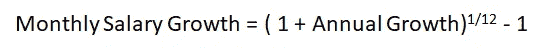
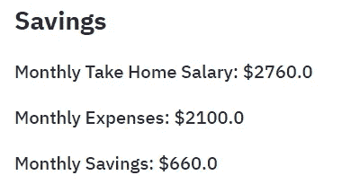

# 使用 Python Streamlit 创建财务规划计算器

> 原文：<https://towardsdatascience.com/creating-financial-planning-calculator-using-python-streamlit-6837460c5863?source=collection_archive---------17----------------------->


照片由 [Unsplash](https://unsplash.com/s/photos/finance-calculator?utm_source=unsplash&utm_medium=referral&utm_content=creditCopyText) 上的 [recha oktaviani](https://unsplash.com/@rechaoktaviani?utm_source=unsplash&utm_medium=referral&utm_content=creditCopyText) 拍摄

财务规划在我们的生活中是必不可少的。除了跟踪我们每月的收入和支出，我们能为未来存多少钱以应对多年来的通货膨胀是另一个重要方面。传统的计算器允许我们进行所有需要的计算，并显示数字。但是，如果我们能够在一个图表中直观地显示我们的预测费用和多年来的节省，那就更好了。好消息是 [**Streamlit**](https://streamlit.io/) 让我们能够构建自己的财务规划计算器，满足所有需求。

在本文中，我们将一步一步地介绍如何使用 Streamlit*，一个基于 Python 的开源数据科学应用框架*，来创建一个财务规划计算器。Streamlit 是一款简单易学、高度可定制的工具，使我们能够根据自己的需求构建数据应用。

可以使用以下链接访问财务规划计算器的部署版本:

[https://share . streamlit . io/teobeeguan/financialplanningcalculator/main/budgetapp . py](https://share.streamlit.io/teobeeguan/financialplanningcalculator/main/BudgetApp.py)

如果您希望使用我的代码来跟踪这篇文章，您可以在我的 [GitHub Repo](https://github.com/teobeeguan/FinancialPlanningCalculator) 获得完整的源代码。

# 必备 Python 库

在开始开发过程之前，我们需要确保以下库在我们的机器中可用:

1.  细流—[https://www.streamlit.io/](https://www.streamlit.io/)
2.  阴谋地—[https://plotly.com/python/](https://plotly.com/python/)
3.  numpy—[https://numpy.org/](https://numpy.org/)

# 计算器应用的开发

## 1.导入库

首先，我们尝试在程序中导入所有需要的库。

## 2.设置页面标题

接下来，我们为计算器应用程序创建页面标题(如财务规划计算器)。

**第 1–2 行:**在 *set_page_config* 方法中设置浏览器标签标题。

**第 3 行:**在我们的应用程序主体中创建一个一级标题。

此时，我们可以尝试运行 Streamlit 应用程序来可视化输出。为此，我们在终端/命令提示符下键入以下命令。

```
streamlit run YourPythonFileName.py
```

*(注意:* *在运行应用程序之前，请确保您已经导航到保存脚本文件的目录。)*

我们将看到如下输出:


作者准备的图像

## 3.创建收入部分

在这里，我们希望获得用户对收入的输入。为此，我们需要一个工资输入字段和另一个税率输入字段。

**第 1–2 行:**创建一个标题(如月收入)和一个副标题(如工资)。

**第 3 行:**创建两列，并列放置我们的工资和税率输入字段。 *colAnnualSal* 和 *colTax* 是我们定义的列名。

**第 5–6 行:**在第一列( *colAnnualSal* ，使用 Streamlit *number_input* 方法创建年薪的数值输入字段。我们可以设置最小值为 0.0，格式为一个小数点数字，“ *%f* ”。

**第 7–8 行:**在第二列( *colTax* )，使用 Streamlit number_input 方法创建另一个税率数值输入字段。

**第 10–12 行:**计算每月实得工资的公式。核心思想是按照进项税率从对我们收入征收的税中扣除工资。接下来，扣除税款后的工资除以 12，这将得出每月的实得工资。


作者准备的图像

## 4.创建费用部分

现在，我们将转到费用部分。我们将为月租金、每日食物预算、水电费等创建几个输入字段。(*您可以根据自己的需要灵活地更改或添加任何相关字段*)。

**第 1–2 行:**创建一个标题，并定义两列来放置我们的输入字段。

**第 4 行:-13:** 在第一列中，创建三个数字输入字段，分别用于每月租金、每日食物预算和不可预见费用及其相应的子标题。

**第 15–23 行:**在第二列中，创建另外三个数字输入字段，分别用于每月交通费、每月水电费和每月娱乐预算及其相应的子标题。

**第 25–26 行:**计算每月 _ 费用和每月储蓄的公式。基本上，我们合计所有的月支出项目，然后从每月的实得工资中减去它们，以获得我们每月的储蓄。


作者准备的图像

## 5.显示计算的节省

这里，我们希望显示根据我们在脚本中定义的公式计算出的节省。

**第 1–4 行:**创建一个标题(如储蓄)，然后将计算出的实得工资、每月开支和储蓄显示为三个不同的副标题。


作者准备的图像

## 6.预测节约

此时，我们已经完成了根据当前收入和支出计算储蓄的部分。虽然我们可以选择多年保持我们的生活方式，但这并不意味着我们的开支和储蓄金额在未来几年将保持不变。由于通货膨胀的因素和我们工资/收入的增加，储蓄金额会随着时间的推移而变化。假设我们的生活方式在未来几年保持不变，预测通货膨胀和我们的增量收入如何相互交织以影响我们的财务计划是一件有趣的事情。

我们可以将这一部分分成两部分:

(a)为通货膨胀率和工资增长率创建输入字段，

(b)创建一个图表，显示预测工资、费用和储蓄的趋势

**6.1。为通货膨胀率和工资增长率创建输入字段**

这里我们将创建几个用户输入字段，以获得他们每年的估计通货膨胀率和工资增长率。为了简化我们的计算，我们假设通货膨胀和工资/收入增长将遵循相同的预计增长率。

**第一行:**在我们的计算应用程序中创建一条水平线。

**第 3–4 行:**创建一个标题并定义两列来放置我们的输入字段。

**第 5–14 行:**在第一列中，使用 *number_input* 方法创建预测年和通货膨胀率的数字输入字段及其相应的子标题。

每月通货膨胀的计算遵循以下公式:


作者准备的图像

一旦计算出每月的通货膨胀率，我们就开始计算每月的预测累积通货膨胀率。Numpy 为我们提供了两个非常有用的内置方法， [*np.cumprod*](https://numpy.org/doc/stable/reference/generated/numpy.cumprod.html) 和 [*np.repeat*](https://numpy.org/doc/stable/reference/generated/numpy.repeat.html) ，让我们免于重复计算几个月的累计通胀。 *np.cumprod* 和 *np.repeat* 将给我们一系列按月的通货膨胀率，我们把它赋给一个变量*cumulative _ inflation _ forecast*。通过将每月费用乘以预测的累积通货膨胀率，我们可以得到一系列从这个月到另一个月的预测费用。

**第 15–20 行:**在第二列中，使用 number_input 方法为预期年薪增长创建数字输入字段。

每月工资增长的计算如下:



作者准备的图像

几个月内预测的累积工资增长的计算类似于上文详述的通货膨胀。

**第 22–23 行:**通过从预测工资中减去预测费用来计算每月的预测节省。接下来，使用 NumPy *cumsum* 方法来计算过去几个月累计的预测储蓄。请注意，我们假设没有额外的储蓄支出。

**6.2 创建一个图表，显示预测工资、费用&节省**的趋势

上一节已经给出了几个数字序列中所有计算出的预测工资、费用和储蓄。每一个数字序列的图表会给我们一个更清晰的画面，让我们检查我们目前的储蓄是否足以应对未来的通货膨胀。

我们将使用 Python Plotly 库在单个图表中创建三个线图，以根据用户输入的预测年数显示预测的工资、费用和储蓄的趋势。

**第 1 行:**按预测年数设置 x 轴数值。

**第 3–10 行:**创建一个**图形*对象。使用 Plotly *go 为预测工资创建一个线图。分散*物体。将预测薪金设置为 y 轴值。使用*add _ trace*方法将该图添加到图形对象。*

***第 12–26 行:**以类似的方式，使用 *go 创建预测费用和预测节省的折线图。分散*对象并将它们添加到同一个图表中。*

***第 27–29 行**:使用 *update_layout* 方法设置整个图表的标题，以及 x 轴和 y 轴的标题。*

***第 31 行:**使用 Streamlit *plotly_chart* 方法渲染图表。*

**

*作者准备的图像*

*目前，图表显示为空，因为我们还没有在前面创建的输入字段中输入任何输入值。*

## *7.示范*

*现在，计算器应用程序已经准备好了，我们可以通过输入所有必需的工资和费用条目值来测试它。*

**

*作者准备的图像*

*通过输入上述所有收入和支出的输入值，我们的应用程序将计算并显示当前每月的税后工资、支出和储蓄，如下所示。*

**

*现在，让我们开始输入预测年数、预计通货膨胀率和工资增长率。*

**

*作者准备的图像*

*输入上述值后，我们将看到图表中显示的线图。*

**

*作者准备的图像*

*图表显示了未来 5 年的健康储蓄计划。假设年通货膨胀率为 5%，预测工资/收入将远远高于预测费用。预计累计储蓄将逐年稳步增长。*

*现在，让我们尝试调整年薪增长和通货膨胀率的输入值。*

**

*作者准备的图像*

*这次我们试图假设通货膨胀率是工资增长的两倍。对于我们的储蓄计划，我们将得到一个非常不同的图景。*

**

*作者准备的图像*

*在大约 4 到 5 年的时间里，我们的支出将超过我们的收入，从那时起，我们开始花我们的积蓄。如果我们将预测年份的数量延长至 10 年，则从第 8 年开始，预测节约将变为负值。*

**

*作者准备的图像*

*如果我们多年来有额外的支出或承诺(如抵押贷款、孩子等)，我们可以想象更糟糕的情况。这就是为什么在作出任何额外的财务承诺之前，一个适当和仔细的财务规划是至关重要的。*

# *结论*

*这里介绍的财务规划计算器给我们一个未来收入、支出和累积储蓄的粗略预测。我们可以选择根据我们的需求定制计算器，通过输入更多的输入字段来捕捉用户的收入来源和支出领域。这将导致更精确的投影。从上面的样本结果中，我们还可以了解到，额外的投资计划或额外的收入来源可能对保持健康的财务状况非常有帮助。*

*另一方面，本文还旨在展示 Streamlit 在开发金融数据应用程序中的一个可能用例。Streamlit 在我们的技术市场中的存在为我们提供了一个简单的平台，可以快速构建和部署任何类型的数据应用程序。*

*我希望你喜欢阅读这篇文章。*

# ***Github***

*这篇文章的所有源代码都在我的 [Github Repo](https://github.com/teobeeguan/FinancialPlanningCalculator) 中。*

# *参考*

*[https://numpy . org/doc/stable/reference/generated/numpy . cum prod . html](https://numpy.org/doc/stable/reference/generated/numpy.cumprod.html)*

*[https://numpy . org/doc/stable/reference/generated/numpy . cumsum . html](https://numpy.org/doc/stable/reference/generated/numpy.cumsum.html)*

*[https://numpy . org/doc/stable/reference/generated/numpy . repeat . html](https://numpy.org/doc/stable/reference/generated/numpy.repeat.html)*