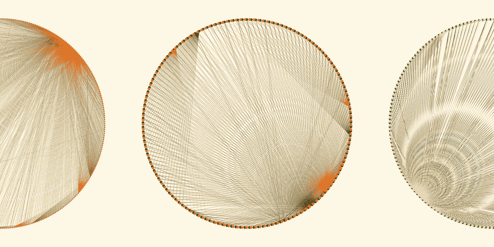
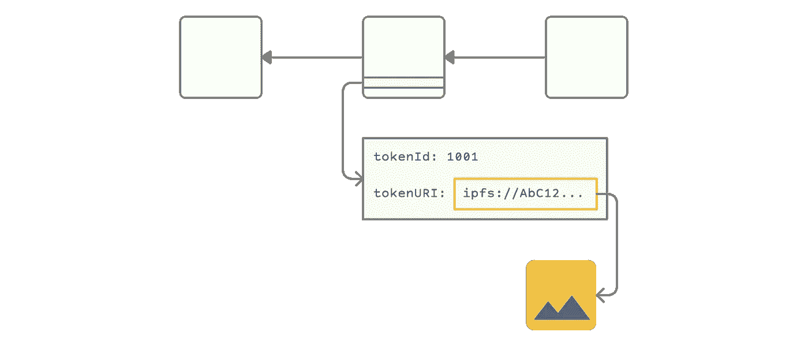
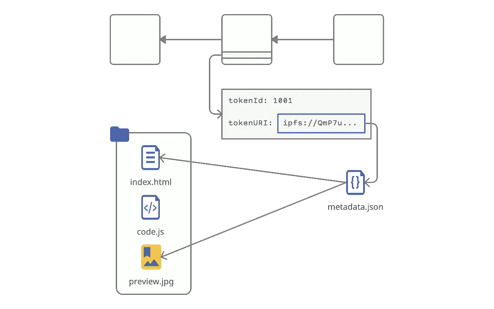
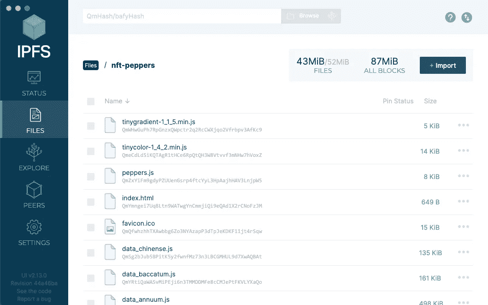
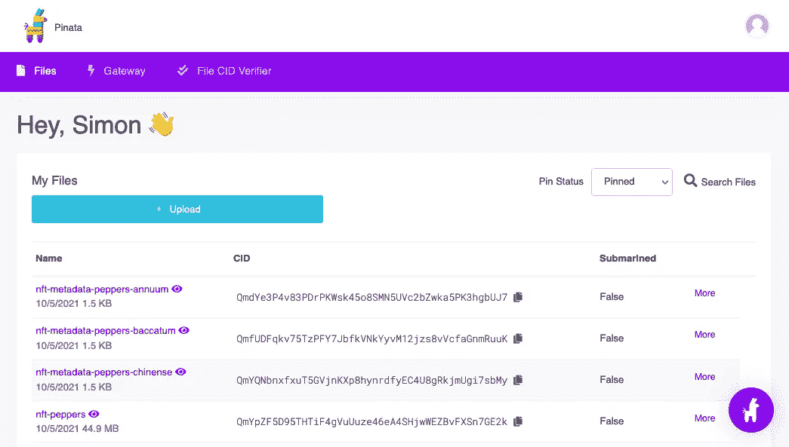

# 从基因组数据创建生殖艺术 NFT

> 原文：<https://towardsdatascience.com/creating-generative-art-nfts-from-genomic-data-16a48ae4df99?source=collection_archive---------3----------------------->



作者图片

在这篇文章中，我概述了我和 IPFS 在区块链以太坊创建动态 NFT 的旅程，并讨论了科学数据可能的用例。我不讨论静态图像的算法生成(你应该阅读 Albert Sanchez Lafuente 的 neat [一步一步的](/algorithmically-generated-image-dataset-71aee957563a)),而是演示当从浏览器查看 NFT 时，我如何使用 Cytoscape.js、Anime.js 和基因组特征数据在运行时动态生成可视化/艺术。我也不会提供区块链的概述，但我强烈推荐阅读黄一飞最近的帖子:[为什么每个数据科学家都应该关注加密](/why-every-data-scientist-should-pay-attention-to-crypto-39b4c25ff319)。

疫情期间，我被困在家里，我是在我们位于布鲁克林的小公寓阳台上尝试园艺的 1000 万 T4 人之一。日本黄瓜很受我们邻居的欢迎，西红柿很受松鼠的欢迎，但我最喜欢看辣椒生长。这就是我的第一个 NFT 的目标:描绘一个随着时间而成熟的辣椒。

有多少描绘是视觉化的，多少是艺术？这是旁观者的看法。当你花时间仔细检查数据点，崇拜最佳实践，优化从内存使用到午餐订单的一切时，采取一些艺术许可，仅仅因为你喜欢就做出一些东西，这是很好的，这正是我在这里所做的。该描述真实地产生于基因组数据特征，但显然这不应被视为任何种类的严肃的生物学分析。

如果你正在寻找最终的实况结果，你可以在这里查看它[，在这里](https://opensea.io/assets/0x86944176301532d4432b50838cea252e3b2990bb/1001)查看 GitHub [上的源代码。](https://github.com/s1monj/nft-peppers)


## 准备基因组数据

这里没有什么新的东西，但为了完整起见，我将快速浏览一遍。我的第一站是访问 NCBI [装配](https://www.ncbi.nlm.nih.gov/assembly/?term=Capsicum)页面，搜索辣椒。我很惊讶地发现了 8 个结果，我想我也许可以创造 8 种不同的辣椒，但在进一步挖掘后，我发现并非所有的数据集都有注释，同一物种有一些重叠。在对那些既有注释又有独特物种的进行过滤后，我得到了 3 个可行的数据集:

*   [辣椒](https://www.ncbi.nlm.nih.gov/assembly/GCF_000710875.1)来自 Jo YD 等人【1】与[红辣椒](https://www.diark.org/diark/species_list/Capsicum_annuum_cultivar_Zunla-1)
*   [辣椒 baccatum](https://www.ncbi.nlm.nih.gov/assembly/GCA_002271885.2) 来自金 S 等人【2】用[黄椒](https://www.diark.org/diark/species_list/Capsicum_baccatum)
*   [黄灯笼辣椒](https://www.ncbi.nlm.nih.gov/assembly/GCA_002271895.2)来自金 S 等人【2】与[甜椒](https://www.diark.org/diark/species_list/Capsicum_chinense)

我发现 Dubey 等人[3]的这篇论文 T14 列出了 11 个怀疑与辣椒果实成熟有关的基因组区域，并从补充材料中复制了引物核苷酸序列和长度。

来自 NCBI 的 gff 文件是简单的 tsv 文本文件，列出了一个特征(如基因、mRNA、外显子等)以及开始和结束坐标以及任何其他元数据——参见下面的示例。我们的目标是将这些文件分成子集，只包含那些属于 Dubey 研究中成熟过程所涉及的区域的特征。

```
NC_029977.1  Gnomon  gene  590985  592488  .  -  .  ID=gene-LOC10...
NC_029977.1  Gnomon  mRNA  619017  620755  .  +  .  ID=rna-XM_016...
NC_029977.1  Gnomon  exon  619829  620755  .  +  .  ID=exon-XM_01...
```

为了只从那些感兴趣的区域提取 gff 特征，我们需要相应的坐标，这是通过 NCBI 基本局部比对搜索工具( [BLAST](https://blast.ncbi.nlm.nih.gov/Blast.cgi) )实现的。使用这个工具，我们获得了 Dubey 研究中发现的每一个核苷酸序列(例如 GGCATCGT…)，并在每种植物的整个基因组序列中查找它——类似于在一本非常大的书中查找特定的短语。

BLAST 确实有一个 web 界面，但我想编写这个步骤的脚本，以便它可以在三个数据集上一致地重复，所以接下来我下载了他们的[命令行](https://www.ncbi.nlm.nih.gov/books/NBK569861/)应用程序。我首先试图通过传递`-remote`标志来使用 NCBI 服务器进行处理。结果以令人怀疑的速度返回，我没有得到任何点击，但是我发现你还需要通过短序列的`-task blastn-short`,这似乎在任何地方都没有记录。

```
blastn -db “GPIPE/4072/100/GCF_000710875.1_top_level” -query dubey.fsa -out results.out -task “blastn-short” -remote
```

这现在产生了相反的效果——远程进程运行了很长时间，而我得到了`Error: [blastn] Failed to fetch sequences in batch mode`。此时，我决定对子弹进行字节化处理，并创建自己的 BLAST 数据库来本地运行这个过程。我从同一个 NCBI 页面下载了所有 fna 文件，并编写了一个类似如下的命令:

```
for g in "${genome_ids[@]}"; do
  for ((i=1;i<=12;i++)); do
    makeblastdb -in datasets/ncbi_dataset/data/${g}/chr${i}.fna
      -dbtype nucl -parse_seqids -out blast/dbs/${g}/chr${i}.blast
  done
done
```

这被证明是值得的:我重复了 blastn 命令，但没有使用`-remote`标志，不久后就有了一个坐标列表，报告了成熟过程中涉及的每个基因序列的完美匹配。最后一步是使用一堆 bash 命令(参见[源](https://github.com/s1monj/nft-peppers)代码)来修剪和格式化数据，因此我为 3 个物种中的每一个留下了一个简单的 3 列 tsv，如下所示——第一列是 Dubey 研究中用于识别该区域的基因位置 ID(总共 11 个不同的 loc ),第二和第三列是 gff 文件中该区域的基因组坐标和特征(有误差)。

```
LOC107843860 213978278 gene
LOC107843860 213989346 mRNA
LOC107843860 213991885 exon
...
```


## 用 Cytoscape.js 生成可视化

几年前，我摆弄过 Cytoscape 桌面应用程序，我一直觉得它生成的网络图形很有美感。显然，我在这里准备的数据绝不是网络，所以这不是一个典型的用例，但我接受了那个创造性的许可并选择了它，因为我喜欢它的外观。

不足为奇的是，Cytoscape.js 需要 JSON 格式的数据，而*是什么呢*有点令人惊讶的是，它不能像桌面版本那样读取表格(2D 数组)并推断节点和边。相反，我们需要明确地将每个节点和边定义为一个数据对象，如下例所示。

```
const dataAnnuum = [{
  "data": {
    "id": "6679599"
  }
},{
  "data": {
    "id": "gene"
  }
},{
  "data": {
    "id": "6679599-gene",
    "source": "6679599",
    "target": "gene"
  }
},
...
```

jq 来拯救:

```
for g in "${genome_ids[@]}"; do
  for loc in "${loc_ids[@]}"; do
    cat graph/$g-$loc.txt | jq --raw-input --slurp 'split("\n") | map(split(" ")) | .[0:-1] | map( { "data": { "id": .[1] } }, { "data": { "id": .[2] } }, { "data": { "id": (.[1] + "-" + .[2]), "source": .[1], "target": .[2] } } )' >> json/$g.js
    cat graph/$g-$loc.txt | jq --raw-input --slurp 'split("\n") | map(split(" ")) | .[0:-1] | map( { "data": { "id": .[0] } }, { "data": { "id": .[1] } }, { "data": { "id": (.[0] + "-" + .[1]), "source": .[0], "target": .[1] } } )' >> json/$g.js
  done
done
```

一旦你格式化了你的数据，对我来说唯一的另一个问题是，我需要将构造函数包装在一个`DOMContentLoaded`监听器中(见下文)，但是除此之外，他们的[入门](https://js.cytoscape.org/#getting-started/initialisation)例子很好地工作了。

```
document.addEventListener("DOMContentLoaded", function () {
  cyto1 = cytoscape({
    container: document.getElementById("target"),
    elements: dataAnnuum,
    style: [...],
    layout: {
      name: "circle",
    },
  });
});
```

Cytoscape.js 为动画提供了一个令人印象深刻的 [API，可用于动态设置节点和边的样式(见下文),但也值得注意的是，它有一个完整的视口操作特性集，如缩放和平移，这对于需要单步执行和叙述图表的正确通信可视化来说非常方便。作为一个简单的动画示例，在下面的代码中，我找到了与一种基因特征(基因、外显子等)相关的所有边缘，并改变了颜色，将线条的宽度加倍。](https://js.cytoscape.org/#core/animation)

```
cyto1
  .nodes("#" + geneFeature)[0]
  .connectedEdges()
  .animate({
    style: {
      lineColor: RIPE_COLOR[seqNum],
      width: SKELETAL_WIDTH[seqNum] * 2
    },
  });
```


## 用 Anime.js 制作动画

我想让图片更生动一些，但是 Cytoscape.js 的平移和缩放并不是我真正想要的效果。我过去曾和 [p5.js](https://p5js.org/) 一起玩，这似乎在生成艺术界很流行，但我想借此机会给 [anime.js](https://animejs.com/) 一个机会，好家伙，我很高兴我这么做了。只需几行代码，我就能拿起包含细胞图的`div`,并流畅地前后旋转它，轻松地开始和停止。

```
anime({
  targets: #graph1,
  rotate: [45, -45],
  duration: 10000,
  easing: "easeInOutSine",
  direction: "alternate",
  loop: true,
});
```

我还使用了倾斜效果，在页面第一次加载时将图形放大。当你需要开始对效果进行计时和排序时，事情会变得稍微复杂一些，anime.js 为此提供了一个[时间线](https://animejs.com/documentation/#timelineBasics)特性。当我将所有的动画移动到时间线上时，我发现还有一个简单的`complete:`选项，可以在每个动画完成时触发一个功能，这被证明是一个对这个简单的动画进行排序的更优雅的解决方案。


## 在 IPFS 部署

不可替代是一个经济术语,用来描述独一无二且不能与其他同类事物互换的事物。不可替代令牌背后的概念是，它们不仅是唯一的，而且其唯一性可以很容易地通过区块链上的公共记录来验证。当一个数字资产，比如一个静态的“photo.jpg”文件，作为一个 [NFT](https://ethereum.org/en/nft/) 被添加到以太坊区块链时，一个常见的误解是文件“photo.jpg”的实际字节码被写入一个区块。仅交易和链上数据，以太坊区块链今天就超过了 1TB 的大关，所以你可以想象，如果每个 NFT 的 jpeg、gif 和电影文件都被添加进去，它会迅速膨胀到 Pb 级的数据。鉴于区块链的主要动机是去中心化，如果链增长到这种规模，对于大多数节点来说，维护起来会非常大，留下一个更集中的大盒子网络。

NFT 没有将 NFT 数据文件存储在链上，而是有一个不可变的`tokenURI`记录指向一个文件。如果这个`tokenURI`使用位置寻址，例如传统的 web 服务器，例如[http://myserver.com/photo.jpg](http://myserver.com/photo.jpg)，那么拥有不可撤销的`tokenURI`记录是没有意义的，如果地址目的地的文件可以被切换出去，这就是[一些不高兴的 NFT 所有者所发生的事情](https://www.theverge.com/2021/3/25/22349242/nft-metadata-explained-art-crypto-urls-links-ipfs)。



作者图片

这就是 IPFS 的用武之地。星际文件系统是一个点对点的分布式存储网络，与 BitTorrent 不同，它由遍布全球的计算机组成，存储和共享数据。IPFS 还使用一种名为 FileCoin 的加密货币作为激励层，这样用户就可以因为在电脑上存储数据而获得奖励。这里的关键区别是，IPFS 不像传统的网站那样使用位置寻址，而是使用内容寻址，这涉及到生成文件或目录的散列(“CID”)并使用它进行检索。

```
Location addressing: [http://myserver.com/photo.jpg](http://myserver.com/photo.jpg)
Content addressing:  ipfs://QmP7u9UzoUtfpiNkj3Sa...
```

要从 web 浏览器访问 IPFS 内容，您需要使用网关，如 Cloudflare 提供的 *ipfs.io* ，例如:

[https://ipfs . io/ipfs/qmp 7 u 9 uzoutpinkj 3 sal 5 tly m2 ngrufvsinhf 21 uff 3 l 1](https://ipfs.io/ipfs/QmP7u9UzoUtfpiNkj3SaL5TLym2ngrUfvsiNhf21uFF3L1)

对 NFT 数据使用 IPFS 的好处在于，它不仅是分散的和始终在线的，而且如果文件中的一个字节发生变化，CID 也会发生变化。这意味着 NFT 记录的不可变`tokenURI`总是保证返回完全相同的数据。

在开始将数据上传到 IPFS 之前，还有一个额外的考虑事项:用于显示 NFT 的元数据。与其将 NFT 的`tokenURI`设置为直接指向 IPFS 上的文件，不如将它指向 IPFS 上的一个元数据 JSON 文件，该文件包含 NFT 的信息，并依次指向源文件以及任何其他文件，如预览图像。因为这个元数据文件也存储在 IPFS 上，所以可以保证它也没有被修改。没有官方的以太坊规范，但是 OpenSea 描述的[格式](https://docs.opensea.io/docs/metadata-standards)已经成为标准。



作者图片

要将文件上传到 IPFS，你可以下载[桌面应用](https://docs.ipfs.io/install/ipfs-desktop/)，并使用它上传完整的源目录，包括 index.html、基因组数据、javascript、支持库和预览图像。请注意，index.html 中的文件路径不需要使用内容寻址(IPFS 网关可以在目录级别解析位置寻址)，但由于这个原因，它们需要是相对的。



作者图片

现在有了 IPFS 上的数据，然后复制目录和图像预览文件的 CID，并完成 metadata.json 文件中的条目。最后，上传元数据文件并复制将用于 NFT 的 CID。请注意，传递给`index.html`的`tokenId=1001`参数只是用作一个序列号，以便单个源代码目录可以根据元数据中引用的 URL 生成 3 个不同的变体(种类)。

```
{
  "token_id": 1001,
  "name": "Capcicum annuum",
  "description": "This red pepper depiction is generated...",
  "image": "ipfs://QmYpZF5D95THTiF4gVuUuze46eA4SHjwWEZBvFXSn7GE2k/annuum-preview.png",
  "background_color": "fcf5e5",
  "external_url": "[https://nicetotouch.eth.link/peppers](https://nicetotouch.eth.link/peppers)",
  "animation_url": "ipfs://QmYpZF5D95THTiF4gVuUuze46eA4SHjwWEZBvFXSn7GE2k/index.html?tokenId=1001",
  "attributes": [
    { "trait_type": "Species", "value": "Capsicum annuum" },
    ...
  ]
}
```

IPFS 桌面应用程序实际上是向全世界提供你的文件，所以它们只有在你的电脑运行时才可用。为了确保文件始终在线并复制到其他对等点(而不仅仅是临时缓存)，我们需要“固定”它们。有一些不同的锁定服务，但我选择了 [Pinata](https://www.pinata.cloud/) ，它给你 1GB 的免费空间，而且非常简单易用。只需注册，点击上传/添加并粘贴您想要 pin 的 cid。



作者图片


## 以太坊区块链上的造币

最后一步是通过在区块链上创建一个公共的、可验证的记录来主张你的数据的所有权。有很多像 OpenSea 这样的 NFT 聚合器提供造币服务，但不幸的是，它们只支持创建简单的单文件 NFT，如图像和电影。BeyondNFT 是我发现的唯一一个允许你通过上传 zip 文件来创建动态 NFT 的网站，但在撰写本文时，还不支持创建你自己的智能合约，相反，你必须使用他们的通用总括合约。

为了概念化契约的角色，NFT 的“令牌”部分可以被认为是一个对象类的实例，该对象类是 [ERC721](https://eips.ethereum.org/EIPS/eip-721) 智能契约的实现。智能合约存在于区块链上，并具有一个 mint 函数，该函数使用一组不可变的变量(例如一个`tokenId`和`tokenURI`)创建一个唯一的令牌。由于这个原因，从同一个契约创建的所有令牌都被视为一个“集合”并被分组在一起，因此当创建一组 NFT(如本例所示)时，您确实希望使用自己的契约，而不是加入一些您无法控制的现有大型通用集合。

创建你自己的智能合同，然后铸造一个 NFT 需要几个步骤，幸运的是，阿米尔·索雷玛尼在[这本精彩的指南](https://medium.com/@mondoir/your-very-own-smart-contract-for-nfts-b068b7d65e5d)中完美地概述了这些步骤。我以前没有使用 Solidity 或部署智能合同的经验，但在这篇文章之后，我在大约半小时内完成了 3 个 NFT。


## 科学数据的用例

当我在生物信息学领域工作时，我似乎花了大量的时间来检查、再三检查我认为我正在存储、移动或处理的文件是否确实是正确的文件。带有相应文件名、服务器位置和目录路径的样本名称的电子表格，以及“新的”、“最新的”或“已修复的”这些词困扰着我。

如果你混淆了 Word 文档、电子表格或 JavaScript 源文件的命名，你可以很快确定你打开的文件是错误的，但科学数据通常不是这样。样本数据可能是如此密集和同质，以至于除了结果之外，没有简单可靠的方法来区分文件内容，这就是*分析，这意味着文件名混淆可能是灾难性的。*

这就是内容寻址数据非常有意义的地方。是的，当你有校验和的时候，它们是很棒的，但是要想有用，它们真的需要从数据的来源产生，并携带到数据去的任何地方。*然而，通过校验和寻址*给了我们一石二鸟的机会:我们可以保证我们下载的是正确的、原始的、未修改的文件，我们还可以在我们这边对它进行校验和，以确保我们已经完全传输了它。

IPFS 的分散性质也非常适合科学数据。学术界很少拥有与企业同等的资源来提供高度可用、高度冗余的数据，具有讽刺意味的是，大多数学术数据都是公开的，是为了公众利益。如果 NCBI 网站今天离线，虽然他们可能会将数据镜像到其他服务器上并备份到磁带上，但如果我无法访问他们的网站，我就无法访问我需要的数据。有了内容地址，我可以直接从 IPFS 下载数据，独立于任何 URL，也不管 NCBI 节点或网关是否关闭。除此之外，点对点组件的操作就像一个内容交付服务，所以当我在处理一个巨大的基因组参考文件时，如果我隔壁的同事想下载相同的数据，他们会自动从我这里直接获得，而不是跨越全球。

IPFS 不太适合科学数据的地方是起源和血统方面，这是区块链和非功能性测试的方向。在最基本的层面上，在高度可访问、完全冗余、安全、分散的服务上拥有不可变的记录来描述一个数据集或多个数据集，为数据科学带来了巨大的价值。当负责拥有数据的实体改变时，可以处理 NFT，并且永久记录历史，并且如果需要更新记录，可以发布具有更新的元数据的新令牌，该元数据包括对旧令牌和旧数据的引用。

在一个更高的层次上，是对一个记录引用和知识产权的新系统的可能应用。我不是一个学者，但在今天的信息时代，期刊出版和引用系统似乎过时和笨重。几年前，理查德·福达·伯利发表了一篇论文，提议建立一个受比特币启发的分散式共享引用分类账。他指出，集中式分类账(如 Scopus 和 Web of Science)是一项大业务，通常“……关于什么被索引和不被索引的重要决定在许多方面都基于经济考虑”，这对于传播科学知识来说是一个问题。想象一下，如果一篇研究论文，连同所有附带的补充材料、数据集和软件被存放在区块链和 IPFS，归作者所有，任何人都可以阅读和复制。索引呢？像 [The Graph](https://thegraph.com) 这样的项目已经发明了 Dapps(去中心化应用程序)来索引区块链数据，许多人认为我们像今天使用谷歌一样搜索和浏览 Web3(去中心化 Web)只是时间问题。

最后，区块链是记录知识产权的明显匹配，正如去年世界知识产权组织[指出的](https://www.wipo.int/wipo_magazine_digital/en/2020/article_0002.html)。虽然他们的讨论集中在设计和商标上，但我也设想了一个与这个例子相关的专利申请。再一次，从我对化学实用专利的有限理解来看，专利的很大一部分是描述这项工作，以及它是如何制作的，以及如何重复或复制(“实现”)。想象一下，如果数据在一个去中心化的区块链上被很好地打包并打上时间戳，这个包用于发布和引用，没有利益冲突或国际政治干预，那么专利当局可以简单地指向这个记录让世界看到。

我希望这为如何将动态可视化作为 NFTs 添加到以太坊区块链提供了一些见解，也让你思考 Web3 在数据科学中可能的未来用例。你可以在这里查看最终结果[，在这里](https://opensea.io/assets/0x86944176301532d4432b50838cea252e3b2990bb/1001)查看 GitHub [上的源码。](https://github.com/s1monj/nft-peppers)

**剪贴画**

以上所有剪贴画均来自 un draw([https://undraw.co](https://undraw.co))并在 [unDraw 开源许可](https://undraw.co/license)下使用。

**参考文献**

[1] Jo，Y. D .，Park，j .，Kim，j .，Song，w .，Hur，C. G .，Lee，Y. H .，& Kang，B. C .，辣椒质体基因组的完整测序和比较分析揭示了辣椒质体基因组上串联重复和大插入/缺失的高频率(2011)，*植物细胞报告*， *30* (2)，217–229。[https://doi.org/10.1007/s00299-010-0929-2](https://doi.org/10.1007/s00299-010-0929-2)

[2] Kim S，Park J，Yeom SI 等，辣椒新的参考基因组序列揭示了植物抗病基因的大量进化(2017)， *Genome Biol* 。2017;18(1):210.发布于 2017 年 11 月 1 日。[https://doi.org/10.1186/s13059–017–1341–9](https://doi.org/10.1186/s13059–017–1341–9)

[3] Meenakshi Dubey，Vandana Jaiswal，Abdul Rawoof，Ajay Kumar，Mukesh Nitin，Sushil Satish Chhapekar，Nitin Kumar，易勒雅斯·艾哈迈德，Khushbu Islam，Vijaya Brahma，Nirala Ramchiary，辣椒果实发育/成熟相关基因的鉴定和功能标记的开发(2019 年)，*基因组学*，第 111 卷，第 6 期，2019 年，[https://doi.org/10.1016/j.ygeno.2019.01.002.](https://doi.org/10.1016/j.ygeno.2019.01.002.)

[4]伯利·理查德·福特，稳定而分散？共享引用账本的承诺与挑战(2018)，*信息服务&使用*，第 38 卷，第 3 期，第 141–148 页，2018，[https://doi.org/10.3233/ISU-180017](https://doi.org/10.3233/ISU-180017)