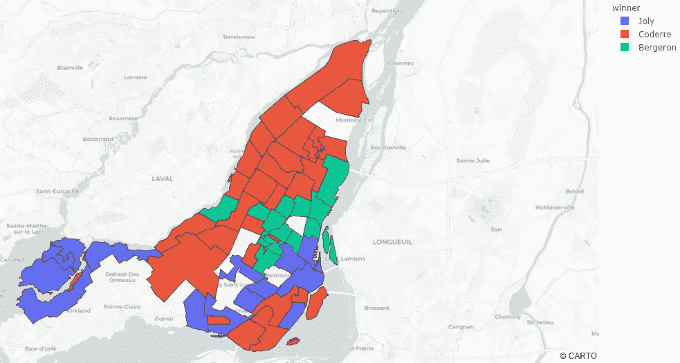
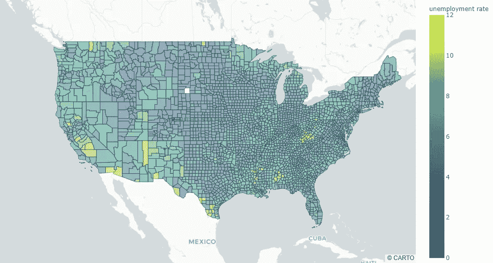
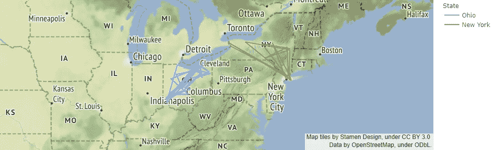
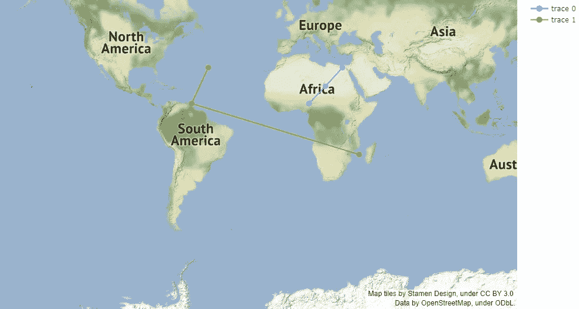

# 使用 Plotly 创建地理图

> 原文：<https://towardsdatascience.com/creating-geographical-plots-using-plotly-e77401f676c1?source=collection_archive---------22----------------------->

## 使用 plotly 可视化地理数据



来源:作者

Plotly 是一个创建高级交互图形的开源库，可用于轻松绘制各种类型的图形和图表。

在 plotly 之前，创建地理图从未如此容易。Plotly 在后端使用 JS 来呈现图形。这使得它们具有视觉吸引力和高度交互性。

在本文中，我们将使用 plotly 来创建地理图，并使用其他功能。

让我们开始吧…

# 安装所需的库

我们将从使用 pip 安装 plotly 开始。下面给出的命令将安装它。

```
pip install plotly
```

# 导入所需的库

在这一步中，我们将导入一些创建图表所需的库，加载数据所需的库等等。

```
import pandas as pd
from urllib.request import urlopen
import json
import plotly.express as pximport plotly.graph_objects as go
```

# 创建地理图表

这是最后一步，我们将使用不同的在线数据集创建不同的地理地图。我们将从创建一个简单的图表开始。

```
with urlopen('https://raw.githubusercontent.com/plotly/datasets/master/geojson-counties-fips.json') as response:
    counties = json.load(response)df = pd.read_csv("https://raw.githubusercontent.com/plotly/datasets/master/fips-unemp-16.csv",
                   dtype={"fips": str})fig = px.choropleth_mapbox(df, geojson=counties, locations='fips', color='unemp',
                           color_continuous_scale="Viridis",
                           range_color=(0, 12),
                           mapbox_style="carto-positron",
                           zoom=3, center = {"lat": 37.0902, "lon": -95.7129},
                           opacity=0.5,
                           labels={'unemp':'unemployment rate'}
                          )
fig.update_layout(margin={"r":0,"t":0,"l":0,"b":0})
fig.show()
```



地理图(来源:作者)

同样，让我们看看其他类型的图表，我们可以使用 Plotly 创建。

```
df = px.data.election()
geojson = px.data.election_geojson()fig = px.choropleth_mapbox(df, geojson=geojson, color="winner",
                           locations="district", featureidkey="properties.district",
                           center={"lat": 45.5517, "lon": -73.7073},
                           mapbox_style="carto-positron", zoom=9)
fig.update_layout(margin={"r":0,"t":0,"l":0,"b":0})
fig.show()
```


地理图(来源:作者)

```
us_cities = pd.read_csv("https://raw.githubusercontent.com/plotly/datasets/master/us-cities-top-1k.csv")
us_cities = us_cities.query("State in ['New York', 'Ohio']")import plotly.express as pxfig = px.line_mapbox(us_cities, lat="lat", lon="lon", color="State", zoom=3, height=300)fig.update_layout(mapbox_style="stamen-terrain", mapbox_zoom=4, mapbox_center_lat = 41,
    margin={"r":0,"t":0,"l":0,"b":0})fig.show()
```



线条地图框(来源:作者)

```
fig = go.Figure(go.Scattermapbox(
    mode = "markers+lines",
    lon = [10, 20, 30],
    lat = [10, 20,30],
    marker = {'size': 10}))

fig.add_trace(go.Scattermapbox(
    mode = "markers+lines",
    lon = [-50, -60,40],
    lat = [30, 10, -20],
    marker = {'size': 10}))

fig.update_layout(
    margin ={'l':0,'t':0,'b':0,'r':0},
    mapbox = {
        'center': {'lon': 10, 'lat': 10},
        'style': "stamen-terrain",
        'center': {'lon': -20, 'lat': -20},
        'zoom': 1})

fig.show()
```



散点图框(来源:作者)

这就是你如何使用 plotly 创建不同的地理图。继续在不同的数据集上尝试，并让我知道您在回复部分的评论。

**本文与** [**皮尤什英加尔**](https://medium.com/u/40808d551f5a?source=post_page-----e77401f676c1--------------------------------) **合作。**

# 在你走之前

***感谢*** *的阅读！如果您想与我取得联系，请随时通过 hmix13@gmail.com 联系我或我的* [***LinkedIn 个人资料***](http://www.linkedin.com/in/himanshusharmads) *。可以查看我的*[***Github***](https://github.com/hmix13)**简介针对不同的数据科学项目和包教程。还有，随意探索* [***我的简介***](https://medium.com/@hmix13) *，阅读我写过的与数据科学相关的不同文章。**