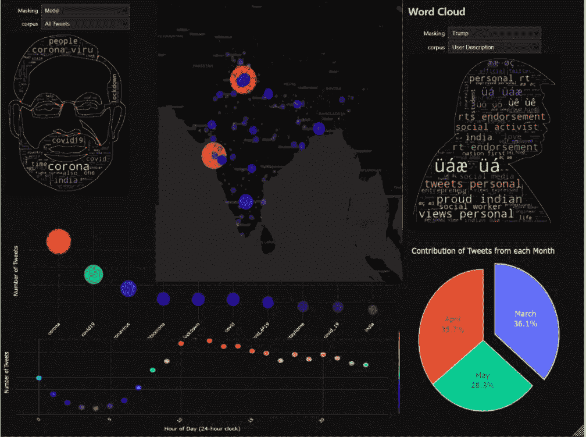
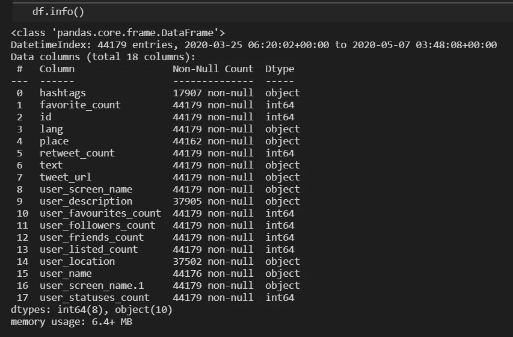
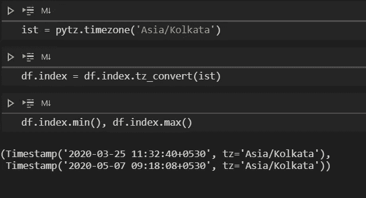
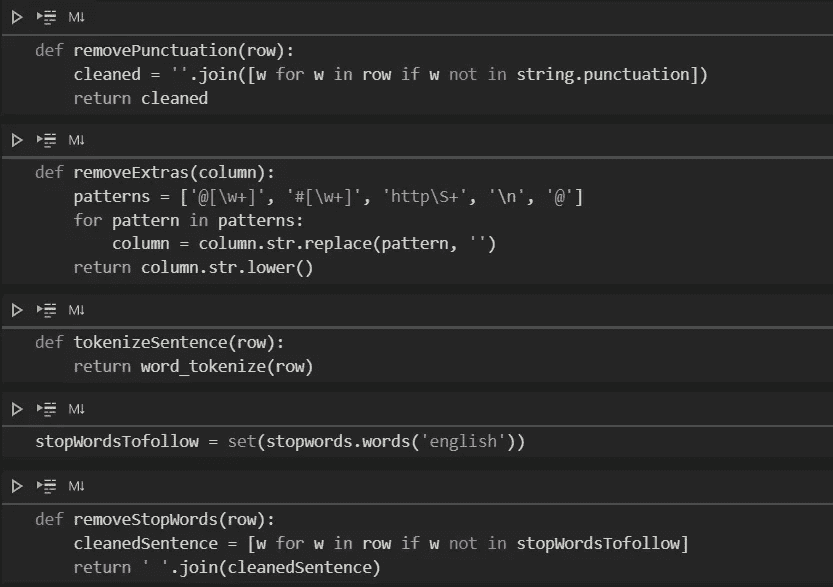
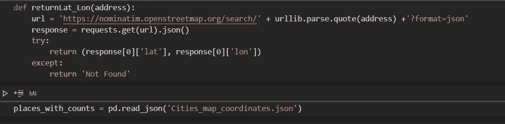
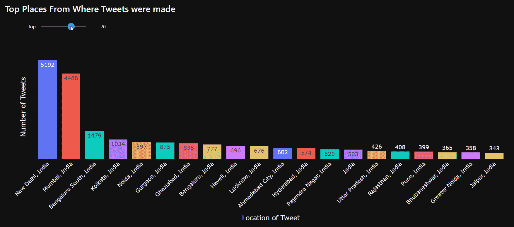
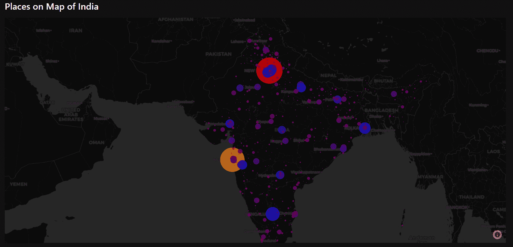
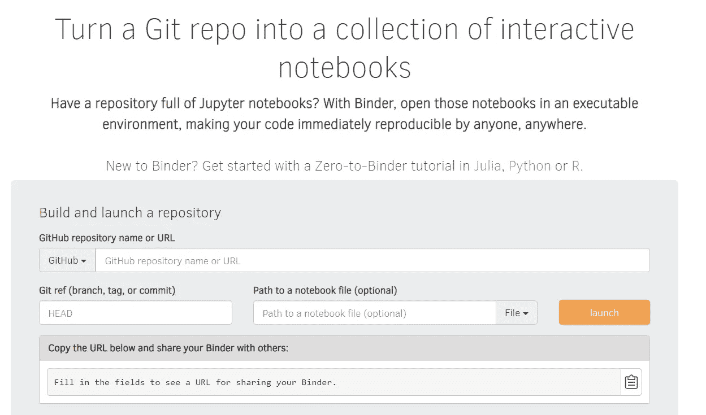
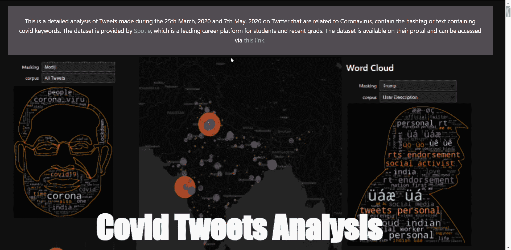

# 使用 Voila 创建交互式 Jupyter 笔记本并部署在 Heroku 上

> 原文：<https://towardsdatascience.com/creating-interactive-jupyter-notebooks-and-deployment-on-heroku-using-voila-aa1c115981ca?source=collection_archive---------7----------------------->

## 使用 Python、Pandas 和 Plotly 分析 Covid 推文



作者图片(使用谷歌绘图创建)，结果的折叠视图

最近，我被指派分析一个包含大约 44k 条目的 Covid tweets 数据集，这篇博客描述了我为创建一些漂亮的可视化效果以及最终部署到云平台 Heroku 所采取的所有步骤。部署了整个 Jupyter 笔记本，消除了任何前端编码的需要。

# 数据集

数据包含日期时间列，这是索引的最佳选择，因为我可以根据日期数据对数据及其子集进行分组。下面是 df.info()返回的内容，考虑到 df 是熊猫读取 CSV 文件的数据框对象:



数据集的所有功能

有 19 列(索引被设置为“created_at ”,它最初是数据集的一部分),除了 hashtags 和 user_description 列之外，大多数列都有非空值，这是有意义的，因为不是每个人都用 hashtags 发推文，也不是所有的推文都有个人资料描述。

经过一段时间的摸索，我发现 language 列只包含' en ',因此我放弃了它。类似地，“id”、“tweet_url”、“user_screen_name.1”也被删除。“用户屏幕名称”和“用户屏幕名称. 1”是相同的列。

# 数据预处理

略述之后，是时候将数据转换成更好的形式了:

时区转换:我住在印度，我的时区是 GMT+5:30。数据集具有 UTC 时区，这使得执行日期时间分析变得困难。例如，如果不进行转换，推特的高峰时间是早上 6 点，但实际上是 11 点。我是这样做的:



UTC 到 IST 的转换

**清理推文:**推文通常包含标签、提及、链接和照片。从 Twitter API 获取数据时，照片被替换为一个链接。所有这些额外的材料都需要被移除，以获得良好的词云和高效的情感检测。我创建了以下函数来消除这种干扰，停止单词和标记化:



Tweets 清理功能

**获取地点的坐标:**有一个名为“地点”的栏目，告诉我们这条推文是从哪里发出的。这给了我一个在地图上绘制它们的绝佳机会，但唯一的问题是我需要可以传递给任何 Mapbox 库的这些地方的准确纬度和经度。经过一番搜索，我找到了一个网站，通过请求他们的端点来提供坐标。这是一个简单的函数:



函数来获取任意地址的坐标

# 制作交互式可视化

在最后一个笔记本里，我做了很多可视化，在这里描述每一个都要花很长时间。我会解释其中一些不同之处。所有的图表、数字都是用 Plotly 制作的。

**图表:**生成表示定性数据计数的静态条形图要容易得多。Plotly 为图表提供了广泛的定制。为了提高交互性，我使用 ipywidgets 来获取用户输入并控制图表的流程。例如，为了以条形图的形式显示 tweets 排名靠前的地方，使用了以下代码:

px 是 plotly express 的别名。

displayPlaces 函数采用参数“top ”,该参数控制绘制条形图时要考虑多少个前 X 位。interact 函数是 ipywidget，它自动创建用户界面控件。更多功能参见[文档](https://ipywidgets.readthedocs.io/en/latest/index.html)。下面的 gif 是为了更好的理解:



显示条形图交互性的 GIF

**地图绘制:**我个人喜欢这种可视化，因为它挑战我探索更多关于 Plotly 的东西。最初，我用 leav 绘制了这个图，结果令人满意，但是用 Plotly，你可以在底图上添加更多的图层，让它看起来更惊人。获取坐标是预处理时解决的一个大任务。以下是获取地理地图的步骤:

px.scatter_mapbox 获取位置坐标、可选的色标、缩放和高度参数。update _ layout map box _ style“carto-dark matter”使地图变暗。查看生成的地图:



表示地图绘图的 GIF

更多类型的绘图可参考 [Plotly 文档](https://plotly.com/python/)。

**单词云:**这些是用一串单词描述文本信息/段落中整体趋势的图像。这些图片乍一看很酷，但大多数都是带有文字的矩形图像。为了使它更吸引人，我们可以把这些话放在图片上！没错，你可以用一个图像作为蒙版，这些文字将被强加于其上，它的实现更容易。将图像作为 numpy 数组加载，并将其作为遮罩参数传递给 word cloud 函数。词云函数来自库词云。


示例单词云

我加大了赌注，让它以用户为基础。用户可以选择屏蔽(可用选项:Modiji、Trump 和 India Map)和语料库(tweets 数据或用户描述)，从中挑选单词。

# 部署 Jypter 笔记本

如果你读过我的“[分析 WhatsApp 群聊&构建 Web 应用](/is-family-group-that-bad-results-will-shock-you-573f64e194be)”的文章，那么你一定知道我必须为这个项目创建整个前端，如果知道就好了。

Voila 是一个 Python 包，它可以将我们的 Jupyter 笔记本变成一个独立的 web 应用程序。这意味着笔记本将作为网站呈现给用户，并且笔记本的单元格将被优先执行。它还提供了选择主题的功能，我选择了深色。下面是本地测试 voila 的过程:

```
pip install voila
pip install voila-material (optional)
```

安装后，只需在任何终端中运行该命令(假设您导航到了保存笔记本的文件夹，否则请输入笔记本名称的完整路径):

```
voila nameofnotebook.ipynb 
```

然后嘣！你有一个网站运行在你的本地主机上，也就是你的笔记本上！您可以在笔记本中添加 HTML 代码作为 markdown，使其更具创造性。要更改网站的主题，只需在运行 voila 命令时传递 theme=dark:

```
voila --theme=dark nameofnotebook.ipynb 
```

要将它部署在云上，以便其他人可以查看您的项目，有许多选择:

Heroku :只需在 Heroku 中创建一个新的应用程序，连接您笔记本所在的 GitHub repo。在 Procfile 中，可以使用此命令来避免任何错误:

```
web: voila --port=$PORT --no-browser --template=material --enable_nbextensions=True nameofnotebook.ipynb
```

**活页夹**:更简单的方法是使用名为活页夹的服务，它会为你的回购创建一个 docker 映像，每次你想运行你的笔记本时，你只需在活页夹上启动它。



截图来自 mybinder.org

这里要提到的一件重要事情是，在笔记本文件的路径中，从下拉列表中选择 URL，然后将 voila 端点粘贴为:

```
voila/render/path-to-notebook.ipynb
```

*"请注意，如果您的笔记本使用任何外部库，您的 Git 存储库中需要有一个 requirements.txt 文件，该文件可以通过 pip 安装。如果没有，将会出现诸如 404:笔记本找不到"*的错误

# 决赛成绩

由于 voila 支持，笔记本电脑的部署变得非常容易。我已经在这两个平台上部署了我的最终分析笔记本，我想在这里提到的一点是，由于我的笔记本是资源密集型的，它通常会溢出 Heroku 内存限制(512MB ),当它达到 200%时，笔记本无法正常呈现。我没有遇到很多活页夹的问题，但是加载图片需要更多的时间。在任何平台中，我的最终笔记本看起来都是这样的:



作者 GIF

整个预处理、仪表板笔记本文件和部署的笔记本链接都可以在我的 Github 存储库中找到:

[](https://github.com/kaustubhgupta/Covid-Tweets-Analysis-Dashboard) [## kaustubhgupta/Covid-Tweets-分析-仪表板

### 这是我的分析。我已经尝试分析数据集中存在的每个特征，这些特征可以给出…

github.com](https://github.com/kaustubhgupta/Covid-Tweets-Analysis-Dashboard) 

# 结论

有许多功能都是为分割工作负载而构建的。这种部署有助于更轻松、更交互地与外部世界共享结果。

这就是关于这篇文章的全部内容，我希望你能从这篇文章中学到一些新的东西。再见！

**我的 Linkedin:**

[](https://www.linkedin.com/in/kaustubh-gupta) [## Kaustubh Gupta -机器学习作家- upGrad | LinkedIn

### 嗨，我是一名 Python 开发人员，能够进行网络抓取、自动化、数据科学、后端网络开发等方面的知识…

www.linkedin.com](https://www.linkedin.com/in/kaustubh-gupta) 

**其他热门文章:**

[](/colabcode-deploying-machine-learning-models-from-google-colab-54e0d37a7b09) [## ColabCode:从 Google Colab 部署机器学习模型

### 启动一个 VS 代码服务器，Jupyter 实验室，或者 FastAPI！

towardsdatascience.com](/colabcode-deploying-machine-learning-models-from-google-colab-54e0d37a7b09) [](/run-python-code-on-websites-exploring-brython-83c43fb7ac5f) [## 在网站上运行 Python 代码:探索 Brython

### Python 中的 JavaScript 等效脚本

towardsdatascience.com](/run-python-code-on-websites-exploring-brython-83c43fb7ac5f) [](/rebuilding-my-7-python-projects-8c629079c8e6) [## 重建我的 7 个 Python 项目

### 这就是我如何重建我的 Python 项目:数据科学、Web 开发和 Android 应用程序

towardsdatascience.com](/rebuilding-my-7-python-projects-8c629079c8e6) [](/build-dashboards-in-less-than-10-lines-of-code-835e9abeae4b) [## 用不到 10 行代码构建仪表板！

### 探索 ExplainerDashBoard，开发交互式仪表板的最简单方法

towardsdatascience.com](/build-dashboards-in-less-than-10-lines-of-code-835e9abeae4b)