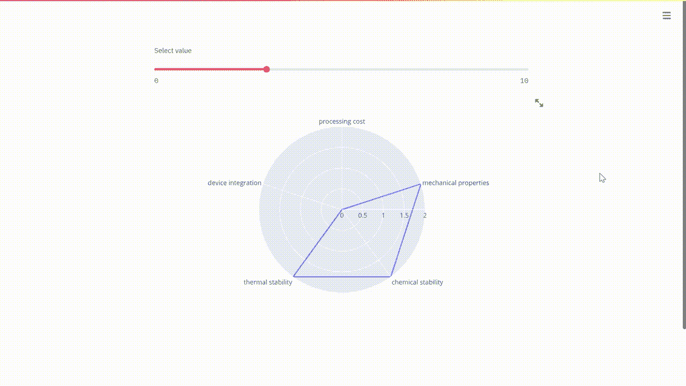
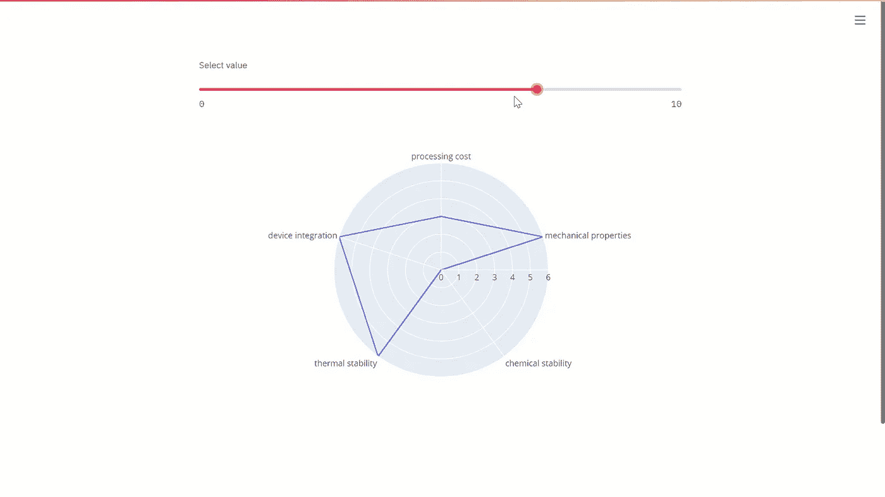
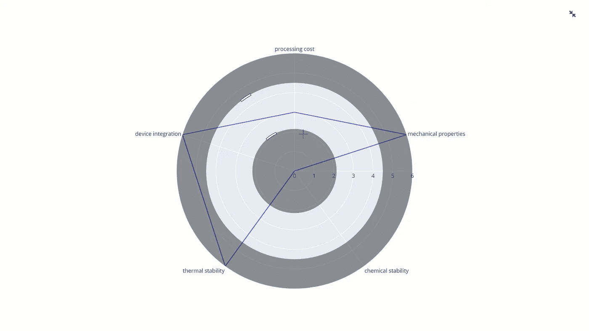

# 用 Python 创建交互式雷达图

> 原文：<https://towardsdatascience.com/creating-interactive-radar-charts-with-python-2856d06535f6?source=collection_archive---------18----------------------->

## 用 Plotly 实时绘制交互式雷达图



作者视觉

## 介绍

也许数据可视化的无名英雄之一是仁慈而优雅的雷达图。举几个例子，我们已经习惯了一大堆其他的可视化，choropleths，甜甜圈和热图，但是雷达图在我们眼花缭乱的仪表盘上基本上不见了。当然，这种图表只有特定的用例，即可视化风玫瑰图、地理数据和一些其他类型的多元数据。但是当您使用它时，它在可视化数值和有序数据集中的异常值或共性方面非常有效。

在本教程中，我们将生成一个带有交互式动态雷达图的仪表板，它将实时呈现。为此，我们将使用 Plotly 和 Streamlit 作为我们强大的 Python 堆栈。如果您还没有这样做，请启动 Anaconda 或您选择的任何其他 Python IDE，并安装以下软件包:

```
pip install plotlypip install streamlit
```

然后继续将以下包导入到脚本中:

## Plotly

Plotly 是目前市面上最通用、最具交互性的数据可视化工具之一。它配备了 Python 和 R 的绑定，与仪表板的集成是无缝的。Plotly 能够生成交互式雷达图，对开发人员来说几乎没有任何开销。您需要做的就是输入一个与每个变量的值相对应的数字数组，剩下的就交给 Plotly 了，如下所示:

## 细流

对于我们的仪表板，我们将使用 [Streamlit](https://www.streamlit.io/) 。长话短说，Streamlit 是一个纯粹的 Python web 框架，它将仪表板实时呈现为 web 应用程序。一旦您的仪表板准备好了，您可以将它端口转发到您的本地 TCP 端口之一，并在您的浏览器上打开它。或者，如果你有兴趣，可以使用 Heroku、AWS 或 Streamlit 自己的一键式部署服务将仪表盘部署到云中。

对于 Streamlit 仪表板，我们将创建一个滑块，使我们能够向 radar_chart 函数中输入任何值。

脚本完成后，您可以通过打开 Anaconda 提示符并键入以下命令来呈现 dashboard/app。

最初，将目录更改为脚本的位置:

```
cd C:/Users/.../script_directory
```

然后通过键入以下命令运行您的应用程序:

```
streamlit run script_name.py
```

然后，Streamlit 将自动生成您的应用程序，并将其转发到您的本地主机，您可以在您选择的任何浏览器中打开它。

## 结果

现在你有了一个交互式雷达图，你可以通过修改滑块的位置来改变可视化显示的值。



作者图片

您还可以使用 Plotly 提供的所有交互式铃声和口哨声。



作者图片

如果您想了解更多关于数据可视化和 Python 的知识，请随时查看以下(附属链接)课程:

## 使用 Streamlit 开发 Web 应用程序:

<https://www.amazon.com/Web-Application-Development-Streamlit-Applications/dp/1484281101?&linkCode=ll1&tag=mkhorasani09-20&linkId=a0cb2bc17df598006fd9029c58792a6b&language=en_US&ref_=as_li_ss_tl>  

## 使用 Python 实现数据可视化:

<https://www.coursera.org/learn/python-for-data-visualization?irclickid=xgMQ4KWb%3AxyIWO7Uo7Vva0OcUkGQgW2aEwvr1c0&irgwc=1&utm_medium=partners&utm_source=impact&utm_campaign=3308031&utm_content=b2c>  

## 面向所有人的 Python 专业化:

<https://www.coursera.org/specializations/python?irclickid=xgMQ4KWb%3AxyIWO7Uo7Vva0OcUkGQgW16Ewvr1c0&irgwc=1&utm_medium=partners&utm_source=impact&utm_campaign=3308031&utm_content=b2c>  

## GitHub 资源库:

<https://github.com/mkhorasani/interactive_radar_chart>  

# 新到中？您可以在此订阅和解锁无限文章[。](https://khorasani.medium.com/membership)