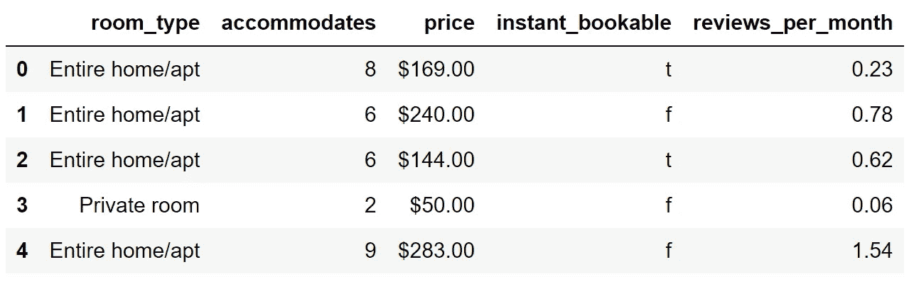
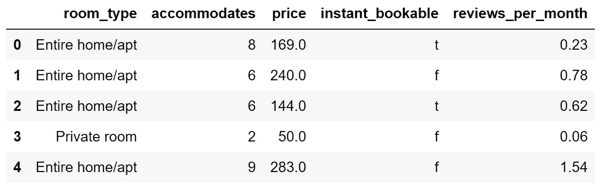
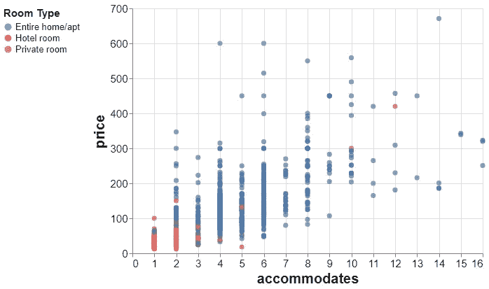
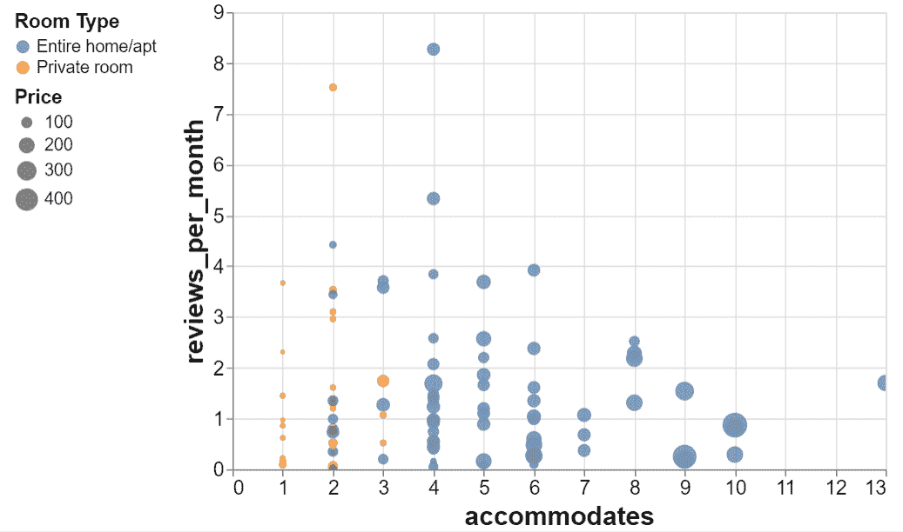
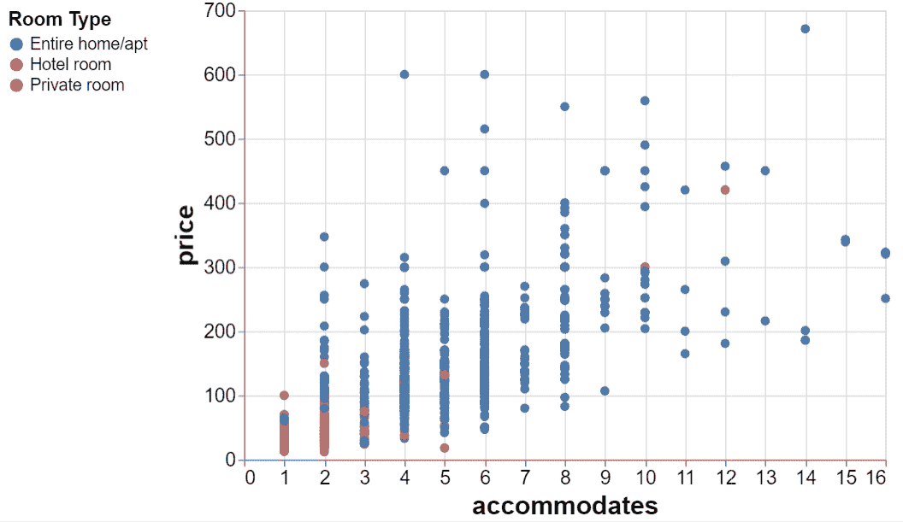
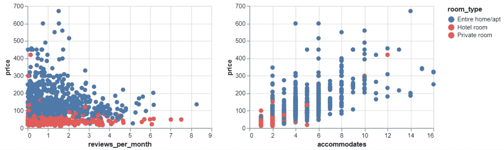

# 使用 Python Altair 创建交互式散点图

> 原文：<https://towardsdatascience.com/creating-interactive-scatter-plots-with-python-altair-e4b47e0aa8eb?source=collection_archive---------6----------------------->

## 增强数据可视化的信息能力


照片由 [IIONA VIRGIN](https://unsplash.com/@virgin?utm_source=unsplash&utm_medium=referral&utm_content=creditCopyText) 在 [Unsplash](https://unsplash.com/s/photos/interactive?utm_source=unsplash&utm_medium=referral&utm_content=creditCopyText) 拍摄

数据可视化是数据科学不可或缺的一部分。我们创建数据可视化来获得手头数据的结构化概览。它们也是交付成果的有效工具。

因为这是一个如此重要的主题，所以有各种各样的软件工具和软件包来创建数据可视化。

其中之一是 [Altair](https://altair-viz.github.io/) ，它是 Python 的一个声明性统计可视化库。

在本文中，我们将学习如何用 Altair 创建交互式散点图。交互式绘图能够提供比标准绘图更多的信息。它们还允许增加可视化的灵活性。

> 如果你想在我发表新文章时收到电子邮件，别忘了订阅。

当然，首要的要求是数据集。我们将在 2021 年 7 月 7 日使用来自西班牙巴塞罗那的 Airbnb 房源数据集。它是与知识共享许可共享的，所以你可以自由地使用和探索它们。

让我们从导入库和创建熊猫数据框开始。

```
import pandas as pd
import altair as altcol_list = ["accommodates", "instant_bookable", "room_type", "reviews_per_month", "price"]df = pd.read_csv(
    "listings_2.csv",
    usecols = col_list,
    nrows = 1000
)df.dropna(inplace=True)print(df.shape)
(965, 5)df.head()
```



(图片由作者提供)

原始数据集中有 17k 行和 74 列。我们通过使用`read_csv`函数的`usecols`和`nrows`参数创建了一个仅包含 5 列 1000 行的数据框。

值得注意的是，在默认设置下，Altair 最多可以使用 5000 个观测值(即行)。可以使用以下命令禁用此限制。感谢 Natalia Goloskokova 的提醒！

```
alt.data_transformers.disable_max_rows()
```

我们还使用了`dropna`函数来删除缺少值的行。

在我们开始创建散点图之前，还有一个数据处理操作。价格列以对象数据类型存储，但需要转换为数字格式。

我们需要删除用作千位分隔符的“$”符号和“，”符号。然后，我们可以将其转换为数值数据类型。

```
df.loc[:, "price"] = \
df.loc[:, "price"].str[1:].str.replace(",","").astype("float")df = df[df["price"] < 1000]df.head()
```



(图片由作者提供)

# 散点图

散点图通常用于可视化两个连续变量之间的关系。它们概述了变量之间的相关性。

我们可以创建一个散点图来检查 accommodates 和 price 列之间的关系。容纳栏是一个地方容量的指标，所以我们预计它与价格正相关。

```
alt.Chart(df).mark_circle(size=50).encode(
    alt.X("accommodates"),
    alt.Y("price"),
    alt.Color("room_type", 
              legend=alt.Legend(
                  title="Room Type",  
                  orient='left',
                  titleFontSize=15,
                  labelFontSize=13)
             )
).properties(
    height=350, width=500
).configure_axis(
    titleFontSize=20,
    labelFontSize=15
)
```

第一步是将数据框传递给顶级图表对象，然后我们指定可视化的类型。`mark_circle`功能创建一个散点图。

在`encode`函数中，我们写下要绘制在 x 和 y 轴上的列名。`color`参数用于区分图例上显示的不同类别。类似于 Seaborn 中的`hue`参数。

最后，`properties`和`configure_axis`功能调整图形和标签大小等视觉属性。

该代码片段创建了以下散点图:



(图片由作者提供)

这是一个标准的散点图。我们现在将看到如何以几种不同的方式使它具有交互性。

# 互动功能

互动功能是使情节互动的最简单的方法。它允许在图上放大和缩小。

让我们通过添加 size 属性来增强上一个示例中的绘图。我们将分别在 x 轴和 y 轴上使用每月容纳量和每月评论数列。

颜色将指示房间类型，每个点的大小将与价格成比例。

通过在最后添加`interactive`功能，我们将能够放大和缩小。

```
alt.Chart(df.sample(100)).mark_circle(size=50).encode(
    alt.X("accommodates"),
    alt.Y("reviews_per_month"),
    alt.Color("room_type", 
              legend=alt.Legend(
                  title="Room Type",  
                  orient='left',
                  titleFontSize=15,
                  labelFontSize=13)
             ),
    alt.Size("price",
            legend=alt.Legend(
                  title="Price",  
                  orient='left',
                  titleFontSize=15,
                  labelFontSize=13))
).properties(
    height=350, width=500
).configure_axis(
    titleFontSize=20,
    labelFontSize=15
).interactive()
```

我从我们的数据框中抽取了一个包含 100 个观察值(即行)的样本，以使该图看起来更有吸引力。这是我们的第一个互动情节。



(作者 GIF)

# 交互式图例

互动性也可以用来制作更具知识性和功能性的剧情。例如，我们可以通过使图例具有交互性来将其用作过滤器。

我们可以通过创建一个选择对象并将其绑定到图例来实现。

```
selection = alt.selection_multi(fields=['room_type'], bind='legend')alt.Chart(df).mark_circle(size=50).encode(
    alt.X("accommodates"),
    alt.Y("price"),
    alt.Color("room_type", 
              legend=alt.Legend(
                  title="Room Type",  
                  orient='left',
                  titleFontSize=15,
                  labelFontSize=13)
             ),
    opacity=alt.condition(selection, alt.value(1), alt.value(0))
).properties(
    height=350, width=500
).configure_axis(
    titleFontSize=20,
    labelFontSize=15
).add_selection(
    selection
)
```

与之前的散点图相比，有 3 处变化。

*   `room_type`列上的选择对象。它必然与传说有关。
*   根据所选房间类型更改点的不透明度的“不透明度”参数。
*   用于将选择对象添加到我们的绘图中的`add_selection`功能。

结果如下:



(作者 GIF)

# 具有多个图的交互式图例

牛郎星允许连接一个传说到多个支线剧情。因此，我们可以同时看到我们的选择对不同关系的影响。

```
selection = alt.selection_multi(fields=['room_type'], bind='legend')chart = alt.Chart(df).mark_circle(size=50).encode(
    y='price',
    color='room_type',
    opacity=alt.condition(selection, alt.value(1), alt.value(0))
).properties(
    height=200, width=300
).add_selection(
    selection
)chart.encode(x='reviews_per_month:Q') | chart.encode(x='accommodates:Q')
```

我们首先创建一个图表对象，但没有指定 x 轴的列。创建和绑定选择部分是相同的。在最后两行中，我们添加了两个不同的 x 轴，并用“or”(|)运算符将它们组合起来。

我已经删除了用于格式化图例和轴标题的部分，使代码看起来更容易理解。



(作者 GIF)

# 结论

我们已经介绍了如何使用交互性来增强数据的可视化。就交互性组件而言，Altair 的功能更多。一旦您理解了交互性的概念，如选择、绑定和条件，您就可以创建令人惊叹的数据可视化。

*别忘了* [*订阅*](https://sonery.medium.com/subscribe) *如果你想在我发表新文章时收到电子邮件。*

*你可以成为* [*媒介会员*](https://sonery.medium.com/membership) *解锁我的全部写作权限，外加其余媒介。如果您使用以下链接，我将收取您的一部分会员费，无需您支付额外费用。*

<https://sonery.medium.com/membership>  

感谢您的阅读。如果您有任何反馈，请告诉我。