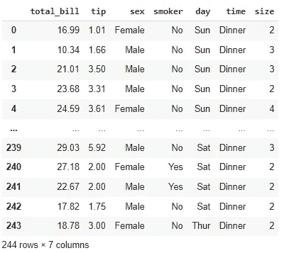

# 使用 JoyPy 创建快乐图

> 原文：<https://towardsdatascience.com/creating-joy-plots-using-joypy-67327a15eb50?source=collection_archive---------21----------------------->

## 使用 JoyPy 创建一系列堆积直方图作为 Joy 图


来源:https://scrapbox.io/pycoaj/JoyPy

可视化是发现洞见的核心部分，可用于讲故事。在创建可视化时，我们需要考虑使用哪个情节，考虑哪些功能，将会出现什么故事，或者找到根本原因分析。你有没有被这些问题困住过？

有不同的 python 库可用于数据可视化。在本文中，将讨论一种罕见的情节类型，称为欢乐情节。它们是一系列直方图、密度图或时间序列数据，其中我们通过固定 X 轴上的数据点并在 Y 轴上创建堆栈来创建堆栈可视化。

在本文中，我们将探索 JoyPy，这是一个用于创建 Joy Plots 的开源 python 库。

让我们开始吧…

# 安装所需的库

我们将从使用 pip 安装 Joy Plots 库开始。下面给出的命令可以做到这一点。

```
!pip install joypy
```

# 导入所需的库

在这一步中，我们将导入加载数据集和可视化数据集所需的库。

```
import joypy
import seaborn as sns
```

# 正在加载数据集

对于本文，我们将使用著名的“Tips”数据集，它已经在 seaborn 库中定义。

```
df = sns.load_dataset('tips')
df
```



数据集(来源:作者)

# 创建快乐情节

现在，我们将从使用不同列的数据创建不同类型的快乐图开始。

```
fig, axes = joypy.joyplot(df)
```


来源:作者

该图显示了数据集中所有数字列的分布。

```
fig, axes = joypy.joyplot(df, by="smoker")
```


来源:作者

此图显示了数值列相对于吸烟者列的分布。

```
fig, axes = joypy.joyplot(df, by="size", ylim='day')
```


来源:作者

```
fig, axes = joypy.joyplot(df, by="day", overlap=10)
```


来源:作者

继续尝试不同的数据集，并使用 JoyPy 创建不同的可视化效果。如果您发现任何困难，请在回复部分告诉我。

本文是与[皮尤什·英加尔](https://medium.com/u/40808d551f5a?source=post_page-----67327a15eb50--------------------------------)合作完成的。

# 在你走之前

***感谢*** *的阅读！如果你想与我取得联系，请随时通过 hmix13@gmail.com 联系我或我的* [***LinkedIn 个人资料***](http://www.linkedin.com/in/himanshusharmads) *。可以查看我的*[***Github***](https://github.com/hmix13)**简介针对不同的数据科学项目和包教程。还有，随意探索* [***我的简介***](https://medium.com/@hmix13) *，阅读我写过的与数据科学相关的不同文章。**