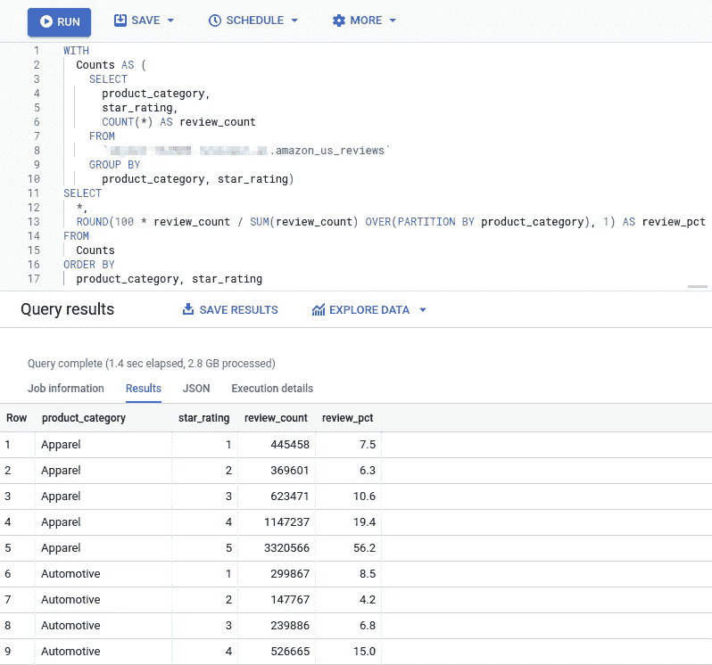
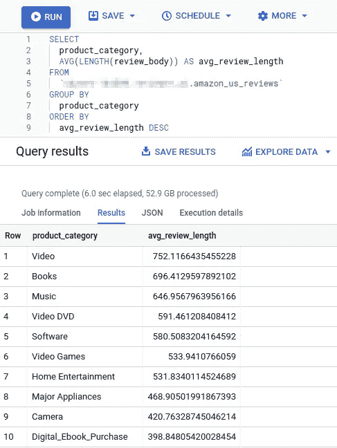
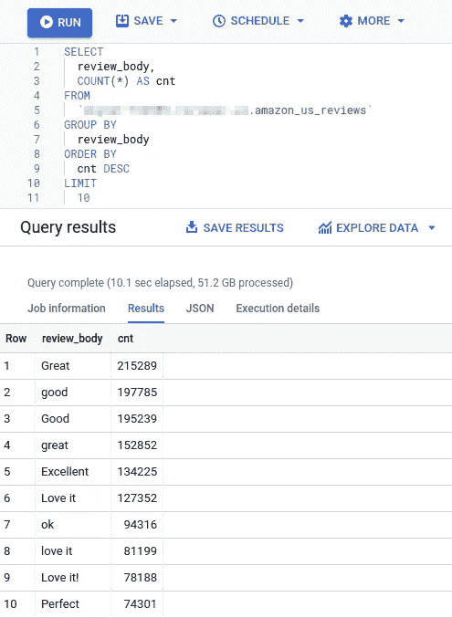
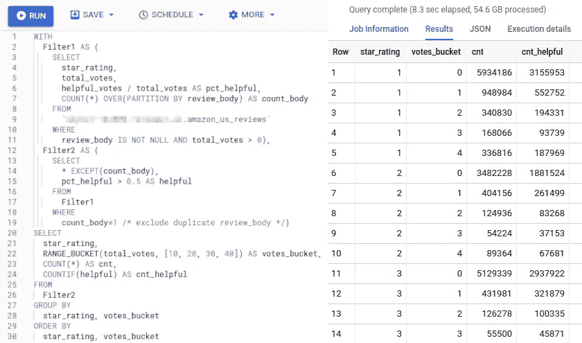
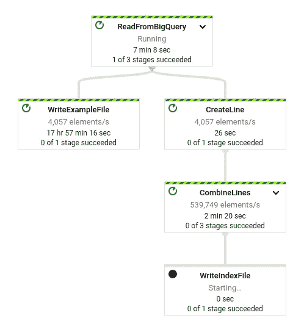
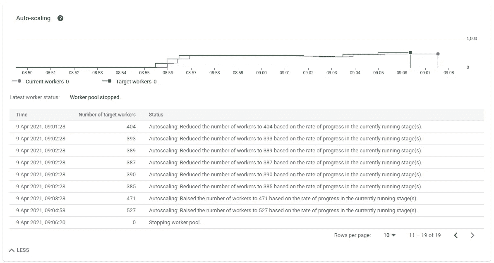
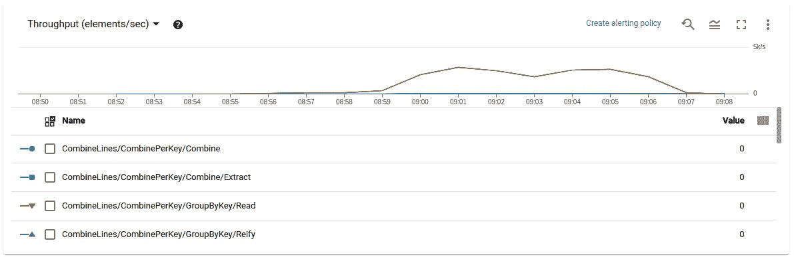
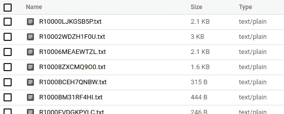
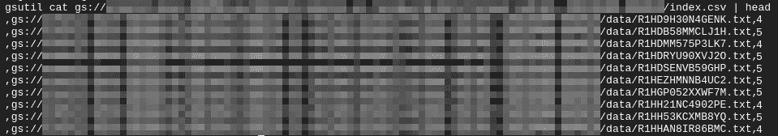

# 使用 BigQuery 和 Dataflow 轻松创建 ML 数据集

> 原文：<https://towardsdatascience.com/creating-ml-datasets-with-ease-using-bigquery-and-dataflow-121eef01f53a?source=collection_archive---------13----------------------->

## 放弃内存处理，支持并行执行和水平扩展

TL；DR:如果你正在处理大量数据，谷歌云平台(GCP)上的 BigQuery 和 Dataflow 可以提高你的效率，让你在为机器学习生成数据集时更加轻松。

最近，初创公司 [reviewr.ai](https://reviewr.ai/) 找到我，让我完成一项数据工程任务，包括为机器学习(ML)准备数据和训练 ML 模型。大公司显然可以让他们的数据科学家花上几天或几周的时间来完成这样的任务，因为他们必须与本地基础设施或云提供商合作，选择云提供商主要是因为该公司多年来一直在许可其 office 套件，与大公司不同，初创公司希望快速完成任务——速度很重要。与许多公司不同，初创公司在选择特定任务的基础设施时通常非常灵活。因此，我们同意应该在 GCP 上完成这项工作，在我看来，它仍然是大数据和 ML 的最佳云平台。因此，我没有花几天时间，而是在一个上午做了所有的数据准备，并在训练 ML 模型的时候休息了一个下午。

本文不是关于任务的机器学习部分或 ML 模型的准确性。它是关于在机器学习开始之前必须发生的数据工程和预处理。大多数数据科学家可能会同意，这通常是花费大部分时间和精力的地方。

## 令人惊叹的任务

我被要求使用来自拥抱脸的[亚马逊 _ 美国 _ 评论数据集来训练一个简单的 NLP 分类模型。它包含来自亚马逊网站的近 1.51 亿条顾客评论，总计约 76 GB 的数据。基于用户写的产品评论，该模型应该将评论分成特定的类别。类成员资格(标签)可以从数据集中包含的数据中导出。因为这个问题很标准，而且我们想要快速的结果，我在 GCP 上使用了](https://huggingface.co/datasets/amazon_us_reviews) [AutoML](https://cloud.google.com/natural-language/automl/docs) 。

为了能够使用 AutoML 中的数据，我必须以某种方式从 1 . 51 亿个样本中选择最多 100 万个合适的样本，并将它们转换为[所需的格式](https://cloud.google.com/natural-language/automl/docs/prepare#csv)，即每个样本一个文本文件，其中包含评论文本以及一个索引 CSV 文件，其中包含所有样本的 URIs 和类别。听起来令人畏惧或耗时？都不是。

## BigQuery:全进

让我们从获取数据副本开始。这些文件存储在 AWS S3 存储桶中，可以通过 HTTP 请求公开访问。[在我们进一步处理它们之前，谷歌云存储](https://cloud.google.com/storage) (GCS)是放置它们的合适地方。具体来说，我将把数据吸收到 [BigQuery](https://cloud.google.com/bigquery) 中，其原因稍后将变得显而易见。有几种方法可以将数据传输到 GCS——例如，使用 bash 脚本`wget` s 或`curl` s 文件，然后`gsutil cp` s 循环地将它们传输到 GCS，或者使用小的 [Python 脚本](https://github.com/jsarbach/data-engineering/blob/main/dataset-creation-bigquery-dataflow/dataset_to_gcs.py)。

我在[云外壳](https://cloud.google.com/shell)中运行这个程序，而不是在我的本地机器上，因为通过谷歌网络传输数据花费的时间要少得多。一旦所有文件都在 GCS 桶中，我只需使用`bq`将它们一次性加载到 BigQuery 中，仍然来自云 Shell:

```
bq load --source_format CSV --autodetect --field_delimiter tab 
--skip_leading_rows 1 --quote ' ' [DATASET_NAME].amazon_us_reviews gs://[BUCKET_NAME]/datasets/amazon-us-reviews/raw/*.tsv.gz
```

通过查看标志可以看出，我让 BigQuery 从数据中推断出[模式](https://cloud.google.com/bigquery/docs/schemas)，并将字段分隔符设置为制表符而不是逗号，将引号字符设置为 none 而不是双引号(“制表符分隔，没有引号和转义符”，如数据集描述所述)。BigQuery 本身可以处理 gzipped 文件，所以我们不必先解压缩文件。

几分钟后，数据存储在 BigQuery 中，并准备好接受检查:


附带说明:如果您有一个 AWS 帐户(因此可以创建一个*访问密钥 ID* 和一个*秘密访问密钥*，您可以使用[存储传输服务](https://cloud.google.com/storage-transfer-service)下载文件，甚至可以使用 [BigQuery 数据传输服务](https://cloud.google.com/bigquery-transfer/docs/s3-transfer)将数据直接导入 BigQuery。

接下来，让我们运行几个查询来感受一下数据。例如，我们可以询问每个产品组和星级有多少评论，以及星级在产品组中的百分比是多少:



或者:哪些产品类别平均获得的评论最长？



顺便说一下，最短的是礼品卡，这可能不会让人感到意外。

如您所见，在 1 . 51 亿行上运行这些查询只需要几秒钟。因此，你可以尽情发挥你的创造力，在你提出问题的时候尽快分析数据。(但是，请记住，你是按照处理的数据量向[收费的，除非你选择统一价格模式。)如果你想绘制结果，只需点击一下鼠标，就可以在](https://cloud.google.com/bigquery/pricing#analysis_pricing_models)[数据工作室](https://cloud.google.com/bigquery/docs/visualize-data-studio)中看到它们。

## 从数据集中选择训练数据

然而，我们不只是想分析数据。我们还希望为 AutoML 生成训练数据集，这意味着从总共 1.51 亿个样本中选择 100 万个样本并计算特征。我不想透露 *reviewr.ai* 到底想让我做什么，所以让我们假设我们想从评论机构推断评级(1-5 颗星)。理想情况下，在这种情况下，每个类有 200，000 个例子。

首先，我们将排除所有没有审核主体的审核(即`WHERE review_body IS NOT NULL`)。此外，我们必须排除具有相同 review_body 的行，因为基本事实中的分类可能会变得模糊，而且 AutoML 不允许重复。事实证明，有很多这样的例子:



厉害！

为了进一步缩小结果范围，我们将关注大多数用户认为有帮助的评论。此外，我们将要求一个评论收到至少 x 票。在哪里设置阈值，x？让我们制作一个统计图，感受一下每个评分的投票数是如何分布的:



如果我们将阈值设置在 10 到 20 之间，我们似乎仍然有足够的样本用于每一类，所以我选择 15。这意味着我们只包括至少获得 15 票的评论，其中大多数被认为是有帮助的。当然，我们可以更进一步，要求每个产品类别都应该有平等的代表性。出于本文的目的，我们将它留在这里。因此，下面是最终定义数据集的查询:

运行一个快速的`SELECT class, COUNT(*) FROM ... GROUP BY class`确认我们每个类确实有 200，000 个样本。

一旦我们对我们的查询感到满意，我们就可以运行它并将结果具体化为一个表，或者将查询本身保存为一个视图。加载表将比查询视图更快(这基本上与运行查询本身是一样的)。尽管如此，我还是选择创建一个视图，因为我们只需要查询一次或几次，所以速度并不重要。该视图的优点是记录了数据集是如何创建的，并且如果您想要为另一个模型迭代创建新的数据集，您可以很容易地修改它并以不同的名称保存它。

那么，现在我们通过 SQL 查询得到了训练数据集的定义——我们如何将它转换成我们需要的格式(每个示例一个包含评论正文的文本文件，加上一个包含所有示例的 URIs 和类的 CSV 文件)？将查询结果导出为 CSV 文件，并编写 Python 脚本来逐行处理该文件？这将花费一两个永恒的时间(处理，而不是写剧本)。相反，让我们转向另一个专门用于这种工作负载的伟大工具:GCP 上的 [Apache Beam](https://beam.apache.org/) 和 [Dataflow](https://cloud.google.com/dataflow) 。

## 无与伦比的并行执行速度

引用[文档](https://beam.apache.org/get-started/beam-overview/)，“Apache Beam 是一个开源的统一模型，用于定义批处理和流数据并行处理管道”。Dataflow 是 GCP Apache Beam 的一个完全托管的跑步者。通常的工作流程是这样的:编写您的管道(用 Java 或 Python)，用一些元素在本地测试它以验证它的工作，然后将其部署到数据流以在云中大规模处理整个数据集。

Apache Beam 有一组 I/O 连接器(“源”和“接收器”)，其中一个用于 BigQuery，一个用于 GCS。这意味着我们可以直接从 BigQuery 查询结果中读取，并将输出写入 GCS bucket。从概念上讲，我们将要构建的管道如下所示:



管道从一个源(BigQuery 查询结果，包含 review_id、review_body 和类)读取数据，并生成两个输出:第一个分支使用 review_body 创建 100 万个文本文件，第二个分支创建 100 万个包含 URI ( `gs://...`)和类的字符串，然后将它们连接起来并将结果写入一个 CSV 文件。管道以每行为基础进行操作。也就是说，每个元素都是查询结果中的一行。

以下是完整的管道代码:

使用 Apache Beam 的好处在于，因为查询结果的每一行都可以独立处理，所以我们实现了大规模并行处理。正如您在下面看到的，Dataflow 确实将工作线程的数量扩展到了 527 个，每秒处理大约 2，200 行:



工作所需的基础设施得到全面管理。在开始实际的管道执行之前，Dataflow 需要花几分钟来配置基础设施(计算引擎)。作业成功完成(或失败)后，它会降速并删除虚拟机。

由于并行执行，相当于 72 个 CPU 小时的工作仅用了大约 18 分钟就完成了。一个重要的注意事项:数据流扩展工作负载的程度可能会受到配额的限制。特别是，在新创建的 GCP 项目中，*Compute Engine API in-use IP addresses*配额(默认为每个区域 8 个)会限制为作业提供的计算实例数量(因为每个工作实例都需要一个 IP 地址)。因此，如果您发现现有配额过低，请务必提前请求增加配额。

现在我们有了:100 万个文本文件和一个 CSV，准备导入 AutoML。



工作证明

## 外卖食品

现在，准备这个数据集的麻烦已经消失在云中，让我们得出一些结论:

*   **水平而不是垂直缩放。**我认识的许多数据科学家都专注于垂直扩展。不符合记忆？让我们得到一个有更多内存的更大的实例。然而，在坚持内存处理的同时，仅仅投入更多的内存来解决问题，会失去并行工作负载的优势，从而在更短的时间内完成更多的工作。对于 BigQuery 中的数据分析，我不必花一秒钟考虑它需要多少内存——我只需打开 BigQuery UI 并开始查询。我的数据流工作的工人都是 [n1-standard-1](https://cloud.google.com/compute/docs/machine-types) 虚拟机，带有 1 个 vCPU 和 3.75 GB 的内存。唯一可能面临内存瓶颈的实例是在将一百万行写入文本文件之前收集并连接它们的工作人员。在这种情况下，产生的字符串使用了 123 MB，所以根本没有达到限制。如果我们这样做，我们只会创建分片文件，而不是一个单一的文件。
*   使用 GCP 的专业数据工程工具。为什么每次想使用 Jupyter 笔记本时都要麻烦地启动它并将数据加载到 pandas 中呢？相反，您可以将数据转储到 BigQuery 中，并在那里保存数据，使您可以随时查询数据。当 Jupyter 实例完成旋转，并且已经将所有数据加载到 pandas 数据帧中时，您可能已经完成了 BigQuery 中的数据分析。当然，你仍然可以使用 Jupyter 毕竟它对于数据科学任务有其优点。但是使用它来查询 BigQuery 和编写 Apache Beam 管道，而不是处理内存中的数据。顺便说一句:也有很多现成的[数据流模板](https://cloud.google.com/dataflow/docs/guides/templates/provided-templates)，所以你甚至可以不用写自己的管道。
*   **精益和可重用流程。**使用 BigQuery 和 Apache Beam 的工作流是精简和灵活的。需要另一个具有不同功能的训练集吗？只需编写所需的查询，启动管道，20 分钟后，您就已经将新数据集导入到 AutoML 中了。如果我们想用相同的数据集在 TensorFlow 中训练自己的模型呢？稍微修改一下 Apache Beam 管道，输出 TFRecord 文件，就可以了。
*   **高效利用基础设施。**使用这些工具不仅可以节省时间，还可以降低基础设施的使用成本。由于 BigQuery 和 Dataflow 都是无服务器的，因此不存在未充分利用或过度利用的基础设施，也没有固定成本(当然，除了存储成本之外，存储成本在大多数情况下可以忽略不计)。考虑到工作负载的短暂性和所需的有限财政承诺，您可能会考虑使用 GCP 来完成这种数据工程任务，即使它不是您的默认主力。