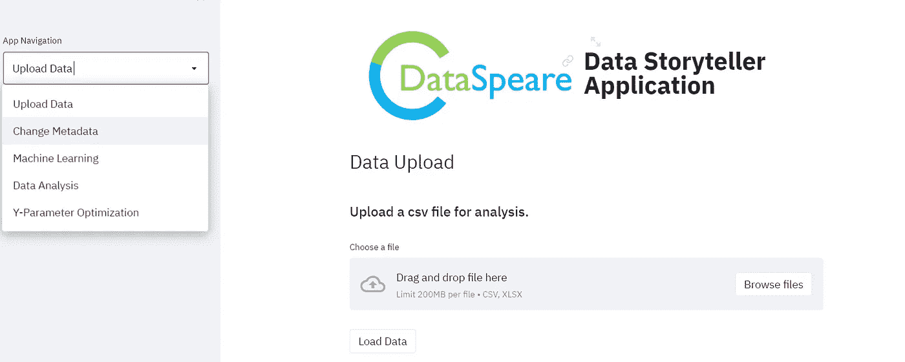
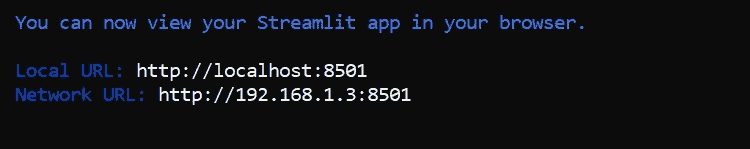
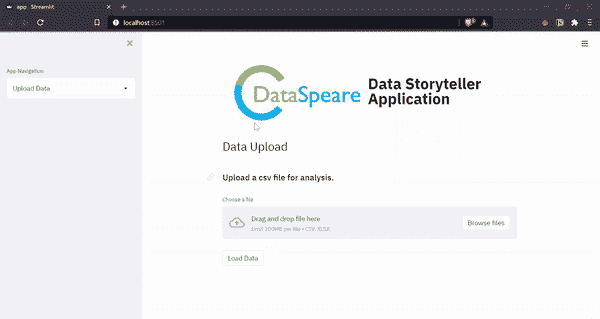

# 使用 Streamlit 创建多页面应用程序(高效！)

> 原文：<https://towardsdatascience.com/creating-multipage-applications-using-streamlit-efficiently-b58a58134030?source=collection_archive---------2----------------------->


由[miko aj](https://unsplash.com/@qmikola?utm_source=medium&utm_medium=referral)在 [Unsplash](https://unsplash.com?utm_source=medium&utm_medium=referral) 拍摄的照片

## [实践教程](https://towardsdatascience.com/tagged/hands-on-tutorials)

## 使用面向对象编程，而不是条件编程。

你有多少次有一个伟大的 ML 项目想法，你认为你可以在你的简历上炫耀？你快速收集数据，分析数据，并在此基础上建立模型；所有这些都在一个 Jupyter 笔记本中，然后你面临你最糟糕的噩梦——**有人要求你部署模型**并用一个用户友好的界面显示推理。如果你独自工作，这有时真的会令人生畏，为什么不呢？你是一个数据科学家，而不是一个网络开发人员！这就是[**细流**](https://streamlit.io/) 的用武之地。这是一个非常棒的工具，它可以让你快速构建交互式 web 应用程序，并用图形展示你的模型，这可能会让许多开发人员感到羞愧。

Streamlit 最棒的一点是，你甚至不需要了解 web 开发的基础知识就可以开始工作，甚至不需要创建你的第一个 web 应用程序。因此，如果你对数据科学感兴趣，但因为不喜欢 web 开发而不愿意部署你的模型，那么这就是你只用 Python 构建漂亮的数据应用程序的机会！

有许多资源可以教你如何开始使用 Streamlit。我个人最喜欢的是[这个](https://www.youtube.com/watch?v=Klqn--Mu2pE)。然而，一旦你开始，你很快就会意识到仅仅构建一两个页面是不够的，一个好的应用程序会有更多的页面，这就是构建多页面应用程序的需要。所以，我决定把它写下来。在本文中，我将带您构建您的第一个多页面 Streamlit 应用程序并部署它。先决条件是了解 Python 和 Streamlit 的基础知识。

**编辑:**Streamlit 社区成员非常友好地让我在 Streamlit 共享平台上展示我的应用程序，所以我在那里部署了它。现在任何人都可以实时测试。你可以在这里找到应用[。](https://share.streamlit.io/prakharrathi25/data-storyteller/main/app.py)

# 代码概述

在这一节中，我将带您浏览我做的一个项目，在这个项目中，我实现了 Streamlit 的**多页面功能** **。现在，这个*不是使用一个`if-else`方法完成的*，在这个方法中，我一直检查用户选择了`streamlit.selectbox()`的哪个条目，并相应地显示页面。这个方法看起来有点像这样。**

```
import streamlit as st# Create a page dropdown 
page = st.selectbox("Choose your page", ["Page 1", "Page 2", "Page 3"]) if page == "Page 1":
    # Display details of page 1elif page == "Page 2":
    # Display details of page 2elif page == "Page 3":
    # Display details of page 3
```

虽然上面的方法没有错，但我发现它非常烦人，因为我必须管理这么多的`if-else`和其中的代码。作为程序员，我们应该能够编写更整洁的应用程序，并在任何需要的地方使用面向对象编程。这就是我在这里要做的！

我制作的应用程序被称为“DataSpeare”(我知道这是一个糟糕的文字游戏)，它是一个基于人工智能的工具，为非技术用户自动化数据分析和机器学习的过程。它可以获取数据集，识别数据中的模式，解释结果，然后基于问题的上下文生成业务用户可以理解的输出故事。该应用程序的功能如下

*   根据给定的数据将数据转化为交互式数据故事
*   产生深刻的见解，推断模式并帮助业务决策。
*   提供个性化配置文件；这些可以表示为描述给定用户感兴趣的内容的元数据。
*   使用交互式直观界面生成业务用户可以理解的报告。

你可以在这里阅读更多关于应用[的内容。如果你想获得项目的源代码，那么你可以去](https://github.com/prakharrathi25/data-storyteller/blob/main/README.md) [GitHub 仓库](https://github.com/prakharrathi25/data-storyteller)。在这篇文章中，我不会介绍整个应用程序，因为它有一个很大的代码库，但我会介绍它的基本结构。

首先，您需要将 Streamlit 安装到您的设备上。就个人而言，我会推荐使用虚拟环境，但这一步是可选的。

```
**pip install streamlit**
```

对于我的应用程序，如果你正在构建整个系统，你可以下载一堆其他需求。现在，最重要的部分是构建应用程序的结构。我使用了一个基于类的结构，它可以让你在应用程序中添加页面作为`MultiPage`类的实例。这已经在我的项目报告中名为`multipage.py`的文件中创建。

这是一个简单的类，有两个方法

*   `add()`:用来给你的应用添加更多的页面。每个新页面都附加到实例变量`pages`上。
*   `run()`:这个方法在应用程序的侧边栏中创建一个下拉菜单，这样你就可以从所有你需要的选项中进行选择。

它只需要你输入`streamlit`，你就可以开始了！

这是一个处理应用程序结构的类，但是你实际上需要 file 来添加页面和管理代码。这已经在`app.py`文件中完成。

这是我们的 Streamlit 应用程序中的主文件，它将运行以加载所有页面。在第 8 行，我创建了一个`MultiPage`类的实例`app`，它是我在第 4 行导入的。`app`实例让我向应用程序添加页面，并运行应用程序。页面已经从第 14 行开始添加，用户可以以类似的方式添加他们的页面。最后，在第 21 行，我使用`run`函数运行了应用程序。

**注意:-** 使用这种结构的人只需改变第 5 行的导入，从第 14 行添加的页面和其余的代码将保持不变。

下面是一个片段，展示了您的应用程序导航的外观，具体取决于您在应用程序中添加了哪些页面。



多页应用程序的简化输出(app.py 文件)

最后，您可以用下面给出的方式为您的应用程序创建一个页面。我只展示了一页，其余的可以在这里看到。我创建了一个名为`pages`的新目录，并将所有页面文件放入其中，您也可以这样做。

我下面展示的页面叫做`data_upload.py`。在这个页面中，我上传了数据集并制作了它的本地副本。这对于在页面之间传输数据很有用。使用[会话变量](https://discuss.streamlit.io/t/multi-page-app-with-session-state/3074)有另一种方法可以做到这一点，但是*我不推荐初学者使用*(也许我会写另一篇关于它的文章)。上传的数据集以 csv 格式存储在`data`文件夹中，并由其他页面读取。因为这是一个自动化的数据分析应用程序，所以它还会为更新的数据集中的每一列生成一个列数据。这是在第 44 行使用`[utils.py](https://github.com/prakharrathi25/data-storyteller/blob/main/pages/utils.py)` [文件](https://github.com/prakharrathi25/data-storyteller/blob/main/pages/utils.py)中定义的`genMetaData()`函数完成的。您可以用类似的方式创建其他页面并构建您的应用程序。

*注意:-在 app()函数中编写代码很重要，因为它在多页面应用程序的结构中被调用。*

一旦所有的页面都制作好、导入并添加到你的应用程序中，就该在你的命令提示符下使用下面的命令来运行你的应用程序了。

```
streamlit run app.py
```

一旦您运行应用程序，您的 cmd 应该看起来像这样，一旦您重定向到本地 URL，您将看到您的应用程序。



最终多页简化应用程序

您也可以使用这个方法，并在您定义的页面内建立的新执行个体，在 multipage 应用程式内建立 multipage 应用程式。

使用 Streamlit 和它的其他组件，如*会话变量*，您可以做很多令人惊奇的事情。我可能会写另一篇关于会话状态和变量的文章，但我希望这篇文章简短且内容丰富。我希望你喜欢它，这是有益的。祝你好运！

# 参考

1.  [https://www.youtube.com/watch?v=nSw96qUbK9o&t = 78s](https://www.youtube.com/watch?v=nSw96qUbK9o&t=78s)
2.  [https://streamlit.io/](https://streamlit.io/)
3.  [https://sap-code . hackere earth . com/challenges/hackathon/sap-code/custom-tab/Data-4-storying/# Data % 204% 20 storying](https://sap-code.hackerearth.com/challenges/hackathon/sap-code/custom-tab/data-4-storytelling/#Data%204%20Storytelling)